# **14. Наречия и частица も**

[**Урок 14: Всё о наречиях: Секрет частицы Mo; и ещё больше Алисы!**](https://www.youtube.com/watch?v=9DR9ifftMvs&list=PLg9uYxuZf8x_A-vcqqyOFZu06WlhnypWj&index=16)

こんにちは.

Сегодня мы вернёмся к приключениям Алисы. Если вы помните, Алиса заметила белого кролика, который бежал. Белый кролик посмотрел на свои часы и сказал: <code>Я опаздываю! Я опаздываю!</code> и убежал. Алиса позвала его остановиться, но, услышал он или нет, он не остановился.

> アリスはとび上がって、ウサギの後を追った

「とび上がる」 — это ещё одно из тех слов, которые мы рассматривали на прошлой неделе, где глагол присоединяется к い-основе другого глагола, чтобы создать новый глагол.

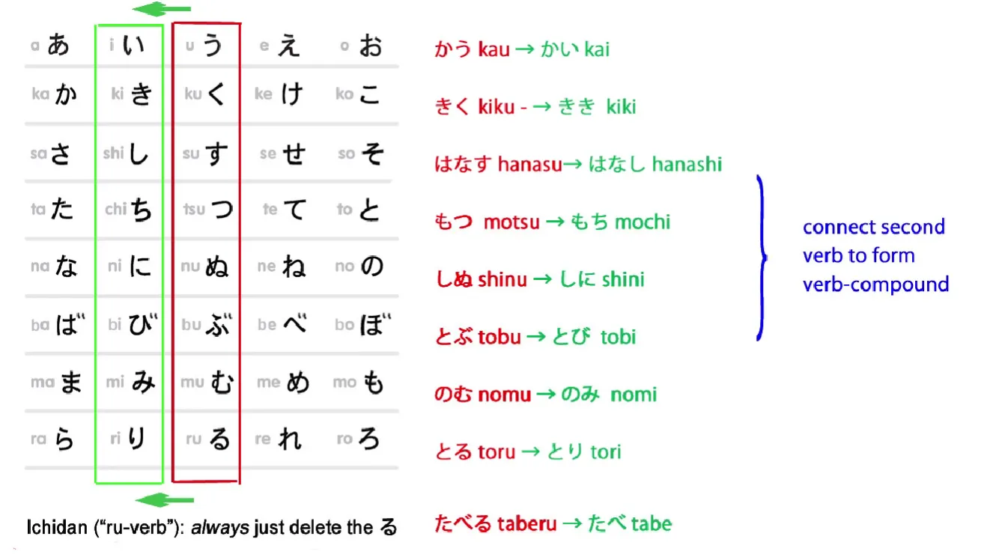

Первый глагол здесь — [飛]{と}ぶ, что означает либо <code>прыгать</code>, либо <code>летать</code>. В данном случае, очевидно, он означает <code>прыгать</code>, так как Алиса не умеет летать. А 上がる означает <code>подниматься</code>. Так что, когда вы соединяете их вместе, 飛び上がる означает <code>взлететь / подпрыгнуть</code>.

И мы можем заметить, что 上がる здесь — это тот же кандзи, что и 上, что означает <code>вверх</code>, а 上がる — это глагол, означающий <code>подниматься</code>, и мы видим, что он связан с 上げる, который мы недавно рассматривали[[11]](./11-compound-sentences-くれる-あげる-and-more-uses-of-the-て-form.md), и который означает <code>давать кому-то вверх / поднимать к кому-то другому</code>.

**Но 上がる означает, что что-то <code>поднимается само по себе / поднимается внутри себя</code>**. Так что мы видим, что эти два слова связаны. Оба они являются глаголами <code>подъёма</code>.

---

> ウサギの後を追った

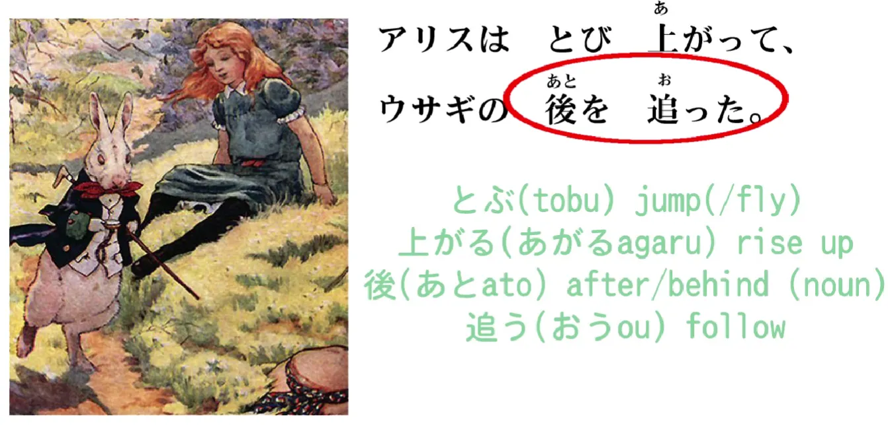

後 означает <code>позади</code> или <code>после</code>, а 追う (которое пишется おう) означает <code>следовать</code>. 後を追う — это распространённое выражение, и оно означает <code>следовать за / следовать позади</code>. **Но, как мы видели раньше, эти позиционные выражения в японском языке всегда являются существительными.**

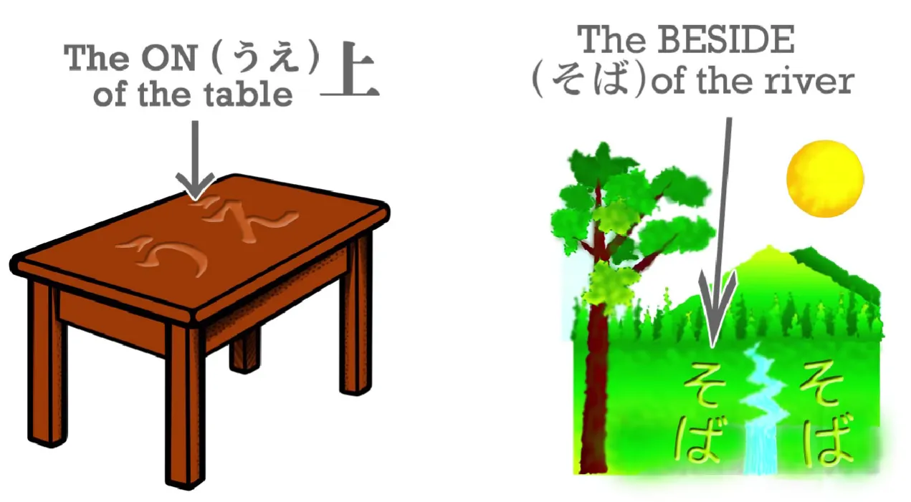

::: info
Имеется в виду, что часть 後 является существительным, так как 後を追う должно быть глаголом.
:::

Мы говорим о <code>на</code> стола, <code>под</code> стола, <code>рядом</code> с рекой. И здесь мы говорим о <code>позади</code> или <code>после</code> кролика. Так что Алиса следовала за <code>кроличьим после</code> или <code>кроличьим позади</code>. Вот как мы это выражаем в японском.

> アリスは飛び上がって、ウサギの後を追った。

(Алиса подпрыгнула и последовала за кроликом.)

*Что касается Алисы, подпрыгнула и кроличьему после/позади последовала.*

---

しゃべるウサギを見たことがない。

[喋]{しゃべ}る означает <code>говорить</code> или <code>болтать</code>. Это немного похоже на <code>jabber</code> в английском, не так ли? 「しゃべるウサギ」 в данном случае, очевидно, **しゃべる, глагол, используется, как любой глагол-локомотив может быть использован, в качестве прилагательного.**

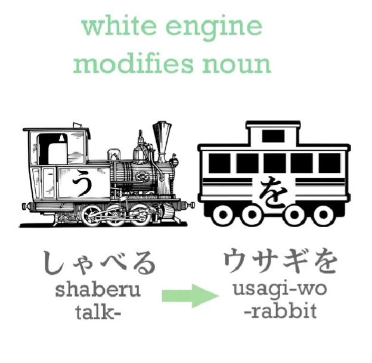

Так что 「しゃべるウサギ」 — это <code>говорящий кролик</code> или буквально <code>говорить-кролик</code>.

見たことがない — это конструкция, которую мы будем очень часто встречать: ことがない, ことがある. Что это значит?

## ことがある

Ну, こと, как мы знаем, означает <code>вещь</code>, и оно означает вещь в абстрактном смысле, состояние, а не конкретную вещь, такую как ручка или книга.

Итак, 「見たこと」: 見た модифицирует существительное こと, не так ли?

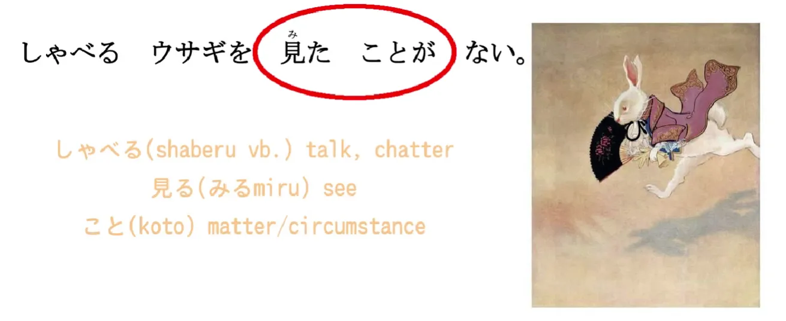

Оно говорит нам, что это за こと, и в данном случае 見る означает <code>видеть</code>, 見た — это <code>видеть</code> в прошедшем времени, **так что こと на самом деле означает <code>видение</code> в прошедшем времени.**

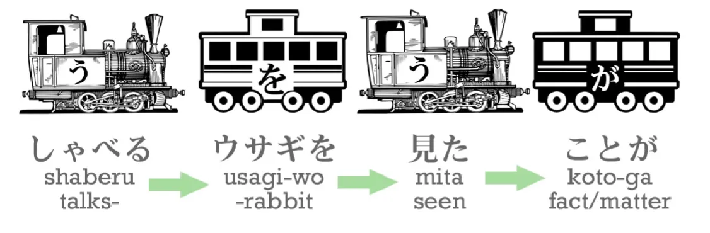

**Итак, 見たこと означает <code>факт того, что видел</code>.** **見たことが ない означает <code>факт того, что видел, не существует</code>.**

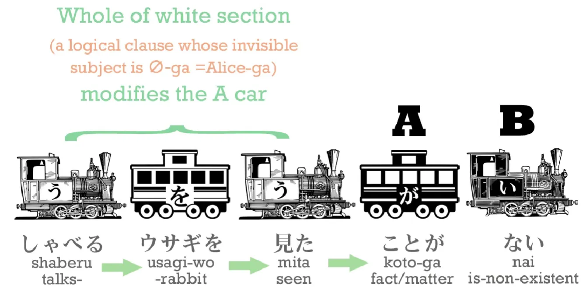

Так что это означает: <code>Алиса никогда не видела говорящего кролика</code>. ( <code>**Факт того, что видела говорящего кролика, не существует**</code>)

> しゃべるウサギを見たことがない

(Алиса никогда не видела говорящего кролика.)

И, конечно, в английском мы всегда хотим сделать Алису актором этого предложения, но **на самом деле субъект этого предложения, А-вагон, — это не Алиса, это こと**.

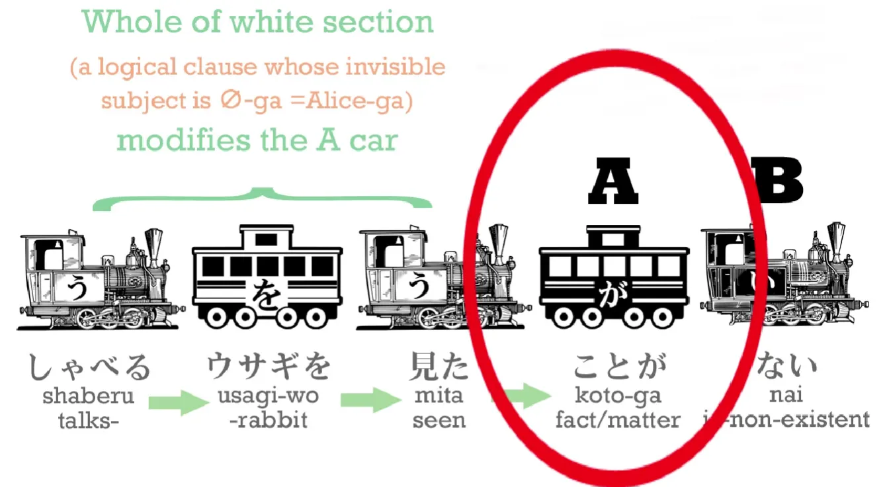

Даже если мы вставим Алису в предложение, мы скажем: 「アリスは喋るウサギを見たことがない」. Она всё равно не будет актором предложения. **Она будет просто темой, о которой говорилось в предложении.** <code>Что касается Алисы, факт того, что видела говорящего кролика, не существует.</code>

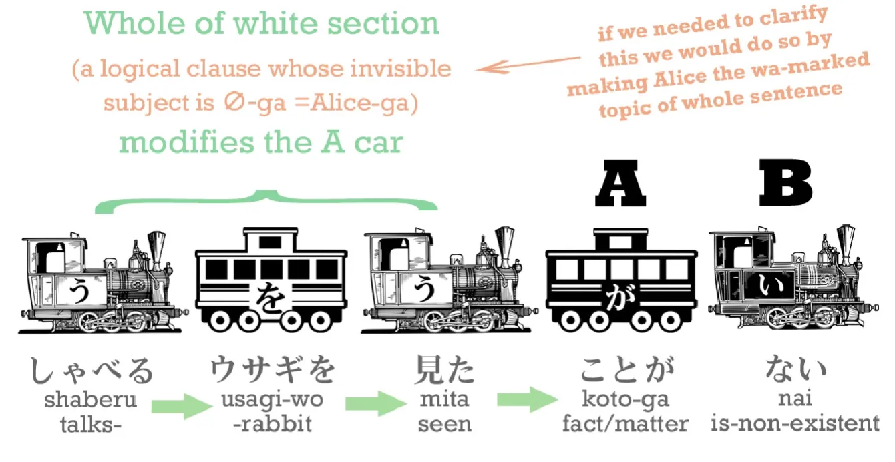

---

ウサギは早く走って、急にウサギの穴にとび込んだ。

Итак, это довольно длинное предложение, и в нём много чего нужно разобрать. Для начала я скажу вам, что оно означает. Оно означает: <code>Кролик быстро побежал и внезапно прыгнул в кроличью нору</code>. Давайте рассмотрим его по частям.

> ウサギは早く走って…

Итак, 走る, как мы знаем, означает <code>бежать</code>; 早い — это прилагательное, означающее <code>быстрый</code> или <code>ранний</code>. В данном случае, очевидно, оно означает <code>быстрый</code> — мы же знаем, что кролик не был ранним, не так ли? Если мы хотим сказать <code>кролик быстрый</code>, мы скажем 「ウサギが早い」.

## Наречия

**Если мы хотим сказать, что его движение быстрое, его действие быстрое, нам нужно наречие. Наречие — это прилагательное, которое описывает не объект, не существительное, а глагол.**

---

**Итак, мы можем очень легко превратить любое прилагательное в наречие в японском языке.** **Всё, что мы делаем, это берём обычное прилагательное, оканчивающееся на い, и используем его く-основу.**

**Так что 早い становится 早く. 早い — это прилагательное, описывающее вещь; 早く — это наречие, описывающее действие.** Итак:

> ウサギは早く走**って**...

(Кролик быстро побежал ***и***...) *- добавлено пояснение для って...*

> ...急にウサギの穴にとび込んだ。

Но 「急に」, что это значит?

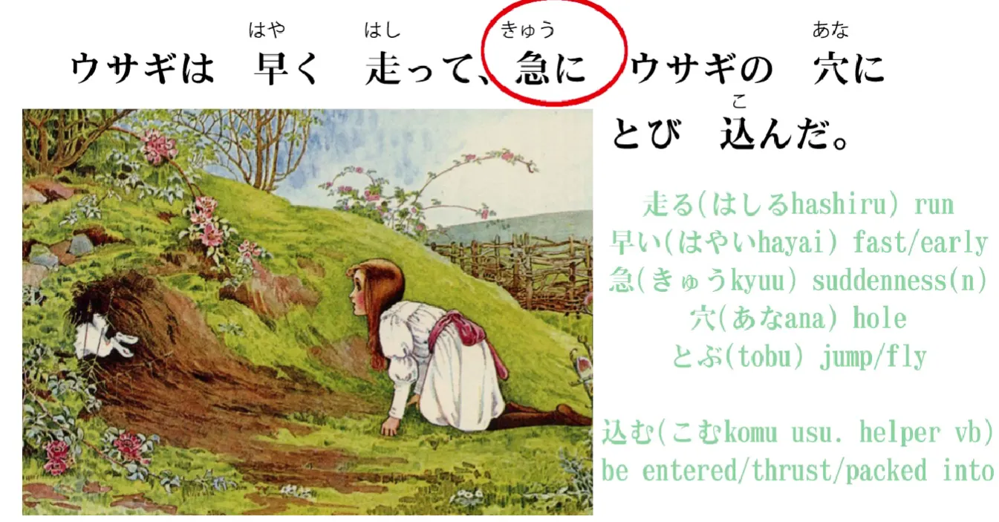

Ну, 急 — это существительное, и оно означает <code>внезапный</code>. **И когда мы добавляем に в конец, мы тоже превращаем его в наречие.** Итак, здесь у нас два вида наречий. **Мы можем образовать наречие от прилагательного, просто используя его く-основу.** **И мы образуем наречие от существительного, добавляя に.**

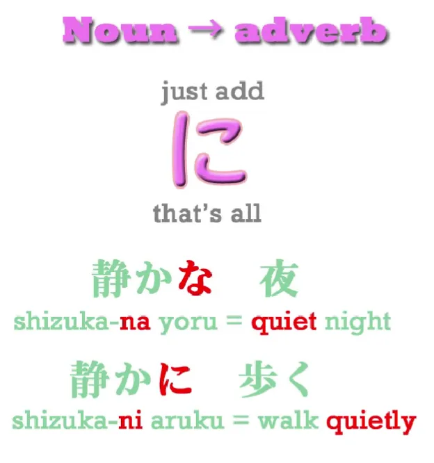

И это работает с некоторыми обычными существительными и почти со всеми адъективными существительными. Итак, 急 означает <code>внезапный</code> или <code>резкий</code>; **急に означает <code>внезапно</code>**. <code>Кролик внезапно прыгнул в кроличью нору.</code>

Итак, всё предложение:

ウサギは早く走って、急にウサギの穴にとび込んだ

(Кролик быстро побежал и внезапно прыгнул в кроличью нору.)

> アリスもウサギの穴にとび込んだ

(Алиса тоже прыгнула в кроличью нору.)

## Частица も

Теперь мы встретим новый элемент, который мы не рассматривали раньше, и это флаг も. **も — это флаг, точно так же, как は.** Почему так?

Ну, мы знаем, что は **[[3]](./3-the-は-particle.md)** — это нелогическая частица, отмечающая тему, не так ли? **も — это ещё одна нелогическая частица, отмечающая тему; на самом деле, это единственная другая нелогическая частица, отмечающая тему.** Итак, **も отмечает тему предложения точно так же, как это делает は.** В чём разница между ними?

Ну, は, как мы знаем, объявляет тему предложения, и, очевидно, она также может менять тему предложения. **Если мы говорим об одной вещи и объявляем новую тему с は, мы изменили тему предложения.**

---

Итак, **も тоже объявляет тему предложения, но оно всегда её меняет.** **Вы не можете использовать も, если в разговоре уже нет текущей темы.** Итак, темой нашего разговора до этого момента был кролик: кролик прыгнул в нору. **И теперь мы меняем тему на Алису.**

> アリス**も**ウサギの穴に飛び込んだ

**Когда мы меняем тему с も, мы говорим, что комментарий об этой теме такой же, как и комментарий о предыдущей теме**, теме, от которой мы меняемся.

---

**Когда мы меняем тему с は, мы делаем противоположное: мы проводим различие между текущей темой и предыдущей темой.** Итак, если бы мы сказали:

「アリス**は**お姉ちゃんのところに戻った」 – ところ — это <code>место</code>, а 戻る — это <code>возвращаться</code>, так что это означало бы, что Алиса вернулась к своей сестре, к месту, где была её сестра, к месту своей сестры.

**Если бы мы сказали это, то は проводило бы различие между тем, что сделал кролик, и тем, что сделала Алиса.** Мы бы сказали: <code>Кролик прыгнул в кроличью нору. Что касается Алисы, она вернулась к своей сестре</code>. И вы видите это и в английском. Это подразумевает, что то, что сделала Алиса, отличалось от того, что сделал кролик. <code>Кролик прыгнул в кроличью нору. Что касается Алисы, она вернулась к своей сестре.</code> Вот что делает は.

---

Если бы мы использовали が: 「**アリスが**お姉ちゃんのところに戻った」, мы бы просто сказали: <code>Кролик прыгнул в кроличью нору, и **Алиса** вернулась к своей сестре.</code>

::: info
Алиса = субъект её клаузы здесь, отмеченный が.
:::
Но с は мы проводим это различие; мы говорим: <code>Кролик прыгнул в кроличью нору, но что касается Алисы, она вернулась к своей сестре.</code>

---

Итак, **если мы скажем も вместо は, то мы делаем противоположное: мы говорим, что комментарий, который мы сделали о кролике, такой же, как и комментарий, который мы делаем об Алисе.**

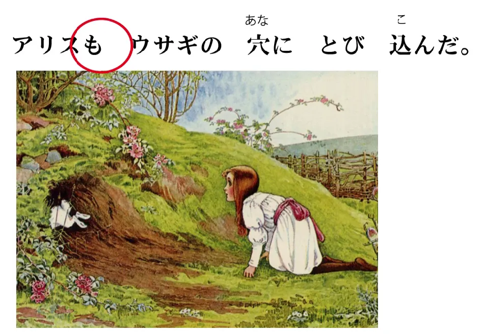

<code>Кролик прыгнул в кроличью нору, и Алиса **тоже** прыгнула в кроличью нору.</code>

Итак, есть различные применения も, которые мы рассмотрим позже, но это самое фундаментальное. **Это частица, отмечающая тему, которая говорит нам, что комментарий о новой теме такой же, как и комментарий о старой теме.**

---

穴の中は**たて穴**だった。アリスはすぐ下に落ちた。

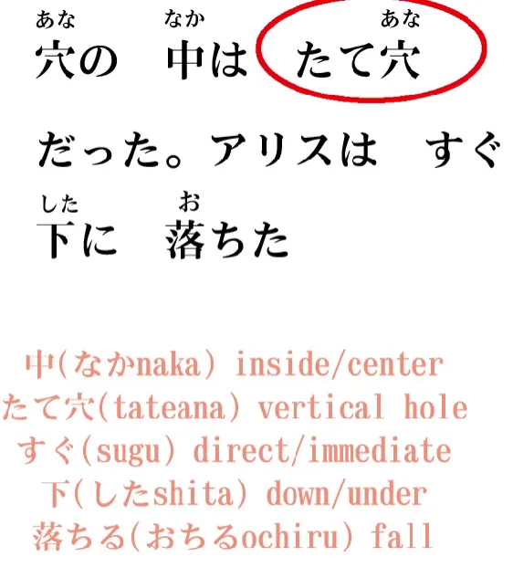

中 означает <code>внутри</code>, либо середину, либо внутреннюю часть чего-либо, так что 穴の中 — это внутренняя часть норы. たて穴/縦穴: слово [縦]{たて} означает <code>вертикальный</code> или <code>прямой</code> (и вы можете видеть, что оно связано с 立つ – стоять). Итак, 「穴の中は竪穴だった」<code>внутренняя часть норы была вертикальной норой</code> – она шла прямо вниз.

> アリスは**すぐ**下に落ちた。

Итак, 下, как мы знаем, означает <code>вниз</code> или <code>ниже</code>. **すぐ означает <code>прямой</code>; оно может означать <code>скоро</code>** в смысле английского <code>It'll happen directly (это произойдёт скоро)</code>, или оно может означать <code>прямой / непосредственно</code> в другом смысле. Так что **すぐ下 означает <code>прямо вниз / сразу вниз / непосредственно вниз</code>.**

---

> でも驚いたことにゆっくりゆっくり落ちた

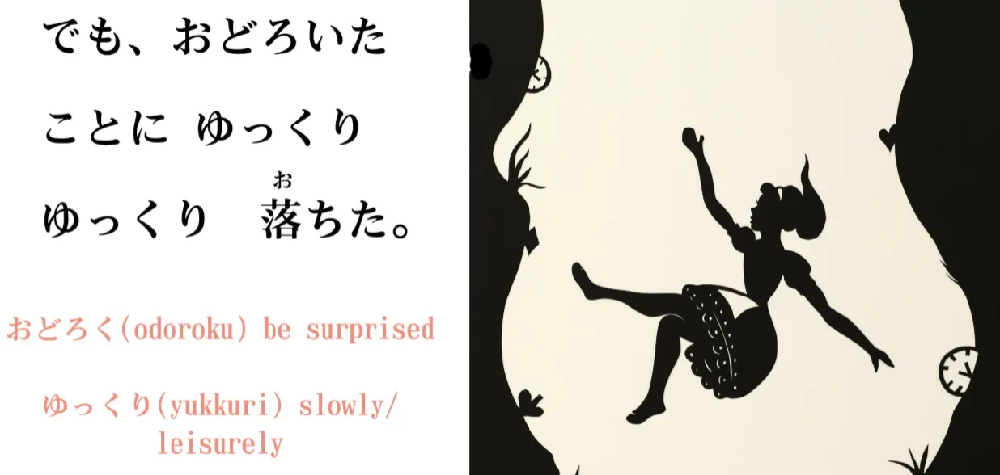

И это означает: <code>Но, к удивлению, она падала очень-очень медленно</code>. <code>驚く</code> означает <code>быть удивлённым</code>, а <code>驚いたこと</code> — интересное выражение, потому что оно буквально, не так ли, означает <code>удивлённая вещь</code>.

---

**Но, как мы видели на примере японских прилагательных эмоций и желаний, с вещами, которые описывают эмоции и желания, в японском они очень легко переходят от того, что испытывает эмоцию, к тому, что вызывает эмоцию, и обратно.**

Так что **<code>驚いたこと</code> здесь означает не <code>удивлённая вещь</code>, а <code>удивительная вещь</code>.**

---

И に ( <code>こと**に**</code>), **это снова та техника добавления に**, добавления に, **после существительного, чтобы превратить его в наречие.**

Итак, <code>驚いたことに落ちた.</code> (К <code>ゆっくり</code> мы вернёмся через мгновение.) Это означает <code>удивительно упала / она упала удивительным образом</code>. И что это был за удивительный образ? <code>**ゆっくりゆっくり**</code>.

## Наречие ゆっくり

Итак, <code>ゆっくり</code> — это очень распространённое слово, которое мы встретим. **Это немного необычное наречие** — третий вид наречий, который мы будем часто встречать в японском языке. Первые два вида, как мы видим, это く-основа прилагательного или существительное с に. **<code>ゆっくり</code> немного необычно тем, что это, по сути, существительное, которое может использоваться как наречие, но нам не нужно использовать с ним に. Оно стоит само по себе.**

---

<code>ゆっくりゆっくり落ちた</code>. **<code>ゆっくり</code> означает <code>медленно / неторопливо / в спокойном темпе</code>**.

Итак, <code>驚いたことにゆっくりゆっくり落ちた</code> – <code>Но, к удивлению, она падала очень-очень медленно</code>.

Итак, мы снова прошли по истории немного быстрее, чем в первый раз, и узнали довольно много.

::: info
Именно здесь Долли полностью включает кандзи в свои уроки, также из-за просьб людей, поскольку, действительно, как только вы освоите кандзи, японский текст без них становится настоящей головной болью для чтения, не говоря уже о понимании. Не бойтесь и не относитесь враждебно к кандзи, они ваши друзья, поверьте мне.

И [**Yomichan**](https://github.com/FooSoft/yomichan/releases) (раньше не работал, но снова работает в новейшей версии), и **[Rikaichamp](https://chrome.google.com/webstore/detail/10ten-japanese-reader-rik/pnmaklegiibbioifkmfkgpfnmdehdfan)** работают здесь, так что кандзи не должны представлять для вас реальной проблемы, что касается их чтения.
:::