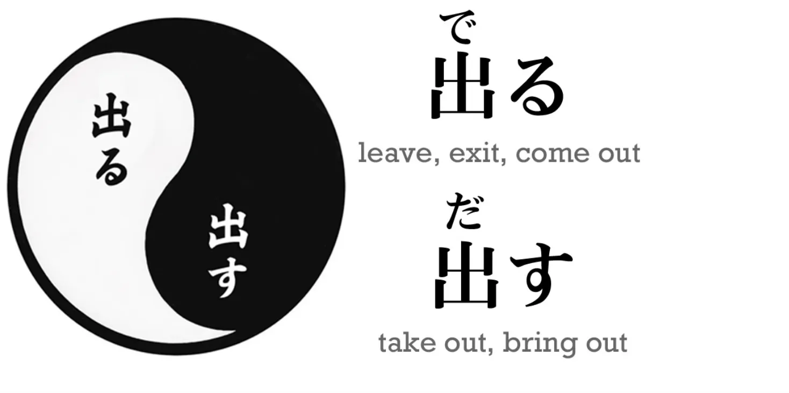
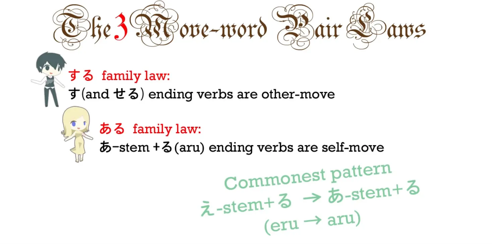
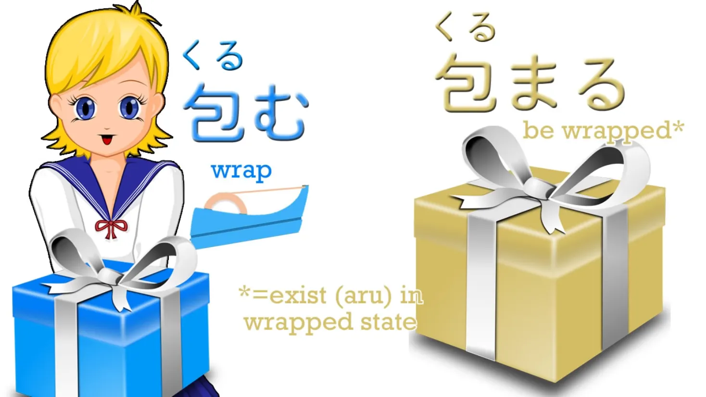
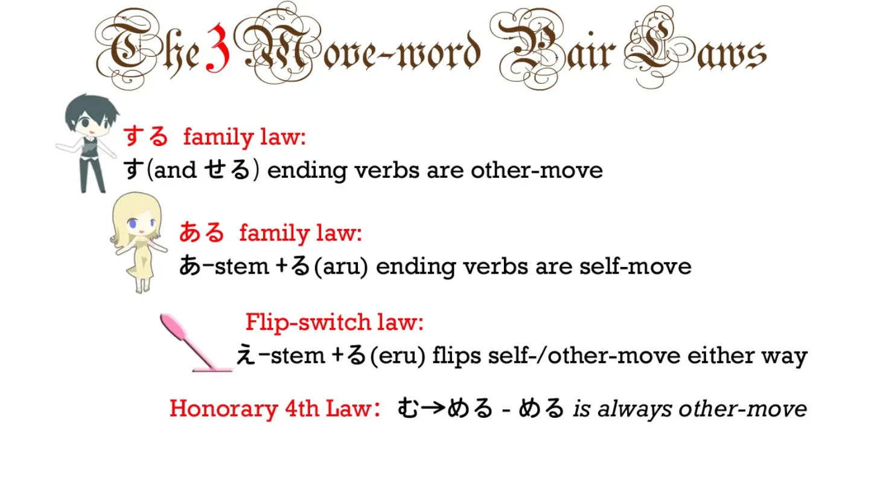
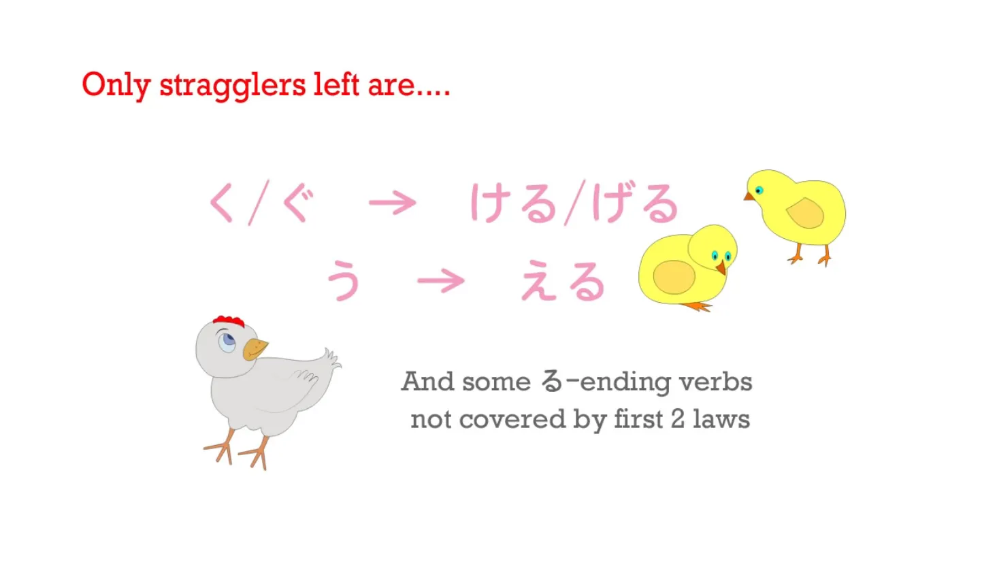

# **15. Переходные и непереходные глаголы**

[**Урок 15: Переходность — 3 факта, которые делают её простой. Переходные/непереходные глаголы разгаданы**](https://www.youtube.com/watch?v=ELk1dqaEmyk&list=PLg9uYxuZf8x_A-vcqqyOFZu06WlhnypWj&index=17)

こんにちは.

Сегодня мы рассмотрим слова, обозначающие «движение себя» и «движение другого». Если вы заглянете в стандартный японский учебник или словарь, вы обычно увидите, что они определяются как <code>переходные</code> и <code>непереходные</code> глаголы. Конечно, это не так далеко от истины, как некоторые другие вещи, которые вы найдёте в этих книгах, например, спряжение, которого в японском не существует; пассив (в японском нет пассива). **Переходность и непереходность действительно существуют в японском языке, и в большинстве случаев между ними и глаголами «движения себя» и «движения другого» есть большое совпадение.** Однако это работает не всегда, и это не совсем то, что подразумевается под «движением себя» и «движением другого» в японском языке.

Поэтому, если вы знакомы и вам комфортно с западными терминами <code>переходные</code> и <code>непереходные</code>, то их использование не сильно повредит, по крайней мере, в большинстве случаев. Но если вы с ними не знакомы, не пытайтесь их выучить только ради японского, потому что они не совсем точны.

::: info
Моё предположение касается английского, поскольку многие глаголы, переходные в английском, не являются таковыми в японском и т.д., по сути, лучше рассматривать эти два понятия как отдельные сущности, чтобы избежать путаницы.
:::

---

Так что же такое слова «движения себя» и «движения другого»? **В японском языке «слово-движение», <code> 動詞 (doushi)</code>, — это глагол, слово, обозначающее действие или движение.**

---

**Итак, слово «движения себя» — это любой глагол, который движет сам себя. Например, если я встаю, это действие «движения себя». Я не двигаю что-то другое, я двигаю себя.** **Если я бросаю мяч, это действие «движения другого». Я не бросаю себя, я бросаю мяч.** И на самом деле, это так просто.

---

**В японском языке есть много пар слов — можно сказать, что это либо две формы одного и того же слова, либо два очень тесно связанных слова — где у нас есть версия «движения себя» и версия «движения другого».** Итак, очень хороший пример — <code>出る(でる)</code> и <code>出す(だす)</code>.

Оба используют один и тот же кандзи, который означает <code>выходить</code>. **Базовая форма — <code>出る(でる)</code>, и она означает просто <code>выходить</code> или <code>появляться</code>, и это версия «движения себя».** **Версия «движения другого» — <code>出す(だす)</code>, и она означает <code>вынимать</code> или <code>выносить</code>: заставлять что-то выходить. */ Вынимать что-то и т.д…***

::: info
Не путать перевод <code>заставлять что-то</code> как обозначение каузатива[[19]](./19-causative-causative-receptive.md),
出す имеет свою собственную <code>каузативную</code> форму - 出させる(ださせる), которая обозначает **[её каузативную форму](https://www.weblio.jp/content/%E5%87%BA%E3%81%95%E3%81%9B%E3%82%8B)**.
*Здесь вы совершаете действие по перемещению чего-либо. Вы не заставляете кого-то другого делать это.*
:::

Итак, в первом случае то, что движется, движется само; оно выходит; оно появляется. **Во втором случае актор предложения, актор глагола, выносит что-то другое или вынимает что-то другое.**

::: info
Итак, как и переходный, «движение другого» ПОХОЖЕ, подразумевает что-то для грамматического объекта, тогда как непереходный глагол/«движение себя» не имеет прямого объекта, поскольку он описывает/<code>движет</code> только себя.
:::

Это часто очень полезно, потому что во многих случаях это даёт нам два различных слова, которые легко понять, потому что они тесно связаны.

---

Например, <code>負ける (まける)</code> означает <code>проигрывать</code> – это не означает потерять предмет или деньги, а проиграть соревнование, проиграть войну, проиграть битву, проиграть игру – другими словами, быть побеждённым. А <code>**負かす(まかす)**</code>, которая является версией «движения другого» от <code>**負ける (まける)**</code>, означает <code>побеждать</code> – другими словами, заставлять кого-то проиграть / *побеждать кого-то*. Итак, там, где в английском у нас есть два слова, <code>lose</code> и <code>defeat</code>, в японском у нас, по сути, одно и то же слово в его версиях «движения себя» и «движения другого».

---

Так что это очень полезно – но не так полезно, если вы не понимаете, как образовывать версии «движения себя» и «движения другого» от слова. Если вы заглянете в стандартные учебники, в большинстве случаев вам скажут, что вы просто должны выучить все слова «движения себя» и «движения другого» по отдельности. Иногда они дают списки пар «движения себя» и «движения другого» – пары переходности, как они их называют. Но это неправда и не нужно.

В большинстве случаев мы можем определить, какое слово является «движением себя», а какое – «движением другого». Есть несколько очень простых правил, которые охватывают большинство пар слов-движений. И эти правила ещё проще, если вы понимаете логику, которая лежит в их основе. И это то, что мы сейчас узнаем.

## ある и する

Первое, что нужно знать, это то, что существует, так сказать, Адам и Ева слов «движения себя» и «движения другого», их мать и отец. И это <code>ある</code> и <code>する</code>.

**<code>ある</code> — мать всех слов «движения себя». Оно просто означает <code>быть</code>. Таким образом, это полностью внутренне направленный глагол. Вы не можете быть или существовать чем-то другим; вы можете быть и существовать только в себе. Оно фундаментально и абсолютно внутренне направлено, самонаправлено.**

---

**<code>する</code>, с другой стороны, означает <code>делать</code>. Итак, они означают <code>быть</code> и <code>делать</code>. И <code>する</code> само по себе, просто «делание», никогда не может существовать само по себе, вы должны что-то делать. Так что это отец всех глаголов «движения другого».**

## Правило семьи する

Теперь, почему нам нужно это знать, почему это важно знать? Потому что, когда мы это знаем, это открывает большинство пар слов-движений, с которыми мы столкнёмся. Как это происходит? Ну, есть то, что я называю 3 законами пар слов-движений. **И первый из этих законов заключается в том, что если одно из пары заканчивается на -す, то это всегда будет слово «движения другого». Почему? Потому что это -す связано с <code>する</code>.**

Итак, в примере, который мы приводили ранее, <code>出る (でる) / 出す (だす)</code>, <code>出る(でる)</code> означает <code>выходить</code>, а <code>出す（だす)</code>, **которое заканчивается на -す, является глаголом «движения другого»** – это то, что означает <code>вынимать **(что-то другое)**</code>. *- оно требует грамматического объекта.*

В <code>負ける(まける) / 負かす(まかす)</code> **мы знаем, что глагол «движения другого»**, глагол, который означает <code>заставлять (кого-то другого) проигрывать</code>, это <code>負か**す**(まかす)</code>, **потому что он заканчивается на -す.** И очень многие из этих пар на -す фактически совершают именно это преобразование, -える в -す. **Но не всегда.**

В некоторых случаях... у нас есть, например, <code> 落ちる (おちる)</code>, что означает <code>падать</code>, и <code>落とす (おとす)</code>, что означает <code>ронять</code>. У них один и тот же кандзи; они образуют пару, у них нет этого обычного окончания -える в -す, но <code>落とす (おとす)</code> всё равно имеет -す на конце, поэтому мы всё равно знаем, что это партнёр «движения другого» в паре.

## Правило семьи ある

Теперь, **второе правило заключается в том, что если одно из пары заканчивается на любую из あ-основ + -る**, то есть оно заканчивается на звук -ある, **это будет партнёр «движения себя» в паре**. Почему? Потому что это -ある связано с <code>ある</code>, матерью всех глаголов «движения себя».

Обычный шаблон здесь — -える в -ある. Мы уже рассматривали это в прошлом уроке, где у нас есть <code>上がる (あがる)</code>, что означает <code>подниматься/вставать</code>, и <code>上げる (あげる)</code>, что означает <code>поднимать (что-то)</code>. Очень часто используется в значении <code>давать (что-то) вверх (другому человеку)</code>. Итак, у нас есть <code>上がる (あがる)</code> и <code>上げる(あげる)</code>, и мы знаем, что партнёр «движения себя» в паре — это <code>上がる (あがる)</code>, потому что он заканчивается на -ある. Обычная форма здесь — -える в -ある, **но опять же, это не обязательно.**

Есть и другие случаи, например, <code>包む(くるむ)</code>, что означает <code>заворачивать</code>, и <code>包まる(くるまる)</code>, что означает <code>быть завёрнутым</code>, но опять же, это не имеет значения, потому что мы знаем, что **то, что заканчивается на -ある, всегда будет партнёром «движения себя» в паре.**

## Правило переключения

Теперь, **третий закон заключается в том, что если мы берём любой обычный глагол, заканчивающийся на звук -う** (как они все), **и меняем его на ряд え и добавляем -る, что означает, что он заканчивается на -える, это переворачивает слово «движения себя» в слово «движения другого» или слово «движения другого» в слово «движения себя».** **Проблема в том, что мы не в каждом случае знаем по структуре, в какую сторону будет перевёрнуто слово.**

Однако это не так сложно, как кажется, потому что, во-первых, это не большое количество глаголов – большинство охватывается первыми двумя правилами – **и из этой группы переключений с -う на -える большинство составляют -む на -める.** И **-める — я бы назвала это почётным членом семьи す.** **Или можно сказать, что -む в -める — это почётный четвёртый закон.** Как бы вы это ни назвали, **в -む в -める, -める всегда является партнёром «движения другого» в паре.** И действительно, по мере того, как вы будете набираться опыта в японском, вы почувствуете, что **глаголы, оканчивающиеся на -める, имеют ощущение «движения другого», похожее на する.**

И это действительно всё, что вам нужно знать, если вы начинаете изучать глаголы «движения себя»/«движения другого», потому что это охватывает подавляющее большинство всех пар, с которыми вы столкнётесь. Так что не чувствуйте, что вам нужно изучать остальную часть этого урока. Вы можете вернуться к нему позже, когда захотите. Но я просто закончу его, отчасти для того, чтобы у вас была вся информация, которая может понадобиться в будущем, и отчасти потому, что это даст нам больше понимания того, как на самом деле работают «движение себя» и «движение другого».

## Почётные правила

Итак, следующее, что нужно знать, это то, что помимо -む/-める, которое является основным, есть и другие почётные члены семьи す, и это: -ぶ в -べる – **-べる всегда является версией «движения другого»** (а -ぶ и -む очень близки в японском; вы, возможно, знаете <code>さびしい/さみしい</code> и другие подобные слова, где вы можете просто использовать ぶ или む в одном и том же слове, **так что -める и -べる, естественно, являются почётными членами семьи す**). А также -つ/-てる – **-てる всегда является парой «движения другого».**

Так что в итоге у нас действительно очень мало «джокеров» в этой колоде.

**Единственные, о которых мы действительно не можем сказать, в какую сторону они движутся, это -く и -ぐ, в -ける и -げる, -う в -える, и те глаголы, оканчивающиеся на -る, которые не подходят ни под один из первых двух законов.** Так что это, по сути, единственные исключения, где вы действительно не можете структурно определить, в какую сторону они движутся.

Итак, можем ли мы что-нибудь сделать с этим последним небольшим меньшинством переключений «движения себя»/«движения другого»? И ответ на это — да. Но это немного тоньше, и это станет легче, когда вы станете более компетентными в японском. Так что вам не нужно беспокоиться об этом, если вы на ранней стадии. Правила, которые я вам дала, охватывают большинство случаев. **Но когда мы берём глагол, о котором структурно нельзя сказать, в какую сторону он переключается, очень часто мы можем сказать семантически** – то есть, **когда я говорю, что ряд え плюс -る переворачивает переходность, я имею в виду именно это.** **Версия на -える — это перевёрнутая версия; версия на -う — это оригинал, та, что в базовой форме глагола.**

Итак, возьмём пример: <code>売る(うる)</code> означает <code>продавать</code>; это очень распространённое слово.

Есть менее распространённая версия этого слова — <code>売れる(うれる)</code>, и **это перевёрнутая версия.** Теперь, <code>продавать</code> — это, очевидно, глагол «движения другого» – я продаю **что-то**. Вы не можете просто продавать в абстракции. Я продаю что-то, и таким образом я двигаю эту другую вещь – буквально. Но <code>売れる(うれる)</code> означает <code>продаваться</code> в другом смысле, как в выражении <code>эта игра продаётся как горячие пирожки</code>. Итак, **в этом случае речь идёт о продаже книги или игры, поэтому то, что продаётся здесь, также является тем, что движется, так что это версия «движения себя»**, не так ли? **Таким образом, ясно, что <code>売る(うる)</code> — это, по сути, глагол «движения другого», но когда он перевёрнут, он имеет версию «движения себя».**

---

Теперь, если мы возьмём тот, что идёт в другую сторону, <code>従う(したがう)</code> означает <code>подчиняться</code> или <code>следовать</code>, и у него есть перевёрнутая версия, <code>従える(したがえる)</code>, что означает <code>быть сопровождаемым</code> или <code>быть подчиняемым</code>.

Теперь, здесь ясно, что **основная идея — это подчинение или следование, а расширенная идея — это быть подчиняемым или быть сопровождаемым.** Итак, **здесь ясно, что версия «движения другого» будет версией на -える, потому что это перевёрнутая версия базового понятия — подчиняться или следовать.**

::: info
Долли написала [**это**](https://www.youtube.com/watch?v=ELk1dqaEmyk&lc=UgxUPDAQZ2p43DA_Z294AaABAg.8pKE8ZA_tQh8pKQIhLE8L6) и [**это**](https://www.youtube.com/watch?v=ELk1dqaEmyk&lc=Ugw4tQMZRgx1xrAmnOh4AaABAg.9CQONWHmDUq9CQeZrqyaG2), также есть [**эта японская статья**](https://ameblo.jp/stravaganza-no2/entry-12013152846.html) о некоторых глаголах «движения себя»/непереходных?, использующих を, что обычно… неграмматично?, я не совсем уверен в объяснении, так как мой японский всё ещё довольно ограничен, так что если что, вы можете написать мне,
Думаю, было бы полезно не рассматривать их чисто как переходные = всегда «движение другого» и т.д.
Поэтому я рекомендую вам провести собственное исследование этой проблемы и решить, как к ней подойти.*
:::

И мы также можем отметить здесь для тех из вас, кто спрашивал себя: <code>Почему она говорит, что переходные и непереходные неверны?</code> – это пример. Японско-английские словари говорят нам, что <code>従う(したがう)</code> — это непереходная версия, но если подумать, <code>従う(したがう)</code> означает <code>подчиняться</code> или <code>следовать</code>. Это не непереходное слово. Вы не можете просто подчиняться или следовать в абстракции. Вы подчиняетесь кому-то или следуете за кем-то. Это переходный глагол.

Так почему же словари называют его непереходным? **Потому что они взяли на себя обязательство переводить «движение себя» как непереходное, но хотя это переходный глагол – вы подчиняетесь кому-то, вы следуете за кем-то – это также глагол «движения себя».**

---

**Подчиняясь кому-то или следуя за кем-то, вы не двигаете этого другого человека.** **Вы двигаете себя.** **Будучи подчиняемым или сопровождаемым, вы не двигаете себя, вы двигаете этого другого человека.** Итак, это один из случаев, когда «движение себя» и «движение другого» не соответствуют переходным и непереходным глаголам.

---

**Таких случаев не слишком много, поэтому неважно, хотите ли вы использовать «переходные» и «непереходные», просто имейте в виду, что значение в любом случае не совсем то же самое, а в некоторых случаях оно вообще не подходит.**

Теперь, как я уже сказала, если вы просто хотите запомнить три правила и ничего больше, это решит проблему глаголов «движения себя» и «движения другого» для вас. В большинстве случаев вы сможете понять их, имея только это. Так что остальная информация, которую я вам рассказала, очень полезна по мере того, как вы будете совершенствоваться в японском, но если вы просто запомните концепцию «движения себя» и «движения другого» и три основных правила: **версия на -ある всегда является «движением себя»,** **версии на -す и -せる всегда являются «движением другого»** и если вы также запомните, что **версия на -める всегда является «движением другого»**, это стоит добавить, потому что это охватывает многое. И с этим вы действительно держите проблему глаголов «движения себя» и «движения другого» в основном под контролем.