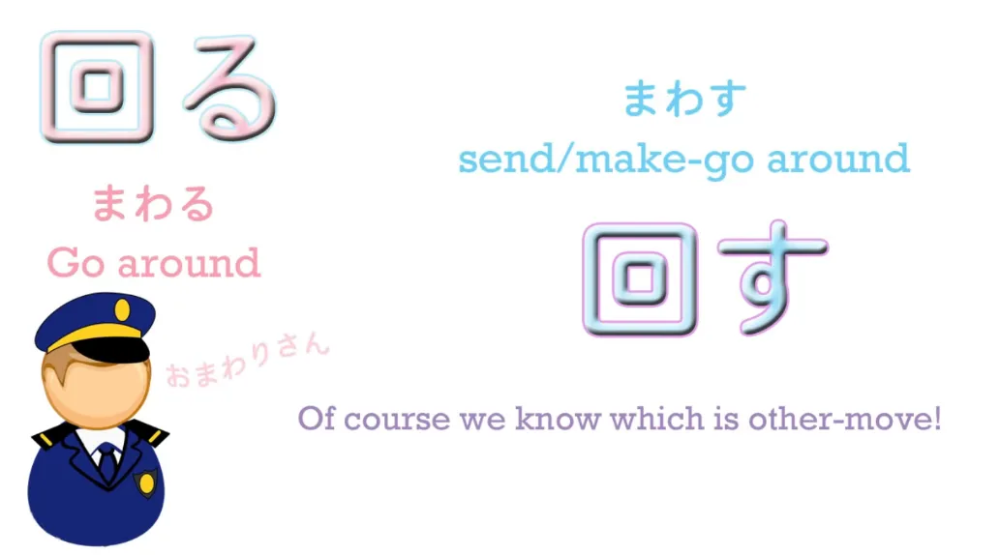
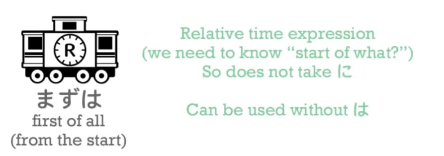
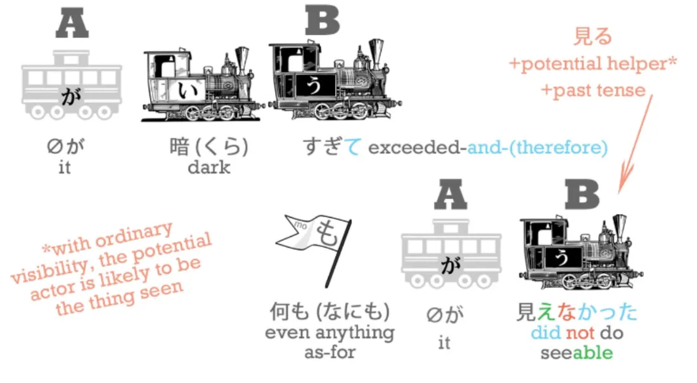
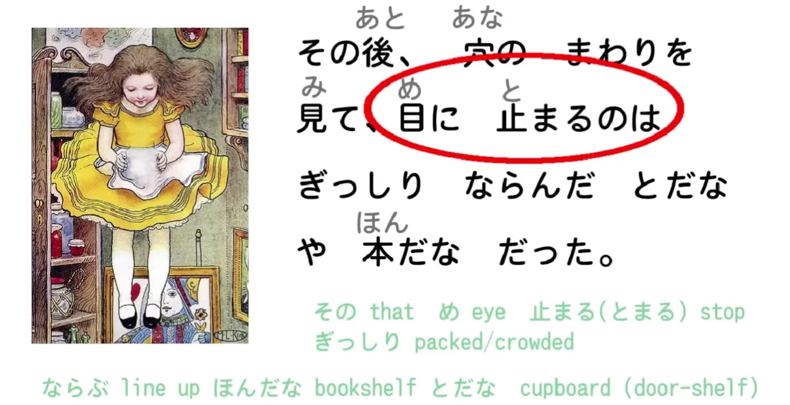
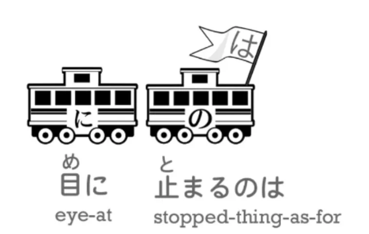
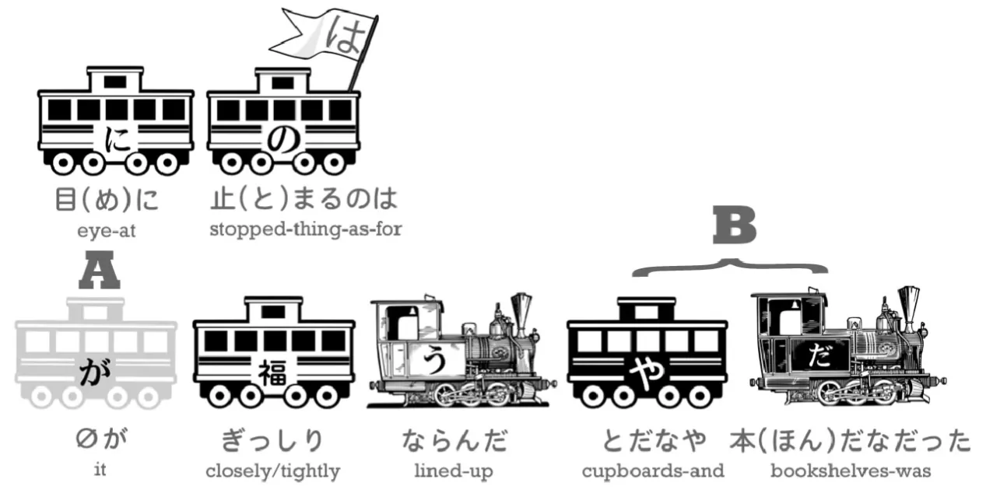
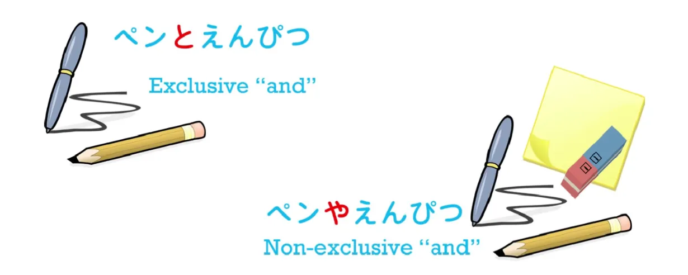
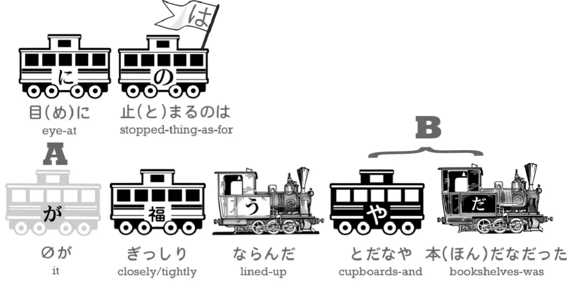
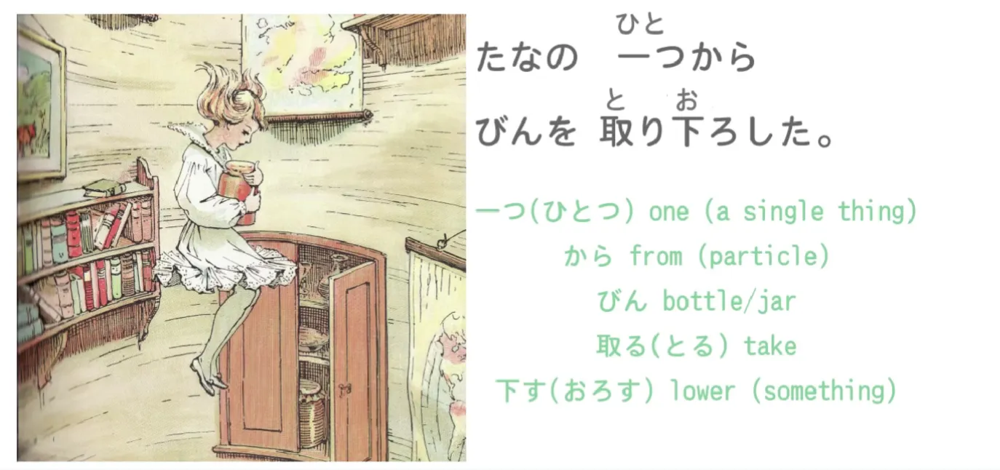

# **16. てみる, частица や, частица から, эксклюзивное <code>и</code>**

[**Урок 16: Te-miru, <code>попробовать сделать</code>, частица ya, частица kara, эксклюзивное <code>и</code> + ещё Алиса**](https://www.youtube.com/watch?v=H_jePzcPFAQ&list=PLg9u9u_A-vcqqyOFZu06WlhnypWj&index=18)

こんにちは.

Сегодня мы возвращаемся к Алисе, и на этот раз мы будем использовать довольно много «поездов», потому что я хочу, чтобы мы по-настоящему уяснили структуру этих предложений. Итак, если вы помните с прошлого раза, Алиса только что вошла в кроличью нору и, к своему удивлению, обнаружила, что очень медленно падает по вертикальной шахте.

> 落ちる間にひまがたっぷりあってまわりをゆっくり見まわせた

Сначала я расскажу вам, что это значит, а затем мы разберём это по частям.

<code>落ちる間に</code>

<code>落ちる</code>, как мы знаем, означает <code>падать</code>. <code>間</code> — это период времени, **а также пространство между двумя вещами.** И, очевидно, период времени всегда, метафорически выражаясь — а мы можем говорить о времени только в пространственных метафорах — период времени всегда является пространством между двумя точками, не так ли? У него есть начало и конец. Так что <code>落ちる間に</code> означает <code>**пока** (она) падала / **в течение того времени, пока** (она) падала</code>.

---

<code>ひま</code> означает <code>свободное время / открытое время</code>. Это слово, которое вы будете встречать довольно часто, и **оно может использоваться как в положительном, так и в отрицательном смысле**. **Оно может означать свободное время, чтобы делать то, что вы хотите, или оно может означать пустое время, скуку, время, которое некуда девать.** Здесь оно просто означает наличие большого количества времени, чтобы оглядеться, потому что она падает, она ничего больше не может делать, и падает она довольно медленно.

---

<code>たっぷり</code> означает <code>в больших количествах</code>. **Это ещё одно из тех наречий, оканчивающихся на り, которым не нужна частица に.** И оно означает <code>в больших количествах / в изобилии</code> — скорее как льётся из крана: <code>たっぷり</code>, <code>в больших количествах</code>. И **здесь это наречие, описывающее тот факт, что <code>ひま</code>, <code>свободное время</code>, существует.** **Так что свободное время существует в больших количествах.**

Итак, это наша первая логическая часть: <code>落ちる間に…</code> (**которая просто задаёт сцену, время для действия — это абсолютное временное выражение, потому что это конкретное время, поэтому оно принимает に**) <code>...ひまがたっぷりあって</code> (<code>было много свободного времени</code>).

---

Теперь следующая часть — <code>まわりをゆっくり見まわせた</code> — интересна, потому что это ещё один пример того, о чём мы говорили на прошлой неделе: пары «движения себя»/«движения другого».

<code>回る</code> означает <code>ходить вокруг / двигаться вокруг</code>. Довольно детское название полицейского — <code>おまわりさん</code>, что означает <code>тот, кто ходит вокруг / тот, кто обходит территорию</code>.

---

<code>回す</code> означает <code>**заставлять (что-то)** ходить вокруг / **отправлять (что-то)** вокруг / заставлять это ходить вокруг</code>, и, конечно, как мы узнали на прошлой неделе, мы легко знаем, какое из пары является словом «движения себя» (ходить вокруг), а какое — **словом «движения другого»** (отправлять вокруг), потому что то, что отправляет вокруг, **заканчивается на -す**.

---

На самом деле, у нас здесь не <code>回る</code>; у нас <code>まわり</code>. И, как мы уже упоминали, **когда мы берём い-основу глагола и используем её саму по себе, она обычно становится существительным.** Есть и другое использование, в которое мы сейчас не будем вдаваться, но в данном случае оно становится существительным. Итак, что означает <code>まわり</code>? <code>まわり</code> на самом деле может означать две вещи: **это может быть существительная форма <code>回る</code>**, и в этом случае это <code>хождение вокруг</code>, <code>обход территории</code>, и это то, что у нас есть в <code>おまわりさん</code>, полицейский — это тот, кто совершает действие обхода территории, **<code>まわり</code> — это <code>акт обхода территории</code>,**

---

**но это также может означать <code>окружение</code>**, и в этом случае оно фактически принимает другой кандзи, чтобы показать, что это немного другое значение слова.
::: info
Это кандзи — 周り.
:::
**Это всё ещё существительная форма <code>вокруг</code>, но в данном случае это окружение, а не акт хождения вокруг.**

::: info
**Верхнее правое оранжевое まわる должно быть まわす.** (Долли-сэнсэй признаёт [**в комментариях**](https://www.youtube.com/watch?v=H_jePzcPFAQ&lc=UgzlHz19j_bcvzKlnGl4AaABAg.9CT4jGElSLJ9CTDDRs1sOu))

:::

Итак, <code> *(zeroが)* まわりをゆっくり見まわせた</code> означает <code>(она) могла неторопливо…</code>

(<code>ゆっくり</code>, это наречие, которое мы выучили на прошлой неделе[[14]](./14-adverbs-and-the-も-particle.md))

она могла неторопливо <code>見まわす</code>

Что означает <code>見まわす</code>? Мы знаем, что означает <code>まわす</code> — это означает <code>заставлять (что-то) ходить вокруг</code>. <code>**見**まわす</code> **присоединяет <code>まわす</code> к い-основе <code>見る</code>.** Мы на самом деле не можем сказать, что это い-основа, потому что это глагол итидан, и все основы итидан выглядят одинаково, как мы знаем, **но мы знаем, что это на самом деле [連用形]{れんようけい}, い-основа, потому что именно она используется для присоединения глаголов к другим глаголам.**

---

Итак, **<code>見まわす</code> буквально означает «отправить свой взгляд вокруг / отправить свои глазные лучи вокруг места / заставить свой взгляд ходить вокруг».** Таким образом, <code>まわりを見まわす</code> — это <code>оглядеться вокруг / отправить свои глазные лучи, отправить свой взгляд вокруг места / *окружения*</code>. А <code>**見まわせる**</code> — это, как мы видели, потенциальная форма <code>**見まわす**</code>.

---

Итак, это означает: <code>поскольку было много времени, она могла неторопливо оглядеться вокруг</code>.

***<code>落ちる間にひまがたっぷりあってまわりをゆっくり見まわせた</code>***

> まずは、下を見てみたけど、 暗すぎて何も見えなかった。

<code>Прежде всего, она попыталась посмотреть вниз, но было слишком темно, поэтому ничего не было видно (ничего нельзя было увидеть).</code>

<code>まずは</code> означает <code>прежде всего</code>. <code>まず</code> — это <code>с самого начала / с самого старта</code>.

<code>まずは、下を 見てみた</code>.

Итак, <code>下を見る</code> — это <code>смотреть вниз / смотреть на низ</code>. **Мы знаем, что в японском <code>низ</code> всегда является существительным**, не так ли? Так что вы смотрите <code>на низ</code> — <code>下を見る</code>. **Но здесь не сказано <code>見る</code>; здесь сказано <code>見てみた</code>**. И это форма речи, которую мы будем встречать очень часто.

## -てみる / -て見る

**Когда мы добавляем <code>みる</code> к て-форме другого глагола, мы говорим <code>попробовать что-то сделать</code>; буквально мы говорим <code>сделать это и посмотреть</code>.** Итак, <code>食べてみる</code> означает <code>съесть это **и посмотреть** / попробовать это</code>.

***А:*** <code>Вам это нравится?</code>

***Б:*** <code>Не знаю.</code>

***А:*** <code>食べてみてください. Попробуйте, вкусите, съешьте это **и посмотрите**.</code>

Мы часто говорим <code>やってみる</code> — <code>Я попробую / Я попробую **и посмотрю**, что получится</code>. **<code>やる</code> — это более неформальная форма <code>する</code>,** и **вы можете сказать <code>してみる</code>, особенно в более формальных обстоятельствах,** **но чаще мы говорим <code>やってみる</code>**: <code>Попробуйте / сделайте это и посмотрите.</code>

**Итак, здесь мы фактически используем <code>見る</code> с <code>みる</code>. <code>見てみる</code>** — <code>попробовать взглянуть / взглянуть / взглянуть и посмотреть</code>.

Итак, <code>下を見てみたけど、暗すぎて</code>. <code>暗い</code> — это <code>тёмный</code>, а <code>すぎる</code>, как мы уже говорили, означает <code>проходить мимо, выходить за пределы</code>. **Так что в данном случае <code>すぎる</code> означает <code>слишком много / выходить за рамки</code>.** Другими словами, было **слишком** темно. Было **чрезмерно** темно; было **слишком** темно.

<code>暗すぎて何も見えなかった</code>. <code>何も</code> означает <code>даже столько, сколько (что-то)</code> — <code>何も</code>. И [**я сделала видео**](https://www.youtube.com/watch?v=00nKUtmnzvI) об этих использованиях も, которое вы, возможно, захотите посмотреть. <code>何も見えなかった</code> — теперь, <code>見る</code> — это <code>видеть</code>; <code>見える</code> — это <code>быть способным видеть/*быть видимым/быть увиденным*</code>.

::: info
Возможно, лучше перевести как <code>быть видимым/поддаваться видению/быть увиденным</code> (версия «движения себя» от 見る)

Я добавила это на случай, если возникнет путаница, поскольку это довольно тонкое различие, и люди путались в этом в комментариях под [**видео**](https://www.youtube.com/watch?v=H_jePzcPFAQ&list=PLg9u9u_A-vcqqyOFZu06WlhnypWj&index=22), не говоря уже обо мне в первый раз.

Что говорит Кьюр Долли [**в комментариях**](https://www.youtube.com/watch?v=H_jePzcPFAQ&lc=UgzYIfuuuSD1tlN7tr54AaABAg.9JDoZ9EQc-O9JDzxV8JLGd). Рекомендую прочитать все комментарии по этому поводу.

В видео Долли-сэнсэй здесь оговорилась (как она признаёт [**в комментариях**](https://www.youtube.com/watch?v=H_jePzcPFAQ&lc=UgxS1dUK8UsQQcHxLKd4AaABAg.9KdTNWq3xuG9Kdu0Oxpim9)), назвав 見える <code>быть способным видеть</code>, что может запутать кого-то, заставив подумать о потенциальной форме 見られる.

---

В данном случае она имела в виду 見える как версию «движения себя» от 見る, означающую что-то вроде <code>быть видимым/поддаваться видению</code> как физическую видимость (вещи и т.д.). Это тонкое отличие от 見られる.
Как Долли говорит [**в комментариях**](https://www.youtube.com/watch?v=H_jePzcPFAQ&lc=Ugz_8te5VO3ktLe0ZVR4AaABAg.96aHgVhcdAL96aMdVNs3c-), оно МОЖЕТ функционировать как потенциальная версия, так и версия «движения себя» от

見る. Это другой глагол, чем 見られる, но 見える также может функционировать как неправильная потенциальная форма 見る, а также является партнёром «движения себя» для 見る. **Проверьте урок 54 для этого, даже сразу после.**

Также, [**этот момент**](https://japanese.stackexchange.com/questions/43881/is-%E8%A6%8B%E3%81%88%E3%82%89%E3%82%8C%E3%82%8B-the-potential-form-of-%E8%81%96%E8%A6%8B%E3%81%88%E3%82%8B) (если вы проверите спряжения 見える на Jisho), как и с примечанием о 出来る в Уроке 10.
Суть здесь в том, что хотя оба подразумевают потенциал, есть разница, причём перевод <code>быть способным видеть</code> больше относится к <code>見られる</code>, а не к 見える, отсюда и это примечание.
:::

И если мы посмотрим на «поезда» здесь, **у нас должен быть субъект, отмеченный が, во второй части предложения:** <code>何も **(zeroが)** 見えなかった</code>.

Что в данном случае является «zero»? Если мы рассматриваем это в английских терминах, мы можем подумать, что это Алиса — <code>Алиса ничего не могла видеть</code>. **Но в японском это обычно на самом деле будет <code>何</code>, что означает <code>вещь / что-то</code>.** **<code>Ничего не было видно, ничего нельзя было увидеть</code>,**

---

потому что обычно с выражениями вроде <code>**見える** / **見えない**</code>, <code>**聞こえる** / **聞こえない**</code>, <code>быть способным видеть/*поддаваться видению*</code> <code>быть способным слышать/*поддаваться слышанию*</code> *(+ их ない-форма: не поддаваться слышанию и т.д.)*
::: info
<code>Поддаваться видению</code> — это приблизительный перевод того, как Долли могла бы перевести это, чтобы, я полагаю, показать, что это скорее глагол, согласно некоторым её комментариям, как отмечено в примечании на предыдущей странице.
Другой перевод для 見える по Долли — быть видимым/<code>быть увиденным</code>/быть видимым/поддаваться видению/видимый.
Хотя -ない, как его отрицательная форма, довольно прилагательное ([**см. это**](https://japanese.stackexchange.com/a/5092)). На самом деле неважно, как это переводится, только если вы хотите быть более техничным в соответствии с методом приблизительного перевода Долли и более чётко показать разницу между 見られる и 見える. **Проверьте урок 54.**
:::

**— мы применяем это не к человеку, который способен видеть, а к вещи, которая способна быть увиденной.** И, конечно, мы это уже проходили, не так ли, в нашем уроке о потенциале.[[10]](./10-helper-verbs-the-potential-helper-verb.md)

<code>その後</code>: <code>後</code>, как мы знаем, означает <code>после</code> — мы встречали его в значении «следовать за кем-то», **но оно также означает <code>после</code> в другом смысле, <code>после этого</code>.** <code>その</code> означает <code>тот</code>; **<code>その後</code> означает <code>после этого</code>.** Так что опять же, **это просто временное выражение, устанавливающее время.** И **на этот раз это относительное временное выражение, <code>после этого / после определённой вещи</code>, поэтому ему не нужна частица に.**

<code>その後、穴のまわりを見て</code> Итак, теперь она не смотрит вниз. Это означает <code>окружение</code>, опять же, <code>[周]{まわ}り</code>, норы, <code>をみて</code> — <code>после этого она посмотрела на окружение норы</code>.

---

> 目に止まるのはぎっしりならんだとだなや本だなだった.

Итак, это довольно сложно. Первая часть предложения достаточно проста. <code>その後、穴のまわり見て</code> — <code>После этого она посмотрела на окружение норы</code>. Вторая часть предложения содержит довольно много для нашего рассмотрения. <code>目に止まるのは</code> буквально означает <code>то, что остановилось в её глазу</code>.

Теперь это похожее выражение на английское <code>the thing that caught her eye</code> (то, что привлекло её внимание), не так ли? Различные вещи проходили через её глаз, через её зрение, и то, что там остановилось, было тем, о чём мы собираемся говорить. Но нам также нужно рассмотреть это использование の. Как мы видели раньше, の похоже на апостроф-s ('s) в английском. Так что если мы говорим <code>さくらのドレス</code>, мы говорим <code>платье Сакуры</code>.

Теперь также, как и в английском, если вы говорите: <code>Какое платье вам нравится больше всего?</code> Предположим, что Сакура и Мэри обе носят платья, и вы говорите: <code>Какое платье вам нравится больше всего?</code> В английском вы можете сказать: <code>Сакуры. Мне больше всего нравится Сакуры</code>. Вы могли бы сказать: <code>платье Сакуры</code>, но не обязаны, вы можете просто сказать: <code>Сакуры</code>. **И то же самое в японском.** **Вы можете сказать** *(просто)* **, <code>さくらの</code> — Сакуры, то, что принадлежит Сакуре.** Но это может быть расширено гораздо дальше в японском, и [**я сделала целое видео**](https://www.youtube.com/watch?v=Bq3GO63D9bw) об этом конкретном использовании の, которое вы можете посмотреть, если хотите углубиться.

---

Но в данном случае это расширяется так: <code>目に止まるの</code> — это <code>вещь, та, что остановилась в её глазу</code>. <code>Какое платье вам нравится больше всего? Сакуры, Сакурино, Сакурина вещь, платье Сакуры.</code> <code>目に止まるの</code> — <code>вещь, та, что остановилась в её глазу</code>. Итак, <code>穴のまわりを見て、目に止まるのは</code> — «глядя на окружение норы, то, что остановилось в её глазу, было…» И это было

<code> *(zeroが)* ぎっしりならんだとだなや本だなだった</code>. **<code>ぎっしり</code> — это ещё одно из тех наречий, оканчивающихся на り, которым не нужна частица に.** <code>ぎっしり</code> означает <code>плотно упакованный</code>. <code>ならんだ</code> — это прошедшее время от <code>ならぶ</code>, что означает <code>выстроенный в ряд</code>, так что <code>**ぎっしり ならんだ**</code> означает <code>**плотно выстроенный в ряд** / **плотно упакованный** / **выстроенный в ряд и плотно упакованный**</code>. <code>ぎっしりならんだとだなや本だなだった</code>.

---

Хорошо. Что ж, к <code>や</code> мы вернёмся через мгновение, но <code>とだなや本だな</code>. Слово для полки в японском — <code>たな</code>, и когда мы добавляем что-то перед ним, чтобы сказать, что это за полка, мы используем то самое <code>ten-ten hooking</code> *(〃)*, о котором мы говорили раньше.
::: info
Урок 5, <code>Третья и четвёртая группа годан-глаголов</code>.
:::
Итак, <code>た</code> становится <code>だ</code>: <code>とだな</code> — это <code>と</code> означает <code>дверь</code>, так что буквально <code>とだな</code> — это <code>дверь-полка</code>, и это японское слово для шкафа. И это довольно хорошее слово, я думаю. Ведь шкаф — это именно это, не так ли? Полки с дверью. Это лучший способ сказать «шкаф», чем английский, который говорит, что это доска, на которую вы ставите чашки, что не совсем то, чем является шкаф. <code>本だな</code> ещё проще: это буквально книжная полка, книжные полки.

## Частица や + эксклюзивное <code>и</code>

Теперь, это <code>や</code> — это то, что нам нужно рассмотреть. Когда вы хотите сказать <code>и</code> — что-то <code>и</code> что-то ещё — как вы это говорите по-японски? Мы знаем, что когда вы соединяете две части предложения, мы используем て-форму, или иногда мы используем другие вещи, такие как <code>でも</code>. В английском мы используем <code>and</code> во всех случаях: мы говорим <code>bread and butter</code> (хлеб с маслом), <code>pencil and paper</code> (карандаш и бумага). Мы также говорим <code>I went into the baker's and bought some bread</code> (Я зашёл в булочную и купил хлеб). **Но в японском мы не используем одно и то же <code>и</code> в двух случаях.** Мы уже знаем некоторые способы, которыми мы можем соединять две части предложения, но когда мы соединяем две вещи, есть два способа сделать это. И один из них — использовать частицу と. Мы знаем, что частица と — это частица цитирования, **но это также и частица <code>и</code>.** Так что если вы хотите сказать <code>pen and book</code> (ручка и книга), мы говорим <code>ペンと本</code>. **Но мы также можем использовать частицу や, так что мы можем сказать <code>と</code> или <code>や</code>, когда хотим соединить два или более объекта.** В чём разница?

---

Что ж, на самом деле это очень полезное различие, и оно пригодилось бы нам в английском. **<code>と</code> — это эксклюзивное <code>и</code>.** Если я говорю: <code>Что в этой коробке?</code>, а вы отвечаете <code>ペンとえんぴつ</code> — <code>ручки и карандаши</code> — **вы говорите мне, что в этой коробке есть ручки и карандаши и ничего больше.**

Если вы говорите <code>ペンやえんぴつ</code>, вы говорите, что есть ручки и карандаши, **и там может быть что-то ещё** — **и очень часто вы подразумеваете, что там есть что-то ещё, потому что вы избегаете использования эксклюзивного <code>и</code>.** Так что то, что <code>остановилось в её глазу</code>, было тем фактом, что шкафы и книжные полки **(среди прочего)** были плотно выстроены вдоль стен.

---

::: info
В видео 取り下ろした имеет лишний ろ в фуригане 下. Читайте только <code>とりおろした</code>.
Я исправила это здесь. Опускать (что-то) можно записать как 下す (おろす) или 下ろす(おろす).
下す — это версия 下ろす с нерегулярным использованием окуриганы. Оба варианта допустимы.*
:::

## Самое базовое использование частицы から

<code>たなの一つからびんを取り下した</code>

<code>たなの一つ</code>: <code>一つ</code> означает <code>один</code>; **<code>から</code> — это частица, означающая <code>из</code>.** Теперь, здесь она использует <code>たな</code> само по себе — <code>полки</code> — и поскольку оно ни с чем не соединено, это <code>たな</code>, а не <code>だな</code>. И поэтому она говорит <code>**из** одной из полок</code> — <code>たなの一つから</code>, <code>из одной из полок</code> — обратите внимание, что <code>たなの一つ</code> на самом деле то же самое, что английское <code>**one** of the shelves</code> — <code>たなの一つ</code>.

<code> *(zeroが)* たなの一つからびんを取り下ろした.</code>

Теперь, <code>取る</code> означает <code>брать</code>, а <code>下す</code> — кандзи, как вы видите, это кандзи для <code>вниз</code>, и опять же **это часть пары движения, пары «движения себя»/«движения другого»**,
поэтому я и представила их раньше.

::: info
Предыдущее примечание о фуригане также относится к 下りる: в видео есть опечатка, там должно быть только お. Я исправила это здесь. Однако здесь нет 下る для (下りる), это не его нерегулярная форма.
Тогда это скорее означало бы くだる (下る) или さがる (下る) в их нерегулярных формах окуриганы.
:::

Большинство курсов сочли бы это промежуточной темой, «движение себя» и «движение другого», но я думаю, что это значительно облегчает распознавание того, что делают слова, если вы об этом осведомлены. <code>下りる</code> означает <code>спускаться / сходить</code> — спускаться по лестнице, выходить из автобуса. <code>下す/下ろす</code> означает <code>спускать *(что-то)* вниз</code>. И снова, **мы знаем, какое из них является словом «движения другого»** — вы <code>спускаете (что-то другое) вниз</code> — это то, что заканчивается на -す: <code>下す</code>. Так что <code>取り下ろす</code> означает <code>взять и спустить вниз</code>.

<code> *(zeroが)* たなの一つからびんを取り下ろした.</code> <code>С одной из полок *(она)* **сняла**...</code>

<code>びん</code> обычно переводится как <code>бутылка</code>; на самом деле в данном случае это была скорее <code>банка</code>. Что в ней было? Что ж, нам придётся подождать до следующего раза, чтобы узнать…

::: info
Опять же, я настоятельно рекомендую просмотреть все комментарии под [**этим видео**](https://www.youtube.com/watch?v=H_jePzcPFAQ&list=PLg9u9u_A-vcqqyOFZu06WlhnypWj&index=18) уроком, так как некоторые его части там дополнительно разъясняются Долли, поскольку этот урок довольно <code>интенсивный</code> (；￣Д￣)
:::