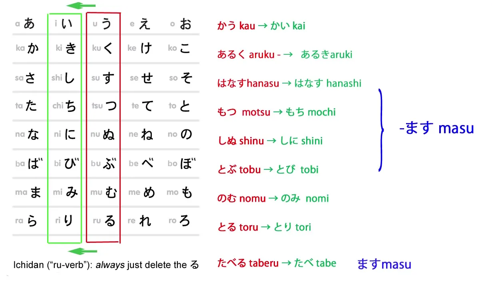
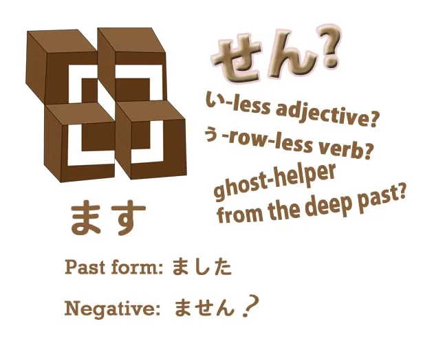
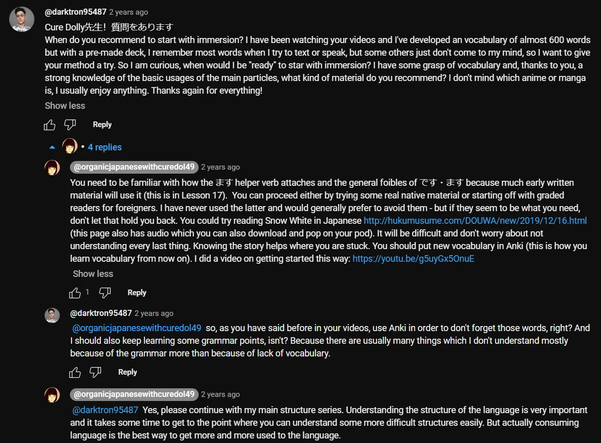

# **17. Вежливый японский и волитив**

[**Урок 17: Как です/ます РУШИТ ваш японский! + Как использовать его правильно. Плюс волитив**](https://www.youtube.com/watch?v=ymJWb31qWI8&list=PLg9uYxuZf8x_A-vcqqyOFZu06WlhnypWj&index=19)

こんにちは.

Сегодня мы поговорим о **вежливом** (формальном) японском: です/ます.

::: info
Всякий раз, когда Долли использует термин <code>формальный</code> для です или ます, следует понимать его как ВЕЖЛИВЫЙ, поскольку между этими двумя терминами в японском языке есть разница. Не знаю, почему она не упомянула это, но это довольно важно различать: если вы посмотрите их определения, словари помечают их как вежливые.
:::

***Они являются частью 丁寧語 (вежливого языка). Поэтому точнее называть их вежливыми.***

Возможно, некоторые удивятся, что мы прошли шестнадцать уроков, ни разу не используя это, в то время как большинство курсов начинают с этого с самого первого урока.

Что ж, есть веские причины, почему мы этого не делали. **Одна из причин в том, что форма です/ます на самом деле довольно эксцентрична.** **Она делает разные вещи, которые не делает большая часть остального японского языка.** Поэтому, если мы выучим её как стандартный способ говорить, у нас появятся всевозможные странные представления о том, как работает японский. Мы могли бы начать изучать её немного раньше, но, честно говоря, есть более важные приоритеты, и лучше твёрдо закрепить в уме настоящий, стандартный японский, прежде чем мы войдём в довольно проблемную область です/ます. Это несложно, как только вы очень твёрдо усвоите стандартные японские структуры, а мы это уже сделали. **Если вы ещё этого не сделали, если вы не следовали этому курсу, пожалуйста, вернитесь к первому уроку прямо сейчас.** Вперёд. Отлично.

## ます

Что ж, для остальных из вас, давайте начнём с <code>ます</code>. **<code>ます</code> — это глагол.** **Это не часть глагола, это сам по себе глагол.** Это вспомогательный глагол, как и многие другие вспомогательные глаголы, которые мы рассматривали до этого момента. **Он присоединяется к нашему старому другу, い-основе, и никак не меняет значения слова, к которому присоединяется.**

**Он просто делает его вежливым.** Так, <code>歩く</code> становится <code>歩きます</code>; <code>話す</code> становится <code>話します</code>, и так далее. И **это просто вежливый способ сказать <code>говорить</code>, <code>ходить</code> и т.д.**

---

Теперь, ещё одна причина, по которой я не учила этому раньше, заключается в том, что люди говорят, что в японском языке всего два неправильных глагола — я сама так говорила, — **но правда в том, что есть ещё один,** **и это <code>ます</code>.** **И <code>ます</code> неправилен не так, как неправильны <code>くる</code> и <code>する</code>. Он гораздо хуже.** Он делает то, что не делается больше нигде в современном японском. Но **хорошая новость в том, что прошедшее время полностью правильное и нормальное.** Оно работает так же, как любой другой глагол, оканчивающийся на す: это <code>ました</code>. Но отрицательная форма не <code>まさない</code>; **это <code>ません</code>.**

### ません

И что это за слово — <code>ません</code>? **Это на самом деле ничто, что существует в современном японском языке.** Учебники говорят нам, что это отрицательная форма глагола, но затем они говорят нам, что глагол — это то, к чему присоединяется <code>ます</code>, а также они говорят нам, что <code>ない</code> — это отрицательная форма глагола, хотя это совсем не так. Это вспомогательное прилагательное. *(см. Урок 7)* Нам не нужно вдаваться в то, что такое <code>ません</code> с точки зрения структуры, потому что это не встречается больше нигде в современном японском, поэтому мы просто запоминаем это как факт. **Отрицательная форма <code>ます</code> — это <code>ません</code>.**

::: info
Непрошедшая форма.
:::

И это ещё одна причина, по которой я не учила этому раньше, потому что в японском не так много такого: вещей, которые нужно просто выучить <code>как факт</code>. Если вы знаете принципы, стоящие за вещами, то, как правило, вы можете понять, как всё работает, без большого количества запоминания. **Поэтому, когда вы начинаете учиться, узнавая, что вам просто нужно выучить, что отрицательная форма <code>ます-глаголов</code>, как их называют — другими словами, вспомогательного глагола ます — это <code>ません</code>, вы начинаете с мысли, что японский просто делает различные случайные вещи, как европейский язык.**

::: info
Что является вредным образом мышления о японском языке, как мы знаем, хотя некоторые вещи в чём-то довольно похожи, всё же лучше рассматривать японский таким, какой он есть, не пытаясь навязывать ему другой язык, за исключением, возможно, объяснения некоторой терминологии (поскольку мы используем здесь английский), если это уместно.
:::

### ませんでした

Теперь, отрицательное прошедшее время становится ещё страннее. **Нет прошедшего времени от -せん, как -ない становится -なかった,** так что же нам делать? **Мы просто добавляем прошедшее время от <code>です</code> к концу <code>ません</code> и говорим <code>ませんでした</code>.** <code> *(zeroが)* あるきませんでした</code> – <code>(Я) **не** ходил(а)</code>. Многим японцам, изучающим японскую грамматику, это очень не нравится, и я не могу их винить. Но это, к лучшему или худшему, стало стандартной японской грамматикой, так что нам просто нужно это запомнить. Это всего лишь пара неправильностей, и их не так уж трудно запомнить, если только мы не учим их в самом начале, где они путают всё наше понимание японского.

---

Если мы учим <code>ます</code> как так называемое <code>спряжение</code> и верим, что это базовая форма глагола, то для образования других форм глаголов мы обнаруживаем, что снимаем -ます, а затем меняем い-основу на другой тип основы, чтобы сделать что-то ещё. Что было бы достаточно сложно, если бы мы знали об основах, но учебники и этого нам не говорят, так что у нас просто куча совершенно случайных правил и положений в европейском стиле, которые вообще не имеют смысла.

## です

Итак, давайте перейдём к <code>です</code>. **<code>です</code>, как вы знаете, это вежливая версия <code>だ</code>.** **Это связка.** **Она работает точно так же, как <code>だ</code>, так что если вы знаете <code>だ</code>, вы уже знаете <code>です</code>.**

За исключением того, что у неё тоже есть странная особенность: если мы берём прилагательное, такое как <code>赤い</code>, означающее <code>является красным</code>, мы добавляем <code>です</code> к его концу в вежливой речи.

**Она ничего не делает; она просто украшает предложение и делает его вежливым.** Опять же, это то, что вам просто нужно выучить, и это не очень сложно, но если вы учите это в начале, у вас складывается впечатление, что вам нужна связка с прилагательным, таким как <code>赤い</code>, точно так же, как вам нужна связка с именным прилагательным, таким как <code>[綺麗]{きれい}</code>.

И, конечно, тот факт, что они называют именные прилагательные <code>な-прилагательными</code>[[6]](./6-adjectives.md), делает всё ещё более запутанным. Вы думаете, что прилагательные принимают связку, а они этого не делают. Настоящие прилагательные, い-прилагательные, не принимают связку, за исключением того, что в довольно странной форме です/ます мы просто добавляем <code>です</code> в конце для украшения. Именные прилагательные, с другой стороны, конечно, принимают связку, потому что они являются существительными — а все существительные принимают связку. Итак, мы говорим <code>あかい</code> – <code>является красным</code> / <code>綺麗だ</code> – <code>является красивым</code>; <code>赤いです</code> – <code>является красным</code> **с украшением**; <code>綺麗です</code> – <code>является красивым</code> **с правильной связкой, которая ей нужна в вежливой форме.**

Итак, как видите, вежливый японский на самом деле не так уж и сложен. Нам нужно выучить несколько довольно странных фактов, и он не похож на большую часть остального японского, который ужасно похож на Лего и логичен. В нём есть небольшие причудливые кусочки, но их немного, и пока у вас в голове прочно закрепился настоящий японский, добавление формы です/ます не представляет особой сложности.

Ещё пара вещей, которые стоит знать: одна из них заключается в том, что помимо <code>ません</code>, **мы также можем сказать <code>ないです</code>.**

Итак, мы можем сказать <code>さくらが話しません</code> – <code>Сакура не разговаривает</code>, или мы можем сказать <code>さくらが話さないです</code>. И это, конечно, совершенно логично и разумно, если вообще что-то из этого логично, **потому что, поскольку мы добавляем <code>です</code> к концу прилагательных в вежливой речи,** **мы также можем добавить его к концу вспомогательного прилагательного ない,** **которое на самом деле просто ещё одно прилагательное.** **Мы не вносим много изменений в <code>ます</code>, потому что это действительно завершитель предложения; мы ставим его в самый конец всего, что мы делаем, чтобы добавить предложению вежливости.**

---

**Однако мы можем использовать как <code>です</code>, так и <code>ます</code> со вспомогательным глаголом волитива.**

И снова <code>ます</code> ведёт себя эксцентрично, потому что его お-основа не <code>まそ</code>, как можно было бы ожидать, **а <code>ましょう</code>.** **Таким образом, волитивная форма — это <code>ましょう</code>.** К счастью, это лишь слегка эксцентрично и несложно освоить. И также к счастью, **<code>です</code> образует соответствующую пару с <code>ます</code> в волитивной форме и становится <code>でしょう</code>.** И поскольку мы затронули тему волитива, давайте рассмотрим и его.

## Волитив

Его образование очень простое, и **это одна из немногих вещей, которые мы делаем с お-основой глаголов**.

**Вспомогательный глагол волитива для годзидан,** как и вспомогательный глагол потенциала — вспомогательный глагол потенциала — это просто одна кана, る(-ru), а **вспомогательный глагол волитива — это просто одна кана う**(-u), **и мы добавляем её к концу お-основы, и она удлиняет звук お.** Так, <code>話す</code> становится <code>話そう</code>, <code>歩く</code> становится <code>歩こう</code> и так далее.

---

Что это значит? **Что ж, название само по себе говорит о его значении. <code>Волитив</code> означает <code>волю</code>, поэтому волитив выражает или призывает к воле.** **Наиболее распространённое его использование — это направление воли группы людей в определённое русло.** Так мы говорим <code>行きましょう</code> *(как уже упоминалось, ましょう — это волитивная форма ます)*, <code>**Давайте** пойдём</code>. И некоторые люди называют вспомогательное прилагательное たい также волитивом, **что сбивает с толку, потому что это не одно и то же.**

---

**И здесь важно помнить, что -たい выражает желание, хотение, стремление что-то сделать.** **Волитивная форма выражает волю. А воля и желание — это не одно и то же.** Например, **у вас может быть воля сделать домашнее задание. Это не значит, что вы хотите делать домашнее задание.** На самом деле вы хотите играть в <code>Captain Toad</code>, но вы направляете свою волю на выполнение домашнего задания. И когда мы говорим такие вещи, как <code>行こう</code>, <code>**давайте** пойдём</code>, для вещей, которые мы все, возможно, хотим сделать, <code>давайте устроим пикник</code>, <code>давайте устроим вечеринку</code>, **но также** <code>давайте уберёмся в комнате</code>, <code>давайте сделаем домашнее задание.</code> **Это выражает волю, а не желание.**

---

Вы очень часто будете видеть на японских вывесках что-то вроде <code>ゴミを持ち帰りましょう</code> – <code>**давайте** подберём наш мусор и заберём его домой</code> – что мне всегда кажется довольно приятным видом призыва, довольно отличающимся от западных знаков, которые говорят: «Подберите свой мусор, иначе мы конфискуем вашу машину и покрасим ваших детей в фиолетовый».

---

Теперь, **есть ряд применений волитива вместе с частицами, такими как -か и -と**, но мы не будем вдаваться в них здесь, потому что я не думаю, что изучение списков употреблений — это хороший способ обучения. Мы разберём их по мере того, как будем сталкиваться с ними, возможно, в ходе приключений Алисы. Но одно применение этой формы, которое стоит знать, потому что вы будете видеть его довольно часто, заключается в том, что **мы используем волитивную форму связки <code>だ</code> или <code>です</code> — <code>だ</code>, которая на самом деле не является глаголом в обычном смысле, волитив — это <code>だろう</code> — и если мы добавим это к любому другому предложению, это придаст ему значение <code>вероятно</code>.**

::: info
Для です это でしょう. Иногда вы можете увидеть だろう, называемое волитивной формой である вместо だ. Из моего исследования следует, что である — это просто более литературная/старая форма だ.
Также обратите внимание на значение сомнения/предположения, которое だろう / でしょう придаёт предложению.
:::

<code>それは赤いでしょう */ だろう</code> – <code>Это **вероятно** красное / **Я думаю**, это красное</code>; <code>さくらがくるでしょう */ だろう</code> – <code>**Я думаю**, Сакура придёт / Сакура **вероятно** придёт</code>.

::: info
Несмотря на то, что だろう является волитивной формой связки だ, кажется, что его можно использовать с прилагательными обычным образом, тогда как обычная связка だ не может. Возможно, это потому, что оно выражает <code>вероятно/думаю/предполагаю</code>, а не <code>является</code>, что является частью -い; или потому, что оно произошло от である?

*Также существуют だろ/でしょ, которые являются менее вежливыми версиями. だろ, кажется, используется только мужчинами.*

Итак, теперь мы знаем, как использовать волитив и как использовать вежливый японский.

:::