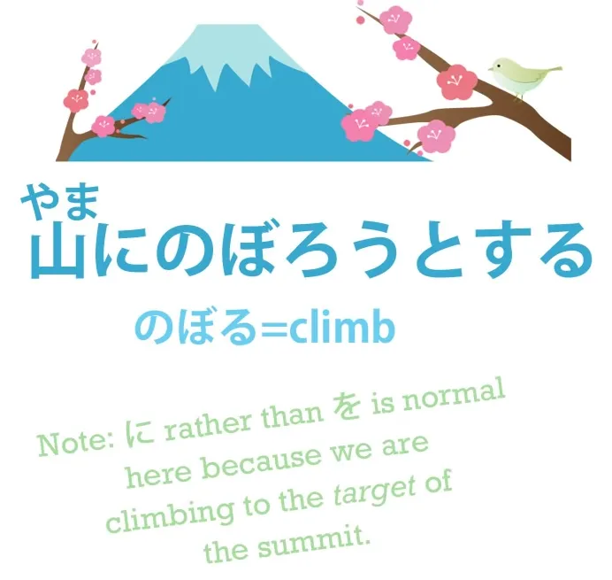
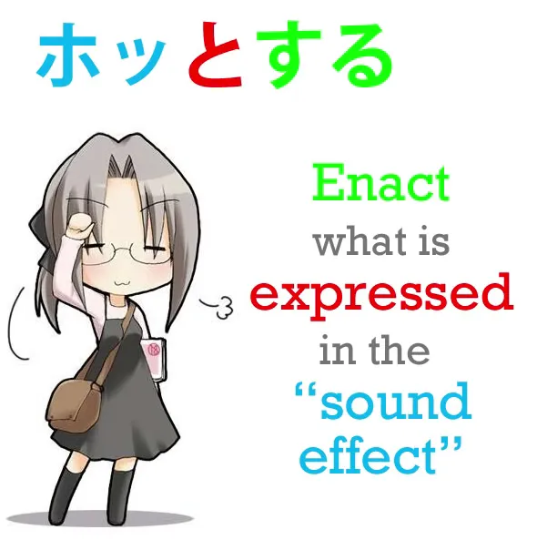
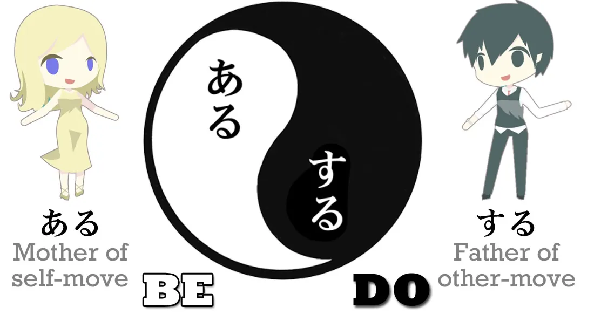
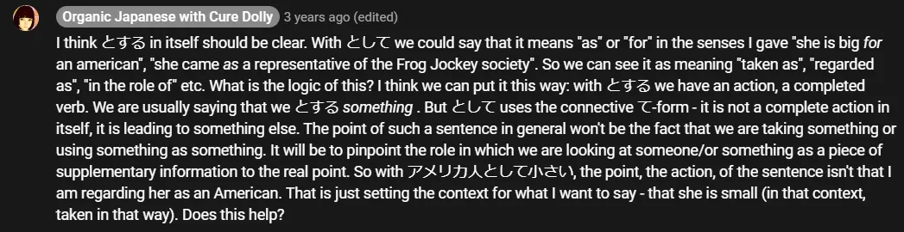
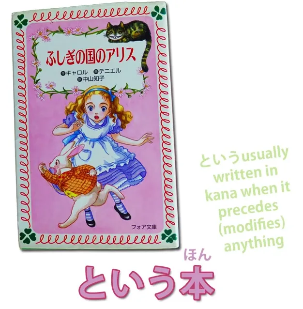
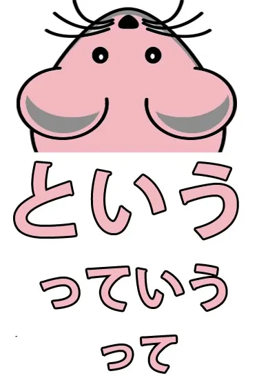

# **18. って = は?? Загадки разгаданы! -おうとする, とする, として, という, っていう**

[**Урок 18: ってtte = はwa?? Загадки разгаданы! Toshite, toiu, to suru, ou to suru, tteiu**](https://www.youtube.com/watch?v=40avkmkQR8M&list=PLg9uYxuZf8x_A-vcqqyOFZu06WlhnypWj&index=20)

こんにちは。

Сегодня мы поговорим о **попытке что-то сделать**, и отсюда мы расширимся до более широких значений частицы цитирования <code>と</code>, потому что это очень центральная часть японского языка, которая используется постоянно. Поэтому нам нужно твёрдо понять, что это такое и как это работает. Итак, на прошлой неделе[[17]](./17-polite-japanese-and-the-volitional.md) мы изучили вспомогательный глагол волитива う и よう, который заставляет слово заканчиваться на звук <code>おう</code> или <code>よう</code> и выражает волю.

**Если мы <code>пытаемся</code> что-то сделать, мы используем для этого волитив.** Так, если мы скажем <code>山にのぼろうとする</code>, это означает <code>**пытаться взобраться** на гору</code>. Почему это так? Что на самом деле делает эта конструкция?

Что ж, <code>のぼろう</code> **выражает волю к восхождению.**

Если мы скажем <code>山にのぼろう</code>, мы говорим: <code>**Давайте** взойдём на гору</code>. Буквально: **направим нашу волю на восхождение на гору.**

## おうとする / とする

<code>のぼろうとする</code> **означает совершение действия, подразумеваемого направлением нашей воли на восхождение на гору.** Если бы мы просто хотели сказать <code>взойти на гору</code>, мы бы просто сказали <code>山にのぼる</code>. Но мы не говорим <code>взойти на гору</code>, мы говорим <code>**пытаться** взойти на гору</code>. **Следовательно, совершить действие, подразумеваемое направлением нашей воли / воплотить нашу волю в восхождении на гору,** **независимо от того, удастся нам на самом деле взобраться на неё или нет.**

Некоторые люди находят различие между <code>try climbing</code> (попробовать взобраться) и <code>try to climb</code> (пытаться взобраться) запутанным. И это действительно только из-за того, как это выражается в английском.

**В японском**, как мы недавно узнали[[16]](./16-てみる-や-particle-から-particle-exclusive-and.md), **если мы хотим сказать** <code>**попробовать** взобраться на гору</code>, мы говорим <code>山にのぼってみる</code>. **Разница в том, что <code>попробовать взобраться / попробовать съесть / попробовать поплавать</code> не подразумевает никаких сомнений в том, что мы действительно можем это сделать.** **Это подразумевает сомнение в том, каков будет результат, когда мы это сделаем.**

---

**<code>Попробовать съесть</code> — мы знаем, что можем съесть, но не знаем, понравится ли нам это.** <code>Попробовать съесть</code> — <code>食べてみる</code> — означает <code>съесть и посмотреть</code>. Съешьте это, а затем посмотрите, каков результат, посмотрите, понравится ли вам это, не понравится ли.

---

<code>山にのぼってみる</code> означает <code>взойти на гору и посмотреть</code>. Посмотреть, было ли это трудно, посмотреть, какой вид сверху.

---

<code>ケーキを食べようとする</code> — <code>**пытаться съесть** торт</code> — подразумевает, что мы не знаем, сможете ли вы на самом деле съесть торт или нет, но всё равно попробуйте. Возможно, это огромный торт, и его будет очень трудно съесть целиком. Итак, <code>してみる</code> — <code>сделать и посмотреть</code> — **подразумевает, что нет сомнений в том, что мы можем это сделать, но есть некоторые сомнения в том, каков будет результат после того, как мы это сделаем.** Понравится ли нам это? Упадёт ли здание? Мы не знаем, что произойдёт, когда мы это сделаем, но мы знаем, что можем это сделать. **<code>しようとする</code> подразумевает, что мы не знаем, можем ли мы это сделать или нет,** **но мы собираемся попытаться это сделать.**

---

Итак, здесь важно понять, что делает частица と. **-と инкапсулирует предложение, которое предшествовало ей:** <code>山にのぼろう</code> — воля к восхождению на гору. **Она не цитирует его.** Это не то, что мы сказали; это не то, что мы подумали, если быть точным. **Суть в том, что она берёт сущность, значение, смысл этого <code>山にのぼろう</code> и приводит его в действие.** И мы увидим это в других случаях.

Например, мы можем прочитать, что кто-то <code>ホッとした</code>. Что это значит? <code>ホッ</code> на самом деле является звукоподражанием. Это звукоподражание вздоха облегчения: <code>ホッ</code>. **Но <code>ホッとする</code> на самом деле не означает <code>вздохнуть с облегчением</code>.** Это означает **<code>почувствовать облегчение / быть облегчённым</code>**.

---

**Итак, то, что мы здесь делаем, это воплощаем идею, чувство, выраженное в <code>ホッ</code>, вздохе облегчения.** **Точно так же, как в <code>山にのぼろうとする</code> мы воплощаем чувство,** **смысл направления нашей воли на восхождение на гору, то есть попытку взобраться на неё.**

### とする & にする

Теперь, аналогично, если мы скажем <code>さくらを日本人とする</code>, это означает **рассматривать Сакуру как японку.**

Мы могли бы также сказать <code>さくらを日本人にする</code>, но это означает нечто совершенно иное. Это означает <code>**превратить Сакуру в японку**</code>. **に — это цель действия.**

---

Некоторое время назад у нас был урок[[8]](./8-the-に-and-へ-particles.md), в котором мы говорили о <code>さくらがかえるになる</code> — <code>Сакура **становится лягушкой**</code>.

Теперь, мы также говорили[[15]](./15-transitive-intransitive-verbs.md) о том, что <code>ある</code> и <code>する</code> — это Ева и Адам японских глаголов,

причём <code>ある</code> является основным глаголом самодвижения, а <code>する</code> — основным глаголом чужедвижения. **<code>なる</code> очень тесно связан с <code>ある</code> — <code>ある</code> означает <code>быть</code>, <code>なる</code> означает <code>становиться</code>.** И **поэтому, если мы говорим <code>になる</code>, это означает стать чем-то.** **Если мы говорим <code>にする</code>, это версия <code>になる</code> для чужедвижения.** Это означает <code>превратить что-то во что-то</code>. Итак, если мы скажем <code>まじょがさくらをカエルにした</code> — <code>ведьма **превратила** Сакуру **в лягушку**</code>.

::: info
カエル — это просто ещё один способ написания слова «лягушка» с помощью катаканы. Животных обычно так и пишут.
:::

<code>さくらを日本人にする</code> — **превращение** Сакуры **в японку**; но <code>さくらを日本人とする</code> — **рассматривать** Сакуру **как японку** / **принимать** Сакуру **за японку.**

<code>かばんをまくらとする.</code>

<code>かばん</code> — это <code>сумка</code>, <code>まくら</code> — это <code>подушка</code>, и это означает <code>использовать сумку как подушку</code>. **Вы не превращаете свою сумку в подушку, она не становится подушкой,** **но вы рассматриваете её как таковую и используете её как таковую.** Итак, здесь у нас есть некоторые из применений <code>-とする</code>. **В целом, это относится к тому, как мы что-то рассматриваем.**

## として

Теперь, **если мы говорим <code>-として</code>, это не столько акт рассмотрения чего-то как чего-то,** **сколько видение чего-то в свете того, чем оно является.** Так, в английском это обычно переводится просто как <code>as</code> или <code>for</code>. Или <code>being in the role of</code> (будучи в роли).

Итак, <code>こじんとして の いけん</code> означает <code>моё мнение **как** частного лица</code>, в отличие, скажем, от <code>моего мнения **как** президента Общества лягушачьих жокеев.</code> *- просто ещё один пример предложения (контраст в словах <code>частное лицо</code> и <code>президент</code>), а не какое-то различие в функции として. Формулировка может ввести в заблуждение, будто Долли имела в виду, что として здесь играет противоположную роль.*

Или мы могли бы сказать <code>アメリカ人として小さい</code> — «Она маленькая **для** американки / **Как** американка, она маленькая». Итак, мы видим, что **функция цитирования частицы -と используется не только для цитирования идей и мыслей, но и для того, чтобы взять чувство чего-либо, упаковать его и затем что-то о нём сказать.**

::: info
На всякий случай, этот комментарий может помочь некоторым в отношении とする & として.

:::

## と[言]{い}う

Конечно, **самое базовое, что может следовать за -と, это <code>いう</code>,** **в этом случае это буквальная цитата,** **-と[言]{い}う** (обычно произносится не столько <code>-という</code>, сколько <code>-とゆ</code>). И **это снова может использоваться не только в буквальной цитате, но и для того, чтобы сказать, как что-то говорится или как это называется.** Так, <code>ふしぎの国のアリスという本</code> означает <code>книга, **называемая** ふしぎの国のアリス</code>.

### って[言]{い}う

**А -と в <code>-という</code> может быть сокращено просто до -って.** Так что мы можем сказать <code>-っていう</code> — <code>ふしぎの国のアリスっていう本</code>, **или оно может быть сокращено просто до -って.**

<code>ふしぎの国のアリスって本</code> всё ещё означает <code>Книга, **называемая** «Алиса в Стране чудес»</code>. Так что люди иногда немного путаются, когда просто видят это -って. **Оно означает -と или -という**, но то, что действительно иногда сбивает людей с толку, это то, что **оно также может использоваться вместо частицы は.**

### って вместо は

Теперь, это кажется особенно странным, пока вы не поймёте, что оно на самом деле делает. Если мы вспомним, что такое частица は, частица は — это частица, отмечающая тему. Итак, когда мы говорим <code>さくらは *(zeroが)* 日本人だ</code>, мы можем перевести это на английский как <code>**Speaking of** Sakura, (she) is Japanese person</code> (Говоря о Сакуре, (она) японка). Теперь, это начинает прояснять ситуацию?

<code>さくらって(zeroが)日本人だ</code> — <code>Сакура — скажем так, (она) японка</code> — <code>Сакура — говоря о ней, (она) японка</code> — <code>Сакура **(тема)**, (она) японка</code>. Теперь, **мы не можем сказать -と или -という вместо частицы は.** **Это очень неформальное использование.** **Мы просто используем -って.** Но вы видите, что это действительно, **хотя и очень разговорное**, не просто какая-то случайная и необъяснимая вещь. **Оно устанавливает Сакуру как то, о чём мы говорим, точно так же, как это делает は.**

Теперь, есть и другие расширенные применения -と. Мы рассмотрим их по мере того, как будем сталкиваться с ними.