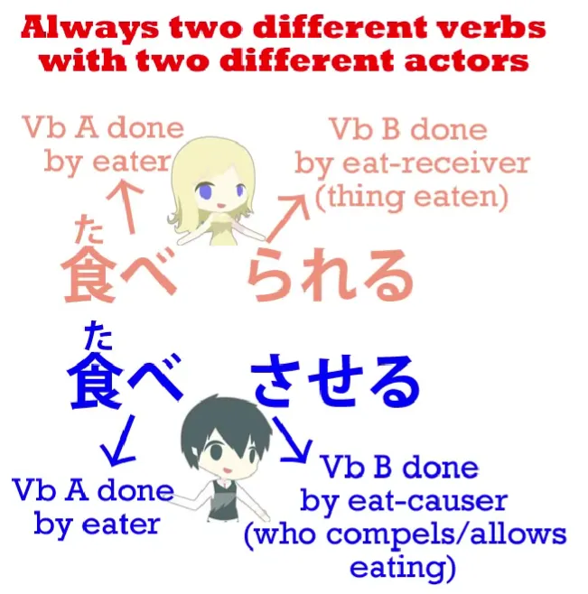
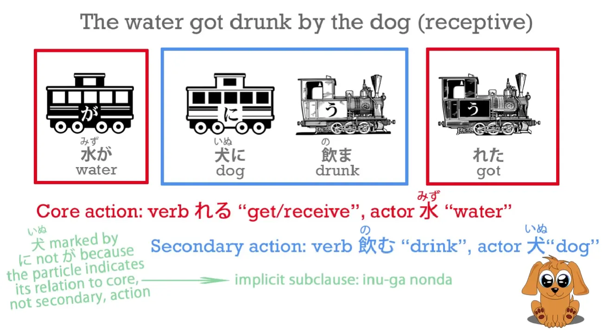
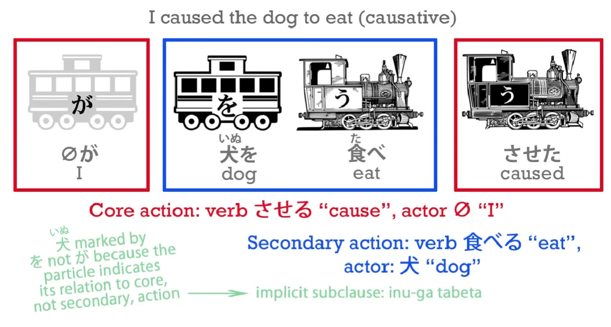
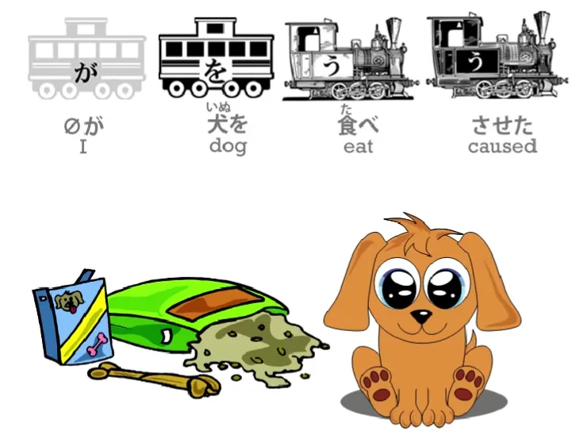
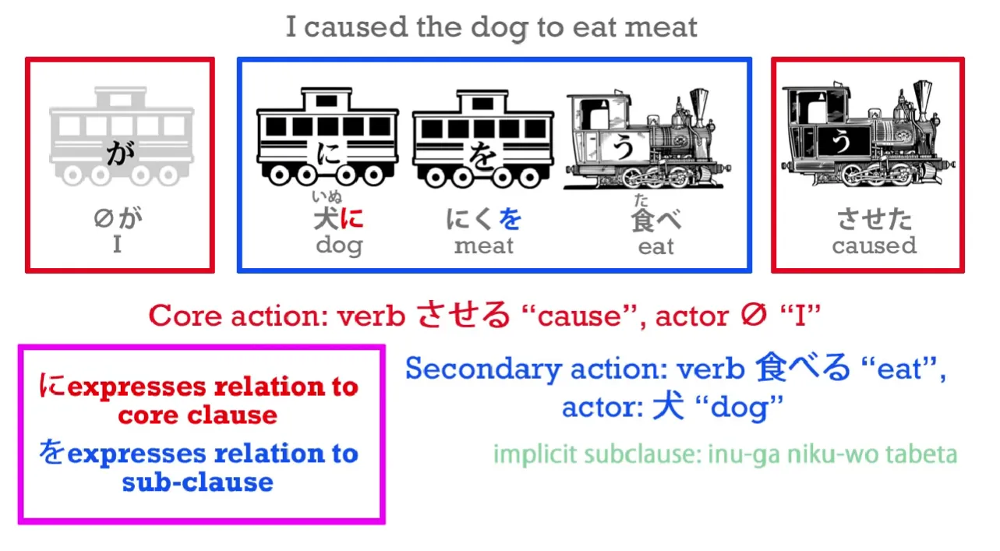
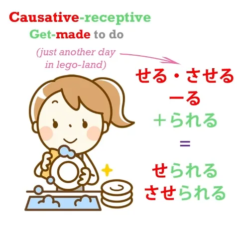

# **19. Каузатив + каузативный рецептив**

[**Урок 19: Каузатив + каузативный пассив: то, что вам НИКОГДА не говорят! Это логично и супер просто**](https://www.youtube.com/watch?v=LCvGHWbhDKw&list=PLg9uYxuZf8x_A-vcqqyOFZu06WlhnypWj&index=38)

こんにちは.

Сегодня мы поговорим о вспомогательном глаголе каузатива. В стандартных грамматиках его называют <code>каузативом</code>, и это вполне подходящее название, потому что **он указывает на то, что мы заставляем кого-то совершить действие глагола, к которому он присоединён.** В стандартных грамматиках **его часто преподают вместе с рецептивом** (который они любят называть <code>пассивом</code>), и для этого есть очень-очень веская причина, хотя настоящая причина никогда не объясняется в обычных учебниках. Итак, я расскажу вам об этом в ближайшее время. Но сначала давайте посмотрим, что такое вспомогательный глагол каузатива.

Это вспомогательный глагол, который, как и рецептив, присоединяется к концу あ-основы другого глагола, и в то время как вспомогательный глагол рецептива — это <code>れる/られる</code>, **вспомогательный глагол каузатива — это <code>せる/させる</code>.**

Если они звучат довольно похоже друг на друга, на то есть веская причина. Как мы уже отмечали ранее, Ева и Адам японских глаголов — это <code>ある</code> и <code>する</code> — <code>быть</code> и <code>делать</code>. <code>ある</code> — мать всех глаголов самодвижения; <code>する</code> — отец всех глаголов чужедвижения. Итак, **рецептив <code>れる/られる</code> тесно связан с <code>ある</code>;** **каузатив <code>せる/させる</code> тесно связан с <code>する</code>.**

И хотя нельзя сказать, что они являются версиями друг друга для самодвижения и чужедвижения, мы видим, что они очень тесно связаны с этим концептуально.

---

**<code>れる/られる</code> указывает на получение действия, к которому он присоединён.** **<code>せる/させる</code> означает побуждение к выполнению этого действия кем-то другим.** И это подводит нас к самому фундаментальному сходству между двумя парами вспомогательных глаголов — сходству, которое никогда не объясняется в учебниках и которое является наиболее фундаментальным для понимания того, как они работают. Почему учебники этого не объясняют? Ну, основная причина в том, что они называют вспомогательные глаголы каузатива и рецептива <code>спряжениями</code>. А реальная структура их работы полностью разрушается и затемняется, если называть их <code>спряжениями</code>. **Спряжённый глагол по определению является одним глаголом.** **Но глагол плюс рецептивный или каузативный вспомогательный глагол никогда не является одним глаголом.** **Это два глагола.**

**Мало того, что это два глагола, так эти два глагола всегда имеют два отдельных подлежащих.** Так, в предложении вроде <code>**水が**犬に飲まれた</code> — <code>**вода** **была выпита** собакой</code> — у нас есть **два глагола, два действия и два разных действующих лица, выполняющих два разных глагола.**

**Основной глагол предложения, ядро глагола, — это <code>れる</code> — <code>получать</code>** — и **это действие совершается водой: вода получает, что её выпивает собака.** **Вторичный глагол — <code>пить</code>, и это действие совершается собакой.** Это становится яснее в чуть более длинном предложении: <code>**さくらが**だれかにかばんをぬすまれた</code> — <code>**Сакура** **получила**, что её сумку украл кто-то</code>.

Опять же, **происходят два действия, и всегда в рецептивном предложении основное действие, ядро действия предложения, — это <code>れる</code> — <code>получать</code>: <code>Сакура получила</code>.**

---

Но внутри этого есть вложенное действие, выполняемое вторичным глаголом <code>ぬすむ</code> — <code>красть</code>. И это действие совершается <code>кем-то</code>. Теперь, с каузативом всё точно так же. **У нас всегда есть два действующих лица, выполняющих два разных глагола.** Итак, если мы скажем <code> *(zeroが)* 犬を食べさせた</code>, что означает <code>**Я заставил** собаку есть</code>, то **происходят два действия.**

Есть действие еды, которое совершается собакой, **а затем есть основное действие, ядро действия предложения, действие побуждения, которое совершается мной.** Так что, как видите, мы никак не можем говорить о спряжённом глаголе ни в случае рецептива, ни в случае вспомогательного глагола каузатива. **В каждом случае есть два отдельных глагола.** **Даже если они соединены вместе, они не только остаются отдельными по функции, но и относятся к двум разным действующим лицам.**

Теперь давайте также уделим момент, чтобы понять, что на самом деле означает <code>せる/させる</code>.

Нам говорят, что в английском это может означать либо <code>заставить</code> кого-то что-то сделать, либо <code>позволить</code> кому-то что-то сделать. И это правильно: оно может иметь любое из этих значений. **Но важно понять, что оно может иметь любое из этих значений, но также может не иметь ни одного из них.** **Лучший способ перевести его — это очень не по-английски звучащее <code>побудить</code> кого-то что-то сделать.** Почему? Потому что мы можем иметь в виду, что мы заставляем их что-то делать, мы можем иметь в виду, что мы позволяем им что-то делать, но мы также можем иметь в виду что-то, что не охватывается ни одним из этих английских переводов. Пример? Ну, у вас уже был один: <code> *(zeroが)* 犬を食べさせた</code>

Это не означает <code>Я заставил собаку есть</code>, не так ли? Но это также не означает <code>Я позволил собаке есть</code>. **Это не означает, что я дал собаке разрешение есть или снял её с цепи, чтобы она могла дотянуться до еды.** Это не то, что это означает. **Это означает, что я создал условия, при которых она могла есть; я дал ей еду; я побудил её есть.**

---

**Итак, <code>せる/させる</code> означает <code>побудить</code> человека или вещь совершить действие любыми средствами, будь то разрешение, принуждение или создание условий для этого.**

Теперь, единственное, что может показаться немного запутанным в каузативе, это то, что **иногда человек или вещь, которую мы побуждаем что-то сделать, может быть отмечена частицей を, а иногда частицей に.** Я уже говорила вам, что японские частицы не меняют свою функцию случайным образом, как это настойчиво подразумевают, а иногда и открыто заявляют учебники — и как мы должны верить, если думаем, что <code>コーヒーが好きだ</code> *(Кофе приятен есть)* буквально означает <code>Я люблю кофе</code>. И если вы не понимаете, о чём я здесь говорю, пожалуйста, посмотрите соответствующее видео[[9]](./9-the-subject-of-the-japanese-sentence-expressing-desire-ほしい-たい-たがる.md), потому что это абсолютно решающее значение для правильного понимания японского языка. Так как же так получается, что две разные логические частицы могут применяться к вещи или человеку, которого мы побуждаем что-то сделать?

То есть, существительное, связанное с <code>せる/させる</code>. **Прежде всего, мы должны понять, что эта вещь может рассматриваться либо как объект, либо как цель действия (<code>せる/させる</code>) человека или вещи, которая осуществляет побуждение.** Если мы возьмём этот объект или цель как человека, это станет немного яснее. **Если мы рассматриваем человека как объект, мы предполагаем, что у него нет личной воли в этом вопросе; мы буквально относимся к нему как к объекту.** Так что это более уместно, когда мы принуждаем кого-то что-то сделать; **если мы рассматриваем их как цель, подразумевается большая взаимность, мы относимся к ним скорее как к равным, и это более естественно сочетается с разрешением, а не с принуждением.** И я говорила об этих степенях взаимности между частицами を, に и と при работе с людьми [**в видео, которое вы, возможно, захотите посмотреть.**](https://www.youtube.com/watch?v=gVqs4TzqySw)

Однако выбор между に и を не является основным или точным показателем того, имеем ли мы в виду разрешение или принуждение, когда используем <code>せる/させる</code>. Почему нет? На это есть две причины. Во-первых, как мы уже упоминали, утверждение, что <code>せる/させる</code> означает либо <code>принуждать</code>, либо <code>позволять</code>, искажает смысл каузатива, пытаясь найти точные английские аналогии, а точной английской аналогии не существует. Во многих случаях, как я продемонстрировала, это может означать ни <code>принуждать</code>, ни <code>позволять</code>. Это скользящая шкала между двумя; это тоньше и более градуировано, чем это.

---

Во-вторых, когда действие, которое принуждается, само имеет を-отмеченный объект — например, <code> *(zeroが)* 犬に肉を食べさせた</code> — <code>(Я) заставил собаку есть мясо</code>.

Вы видите, что подразумеваемое, подчинённое предложение здесь — <code>犬が肉を食べた</code>. Мясо — это объект действия собаки, а **собака — это то, что я побуждаю совершить это действие.** Итак, **в такого рода предложениях** японский язык не позволяет нам использовать частицу を дважды. Поскольку есть частица を, присоединённая к мясу, которое ест собака — другими словами, **это объект внутреннего, подчинённого предложения** — **мы не можем также использовать её на самой собаке, которая является объектом или целью побуждения.** Почему так? Ну, на самом деле это отчасти стилистическая, но в значительной степени прагматическая стратегия со стороны японской грамматики. Мало того, что это звучит неловко, если у вас две を в предложении, это могло бы в некоторых предложениях стать двусмысленным. Мы могли бы в конечном итоге сомневаться, какая を отмечала объект, связанный с <code>食べる</code> (или какой бы то ни был глагол), а какая を связана с <code>せる/させる</code>, побуждением к действию. Как бы то ни было, мы всегда знаем, что **в предложении с <code>せる/させる</code>**, каузативном предложении, которое также имеет объект самого действия, **этот объект всегда будет отмечен частицей を,** **а цель или объект побуждения**, то, что заставляют что-то делать, или позволяют что-то делать, или способствуют чему-то, **будет отмечено частицей に.**

Ну, это, я думаю, самый сложный аспект всего этого, и это на самом деле не очень сложно, не так ли? Теперь, другая вещь, которую люди находят особенно трудной, это каузативный рецептив (то, что называется <code>каузативным пассивом</code> и, когда преподаётся со стандартной грамматической моделью, вызывает у людей большое замешательство)

## Каузативный рецептив / каузативный пассив

На самом деле, как только мы поняли, что такое каузатив и рецептив на самом деле и что они на самом деле делают, я не думаю, что в каузативном рецептиве есть что-то особенное. Мы знаем, что вспомогательные глаголы — это просто глаголы. Они присоединяются к другим глаголам, но они являются глаголами сами по себе. Если мы этого не понимаем, всё становится очень сложно. Теперь также, основные структурные вспомогательные глаголы, такие как каузатив, потенциал и рецептив, являются итидан-глаголами. Так что, если нам нужно присоединить к ним что-то ещё, мы просто делаем то же, что и с любым другим итидан-глаголом — мы убираем -る и присоединяем всё, что собираемся присоединить. Итак, **если мы хотим присоединить рецептив к каузативу, мы просто убираем -る с каузатива, <code>せる</code> или <code>させる</code>, и присоединяем <code>られる</code>**, что является итидан-вспомогательной формой рецептива.

И это так просто. Ничего сложного в этом нет. Но кто-то скажет, и совершенно справедливо: <code>Но разве у нас теперь не три глагола в предложении?</code> И это абсолютно верно. **У нас три глагола в каузативно-рецептивном предложении.** Например, <code>私はブロコリを食べさせられた</code> — <code>Меня **заставили есть** брокколи</code>. Итак, у нас три глагола: <code>食べる</code> — <code>есть</code>; <code>させる</code> — <code>принуждать</code> (в данном случае это будет <code>принуждать</code>); <code>られる</code> — <code>получать</code>: <code>Я получил принуждение есть брокколи</code>. Итак, если у нас три глагола, есть ли у нас три подлежащих? Нет, **у нас два подлежащих.**

::: info
В видео красная надпись <code>Secondary action: verb</code> содержит опечатку <code>さらる</code>. Jisho, Yomichan с 27 словарями… да и ничто другое… даже не знают, что такое <code>さらる</code>. Я это исправила.

:::

**И сложно ли понять, какими будут эти два подлежащих? Нет, не сложно, потому что человек, который получает, и человек, который ест, всегда будут одним и тем же.** <code>Я получил, что меня заставили есть...</code> — **Я был тем, кто получил, что его заставили есть,** **и, следовательно, я должен был быть также тем, кто ел.**

---

Итак, **первый глагол в предложении, глагол, к которому присоединены два других,** **всегда будет выполняться тем же человеком, что и последний глагол, получение.** **А принуждение человека что-то сделать всегда совершается кем-то другим.**

---

Итак, **у нас три глагола**, **два** из которых **присоединены к человеку, который получил принуждение и который совершил действие, потому что он получил принуждение.** **А средний принадлежит человеку, который совершил принуждение.**

::: info
Если что, загляните в [**комментарии**](https://www.youtube.com/watch?v=LCvGHWbhDKw&list=PLg9uYxuZf8x_A-vcqqyOFZu06WlhnypWj&index=38), как обычно.
:::