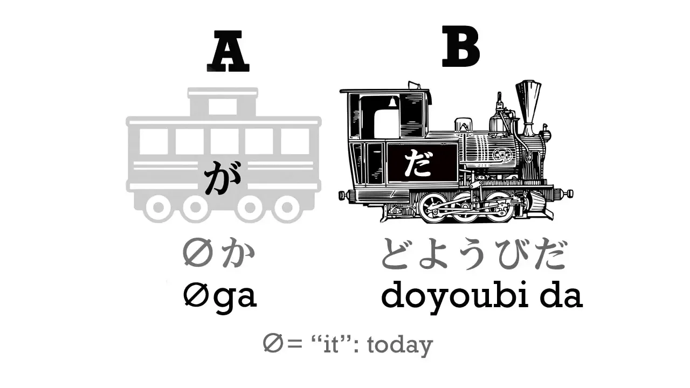
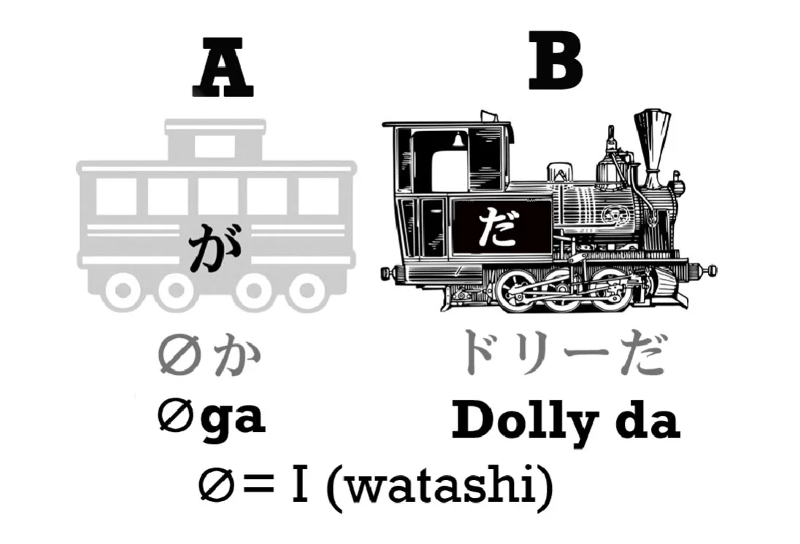
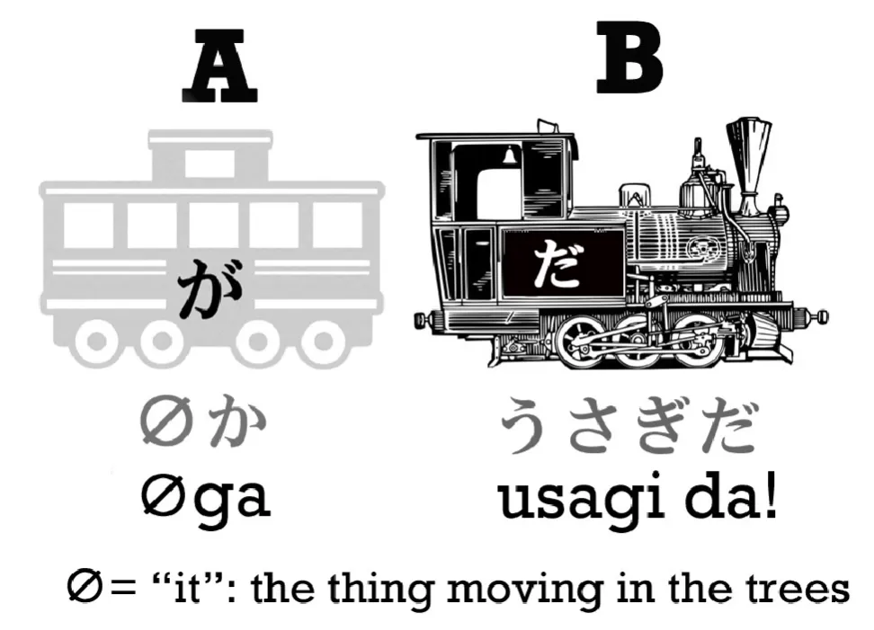
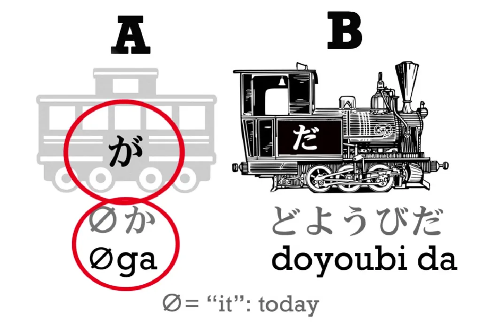
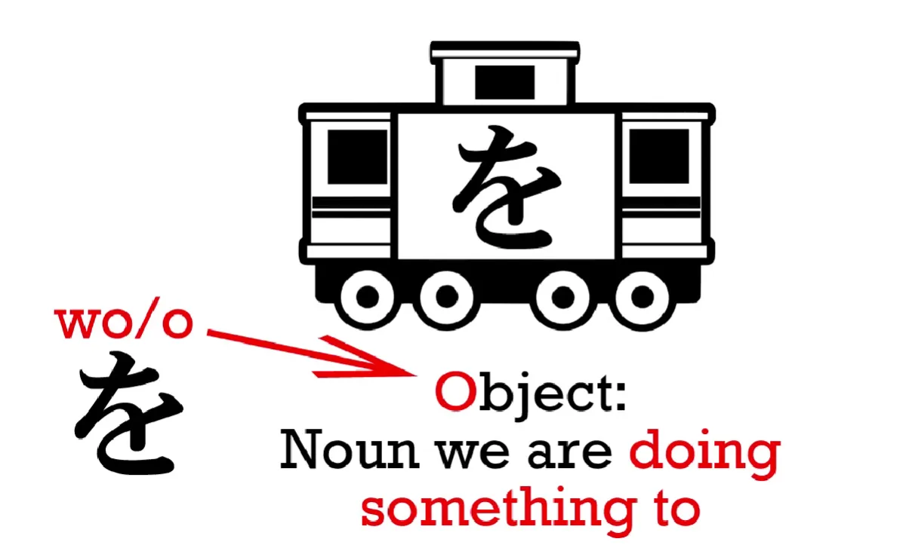

# **2. Невидимый вагон и частица を**

[**Урок 2: Секреты ядра. Японский язык легко — раскрываем <code>код</code>. Изучаем японский с нуля**](https://www.youtube.com/watch?v=P3n8n0u3LHA&list=PLg9uYxuZf8x_A-vcqqyOFZu06WlhnypWj&index=2&ab_channel=OrganicJapanesewithCureDolly)

## Невидимый вагон

На прошлом уроке мы узнали, что каждое японское предложение имеет одно и то же ядро: главный вагон и локомотив, также известные как А и Б, также известные как то, о чём мы говорим, и то, что мы о нём говорим. И я говорила вам, что у нас может быть гораздо больше вагонов по мере усложнения предложений, но у них всё равно всегда будет одно и то же ядро.

Теперь мы рассмотрим некоторые из этих дополнительных вагонов. Ранее я заявляла, что хотя каждое предложение имеет одни и те же два основных элемента ядра, вы не всегда можете видеть оба из них. Вы всегда можете видеть локомотив, но иногда вы не можете видеть главный вагон. Почему? **Когда вы не можете видеть главный вагон, он был заменён невидимым вагоном.**

Итак, что такое невидимый вагон? В английском языке ближайший эквивалент — <code>it</code>.

Давайте начнём с того, что посмотрим, что делает <code>it</code> в английском. Давайте рассмотрим этот пример:

> Мяч скатился с холма.
>
> Когда мяч достиг дна, мяч ударился об острый камень.
>
> Мяч был проколот, и весь воздух вышел из мяча.

Ну, разве кто-нибудь когда-нибудь так скажет? Конечно, нет, потому что как только мы установили, о чём мы говорим, мы заменяем это на <code>it</code>. Вместо этого мы говорим:

> Мяч скатился с холма.
>
> Когда он достиг дна, он ударился об острый камень.
>
> Он был проколот, и весь воздух вышел из него.

<code>It</code> ничего не значит, потому что оно может означать абсолютно что угодно. Если я говорю <code>it</code>, я могу говорить о цветке или о небе. Я могу говорить о дереве, или о своём пальце, или об Эйфелевой башне, или о галактике Андромеды. Само по себе <code>it</code> ничего не значит: **вы знаете, что такое <code>it</code> из контекста.**

Теперь, давайте предположим, что маленький ребёнок пытается сказать это и говорит:

> Мяч скатился с холма,
>
> достиг дна, ударился об острый камень,
>
> прокололся, весь воздух вышел.

Ну, это трудно понять? Нет, совсем не трудно, не так ли? Потому что на самом деле нам не нужно использовать <code>it</code> каждый раз, снова и снова, чтобы понять, что говорится. Хотя английская грамматика требует этого, нет никакой реальной коммуникативной необходимости включать <code>it</code> каждый раз.

В японском языке нет <code>it</code>. *(Я полагаю, имеется в виду в смысле замены, как выше)*

Итак, если маленький ребёнок, или даже взрослый, спускается на кухню ночью, и кто-то её видит, она может сказать: <code>Очень проголодалась. Пришла за чем-нибудь поесть.</code> Опять же, в этом нет ничего запутанного или сложного. Она имеет в виду: <code>Я очень проголодалась. Я пришла за чем-нибудь поесть.</code>

**В английском это не является правильным предложением, но в японском — является. Все эти маленькие местоимения, такие как <code>it</code>, <code>she</code>, <code>he</code>, <code>I</code>, <code>they</code>, в японском могут быть заменены невидимым вагоном, нулевым местоимением. Но важно помнить, что они всё ещё там.**

Итак, давайте посмотрим, как это работает в японском. Я могу сказать <code>ドリーだ</code>, и это означает <code>Я — Долли</code>. Изначально это выглядит так, будто здесь есть только локомотив и нет главного вагона, но на самом деле главный вагон — это просто невидимый вагон. Полное предложение на самом деле: <code>(**zeroが**)ドリーだ</code>.

Мы можем сказать, что <code>Я</code> — это значение по умолчанию для нулевого местоимения, невидимого вагона. Однако контекст может определить его как угодно. Например, если мы слышим шорох в лесу и смотрим в ту сторону, и я говорю: <code>ウサギだ!</code>, это означает <code>(**zeroが**)ウサギだ!</code> <code>Это кролик!</code> Это, то, на что мы только что посмотрели, шуршащее в деревьях, это кролик.

Если я говорю <code>土曜日だ</code> ([土曜日]{どようび} означает суббота), я говорю <code>(Это) суббота</code>. Что такое <code>это</code>? Сегодня. Все эти предложения являются полными, законченными японскими предложениями, с が-отмеченным подлежащим / вагоном А / главным вагоном и локомотивом.

## Частица を

Я собираюсь познакомить вас с ещё одним видом вагона, и это を-вагон. Это означает существительное, отмеченное частицей を, произносимой как <code>о</code>. И если вы знаете английский грамматический термин <code>object</code> (объект), который означает то, над чем мы что-то делаем, это хорошая мнемоника, чтобы запомнить, что <code>о</code> означает <code>object</code>.

Итак, を-вагон выглядит так, и, как видите, он белый. Он белый, потому что не является частью основного состава. **Основной состав всегда состоит только из двух элементов: локомотива и главного вагона.** Когда мы видим белые вагоны, мы знаем, что они сообщают нам что-то ещё о локомотиве или о главном вагоне.

Итак, давайте возьмём предложение: <code>わたしがケーキを食べる</code>. Это означает <code>Я ем торт</code>.

Теперь, ядро предложения здесь — <code>Я ем</code>. Это два чёрных вагона. Белый вагон, <code>ケーキを</code>, сообщает нам больше о локомотиве. Ядро предложения — <code>Я ем</code>, а <code>ケーキを</code> сообщает нам, что именно я ем.

Теперь, интересно то, что мы часто можем увидеть это сказанным так: <code>ケーキをたべる</code>. И вы уже знаете, что происходит, когда это случается. Это ещё один случай, когда у нас есть невидимый вагон А.

**Мы не можем иметь предложение без が. Мы не можем иметь действие, которое совершается без того, кто его совершает.** Если мы говорим <code>ケーキをたべる</code>, то на самом деле мы говорим <code>(zeroが)ケーキをたべる</code>. И значение по умолчанию для <code>zero</code>, для невидимого вагона, — это <code>わたし</code>. Так что обычно это будет означать <code>Я ем торт</code>, хотя если вы в это время говорили о ком-то другом, это могло бы означать, что этот человек ест торт.

::: info
На всякий случай — как видно из картинок, каждая частица присоединяется к слову ПЕРЕД ней / относится к слову ПЕРЕД ней, а не после.
:::