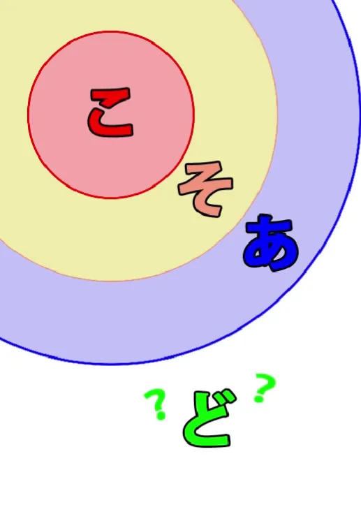
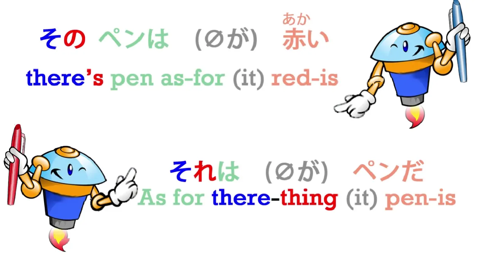
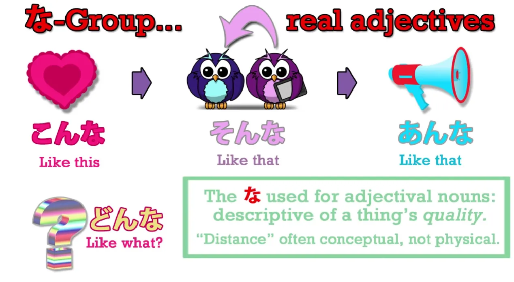
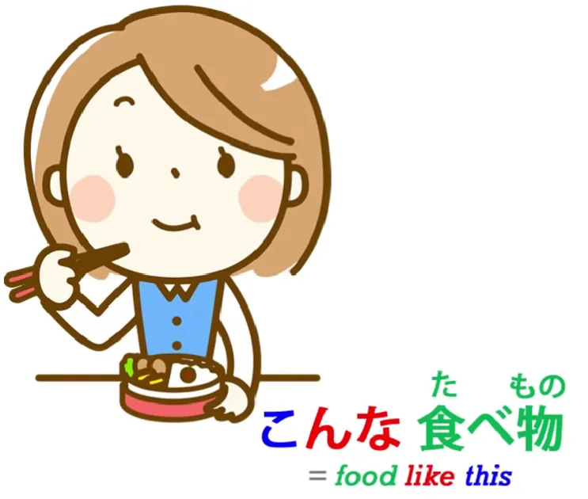
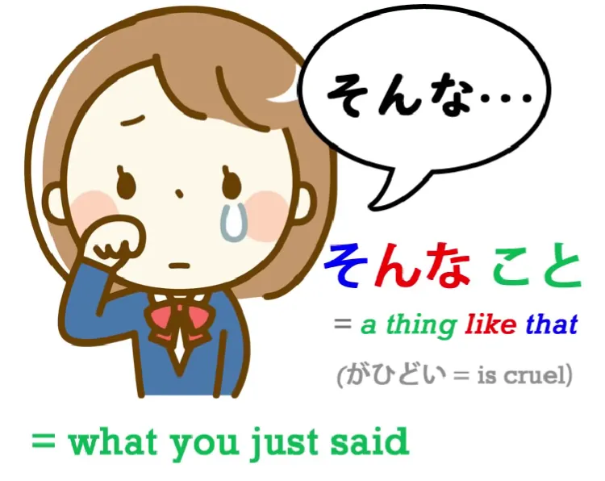
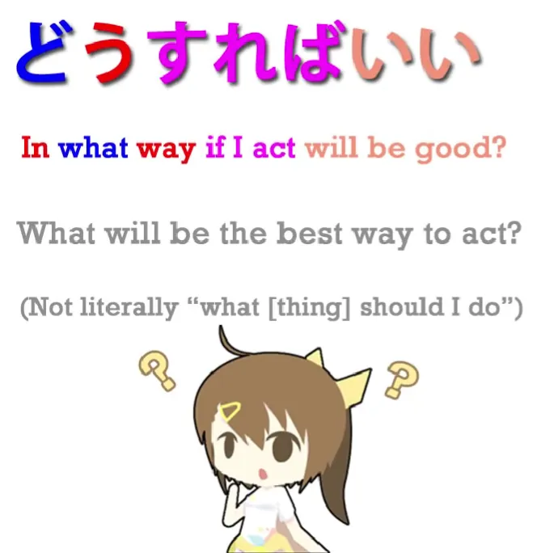
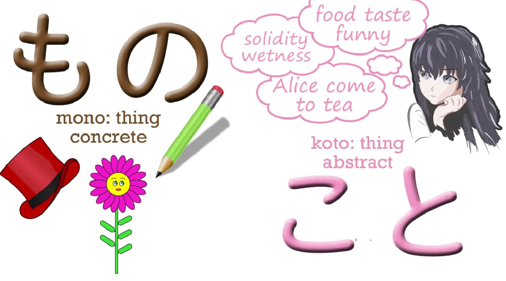
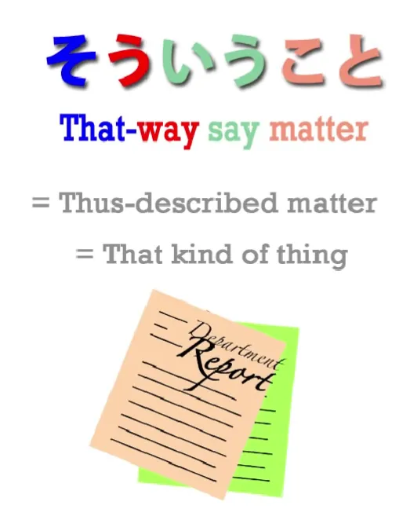

# **20. Указательные слова: それ・その・そんな・そう и т.д.**

[**Урок 20: Sore/Sono/Sonna/Sou и т.д. — как на самом деле работают указательные слова!**](https://www.youtube.com/watch?v=xLkY6whr7T4&list=PLg9uYxuZf8x_A-vcqqyOFZu06WlhnypWj&index=31&ab_channel=OrganicJapanesewithCureDolly)

Здравствуйте.

Сегодня мы поговорим о японской системе указательных слов, которые используют こ-, そ-, あ-, ど-.

Её обычно называют системой こ-そ-あ-ど, и изначально она просто обозначает физические местоположения, но затем распространяется на более тонкие и метафорические применения. Это обычное явление, потому что все языки используют физические метафоры для выражения абстрактных понятий. И, к счастью, эти способы выражения часто схожи в разных языках, потому что концептуальный мир соотносится с физическим миром определёнными, вполне предсказуемыми способами. Итак, давайте рассмотрим самое базовое значение и использование こ-そ-あ-ど, а именно — фактические физические местоположения.

## ここ, そこ, あそこ, どこ

**Самое базовое использование для обозначения местоположения — это <code>ここ</code>, <code>そこ</code>, <code>あそこ</code>, <code>どこ</code>.**

<code>ここ</code> означает «здесь». Если вы знаете японское слово <code>こころ/心</code> — «сердце» — оно здесь, прямо там, где я, прямо там, где моё сердце. Это не этимология слова, но это мнемоника. <code>そこ</code> означает «там». Итак, **часто <code>ここ</code> означает место говорящего, а <code>そこ</code> — место слушателя.** **<code>あそこ</code> означает «вон там» и часто подразумевает удалённость как от говорящего, так и от слушателя.** Так что слово на あ означает «вон там», несколько на расстоянии, так что это немного далеко, вам придётся аааа — кричать — чтобы вас услышали там. **<code>どこ</code> означает «где», так что это вопросительное слово.** Итак, **слова на こ означают «здесь»**, возможно, рядом со мной, **слова на そ означают «там»**, часто рядом с вами, **слова на あ означают «вон там»**, а **слова на ど образуют вопрос**. Так, в аниме или манге вы часто увидите, как кто-то говорит: <code>ここはどこ?</code> — «Где это?» Буквально: **«Говоря об этом месте, где (оно)?»** И это, кажется, самый обычный способ для японца задать этот вопрос, оказавшись внезапно в неизвестном месте. Английский способ задать этот вопрос, скорее всего, будет — «Where am I? (Где я?)», но **японский способ — «Где это место?»** <code>ここはどこ?</code> — «Что касается этого места, где?»

Итак, это довольно просто, я думаю. А теперь мы рассмотрим то, что иногда сбивает людей с толку, и это потому, что когда мы доходим до групп на れ- и на の-, в английском мы выражаем их одним и тем же словом. Но у нас есть это различие, так что давайте посмотрим на них.

## これ, それ, あれ, どれ

**Группа на れ- — это <code>これ</code>, <code>それ</code>, <code>あれ</code>, <code>どれ</code>.** **И здесь дело в том, что -れ означает «вещь».** こ- означает место, локацию, и на самом деле может быть написано с кандзи <code>所</code> — «место». **-れ связано с <code>ある</code>.**

Это одна из тех вещей, что связаны с фундаментальным <code>ある</code>, матерью глаголов. И <code>ある</code> означает «быть»; **это -れ означает «существо».** Когда мы говорим «существо» (a being) в английском, мы обычно имеем в виду разумное существо, животное или человека, **но здесь это означает любое существо, всё, что существует.** Итак, <code>これ</code> означает «эта вещь/это существо»; <code>それ</code> означает «та вещь/то существо»; <code>あれ</code> означает «та вещь вон там/то существо вон там», а <code>どれ</code> означает «какое существо/что за вещь?»

## この, その, あの, どの

Теперь, с чем их можно спутать, так это с **группой на の-: <code>この</code>, <code>その</code>, <code>あの</code>, <code>どの</code>.**

Итак, -れ означает «существо» и относится к вещи. の, как мы знаем, используется для создания адъективов или дескрипторов. Так, если мы говорим, <code>さくらのドレス</code>, мы говорим «платье Сакуры». Если мы говорим, <code>でんせつのせんし/伝説の戦士</code>, мы говорим «легендарный воин» / «воин, который принадлежит к классу легенд».

---

Итак, **это то же самое の, которое мы видим в <code>この/その/あの/どの</code>.** Так, если мы возьмём очень базовую фразу из учебника, такую как <code>これは *(zeroが)* ペンだ</code>, мы говорим: «это — эта вещь — *(оно)* является ручкой».

Но если мы говорим, **<code>このペン</code>** *(zeroが)* は赤い — «**Эта ручка** *(она)* красная». <code>このペン</code> — «здесь-ручка», ручка, которая принадлежит к классу вещей, находящихся здесь.

<code>それは *(zeroが)* ペンだ</code> — «Та вещь вон там или вещь, которую вы держите, ***(она)*** является ручкой». <code>そのペンは *(zeroが)* 赤い</code> — «Та ручка, ручка, которая принадлежит к классу вещей вон там, ***(она)*** красная». Итак, в английском мы можем сказать «this» или «this pen», и нет никакого различия между словами. Мы используем «this» в обоих случаях. Так что, как только мы привыкнем к тому, как они работают, я думаю, они тоже станут очень простыми.

## こんな, そんな, あんな, どんな

Итак, **следующая группа — это <code>こんな</code>,<code>そんな</code>, <code>あんな</code>, <code>どんな</code>.**

Итак, **в этом случае мы используем -な.** И -な, как мы знаем, это форма связки, которая превращает адъективное существительное в прилагательное, которое вы можете поставить перед чем-то ещё.[[6]](./6-adjectives.md) Именно это здесь и происходит. Итак, **<code>こんな</code>** означает **«такой/такого рода»**; **<code>そんな</code>** означает **«такого рода»**, **<code>あんな</code>** означает **«такого рода вон там/более далёкого рода»**. И я не буду вдаваться в детали, **но то, используем ли мы <code>そんな</code> или <code>あんな</code>, будет зависеть от...** **иногда от буквального положения чего-либо, но очень часто от того, насколько эти вещи далеки от того, о чём мы говорим, от текущих обстоятельств, от чего-то, что мы ассоциируем с собой.**

---

Итак, мы могли бы сказать: <code>**こんな食べ物**</code>が好きです — «Мне нравится **такая еда**».

<code>**そんなこと**</code>がひどい — «**Такого рода вещь** неприятна/жестока».

И на самом деле, вы часто встретите в аниме или манге, что кто-то просто говорит: <code>そんな!</code> **И когда это говорится таким жалующимся или обвиняющим тоном, это сокращение от «такого рода вещь».** Вы говорите: «такого рода вещь», и это будет означать что-то вроде: «такого рода вещь недоброжелательна/такого рода вещь подла / такого рода вещь мне не нравится». **<code>そんな!</code> — «Как ты мог такое сказать!»**

---

Итак, **<code>そんな</code> — это, по сути, сравнительный адъектив:**

мы описываем, на что что-то похоже, сравнивая это с чем-то другим, на что мы ссылаемся: с чем-то, что здесь, с чем-то, что вон там, или с чем-то, что очень далеко, будь то в физическом пространстве или концептуально.

---

**<code>どんな</code> спрашивает, что это за вещь.** Буквально: «С чем бы мы это сравнили?»

## こう, そう, ああ, どう

Итак, когда мы используем こ-そ-あ-ど сами по себе и удлиняем их с помощью -う (или в случае с あ-, с дополнительным -あ), так что они становятся **<code>こう</code>, <code>そう</code>, <code>ああ</code>, <code>どう</code>**, тогда **мы говорим о том, как что-то есть или происходит.** Так, когда мы говорим <code>*(zeroが)* そうですね?</code>, мы говорим: «*(Это)* так, не так ли?»

Итак, что мы на самом деле говорим, это <code>*(zeroが)* **そう**だ/**そう**です</code> — «*(Оно)* **таково**». Если мы говорим, <code>**そう**</code>する, мы имеем в виду «делать **так**»; если мы говорим <code>**こう**</code>する, мы имеем в виду «делать **вот так**»: делать **таким образом** / делать **таким образом**. Если мы говорим <code>**どう**</code>する, мы говорим «делать **как?**», и мы часто говорим <code>**どう**</code>すればいい?

Итак, **<code>すれば</code> — это условная форма <code>する</code>.** Сказать <code>どうすればいい?</code> означает «как **если** я сделаю, будет хорошо?» И мы часто находим их в сочетании с <code>いう/言う</code>, означающим «говорить». Это ещё один пример более широкого применения концепции цитирования в японском языке, которую мы недавно обсуждали. И **это часто используется в отношении вещей, которые не являются физическими, конкретными вещами** — другими словами, **того рода вещей, которые мы называем <code>こと</code>**, а не <code>もの</code>.

И мы будем очень часто слышать <code>そういうこと</code>, <code>こういうこと</code> и <code>どういうこと</code>. Мы также слышим <code>ああいうこと</code>. Оно используется реже, чем другие, но всё же используется.

Итак, что мы имеем в виду, когда говорим <code>そういうこと</code> — «вещь такого рода»; <code>こういうこと</code> — «вещь такого рода»; <code>どういうこと</code> — «что за вещь?» Почему мы имеем в виду «что за вещь»? Такого рода вещь / такого рода вещь, что за вещь? Что мы на самом деле говорим, это **«как-сказанная вещь / как-сказанное обстоятельство / как-сказанное условие»**. Другими словами, **каким образом мы описываем это состояние** / **какое описание имеет это обстоятельство или условие?** И мы часто слышим как своего рода восклицание: <code>どういうこと!?</code> и это означает «что здесь происходит? / что это? / какое описание имеет эта происходящая вещь?» И это также может означать «о чём вы говорите / к чему вы клоните / что вы здесь говорите?» <code>どういうこと!?</code> И здесь важно понять, что **<code>いう</code> там не относится к тому факту, что человек только что это сказал.** <code>どういうこと</code> означает «Что вы имеете в виду / к чему вы клоните / о чём вы здесь говорите?» <code>いう</code> не относится к тому факту, что вы это говорите. **<code>いう</code> относится к описанию вещи.** Так что <code>どういうこと</code> в данном случае является сокращением от <code>どういうことをいう?</code> — «как описанную вещь **вы говорите?**» Итак, мы видим, что система こ-そ-あ-ど работает как в смысле буквального местоположения, так и в смысле метафорического местоположения.