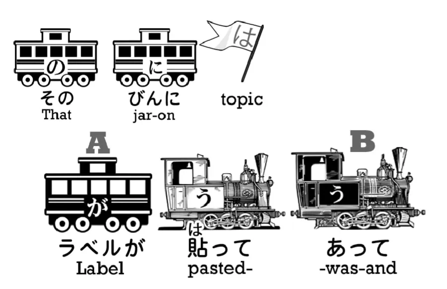
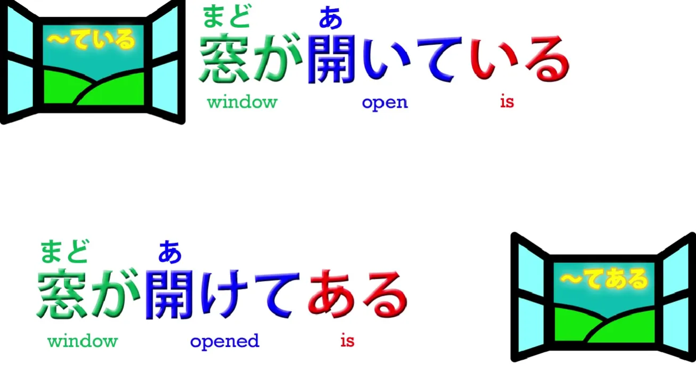
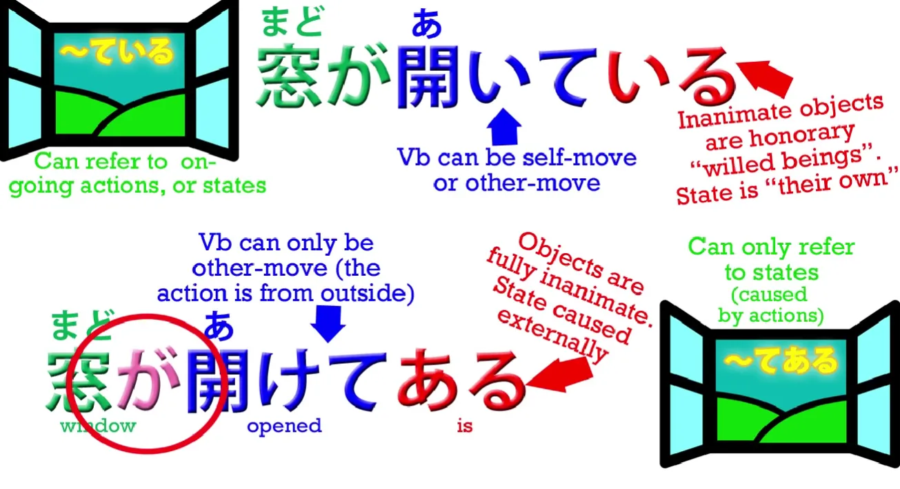
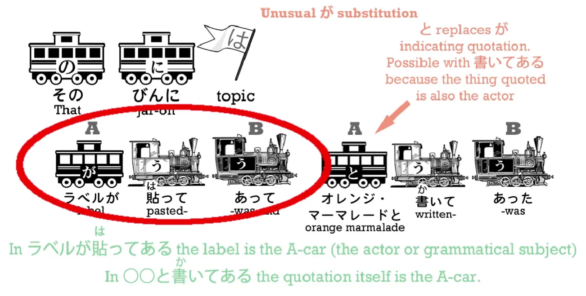
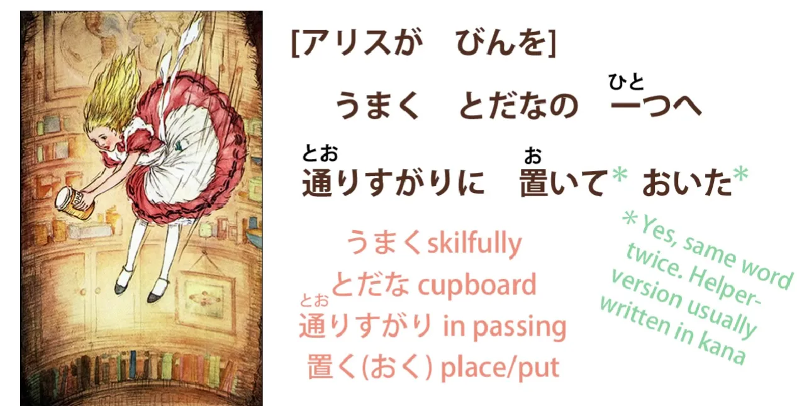
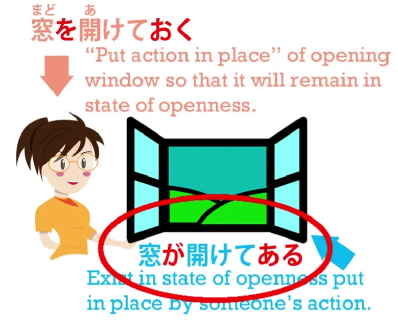

# **21. てある/ている & ておく**

[**Урок 21: Te oku/te aru: как их НА САМОМ ДЕЛЕ понять. То, чему никогда не учат!**](https://www.youtube.com/watch?v=cYrqFjPvwSI&list=PLg9uYxuZf8x_A-vcqqyOFZu06WlhnypWj&index=27&ab_channel=OrganicJapanesewithCureDolly)

こんにちは。

Сегодня мы вернёмся к приключениям Алисы и используем их как возможность углубиться в некоторые более глубокие и тонкие применения て-формы. Они рассматриваются в обычных учебниках и на японских обучающих сайтах, но, как обычно, там не объясняется логика, стоящая за ними, что затрудняет их понимание. А в некоторых случаях, когда нет прямого английского эквивалента, они действительно не говорят вам, что на самом деле происходит, потому что они говорят только в терминах английских эквивалентов, что оставляет вас гадать довольно часто.

Итак, если вы помните, Алиса очень медленно падала в кроличью нору и, падая, сняла банку с одной из полок.
<code>そのびんにはラベルが貼ってあって 「オレンジ・マーマレード」と書いてあった</code>

Итак, в этом предложении у нас три глагола в て-форме. Давайте посмотрим, что они делают.
<code>そのびんにはラベルが貼**ってあって**.</code>
<code>[瓶]{びん}</code> — это слово, используемое здесь для обозначения <code>банки</code>. Оно может означать <code>бутылка</code> — его часто переводят как <code>бутылка</code> — но оно также может означать <code>банка</code>, и именно это оно означает здесь. <code>ラベル</code> означает <code>этикетка</code>. Это <code>ラベル</code>, а не <code>レベル</code>, я полагаю, потому что оно пришло из другого европейского языка, отличного от английского.
::: info
レベル означает <code>уровень</code>.
:::
Мы также можем сказать <code>レーベル</code>, но это менее распространено, чем <code>ラベル</code>. *(Здесь важен ー)*
<code>貼る</code> означает <code>приклеивать</code> или <code>прикреплять</code> что-либо к чему-либо другому, так что это означает, что этикетка была приклеена к бутылке.

Буквально: **говоря об этой бутылке как о цели чего-либо**, этикетка была приклеена к ней. Теперь это использование, <code>貼ってある</code>, мы до сих пор не рассматривали в этом курсе. Мы говорили о て-форме глагола плюс <code>いる</code>, и мы знаем, что <code>いる</code> означает <code>быть</code>, а て-форма глагола плюс <code>いる</code> означает быть-делающим этот глагол или быть-в-состоянии этого глагола.

## てある

А как насчёт <code>-てある</code>?
<code>ある</code> также означает <code>быть</code>, так что значение на самом деле очень похоже. **Оно также означает быть-в-состоянии этого глагола.** Однако есть разница, и я объясню эту разницу на другом примере. Давайте возьмём предложение <code>窓が開い**ている**</code> и предложение <code>窓が開け**てある**</code>.

Оба они означают <code>Окно открыто</code>. <code>開い**ている**</code> просто означает, что окно открыто, и мы можем перевести это непосредственно на русский, и это действительно одно и то же. **Но <code>窓が開けてある</code> не имеет английского эквивалента, потому что оно всё ещё означает, что окно открыто, но несёт в себе другое подразумеваемое значение.**

Прежде всего, мы используем чужедвижущуюся версию <code>開く</code>, которая есть <code>開ける</code> *(нижняя)*. <code>窓が**開いている**</code> – **это самодвижущаяся версия <code>開く</code>**, и она просто означает **быть открытым, существовать в состоянии открытости.** Чужедвижущийся глагол, <code>**開ける**</code>, который является обычным глаголом с окончанием く / ける (у-основа к э-основе + -る) третьего закона самодвижущихся/чужедвижущихся глаголов, которые мы уже рассматривали.[[15]](./15-transitive-intransitive-verbs.md)

**Итак, <code>開く</code> *(верхний)* означает быть открытым самому, чем бы вы ни были, коробкой или чем-то ещё;** **<code>開ける</code> *(нижний)* означает открыть коробку, открыть дверь и т.д.**

Итак, что **<code>窓が開けてある</code> означает, так это то, что окно было открыто, но оно было открыто потому, что кто-то другой его открыл.** **Мы сигнализируем об этом, во-первых, используя чужедвижущуюся версию глагола, и, во-вторых, используя <code>ある</code> вместо <code>いる</code>.**

Так в чём же причина этого? Ну, когда мы говорим <code>窓が開い**ている**</code>, **хотя это неодушевлённый предмет, мы используем ту версию <code>быть</code>, которую мы используем для одушевлённых существ, людей, животных и тому подобного.** На самом деле, именно эта часть нуждается в объяснении, не так ли? Почему мы используем одушевлённую версию <code>быть</code> для неодушевлённого предмета, такого как окно? И мы делаем это постоянно. **Мы всегда говорим <code>-ている</code> для неодушевлённых предметов всех видов.** Причина в том, что **в этом выражении мы просто говорим, что окно было открыто — мы не подразумеваем, что кто-либо открыл окно.** Так что, в некотором смысле, **мы можем сказать, что мы относимся к окну как к почётному одушевлённому существу.** **Окно было открыто, так сказать, по своей собственной воле.** **Мы не говорим, что оно открыто из-за чьей-либо воли, кроме его собственной.** Так что в определённом смысле мы относимся к окну как к почётному одушевлённому существу:
<code>窓が開いている</code>.

---

Но если мы говорим <code>窓が開け**てある**</code>, **мы говорим, что кто-то открыл окно.** **Окно было лишь объектом, который был открыт кем-то другим.** **Таким образом, оно теряет свой статус почётного одушевлённого существа.** **Оно рассматривается как простой объект, неодушевлённая вещь** – <code>開け**てある**</code>.

---

И здесь важно понять, что **даже если оно потеряло свой статус одушевлённого существа, даже если мы используем чужедвижущуюся версию глагола, が-отмеченный актор этого предложения — это окно:**
<code>**窓が**開けてある</code>.

**Окно совершает действие, которое есть <code>ある</code>: окно существует в состоянии, когда оно было открыто кем-то другим.**

---

И то же самое происходит в нашем предложении из Алисы.
<code>そのびんには**ラベルが貼ってあって**</code> –
<code>Банка **существовала в состоянии**, когда на ней была **приклеена** **этикетка** *и…*</code>
Как видите, в английском языке этому нет ничего эквивалентного, поэтому нам просто нужно усвоить это, чтобы мы могли смотреть на японский как на японский. Это фундаментально для того, что я здесь преподаю. Я преподаю настоящую структуру японского языка, а не просто бросаю вам немного японского и немного английского и говорю: <code>Ну, это вроде как означает то.</code> Нам нужно максимально избавиться от английского перевода и смотреть на японский так, как он действительно работает сам по себе, как японский. И именно поэтому мои «переводы» под поездами становятся всё страннее и страннее. Потому что я не пытаюсь перевести это для вас на естественный английский. Я пытаюсь сказать вам, что на самом деле делает японский.

Итак, вторая половина предложения... **Вторая て-форма** *(あって)*, конечно, **просто соединяет первое логическое предложение в этом сложном предложении со вторым логическим предложением**.

А второе логическое предложение:
<code>「オレンジ・マーマレード」と書い**てあった**</code>.
И здесь у нас снова эта форма <code>-てある</code>. И всякий раз, когда мы говорим о чём-то, что написано на чём-то, мы склонны использовать эту форму. Мы не говорим «На этикетке было написано „Апельсиновый мармелад“», что мы говорим в английском, как будто этикетка могла говорить. Мы говорим
<code>「オレンジ・マーマレード」と**書いてあった**</code>.
-と — это наша частица цитирования, конечно, она цитирует именно то, что было написано на этикетке, а затем <code>**書いてある**</code> означает, что она **находилась в состоянии, когда эти слова были написаны на ней кем-то другим.**

Теперь я сделаю здесь кое-что немного необычное. Надеюсь, вы не будете возражать. Я немного забегу вперёд в истории, потому что следующая часть содержит очень интересный момент, который действительно требует отдельного урока, а часть сразу после этого включает то, что действительно завершает то, что мы делаем сегодня.

## ておく

Она вводит <code>-ておく</code>, который действительно относится к той же группе, что и <code>-ている</code> и <code>-てある</code>.

Эту взаимосвязь учебники не объясняют, и поскольку они этого не делают, <code>-ておく</code> остаётся довольно неопределённым в умах людей. Многие довольно продвинутые студенты на самом деле не понимают, почему <code>-ておく</code> используется в некоторых случаях. Итак, мы продолжим с этим сейчас, а я просто расскажу вам о промежуточной части истории. Это совсем немного. Алиса понимает, что банка из-под мармелада на самом деле пуста, и что ей с ней делать? Она не хочет её ронять, потому что она упадёт до самого дна норы и, скорее всего, кого-нибудь убьёт. И, если вы читаете газеты, вы, вероятно, знаете, что в Стране Чудес уже слишком много инцидентов с пустыми банками из-под мармелада. Итак, теперь вы знаете предысторию, давайте продолжим.

<code>うまくとだなの一つへ通りすがりに**置いておいた**</code>

<code>うまく</code> означает <code>умело</code>; <code>[戸棚]{とだな}</code>, как мы знаем, это <code>шкаф</code>; <code>とだなの一つ</code>, как мы говорили на прошлом уроке, это <code>один из шкафов</code>. Итак, она умело, проходя мимо, положила её в один из шкафов. И что это за <code>**置いておいた**</code>? Теперь, **оба они — один и тот же <code>置く</code>**, <code>置く</code> означает <code>класть</code>. Первый достаточно прост: она <code>положила</code> её в шкаф, но почему у нас есть второй <code>おく</code> в конце — <code>置いて**おいた**</code>? Теперь, это ещё одно очень распространённое и очень важное использование て-формы, и это то, что учебники и англоязычные сайты, как правило, не объясняют очень хорошо, потому что у нас этого действительно нет в английском. Однако мы уже наполовину знаем это, потому что **это в определённом смысле другая половина <code>-てある</code>.**

**<code>-ておく</code> означает поместить действие на место.** Теперь в этом конкретном использовании это довольно легко увидеть, потому что она буквально помещает банку на место, и она помещает это действие на место. Учебники и веб-сайты говорят вам, что это означает делать что-то заранее, делать что-то с какой-то целью. И это верно во многих случаях. Это, вероятно, самое близкое, что вы можете получить в английском. Но **на самом деле это означает поместить действие на место.** И чтобы понять это, давайте вернёмся к нашему примеру
<code>窓が開けてある</code> – <code>окно открыто, потому что кто-то его открыл</code>.

---

Теперь, тот, кто его открыл, если мы скажем это не с точки зрения окна, а с точки зрения человека, совершающего действие, 👇
<code>**開けておく**</code> — это другая сторона этой медали.

**Человек поместил открытие окна на место, чтобы после этого окно оставалось открытым.** Итак, вы видите, у нас есть две половины одной монеты.
<code>**窓が**開け**てある**</code> – **окно стоит открытым, потому что кто-то его туда поместил.**
<code>**窓を**開け**ておく**</code> – **открыть окно, чтобы оно оставалось открытым в будущем, чтобы оно затем было открытым, поместить действие открытия окна на место.** И это то, что означает <code>おく</code> – <code>おく</code> означает <code>помещать</code>.

---

**Итак, вы <code>помещаете</code> действие, вы приводите его в действие, вы его устанавливаете.** И **именно поэтому оно имеет тенденцию иметь вторичное значение <code>делать заранее</code> или <code>делать для другой цели</code>, потому что вы устанавливаете это действие, и подразумевается, что вы хотите, чтобы результат этого действия <code>оставался в силе</code> для любых будущих целей, которые оно может иметь.**

---

В данном случае у Алисы нет будущей цели. **Так что на самом деле て-форма плюс <code>おく</code> имеет гораздо более широкий спектр значений, чем** **английский перевод <code>делать заранее</code> или <code>делать с какой-то целью</code>**, который оно получает в учебниках.

---

**В случае с Алисой в этой истории она на самом деле ничего не делает заранее или с какой-то целью; она просто пытается решить проблему, что делать с пустой банкой из-под мармелада, не рискуя травмировать людей внизу.** И есть много случаев, когда это использование ещё дальше отходит от англоязычных определений. Например, люди говорят: <code>Жестоко запирать маленького ребёнка в её комнате</code>, и для этого мы используем
<code>閉じ込め**ておく**</code>.
<code>閉じ込める</code> означает <code>запирать кого-то / держать кого-то взаперти</code>, и **<code>-ておく</code> здесь не означает делать это с какой-то целью, это не означает делать это заранее.** **Это означает совершить действие и оставить его результаты в силе / поместить действие на место и оставить его в силе.** Аналогично, люди говорят: <code>Иногда можно позволить ребёнку поплакать</code> – <code>泣かせ**ておく**</code>.
<code>泣く</code> означает <code>плакать</code>; <code>泣かせる</code> — это каузатив от плакать: в данном случае <code>позволить плакать</code>. *(**Урок 19**)* И **<code>-ておく</code>** не означает делать это заранее или делать это для какой-то особой цели. Оно **просто означает совершить действие и оставить его последствия в силе / поместить действие на место.**

::: info
Это может быть немного сложно (судя также по огромному количеству концентрированного подчёркивания, (кстати, дайте знать, если это трудно читать), поэтому я рекомендую также проверить [комментарии](https://www.youtube.com/watch?v=cYrqFjPvwSI&list=PLg9uYxuZf8x_A-vcqqyOFZu06WlhnypWj&index=27&ab_channel=OrganicJapanesewithCureDolly), как обычно.
:::