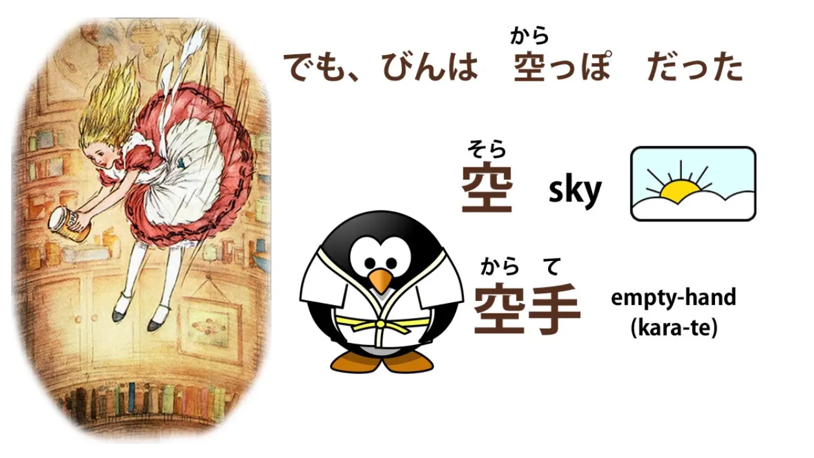
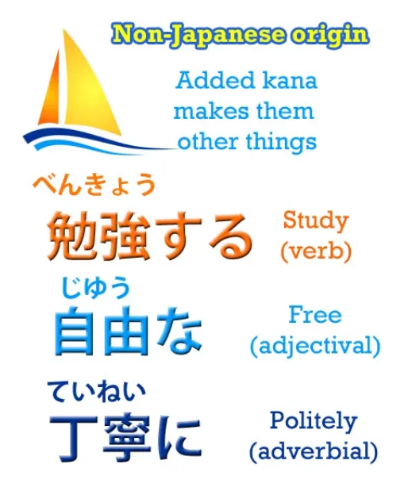
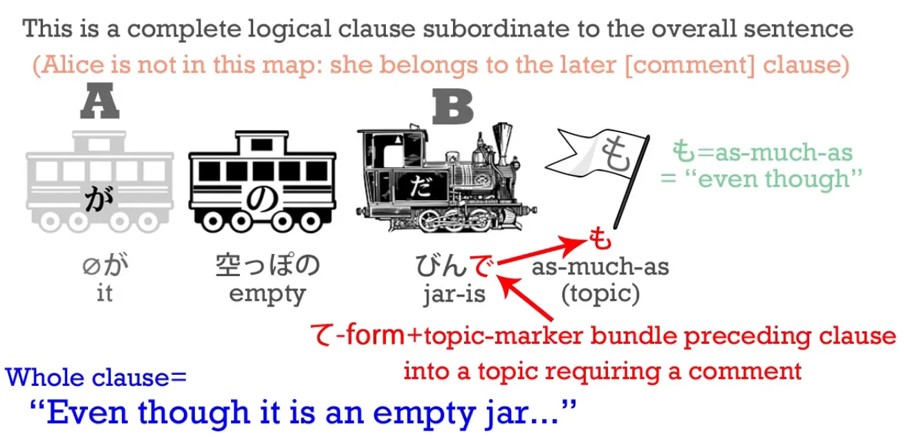
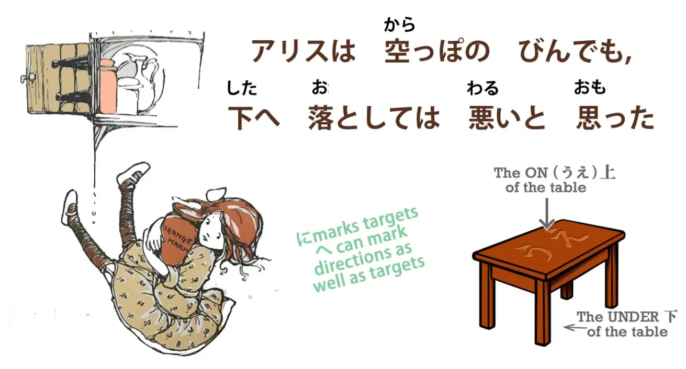
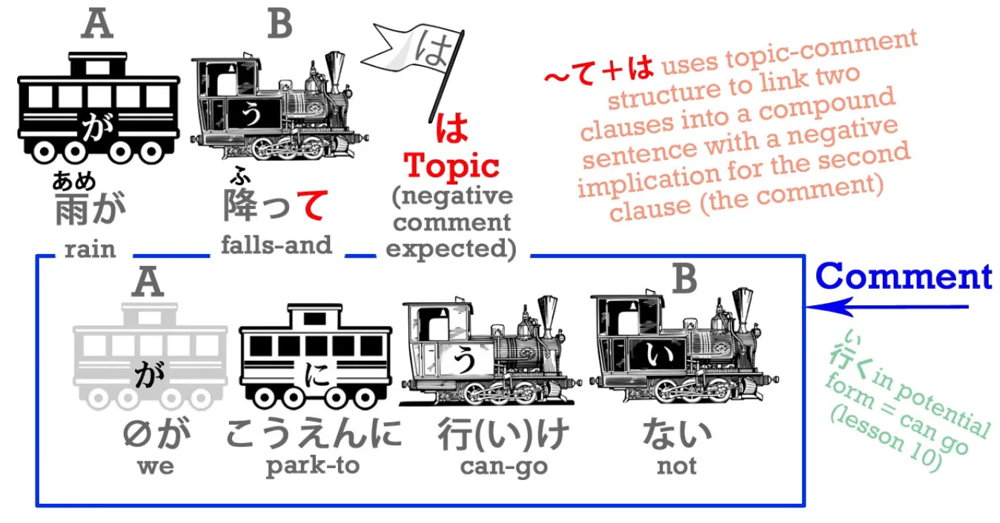
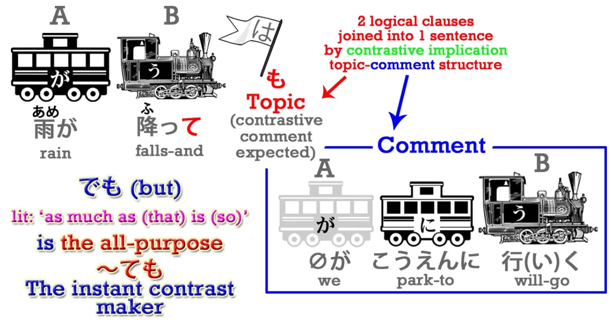
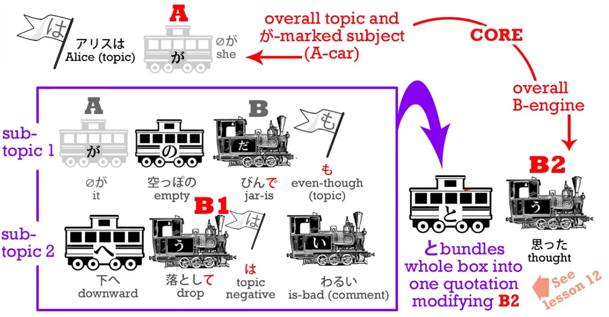
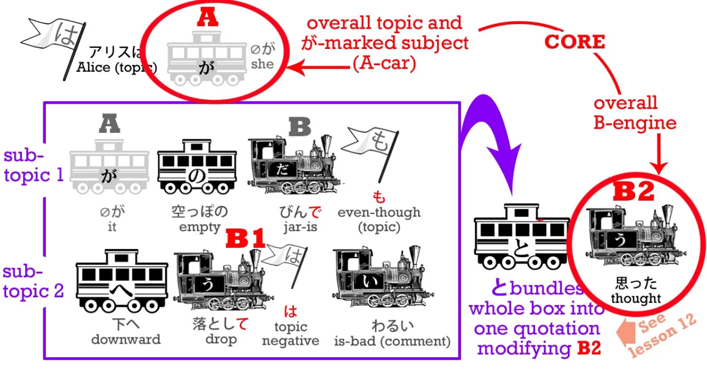

# **22. ては & ても**

[**Урок 22: ては, ても — магия темы/комментария! Как на САМОМ ДЕЛЕ работают 〜ては и 〜ても**](https://www.youtube.com/watch?v=qV-TZbsH1kI&list=PLg9uYxuZf8x_A-vcqqyOFZu06WlhnypWj&index=34&ab_channel=OrganicJapanesewithCureDolly)

こんにちは。

Сегодня мы вернёмся к тому небольшому отрывку из Алисы, который мы пропустили на прошлой неделе, и это даст нам возможность рассмотреть て-форму + は и て-форму + も, а также кое-что ещё. Итак, мы вернёмся к моменту, когда Алиса только что сняла банку с мармеладом с полки.
<code>でも, びんは空っぽだった</code> – <code>Но банка была пуста</code>.

<code>[空]{から}</code> означает <code>пустой</code>, и вы видите, что у него есть кандзи для <code>неба</code> *(空 как небо читается そら)*, которое, я полагаю, является самым большим пустым пространством в этом мире. <code>空</code> – <code>пустой</code> – это <code>から</code> в <code>空手</code>, что является искусством боя пустой рукой, без какого-либо оружия. **<code>空っぽ</code> — это своего рода усиление <code>пустого</code>, означающее, что в нём ничего не было, он был совершенно пуст.** И **<code>空っぽ</code> работает как существительное**, и, вообще говоря, если вы не знаете, к какой части речи относится слово в японском, скорее всего, это существительное.

Японский — довольно существительно-ориентированный язык, потому что все слова, приходящие из других языков, таких как китайский, которых огромное количество, а также английский и другие языки, приходят как существительные. **Вы можете превратить их в глаголы, поставив после них <code>する</code>; вы можете превратить их в прилагательные с помощью の и -な.**

**Но по сути своей они — существительные.** Так что это всегда хорошая догадка, когда вы не знаете, что это за слово: весьма вероятно, что это существительное. <code>空っぽ</code> — это существительное, <code>пустой</code>.
<code>でも, びんは**空っぽ**だった</code> – <code>Однако банка была **пуста**</code>.
<code>アリスは空っぽのびんでも下へ落としては悪いと思った.</code>
Здесь снова мы увидим другие применения て-формы.

## でも / ても

Прежде всего,
<code>アリスは空っぽのびん**でも**</code>.
Итак, **で здесь — это て-форма от <code>だ</code>**, а も, как мы знаем, — это аддитивная, включающая сестра は: аддитивная, включающая нелогическая частица, отмечающая тему. Итак, <code>空っぽのびん**でも**</code>.

<code>で</code>, て-форма от <code>です</code>, означает <code>это было (пустая банка)</code> – а <code>**でも**</code> означает <code>**даже если** это была (пустая банка)</code>. **も может использоваться в значении <code>целых</code>** – <code>一万円もかかった</code> – <code>это заняло целых 10 000 иен / стоило целых 10 000 иен</code> – <code>**でも**</code> означает что-то вроде <code>**даже если это была** (пустая банка) / **хотя это была** (пустая банка)</code>. И [**я сделала видео**](https://www.youtube.com/watch?v=00nKUtmnzvI) об этих использованиях も, которое вы, возможно, захотите посмотреть. И мы также используем эту форму <code>-ても</code> при запросе разрешения, не так ли?
<code>ケーキを食べてもいい?</code> – <code>Можно мне съесть торт? / Могу я съесть торт?</code> Буквально: <code>Если я зайду так далеко, что съем торт, будет ли это нормально?</code>

---

<code>空っぽのびんでも下へ落としては悪いと思った</code>.
<code>落とす</code> означает <code>ронять</code>. Это ещё одна из наших пар самодвижущихся/чужедвижущихся глаголов. <code>落ちる</code> означает <code>падать</code> – это самодвижущийся: вещь падает сама по себе. <code>落とす</code>, который оканчивается на -す, согласно первому закону самодвижущихся/чужедвижущихся глаголов, поэтому он означает <code>ронять</code>: мы не роняем себя, мы роняем что-то другое.

<code>下へ</code> : итак, -へ, как мы знаем, — это другая целевая частица. Она очень похожа на に, **но разница в том, что -へ имеет тенденцию относиться больше к направлению**, **в котором что-то движется, чем к его фактической цели.** Так что в данном конкретном случае <code>下に落とす</code> **было бы неправильно**. Мы не говорим, что мы роняем это в определённую цель, как <code>テーブルの下</code> – под столом.

Мы просто роняем её вниз, роняем в направлении вниз. Мы даже не знаем, что там внизу. Она пыталась посмотреть, но мало что видела. Итак, роняем её в направлении вниз – <code>下へ落とす</code>. Теперь, <code>したへ落としては悪い</code>. Здесь вы видите, у нас только что была て-форма плюс も; теперь у нас て-форма плюс は. И мы знаем, что も и は — противоположные близнецы. **В то время как も — это аддитивная, включающая частица, は — это субтрактивная, исключающая частица.** **Таким образом, в то время как -ても означает <code>даже если</code>, -ては означает <code>если даже</code>.**

## ては

Итак, **мы склонны использовать -ても в позитивных контекстах** – <code>Если я сделаю **хотя бы** это, будет ли это нормально?</code> **Но мы используем -ては в негативных, запрещающих контекстах** – <code>даже не делай **хотя бы** этого</code>. Поэтому мы часто говорим: <code>-**ては**だめ</code> – <code>**делать это** нехорошо / **делать это** плохо</code> / *если сделано (действие), нехорошо.* В этом случае очень похоже: <code>落とし**ては**悪い</code> – <code>**даже если** уронить это, будет плохо</code>. Суть не в том, что уронить — это мелочь, или что съесть торт — это что-то большое. **Суть в том, что мы можем зайти так далеко, как съесть торт, это нормально, но даже не думайте** **о том, чтобы уронить это:** <code>落としては悪い</code> – это совершенно исключено. **Очень часто это запрещающее -ては просто сокращается до -ちゃ.**
笑っ**ちゃ**だめ！- Не смейся! / *Даже малейший смех — это плохо. (примерно)* Теперь этот шаблон продолжается и в других применениях -ては.

## ては как связка между двумя придаточными предложениями

Например, мы можем использовать -ては как связку между двумя придаточными предложениями, и **это подразумевает, что второе придаточное предложение нежелательно или негативно.**

Итак, мы можем сказать: <code>雨が降っ**ては**公園に行けない</code> – <code>Идёт дождь, и мы не можем пойти в парк</code>. Теперь, как мы знаем, -て может соединять два предложения, и если бы мы просто сказали: <code>雨が降って公園に行けない</code>, мы бы сказали: <code>Идёт дождь, и мы не можем пойти в парк</code>. **Есть подразумеваемое значение, что мы не можем пойти в парк, потому что идёт дождь, но нет** **никакого намёка на то, довольны мы или недовольны результатом.** <code>雨が降っ**ては**公園にいけない</code> **указывает на то, что результат неприятен или нежелателен.** И вы видите, что **это имеет свои корни в ограничивающем качестве は.** Например, в английском мы могли бы сказать: <code>Just because it's raining, we can't go to the park</code> (Просто потому, что идёт дождь, мы не можем пойти в парк), и это именно то, что означает は, не так ли?

::: info
Хлеб здесь является прямым дополнением (как в английском).
:::

Если мы говорим <code>パンを食べた</code>, мы говорим <code>Я съел хлеб</code>, но если мы говорим <code>パンは食べた</code>, **это часто подразумевает, что я съел хлеб, но не съел что-то другое.**

::: info
Говоря о хлебе, (я) съел. (примерный перевод), хлеб — это тема разговора, я полагаю?
:::

И наоборот, если мы говорим <code>パンを食べなかった</code>, мы говорим <code>Я не ел хлеб</code>; если мы говорим <code>パンは食べなかった</code>, **мы часто подразумеваем, что я не ел хлеб, но ел что-то другое.**
<code>雨が降っ**ては**公園に行けない</code> изначально могло подразумевать что-то вроде <code>**Просто потому, что** идёт дождь, мы не можем пойти в парк</code>, но теперь **(с ては)** его значение больше <code>**К сожалению, из-за того, что** идёт дождь, мы не можем пойти в парк</code>.
<code> *(zeroが)* 妹とけんかし**ては**母にしかられた</code> – <code>**Из-за того, что** (я) поссорился с сестрой, меня отругали...</code>

И снова, **は здесь указывает на то, что это негативный результат.** **Таким образом, оно связывает два полных придаточных предложения с указанием на то, что** **второе следует как нежелательный результат из первого.** Так что это продолжение негативного значения -ては.

## ても / でも как связка

**-ても, с другой стороны, когда оно связывает два предложения,** **не указывает на негативный или позитивный результат.** **Оно указывает на неожиданный или контрастный результат по отношению к первому.** Итак, если мы скажем: <code>雨が降っ**ても**公園に行く</code>, мы говорим: <code>**Даже если** *(Несмотря на то, что)* идёт дождь, мы идём в парк</code>.

**И вы видите, что это по сути та же функция, что и у <code>でも</code>,** **которое переводится как <code>но</code>, совершенно верно.**

**<code>でも</code> сворачивает всё, что было до него, в это <code>で</code>, которое является て-формой от <code>だ</code>.** **Таким образом, мы говорим: <code>всё это произошло</code>, а затем も добавляет к этому элемент <code>но</code>,** **элемент <code>даже если</code>, <code>несмотря на то, что</code>.** Таким образом, мы также могли бы сказать: <code>雨が降る**でも**公園に行く</code>, что означает почти то же самое, что и <code>雨が降っ**ても**公園に行く</code>. Структурное различие заключается в том, что в <code>雨が降っても</code> -ても присоединяется только к <code>降る</code>, тогда как в <code>雨が降るでも</code> で **объединяет всё предыдущее предложение.** На практике это даёт нам практически то же значение.

Итак, давайте вернёмся к этому предложению из Алисы и посмотрим, как оно структурировано.

Оно немного сложнее, чем кажется на первый взгляд, но очень легко понять. И если мы сможем его понять, это даст нам ключ к анализу гораздо более сложных предложений, которые могут вызвать у нас трудности в будущем. **Ядро предложения находится в начале и в конце. Всё предложение просто сообщает нам, что подумала Алиса.** Итак, ядро — <code>**アリスは(zeroが)思った**</code>.

Внутренняя часть предложения состоит из двух структур «тема-комментарий». Первая тема — <code>даже если это пустая бутылка</code> **(тема)** - (zeroが)空っぽのびんでも, а комментарий к ней сам по себе является ещё одной структурой **«тема-комментарий»**: <code>**что касается** того, чтобы уронить её, это было бы плохо</code> - <code>下へ落として**は**わるい</code>

---

**И затем вся эта двойная структура «тема-комментарий» объединяется в это -と, что на самом деле означает, что мы можем рассматривать всё это как своего рода квази-существительное – просто объединить** **в это -と и приписать это Алисе как её мысль.** *(思った)* Теперь, конечно, когда мы на самом деле читаем или смотрим на японский, мы не думаем о <code>что касается</code> или <code>говоря о</code> каждый раз, когда видим утверждение «тема-комментарий», потому что <code>что касается</code> в английском гораздо тяжелее, гораздо громоздче, чем простые は и も в японском. Так что же нам делать? **Ещё раз, как всегда, мы не переводим это на английский, за исключением случаев, когда нам это абсолютно необходимо для объяснения или понимания. Мы воспринимаем японский таким, какой он есть сам по себе, и именно так мы учим японский, в отличие от простого изучения японского.**