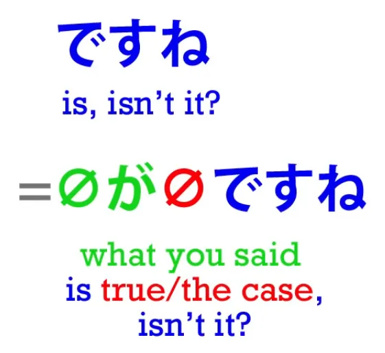
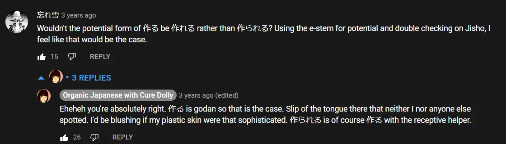

# **23. だって + だから & それから**

[**Урок 23: だって Datte: что это НА САМОМ ДЕЛЕ значит (подсказка: это не слово) + だから, それから**](https://www.youtube.com/watch?v=kO89HzRQygQ&list=PLg9uYxuZf8x_A-vcqqyOFZu06WlhnypWj&index=25&ab_channel=OrganicJapanesewithCureDolly)

こんにちは.

Сегодня мы поговорим о <code>だって</code> и некоторых вопросах, которые возникают в связи с использованием <code>だ</code> и <code>です</code>. Один из моих комментаторов говорил о том, что его сбивает с толку <code>слово</code> <code>だって</code>, и я не удивлена, потому что, если вы посмотрите в японско-английские словари, они скажут вам, что <code>だって</code> означает <code>потому что</code>, и <code>но</code>, и <code>даже</code>, а также <code>кто-то сказал</code>, что является довольно запутанным набором значений для одного так называемого слова. **И я говорю <code>так называемого</code> слова, потому что <code>だって</code> на самом деле даже не слово.** И то, что, кажется, никогда не объясняется в словарях или где-либо ещё, это то, чем оно на самом деле является, что оно на самом деле означает, и, следовательно, почему оно несёт в себе такой диапазон значений. Итак, давайте начнём с самого базового значения, которое является последним в списке: <code>кто-то сказал</code>.

## だって как <code>кто-то сказал</code>

**<code>だって</code> на самом деле просто состоит из связки <code>だ</code> плюс って,** **которое не является て-формой чего-либо, это って, которое является сокращением**, как мы уже говорили ранее[[18]](./18-って-は-mysteries-explained-おうとする-とする-として-という-っていう.md), **цитатной частицы -と плюс <code>いう</code>.**

---

**Итак, って означает <code>-という</code>, другими словами, <code>говорит</code> определённую вещь.** **-と объединяет что-то в цитату, а <code>いう</code> говорит, что кто-то это говорит.** Так что это действительно так просто.
<code> *(zeroが)* 明日は晴れ**だって**</code> — это просто <code> *(zeroが)* 明日が晴れ<b>...</b></code>

<code>晴れ</code> означает <code>солнечно</code> или <code>ясное небо</code> — и, как и в случае с большинством слов, относительно которых есть сомнения, к какому типу слов они относятся, они обычно оказываются существительными, **<code>晴れ</code> — это существительное.** Итак, <code>明日は晴れだ</code> просто означает <code>Завтра будет солнечно</code>. А когда мы добавляем って, мы говорим: <code>**Говорят, что** завтра будет хорошая погода</code>. **Мы можем говорить, что это говорит кто-то конкретный, или мы можем просто говорить <code>говорят</code> в общем** — <code>Я слышал(а), что завтра будет хорошая погода</code>, могли бы мы сказать по-русски. <code>Говорят, завтра будет хорошая погода.</code> Так что это очень просто, и **вот что такое <code>だって</code>:** **это <code>だ</code> плюс って, сокращение <code>-という</code>.**

И это то, чем оно является во всех остальных случаях тоже, так что давайте посмотрим, как это работает. Как оно стало означать <code>но</code>?

## だって как <code>но</code>

Что ж, для начала давайте поймём, что **когда оно используется само по себе** — а **оно означает <code>но</code>, когда используется само по себе, а не как окончание предложения**, как в примере, который мы только что рассмотрели, — **оно имеет слегка детский и обычно несколько негативный или спорный оттенок.** Итак, если кто-то говорит: <code>さくらがきれいだね</code> — <code>Сакура красивая, не так ли?</code> А вы говорите: <code>**だって**頭が弱い</code>. Теперь <code>頭が弱い</code> буквально означает <code>голова слабая</code> — <code>Она не очень умна</code>. Так что это было бы похоже на: <code>**Но** она не очень умна</code>. **Но то, что вы на самом деле здесь делаете, это берёте утверждение, которое сказал последний человек, и** **добавляете к нему связку <code>だ</code>.**

И чтобы понять это, давайте на мгновение посмотрим на кое-что другое.

### ですね

Очень часто, когда мы соглашаемся с чем-то, что говорит кто-то, мы можем сказать <code>ですね</code>. И буквально это просто означает <code>есть, не так ли?</code> И как это может означать это, ведь на самом деле <code>だ</code> или <code>です</code> **сами по себе ничего не значат.** Они должны соединять две другие вещи, и ни одна из них здесь не указана.

**Но то, к чему <code>です</code> прикрепляется по умолчанию, это то, что человек только что сказал.** И **то, к чему оно присоединяет это, это**, по умолчанию, **что-то вроде <code>本当</code> или <code>そう</code>** — <code>**そう**ですね</code>.

Итак, на самом деле мы говорим: <code>**Это правда**, не так ли?</code> или <code>**Это так**, не так ли?</code> или <code>**Вот как это есть**, не так ли?</code>

## それから & だから / ですから

Мы также делаем это, когда говорим <code>**だから**</code> или <code>**ですから**</code>, что на самом деле означает <code>**потому что**</code>.

Итак, мы знаем, что <code>から</code> означает <code>потому что</code>; оно буквально означает <code>из</code> и поэтому также означает <code>потому что</code>. **Из А, Б. Из Факта А мы можем вывести Факт Б. Из Факта А, Факт Б вытекает.** **Итак, <code>から</code> — <code>потому что</code>.** Иногда у нас может возникнуть искушение сказать <code>それから</code>, что является буквальным переводом английского <code>because of that</code>. **Но на самом деле <code>それから</code> не используется в значении <code>из-за этого</code>.** <code>それ</code> означает <code>то</code>, а <code>から</code> может означать «потому что», **но <code>それから</code> обычно означает <code>после этого</code>** — <code>から</code> в более буквальном смысле, **<code>から</code> в значении <code>из</code>, и в данном случае <code>из</code> в смысле времени, а не пространства.**
<code>С этого момента / с этого момента во времени / после этого</code>; <code>それから</code> — <code>после этого</code>.

---

Чтобы сказать <code>**из-за этого**</code>, мы говорим <code>**ですから**</code> или <code>**だから**</code>, и это на самом деле сокращение от <code>**それはそうですから**</code> или <code>**それは本当ですから**</code>.👇 Мы говорим <code>**потому что это так**</code>, и если вы подумаете об этом, это более логично, чем то, что мы говорим по-английски. Мы говорим <code>потому что это так</code>. <code>Because of that</code> на самом деле буквально означает по-английски <code>because that is the case</code>, но мы просто сокращаем это до <code>because of that</code>, 👇 и **в японском мы просто сокращаем это до <code>ですから</code>.**

## Возвращаемся к だって как <code>но</code>

Теперь, когда мы это понимаем, мы можем понять <code>だって</code> в значении <code>но</code>.

**<code>だ</code> отсылает к тому, что сказал последний человек, а って просто констатирует, что он это сказал.** Итак, если кто-то говорит: <code>さくらがきれいだね</code> — Сакура красивая, не так ли, не правда ли? — А вы отвечаете: <code>**だって**頭が弱い</code>. Теперь, **<code>но</code> здесь — это вы говорите <code>Вы сказали, что...</code>.** **И <code>だって</code> — это довольно детский и спорный способ сказать это, поэтому подразумевается, что то, что последует дальше, будет отрицать сказанное.**

---

**И это работает точно так же, как английское <code>but</code>.** Если подумать, **<code>but</code> не говорит, что то, что было до него, неправда.** **На самом деле оно принимает, что то, что было до него, правда, но затем добавляет информацию, которая противоречит впечатлению, созданному этим утверждением.**

---

Итак, <code>さくらがきれいだね</code> — <code>Сакура красивая</code> — <code>**だって**...</code> — <code>**Вы сказали это, и я не оспариваю, что это так, НО** — она не очень умна</code>.

## だって как <code>потому что</code>

Итак, как оно стало означать <code>потому что</code>, что в некотором смысле кажется почти противоположным <code>но</code>, почти противоположным значением? Что ж, давайте заметим, что **одна вещь, которую <code>но</code> и <code>потому что</code> имеют общего, это то, что они принимают первое утверждение.** <code>Но</code> продолжает говорить что-то, что контрастирует с этим утверждением, при этом всё ещё принимая его. **<code>Потому что</code> говорит что-то, что продолжает объяснять это утверждение.** И **это может быть гармоничное объяснение, которое просто даёт нам больше информации об этом, но это также может быть и противоречивое объяснение.** Так, например, если кто-то говорит: <code>Ты не сделал(а) большую часть своей домашней работы</code>, а вы отвечаете: <code>Потому что ты постоянно со мной разговариваешь!</code> **Это может быть выражено с помощью <code>だって</code> в японском.** Опять же, что это на самом деле говорит: «Вы говорите это, и я не оспариваю это, **но вот что-то**, **что мы можем добавить к этому, что подрывает нарратив, который вы пытаетесь выдвинуть».**

---

Итак, видите, оно не означает буквально ни <code>но</code>, ни <code>потому что</code>. **Что оно означает, это:** **<code>Я принимаю ваше утверждение, и теперь я собираюсь добавить что-то немного спорное</code>.** В русском оно может быть переведено как <code>но</code> или <code>потому что</code> в зависимости от обстоятельств.

## だって как <code>даже</code>

Итак, как оно может приобрести значение <code>даже</code>? Что ж, давайте поймём, что это немного другое использование. **Когда мы используем его в значении <code>даже</code>, мы не используем <code>だ</code> так, как мы используем его, когда говорим <code>だから</code> или <code>だって</code> в только что рассмотренных смыслах.** Другими словами, **мы не просто используем его для отсылки к последнему утверждению.**

---

**Обычно мы прикрепляем его к чему-то конкретному внутри утверждения, которое мы делаем.** Итак, если вы говорите: <code>さくらはできる</code> — <code>Сакура может это сделать</code>, а я говорю: <code>**私だって**できる</code>, что обычно переводится как <code>**Даже я** могу это сделать</code>, то на самом деле мы говорим: <code>**Скажем, это я**</code>, что означает как в японском, так и в английском: <code>**Возьмём гипотезу, что это я**</code> или <code>**Рассмотрим случай меня в этих обстоятельствах**</code>, и мы говорим: <code>私だってできる</code> <code>Скажем, это я, я могу это сделать</code>.

Теперь, это имеет другое значение, чем <code>私**も**できる</code>, **что просто нейтрально означает** <code>Я тоже могу это сделать</code>. <code>私**だって**</code>, **поскольку это очень разговорное выражение и поскольку оно связано с этим слегка** **негативным или противоречивым подтекстом**, означает <code>**Даже** я могу это сделать</code>.

---

**И это не обязательно должно быть негативным в смысле противоречия чему-либо.** Вне контекста Сакуры мы могли бы просто сказать: <code>私だってホットケーキが**作れる**</code> — <code>Даже я могу приготовить оладьи</code>.

::: info
Долли-сэнсэй оговорилась, сказав 作られる, но как потенциальная форма годзидан-глагола, должно быть 作れる. 作られる — это страдательная форма от 作る — мы убираем う, добавляем あ-основу + れる. Потенциальная форма — え + る.

:::

И в этом случае **мы не говорим это негативно,** **но <code>私だって</code> всё равно несёт в себе подтекст <code>даже я</code>.** Оно всё ещё имеет свой слегка пренебрежительный или негативный оттенок, потому что то, что вы здесь говорите, это: <code>**Даже кто-то вроде меня, даже я, кто обычно мало что умеет делать**, может приготовить оладьи</code>.

Итак, я надеюсь, что это делает <code>だって</code> более понятным, а также способы, которыми <code>だ/です</code> могут использоваться для принятия и подтверждения предыдущих утверждений, сделанных самим собой или кем-то другим, и добавления к ним чего-либо.