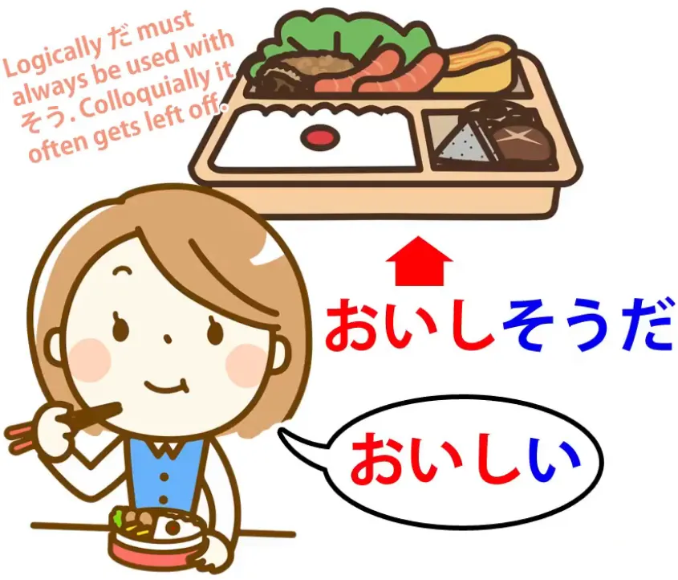
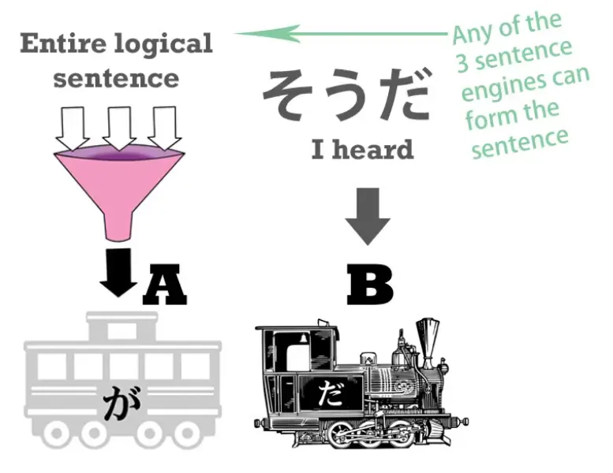

# **24. Слухи и догадки — そう・そうだ・そうです**

[**Урок 24: Слухи и догадки! 〜sou da, 〜sou desu — как они ДЕЙСТВИТЕЛЬНО работают.**](https://www.youtube.com/watch?v=uSJukXcyccw&list=PLg9uYxuZf8x_A-vcqqyOFZu06WlhnypWj&index=26&ab_channel=OrganicJapanesewithCureDolly)

こんにちは.

Сегодня мы поговорим о вспомогательном существительном <code>そう</code>, которое может означать либо сходство, либо слухи: **либо что что-то кажется чем-то**, либо что мы **излагаем не свою точку зрения или мнение, а то, что мы слышали.** Различить их может показаться сложным, особенно когда учебники дают вам список связей с существительными, глаголами и различными другими вещами. Это гораздо менее сложно, когда вы понимаете основной принцип, что на самом деле происходит с <code>そう</code>. Так что вам не придётся запоминать много разных вещей. Итак, прежде всего, что такое <code>そう</code>? **Это то же самое <code>そう</code>, о котором мы недавно узнали, которое входит в <code>こう-そう-ああ-どう</code>.**[[20]](./20-directionals-それ-その-そんな-そう-etc.md)

**Итак, <code>そう</code> означает <code>так</code>**, что, конечно, делает его очень хорошим кандидатом для **описания того, что что-то кажется чем-то.**

## そう как <code>кажется чем-то</code>

**Когда оно используется таким образом, мы присоединяем его к любому из трёх локомотивов.**

И помните, как мы уже узнали ранее, каждый из трёх локомотивов может быть перемещён за другие вагоны, чтобы превратить их в прилагательные.[[6]](./6-adjectives.md) **Теперь, как только -そう был присоединён к локомотиву,** **локомотив становится новым прилагательным-существительным.** Как мы их присоединяем? Мы делаем одно и то же в каждом случае. **Мы берём последнюю кану из локомотива.** Это та кана, которая делает его тем, чем он является, его активная часть.

---

**Итак, мы берём <code>だ</code> из だ-локомотива — <code>だ</code> или <code>な</code> из だ / な-локомотива.** **Мы берём <code>い</code> из い-локомотива.** **И из глагольного локомотива мы берём последнюю кану из う-ряда.** **И мы просто добавляем к ним -そう**, так что это очень простое соединение.

### С прилагательными-существительными

И **важно помнить, что в случае с существительными** **мы не можем сделать это с обычным, стандартным существительным.** **Мы можем сделать это только с прилагательным-существительным.**

---

Другими словами, **если прилагательное-существительное изначально является прилагательным-существительным,** **мы можем превратить его в другое прилагательное-существительное с помощью -そう.** **Если оно изначально не было прилагательным-существительным, оно не может быть превращено в прилагательное-существительное.** Итак, если мы возьмём прилагательные-существительные, такие как <code>元気</code> (<code>живой</code> или <code>здоровый</code>) и <code>静か</code> (что означает <code>тихий</code>) — если мы говорим <code>静かだ</code>, мы имеем в виду <code>тихий</code> — если мы говорим <code>元気だ</code>, мы имеем в виду <code>живой</code> или <code>здоровый</code>. Если мы говорим <code>元気**な**学生</code>, мы говорим <code>живой или здоровый-***есть*** студент</code>. Теперь **если мы** уберём это <code>だ</code> или <code>な</code> и **добавим -そう** — и скажем <code>元気**そうな**学生</code>, мы говорим <code>живой **выглядящий**-***есть*** студент / живой **кажущийся**-***есть*** студент</code>. Аналогично, если мы говорим <code>静かな女の子</code>, мы говорим <code>тихая-***есть*** девочка</code>. **Если мы** уберём это -な или だ и **добавим -そう** и скажем <code>静か**そうな**女の子</code>, мы говорим <code>тихая-**кажущаяся**-***есть*** девочка / тихая-**выглядящая**-***есть*** девочка</code>. Так что это очень просто, не так ли?

::: info
Как показано выше, мы убираем だ / な из исходного прилагательного-существительного, но затем, когда мы присоединяем -そう после него, мы всё равно используем だ / な, но оно вместо этого исходит из части そう. Это может быть сформулировано немного запутанно, учитывая, что примеры Долли всё ещё содержат だ / な.
:::

*Так что на всякий случай, чтобы избежать возможной путаницы… Потому что, по-видимому, [**そう само по себе является прилагательным-существительным**](https://jisho.org/word/%E3%81%9D%E3%81%86), поэтому だ / な, вероятно, присоединяется к そう. Здесь 静か — это прилагательное-существительное, к которому присоединяется そう, другое прилагательное-существительное, которое, кажется, служит суффиксом, к которому присоединяется な, чтобы связать его с 女. Таким образом, 静かそうな — это единое целое. Это согласуется с оранжевым комментарием Долли чуть ниже о том, что связка используется с そう.*

*Это всего лишь моё ограниченное понимание, так что воспринимайте это с долей скептицизма. Свяжитесь со мной, если я ошибаюсь.*

### С прилагательными

**С прилагательными, которые оканчиваются на <code>い</code>, мы просто убираем этот -い и добавляем к нему -そう.**

::: info
Обратите внимание на оранжевый комментарий выше на картинке с そう + だ.
:::

Итак, если мы возьмём <code>面白い</code> (<code>интересный-***есть***</code> или <code>забавный-***есть***</code>), <code>おいしい</code> (<code>вкусный-***есть***</code>), **мы просто отсекаем -い и добавляем -そう.** Итак, <code>面白い</code> означает <code>интересный-***есть***</code> или <code>забавный-***есть***</code>, <code>面白**そう**</code> означает <code>**кажется** интересным / **кажется** забавным</code>. <code>おいしい</code> означает <code>вкусный / аппетитный-***есть***</code>, <code>おいし**そう**</code> означает, что оно <code>**выглядит** вкусно</code>, оно <code>**выглядит** аппетитно</code>. И это важно помнить, потому что, как мы уже упоминали ранее, **японский язык гораздо строже английского в ограничении того, что мы можем говорить,** **только то, что мы можем знать наверняка сами.**

---

**Итак, если вы не попробовали что-то, вы не можете сказать, что это <code>おいしい</code>.** **Если вы не сделали что-то, вы не можете сказать, что это <code>面白い</code> — интересное или забавное.** Логически это, возможно, должно быть так и в английском, но японский язык гораздо строже в этом отношении. Итак, важно знать такие вещи, как <code>面白**そう**</code>, <code>おいし**そう**</code>, **если мы на самом деле не пробовали еду, не выполняли действие или что-то ещё.**

### С глаголами

Теперь, **с глаголом мы отсекаем кану из う-ряда.** Очевидно, как всегда, в случае итидан-глаголов это всё, что мы делаем. А **в случае годан-глаголов мы используем い-основу.**

А い-основа — это то, что можно назвать чистой основой глагола. В японском языке она называется **<code>[連用形]{れんようけい}</code>, что означает <code>форма для связующего использования</code>.** И это может показаться странным, потому что мы знаем, что все четыре основы на самом деле соединяют вещи, но в то время как остальные три имеют определённые применения, **<code>[連用形]{れんようけい}</code>, い-основа, помимо своих определённых применений,** **может использоваться для соединения почти всего.** **Она может соединять глаголы с существительными, чтобы образовывать новые существительные;** **она может связывать глаголы с глаголами, чтобы образовывать новые глаголы; и так далее.**

---

Итак, **мы присоединяем -そう к <code>連用形</code>, い-основе**, универсальной соединительной основе глаголов. Что они означают? Ну, **в общем, они означают, что что-то, кажется, вот-вот произойдёт.**

::: info
Ещё раз, напоминание о том, что だ используется после そう.
:::

Итак, <code>雨が降り**そうだ**</code> означает <code>**похоже, что** вот-вот пойдёт дождь</code>. <code>子どもが泣き**そう*(だ)***</code> означает <code>Ребёнок **выглядит так, будто** вот-вот заплачет / **кажется, что** вот-вот заплачет.</code> И если вы видите, это довольно похоже на то, что мы могли бы сказать по-английски: <code>**Похоже, будет** дождь / **кажется, что** вот-вот пойдёт дождь.</code> Так что эти способы использования действительно довольно просты.

## そう как слухи

Что же нам делать, когда мы используем <code>そう</code> в значении слухов, то есть <code>Я что-то слышал(а) — я не сообщаю о своём собственном наблюдении или чувстве, я сообщаю то, что получил(а) из вторых рук от кого-то другого</code>? Некоторые люди сказали бы, что это тоже суффикс, и мы должны соблюдать разные правила его применения, **но правда в том, что это не суффикс.**

---

**Обсуждённый нами -そう — это суффикс.** **Мы присоединяем его к другим словам, чтобы образовать новое слово.** Каким бы ни было слово изначально, **как только -そう присоединяется, оно становится прилагательным-существительным.**

::: info
Кажется, указывает на мою предыдущую мысль выше…
:::

*---*

**Это не то, что происходит, когда мы говорим о слухах.** Когда мы говорим о слухах, мы используем <code>**そうだ**</code> или <code>**そうです**</code> **после всего, завершённого предложения.**

**Итак, завершённое предложение становится А-вагоном предложения,** а **<code>そうだ</code> становится Б-локомотивом.** И **содержание предложения теперь подчинено.** Итак, давайте рассмотрим пример:

<code>さくらが日本人だ**そうだ**</code>. То, что мы здесь говорим, это <code>**Я слышал(а), что** Сакура — японка</code>. Итак, **<code>Сакура — японка</code> всё вместе берётся как Вагон А, подлежащее предложения, а затем то, что мы говорим об этом, это то, что мы это слышали.** Почему мы используем <code>そうだ/そうです</code> в значении <code>Я слышал(а)</code>?

Ну, если подумать, это похоже на то, что мы могли бы сказать по-английски. Предположим, мы говорим: <code>Почему этой машины больше нет на улице?</code>, а вы говорите: <code>Кажется, какие-то люди в масках пришли и угнали её</code>. Теперь, когда вы это говорите, это означает, что кто-то вам это сказал, не так ли? Если бы вы видели это сами, вы бы сказали: <code>Какие-то люди в масках пришли и угнали её</code>, но когда вы говорите: <code>Кажется, какие-то люди в масках пришли и угнали её</code>, вы говорите: <code>Ну, это история, которую я слышал(а)</code>.

::: info
Я бы также проверил(а) [**этот комментарий**](https://www.youtube.com/watch?v=uSJukXcyccw&lc=Ugy3WGJ0efK8lG72-N94AaABAg&ab_channel=OrganicJapanesewithCureDolly) тоже...
:::

И в японском это то же самое, только немного более систематично. **<code>そうだ/そうです</code> при добавлении в качестве Б-локомотива к целому, завершённому предложению всегда** **говорит, что это то, что мы слышали, это информация, которую мы имеем, чего бы это ни стоило.**