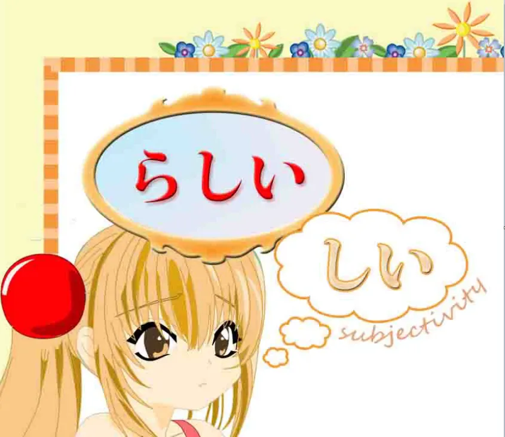
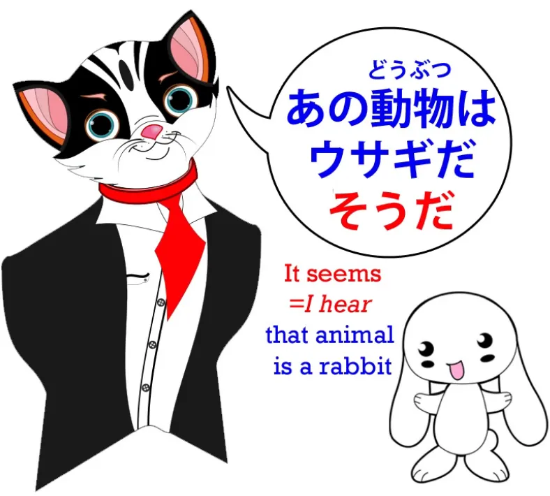
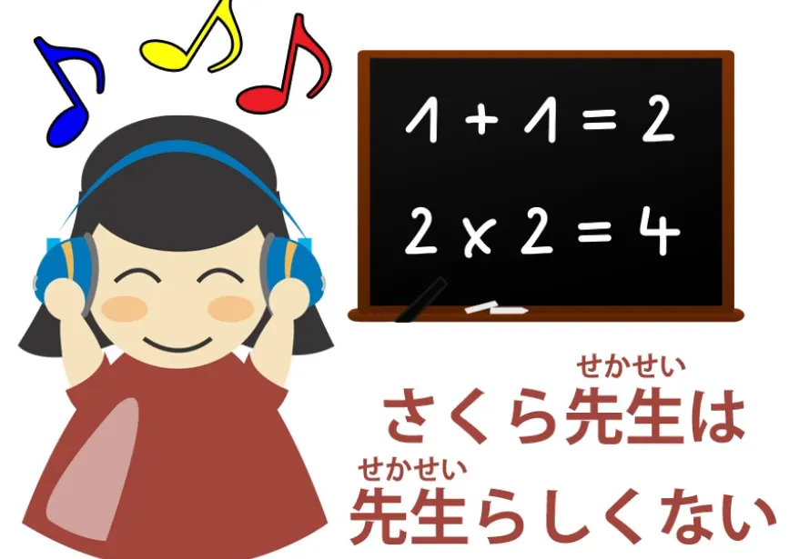

# **25. らしい vs そうだ / そうです + っぽい (ppoi)**

[**Урок 25: らしい Rashii сделано рациональным! らしい vs そうです. らしい vs そうです. っぽい ppoi**](https://www.youtube.com/watch?v=y3KlZ6IwtQ0&list=PLg9uYxuZf8x_A-vcqqyOFZu06WlhnypWj&index=31&ab_channel=OrganicJapanesewithCureDolly)

こんにちは.

На прошлой неделе[[24]](./24-hearsay-guesses-そう-そうだ-そうです.md) мы говорили о вспомогательном прилагательном-существительном <code>そう</code> и о том, как мы используем его для выражения того, на что что-то может быть похоже, нашего впечатления о чём-то, а также для передачи слухов. Сегодня мы поговорим о других способах выражения схожего круга идей, о том, как они работают, чем они похожи и чем отличаются.

## らしい

Итак, мы рассмотрим **<code>らしい</code>, которое является вспомогательным прилагательным.** И **это прилагательное, оканчивающееся на -しい**, что мы можем назвать **подклассом прилагательных**.

Все настоящие прилагательные, как вы знаете, оканчиваются на -い. Так называемые прилагательные, которые не оканчиваются на -い, на самом деле являются прилагательными-существительными. *(такими как [綺麗]{きれい})* Но группа тех い-оканчивающихся прилагательных заканчивается на -しい. *(Думаю, некоторые из <code>настоящих</code> прилагательных.)* Как вы видите, **оно всё ещё оканчивается на -い, но также имеет -し, так что это -しい.** И характеристика этой группы прилагательных заключается в том, что **в целом они выражают субъективные качества.** То есть, **не точные измеримые качества, а вещи, которые в некоторой степени зависят от впечатления человека или других разумных существ о них.** Так, например, <code>[悲]{かな}しい</code> означает <code>грустный</code>; <code>[嬉]{うれ}しい</code> означает <code>счастливый</code>. <code>[難]{むずか}しい</code> означает <code>трудный</code>, и хотя это кажется несколько более объективным, чем <code>嬉しい</code> и <code>悲しい</code>, **это всё же в некотором роде субъективность, потому что трудность относительна для конкретных людей.**

**Насколько вы находите что-то трудным или лёгким, в значительной степени зависит от** **того, кто вы и каковы ваши способности.** Итак, это, как мы увидим, даёт нам представление о том, что это за слово и чем оно отличается от <code>そう</code>. Его использование очень простое. **Как и <code>そう</code>, оно может быть присоединено либо к отдельному слову, либо** **к завершённому логическому предложению.**

И присоединение абсолютно простое, потому что мы никогда ничего не делаем, кроме как **просто ставим <code>らしい</code> после слова или после завершённого логического предложения.** **Мы ничего не меняем, ничего не делаем, так что проще не бывает.**

Итак, **как и в случае с <code>そう</code>, если мы ставим его после отдельного слова,** **мы говорим о наших впечатлениях от этого конкретного объекта.** **Если мы ставим его после завершённого предложения**, мы говорим: <code>**кажется, что это так**</code>.

## Разница между らしい и そうだ/です

Однако есть разница. Если мы ставим <code>そうだ</code> после завершённого предложения, как вы знаете, мы завершаем предложение, если необходимо, ещё одним <code>だ</code>, и это использование означает, что **мы слышали, что это предложение соответствует действительности.**

### らしい vs そうだ — после завершённого предложения

Итак, если мы говорим <code>あの動物はウサギだそうだ</code>, мы говорим: <code>Я слышал(а), что это животное — кролик</code>. А если мы говорим <code>あの動物はウサギだ**らしい**</code>, мы говорим: <code>**Кажется**, это животное — кролик</code>.

Итак, **это может означать то же самое, что и** <code>ウサギだ**そうだ**</code>. Это может означать: <code>Я слышал(а), что это кролик</code>, и иногда учебники становятся довольно запутанными и сбивающими с толку относительно того, означает ли <code>らしい</code> на самом деле <code>Я слышал(а)</code> или <code>кажется</code>, но это очень просто, если вы точно понимаете, что оно делает. **На самом деле оно означает <code>похоже</code> или <code>кажется</code>, и это имеет точно такую же двусмысленность и отсутствие двусмысленности, как и в английском.**

Итак, давайте рассмотрим случай с этим загадочным животным. Предположим, я смотрю на него с группой людей, а потом вы подходите ко мне и спрашиваете: <code>Что это за животное?</code>, и я говорю: <code>ウサギだ**らしい**</code>. Итак, я дал(а) **завершённое предложение с <code>らしい</code> в конце**, и естественное значение здесь было бы: <code>**Я слышал(а) от тех людей, что** это был кролик.</code>

---

Теперь вы видите, это то же самое, как если бы по-английски я сказал(а): <code>**It appears that** it's a rabbit.</code> Теперь вы бы восприняли мои слова, как по-английски, так и по-японски, как: <code>**Из того, что я слышал(а) (от тех людей)**, это кролик</code>. Теперь рассмотрим другой сценарий. Кролик ушёл, и я осматриваю его следы, а вы подходите ко мне и спрашиваете: <code>Что это было за животное?</code>, и я говорю: <code>ウサギだった**らしい**</code>. Опять же, <code>**Похоже, что** это был кролик</code>, или <code>**Кажется, что** это был кролик.</code>

В этом случае вы, вероятно, сделали бы вывод из того, что я делаю, что, говоря <code>**Похоже**, это был кролик</code>, я говорю: <code>**Судя по доказательствам, которые я здесь вижу, похоже, что** это кролик.</code> Так что, видите, в этом нет ничего особенно грамматического или сложного. Это то же самое, что и в английском, если бы вы сказали <code>It appears that it's a rabbit</code> или <code>It seems that it's a rabbit</code>, **это зависит от контекста, подразумевает ли это, что это информация, которую вы слышали,** **или что это вывод, который вы делаете из своих наблюдений.**

---

**Если вы хотите быть совершенно недвусмысленным в том, что вы говорите о слухах,** **что вы говорите о чём-то, что вы слышали от других людей**, тогда вы говорите: <code>ウサギだった**そうだ**</code>.

Это недвусмысленно. Это может означать только: <code>**Я слышал(а) это от кого-то**</code>.

### らしい vs そうだ — отдельное слово

Теперь, когда мы применяем <code>らしい</code> к отдельному слову, самое непосредственное различие между <code>らしい</code> и <code>そうだ</code> заключается в том, что **мы не можем применять <code>そうだ</code> к обычному существительному.** **Мы можем применять его только к прилагательному-существительному**, и для этого есть веская причина.

Мы вернёмся к этому через мгновение. **<code>らしい</code> вы можете применять к любому типу существительных,** **будь то прилагательное-существительное или обычное существительное.** Но оно по-настоящему раскрывает свой потенциал, когда применяется к обычным существительным.

---

Как и следовало ожидать из того факта, что **это -しい прилагательное** – то есть, что мы ожидаем от него выражения большей степени субъективности – **оно обладает способностью уподоблять одну вещь другой.** Так, мы можем сказать <code>あの動物はウサギ**らしい**</code> – <code>Это животное **похоже на** кролика / это животное **кроликоподобное**.</code>

---

Теперь, разница между этим и <code>そう</code>, помимо того факта, что вы можете применять <code>そう</code> только к прилагательным-существительным – и вот почему вы можете применять <code>そう</code> только к прилагательным-существительным – заключается в том, что когда мы говорим <code>あの動物はウサギ**らしい**</code>, **мы не обязательно предполагаем, что это на самом деле кролик.** **Мы можем быть полностью осведомлены о том, что это не кролик,** и просто говорим, что это **похоже на** кролика, это **кроликоподобное** животное. И, конечно, **мы можем превратить его в такое же прилагательное:** <code>ウサギ**らしい**動物</code> – <code>**кроликоподобное** животное</code>. И опять же, это то же самое, что и в английском. Если мы говорим <code>That animal **looks like** a rabbit</code>, мы можем иметь в виду <code>**Я предполагаю, что это** кролик</code>, или мы можем иметь в виду <code>Это, вероятно, не кролик, но оно определённо выглядит как кролик.</code> Теперь это расширяется на ещё более широкие области субъективности.

### らしい для более субъективных областей

Например, **мы можем сказать, что что-то обладает качествами чего-то.** Например, <code>男**らしい**男</code> — это <code>мужественный мужчина</code>, мужчина, **который обладает качествами** мужчины. Если мы говорим о ком-то, кто не является учителем, и говорим <code>先生**らしい**</code> – <code>Этот человек **похож на** учителя.</code> **Мы можем предполагать или не предполагать, что она на самом деле учитель.**

---

Но если мы знаем, что она учитель, и говорим <code>さくら先生は先生**らしい**</code>, мы имеем в виду, что она **ведёт себя как** учитель.

**Она учитель, и у неё есть правильные качества и манеры для того, чтобы быть учителем.**

---

И наоборот, мы могли бы сказать <code>さくら先生は、先生**らしくない**</code>, и в этом случае мы говорим: <code>Ну, мы знаем, что она учитель, но она **не ведёт себя как** учитель, она **не действует как** учитель.</code>

Итак, видите, **с <code>らしい</code> мы углубляемся в гораздо более субъективные области.** **Мы не просто гадаем, действительно ли что-то вкусное или интересное,** **что мы можем подтвердить опытом.** **Мы говорим о наших впечатлениях, убеждениях и субъективных ощущениях, окружающих явление.** Теперь мы также можем сказать, например, если Сакура говорит что-то неприятное, а обычно она очень милая девушка, мы можем сказать: <code>それはさくら**らしくない**</code> – <code>Это **было/есть не похоже на** тебя, Сакура.</code> **Итак, мы говорим о качествах, субъективно воспринимаемых качествах вещи.** Таким образом, **в некоторых областях оно пересекается с <code>そうだ</code>,** **но в других областях оно продвигается в более тонкие и субъективные области.**

## っぽい

Теперь мы также быстро рассмотрим っぽい, которое представляет собой маленький っ, за которым следует -ぽい, так что у нас есть небольшая пауза между этим и тем, что мы говорим. Итак, если мы хотим сказать <code>дет**ский**</code> (в смысле <code>ребяческий</code>), мы можем сказать <code>子ども**っぽい**</code>. **Оно работает очень похоже на <code>らしい</code>. Это также вспомогательное прилагательное.** **Оно гораздо более разговорное, чем <code>らしい</code>,** и мы обычно слышим его именно в такой форме – <code>子ども**っぽい**</code>, <code>ウサギ**っぽい**</code>.

---

**Вы не можете использовать っぽい в конце завершённого предложения. Вы можете присоединять его только к слову.** И помимо его разговорного характера, различие в тенденции от <code>らしい</code> заключается в том, что **<code>らしい</code> будет иметь тенденцию подразумевать, что качество является тем, чем что-то должно обладать.** **-っぽい часто имеет тенденцию подразумевать противоположное.** *(в основном, оно имеет тенденцию подразумевать нежелательное качество)*

---

Здесь нет жёсткого правила, но **в <code>らしい</code>, как правило, присутствует положительная склонность, а в っぽい — отрицательная**, **хотя вы, безусловно, услышите, как их используют и наоборот в некоторых случаях.** Так, <code>子ども**らしい**</code> **с большей вероятностью будет подразумевать, что ребёнок ведёт себя подобающим ребёнку образом**, тогда как <code>子ども**っぽい**</code> имеет тенденцию означать <code>ребяческий</code>.

На самом деле, в английском мы могли бы сказать, что <code>子ども**らしい**</code> означает <code>child-**like**</code> (по-детски), а <code>子ども**っぽい**</code> означает <code>child**ish**</code> (ребяческий), хотя это не так жёстко и однозначно, как в английском. **Оно может быть использовано и наоборот, не нарушая никаких реальных правил.** Когда я впервые появилась в этой конкретной оболочке, этом теле, которое я сейчас ношу – я, конечно, призрак в доспехах *(отличная отсылка, Долли :D)* – я говорила по-английски, представляя его, но сделала небольшое отступление на японском, потому что я действительно не знаю, как это сказать по-английски. Я сказала: «Что вы думаете обо мне, когда я выгляжу так? <code>人間っぽいね?</code>» <code>人間**っぽい**ね</code> – <code>Это очень человекоподобно, не так ли?</code> И хотя это не было совсем уж уничижительным, смысл того, что я говорила, был: <code>Боже мой, в этой оболочке я **выгляжу действительно более** человекоподобной, **чем я есть на самом деле**, не так ли?</code> Что, я думаю, является причиной, по которой некоторые люди называют меня <code>жуткой</code>, потому что я, вероятно, просто слишком человекоподобна для того, кто не является человеком.

::: info
Может быть немного сложно сказать, какие части перевода мне следует выделить, чтобы они соответствовали тому, что Долли даёт на 日本語, но, надеюсь, это поможет, я стараюсь вывести их как можно лучше (p^-^)p
В любом случае, с этого момента я не буду использовать эти подчёркивания примерно до Урока 78.

В более поздних уроках они снова появятся, в этих промежуточных уроках их нет, потому что тогда я использовал(а) только жирный шрифт и не добавлял(а) подчёркивания до более позднего времени, поэтому пока на них нет линий.

Также, уроки с этого момента и до 64 входят в число первых, которые я редактировал(а), и я ещё не просматривал(а) там заметки, так что имейте это в виду и воспринимайте их с долей скептицизма, как обычно, на всякий случай, поскольку мой японский всё ещё очень ограничен, и я не получал(а) отзывов от более профессиональных/продвинутых людей по ним.
Причина также в том, что я был(а) (и до сих пор в некотором роде остаюсь) не совсем уверен(а), следует ли мне их использовать (Yomichan не хочет правильно сканировать части с другим стилем, а 10ten — хочет…)

Потребовалось много времени и работы, чтобы подчеркнуть важные части, так что, возможно, я вернусь к этому позже, чтобы сделать это хотя бы последовательным. Если можете, пожалуйста, дайте мне знать через Discord или Mail, предпочитаете ли вы подчёркнутые важные части или просто неподчёркнутый текст, так как иногда количество <code>важного материала</code> может быть немного сложнее читать, когда всё подчёркнуто. С жирным шрифтом было ещё хуже, поэтому я перестал(а) его использовать и преобразовал(а).
:::