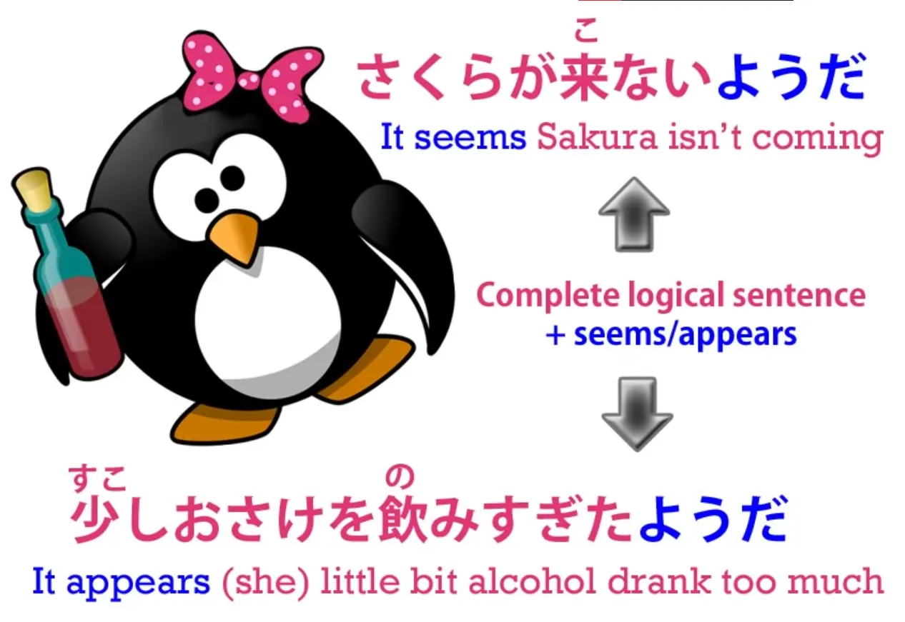
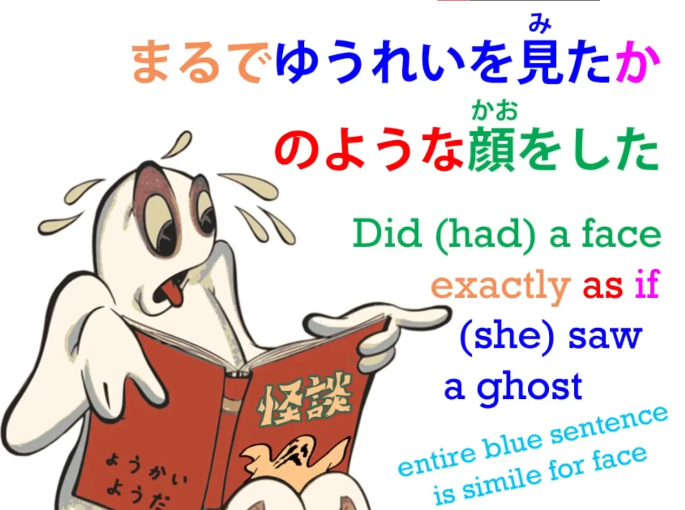
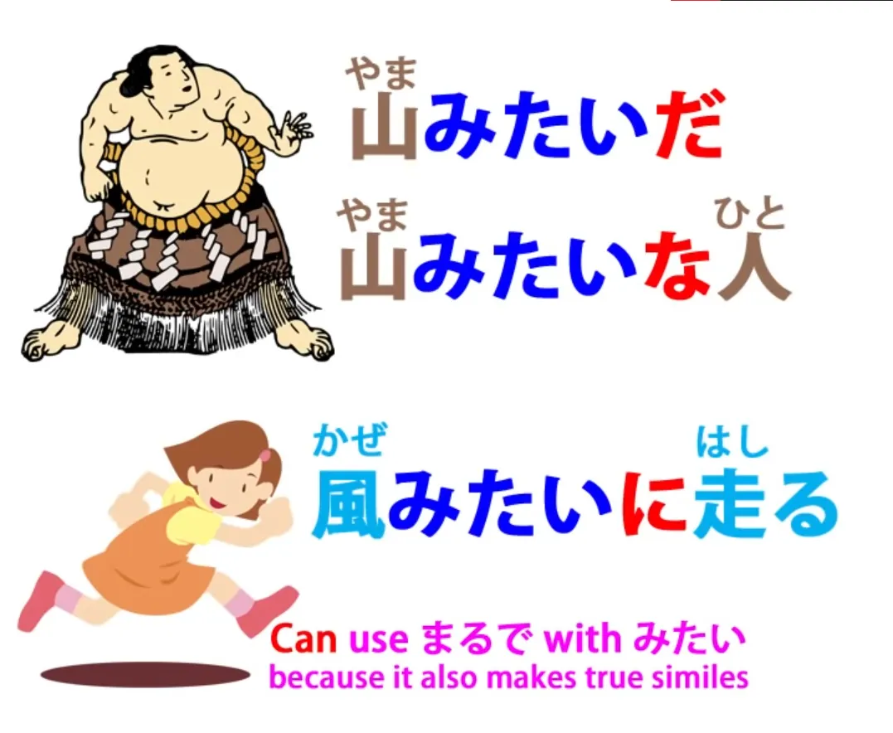
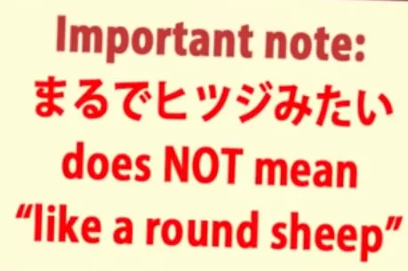
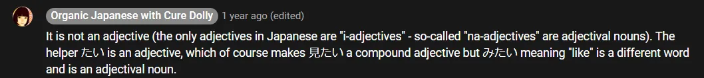
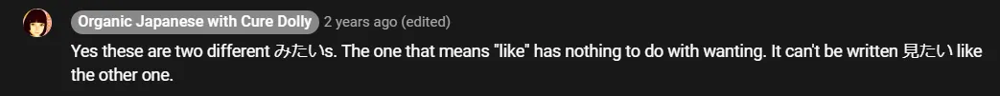

# **26. Сравнения: ようだ・のように・のような ・みたい**

[**Урок 26: Кристально чистая логика японских сравнений: のように・のような ・みたいграмматика**](https://www.youtube.com/watch?v=Ft_zw0mdeyI&list=PLg9uYxuZf8x_A-vcqqyOFZu06WlhnypWj&index=28&pp=iAQB)

こんにちは。

Сегодня мы поговорим о <code>ようだ</code> и немного упомянем её кузину <code>みたい</code>. Мы обнаружим, что <code>ようだ</code> представляет собой другой конец скользящей шкалы выражений предположения и сходства, которые мы обсуждали на двух последних уроках.

На одном конце у нас <code>そうだ</code>, на другом — <code>ようだ</code>, а посередине — <code>らしい</code>. Все эти выражения могут быть помещены в конец завершённого логического предложения, чтобы выразить, что это предложение либо то, что мы слышали, либо то, что мы предполагаем из имеющейся у нас информации или из того, что мы видим. Но когда мы присоединяем их к отдельным словам, тогда у нас появляется эта скользящая шкала значений.

Как мы знаем, <code>そうだ</code> мы используем для предположения о качестве чего-либо. Мы можем сказать <code>おいしそうだ</code> — <code>Выглядит вкусно /Я не пробовал(а), но думаю, что если бы попробовал(а), то нашёл(нашла) бы это вкусным.</code>

С <code>らしい</code> у нас гораздо большая степень субъективности. <code>らしい</code> во многом пересекается с <code>そうだ</code>, но также может делать то, чего <code>そうだ</code> не может.

Оно может сравнивать вещи с другими вещами, с тем, чем они, как мы знаем, не являются. Мы можем сказать, что животное <code>ウサギらしい</code> — <code>кроликоподобное</code> — даже если мы знаем, что это не кролик. Мы можем сказать, что человек <code>子どもらしい</code> — <code>по-детски</code> — независимо от того, является ли она на самом деле ребёнком или нет. Мы не обязательно предполагаем, что животное — кролик или человек — ребёнок. Мы просто делаем это сравнение.

## ようだ ・ように・ような

Теперь <code>ようだ</code> может пойти гораздо дальше. Оно может создавать настоящую метафору или сравнение. Так, с <code>ようだ</code> мы можем сказать такие вещи, как <code>борец сумо похож на гору</code> или <code>человек бежит как ветер</code>. Это, если хотите, сравнения или метафоры в литературном или поэтическом стиле.

Мы не говорим, что борец хоть чем-то похож на гору, кроме того, что он большой и крепкий. Мы не говорим, что человек хоть чем-то похож на ветер, кроме того, что она быстрая. И один из способов узнать, когда <code>ように</code> действует таким образом, это то, что мы можем использовать с ним слово <code>まるで</code>. Так, мы можем сказать <code>まるで風のように走った</code> — <code>бежал(а) прямо как ветер</code>.

Буквально <code>まるで</code> означает <code>кругло</code>.

<code>[丸]{まる}</code> означает <code>круг</code> или <code>круглое</code>, поэтому, когда мы говорим <code>まるで</code>, мы имеем в виду <code>кругло/целиком/полностью</code>. И это гипербола, которая распространена во многих языках, включая, безусловно, английский. Мы могли бы сказать по-английски: <code>That wrestler is exactly like a mountain.</code> (Этот борец **точно** как гора.)

Мы могли бы даже сказать: <code>I literally froze to death.</code> (Я буквально замёрз(ла) насмерть.) Это противоположность тому, что мы на самом деле имеем в виду: мы не имеем в виду, что мы <code>буквально</code> замёрзли насмерть, мы имеем в виду, что мы замёрзли насмерть в переносном смысле. В буквальной реальности мы, кажется, всё ещё живы. Мы не имеем в виду, что борец <code>точно</code> как гора.

На нём нет снега! Но причина, по которой мы говорим такие вещи, как <code>точно</code> и <code>буквально</code>, заключается в том, чтобы придать выразительности поэтическому сравнению. А в японском языке обычное сочетание здесь — <code>まるで</code>.

И это также демонстрирует разницу между <code>ようだ/ような/ように</code> и другими выражениями сходства. Вы не можете использовать <code>まるで</code> с <code>そうだ</code> или <code>そうです</code>. Вам не следует использовать <code>まるで</code> с <code>らしい</code>. С этими выражениями оно неуместно.

Мы используем <code>まるで</code>, когда пускаемся в своего рода поэтический полёт фантазии. Это гиперболическое выражение, которое сигнализирует о приближении сравнения или метафоры. Когда мы говорим, что человек <code>子どもらしい</code> или животное <code>ウサギらしい</code>, мы немного расширяем реальность; мы сравниваем это с чем-то, чем оно могло бы быть, но не является.

Теперь, если мы посмотрим на использование этих выражений, мы увидим, что, как обычно в японском, они очень логичны.

Учебники иногда дают вам списки связей и способов их использования. Но на самом деле все они имеют смысл. Нам не нужен список, чтобы сказать, что <code>ようだ</code> также может использоваться как наречие <code>ように</code> или что оно может быть помещено перед чем-либо как прилагательное <code>ような</code> — потому что эти связи — это просто те же самые связи, которые вы можете установить с любым прилагательным-существительным.

Единственное, что нам нужно знать, это то, что, как и <code>らしい</code>, и в отличие от <code>そうだ</code>, мы можем использовать его с любым типом существительного, а не только с прилагательными-существительными. И это тоже имеет смысл, потому что как с <code>らしい</code>, так и с <code>ようだ</code> мы можем сравнивать вещи с другими вещами, тогда как с <code>そうだ</code> мы можем только предполагать качество вещи, что-то, что может быть выражено прилагательным или прилагательным-существительным. А когда мы присоединяем его к глаголу, как мы видели, оно имеет немного другое значение.

Однако <code>ようだ</code> имеет особую связь, которой нет у других.

Как вы знаете, мы можем просто присоединить его к целому предложению, как и два других, со значением <code>(это предложение) — это то, что, кажется, имеет место быть</code>. Но мы также можем присоединить его к целому, завершённому предложению с другим значением. Мы можем сделать это, чтобы превратить всё предложение в наше сравнение.

Так, например, мы можем сказать <code>まるでゆうれいを見たかのような顔をした</code> — <code>У неё было такое лицо (или она сделала такое лицо), будто она увидела призрака.</code>

Итак, как мы видим, <code>она увидела призрака</code> — это целое логическое предложение. В японском у нас есть zero-частица для <code>она</code>, но это полное логическое предложение: <code>она увидела призрака</code> — <code>ゆうれいを見た</code> — <code>(zeroが)ゆうれいを見た</code>. Теперь, затем мы ставим <code>か</code> в конец. Что это за <code>か</code>?

## Частица か

Мы не так много говорили о частице <code>か</code>, потому что в японском языке です/ます вы используете её для обозначения вопроса. Вы можете использовать её для обозначения вопроса в неформальном японском, который мы обычно используем здесь, но в основном мы этого не делаем, потому что, как ни парадоксально, ставить <code>か</code> в конце неформального вопроса кажется невежливым — это имеет тенденцию звучать немного резко или отрывисто.

Однако вопросительная частица <code>か</code> имеет ещё одну важную функцию. И это то, что она может объединять утверждение в своего рода вопрос, и именно это здесь и происходит. Мы начинаем с <code>まるで</code>, чтобы сигнализировать, что собираемся использовать сравнение.

Затем мы делаем наше завершённое утверждение — <code>ゆうれいを見た</code> — <code>(zeroが)ゆうれいを見た</code> — <code>она увидела призрака</code>. А затем мы добавляем <code>か</code>, и это превращает его в вопрос. Это даёт нам наше <code>если</code> — <code>как если бы она увидела призрака</code>.

И эта <code>か</code> даёт нам наше вопросительное <code>если</code>. На самом деле, она не видела призрака, так что это не совсем утверждение; это возможность, потенциальность, <code>если</code>. Что она на самом деле сделала, возможно, это увидела комиссии, которые PayPal взимал с неё за международный денежный перевод.

Мы не предполагаем, что она действительно видела призрака. Мы предполагаем, что лицо, которое она проявила — <code>顔をした</code> — было похоже на лицо, которое она проявила бы, если бы — <code>か</code> — она увидела призрака.

Теперь, другая вещь, которую нам нужно понять об этой <code>か</code>, заключается в том, что она фактически номинализует логическое предложение, которое она отмечает.

Итак, что она делает, это превращает это полное логическое предложение в вопрос, гипотезу, <code>если</code>, которое затем структурно функционирует как существительное. Таким образом, оно может быть отмечено частицей の, что может произойти только с существительным. И таким образом, это новое существительное, этот объект, который мы создали из целого логического предложения, теперь может быть соединён с другим существительным частицей の.

<code>よう</code> — это <code>форма</code> или <code>сходство</code> — <code>やまのよう</code> — это форма горы, <code>風のよう</code> — это форма или сходство ветра, и в данном случае <code>ゆうれいを見たかのよう</code> — это сходство этого объекта, который мы создали из гипотезы о том, что видели призрака. Опять же, это не то, что мы можем сделать с любым из других. Мы даже не можем сделать это с <code>みたい</code>, которое во многих отношениях работает почти точно так же, как <code>のよう</code>.

## みたい

<code>みたい</code> — это менее формальная кузина <code>よう</code>, и в целом она означает то же самое и в целом может использоваться теми же способами.

Это прилагательное-существительное, точно так же, как <code>よう</code>, может использоваться с <code>に</code>, чтобы сделать его наречием, или с <code>な</code>, чтобы сделать его прилагательным, стоящим перед существительным, как и любое прилагательное-существительное. Главное, что нужно помнить о нём, это просто то, что оно менее формально, поэтому вы не используете его в эссе.

С другой стороны, вы можете предпочесть выбрать его, когда разговариваете с другом, вместо <code>ようだ</code> во многих случаях, просто потому, что оно звучит немного менее формально и немного более дружелюбно. Но вы не можете использовать его с завершённым предложением.

Вы можете использовать его с полным предложением, чтобы предположить, что это утверждение соответствует действительности, но вы не можете использовать его с <code>か</code>, чтобы использовать полное предложение в качестве сравнения. Для этого вам нужно использовать <code>かのようだ/かのように</code>. Ещё одна вещь, которую следует отметить, это то, что иногда, вероятно, потому что оно очень неформальное, <code>だ</code> или <code>です</code> опускается из <code>みたい</code>.

Вы можете сказать <code>まるでヒツジみたい</code> — <code>прямо как овца</code>.

Это не совсем правильная грамматика — вы должны сказать <code>みたいだ</code> — но очень часто его опускают. Опускать его из <code>ようだ</code> не принято.

::: info
На всякий случай добавлю, что это прилагательное-существительное みたい НЕ то же самое, что 見たい (прилагательное, означающее <code>вызывающий-желание-видеть</code>). Это два разных <code>みたい</code>. Вы не можете написать этот みたい как 見たい, иначе это будет прилагательное <code>вызывающий-желание-видеть</code>. Что Долли-сэнсэй говорит в комментариях:

:::