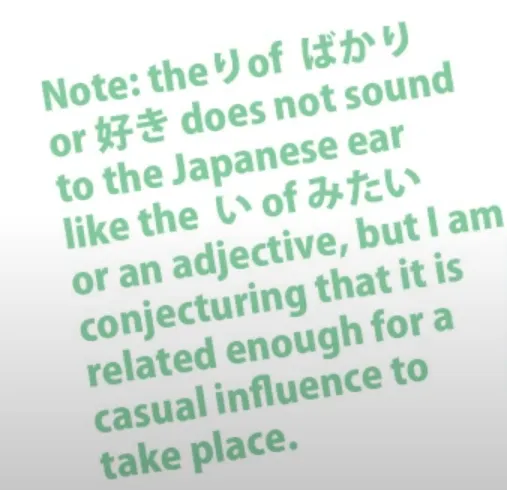
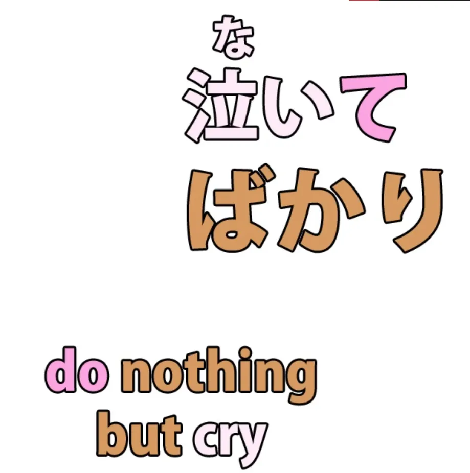
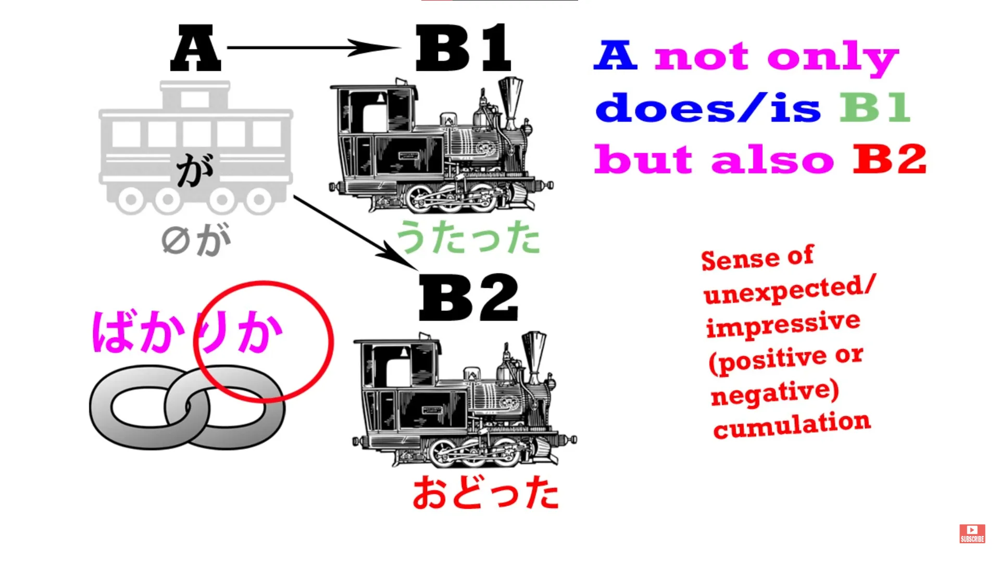
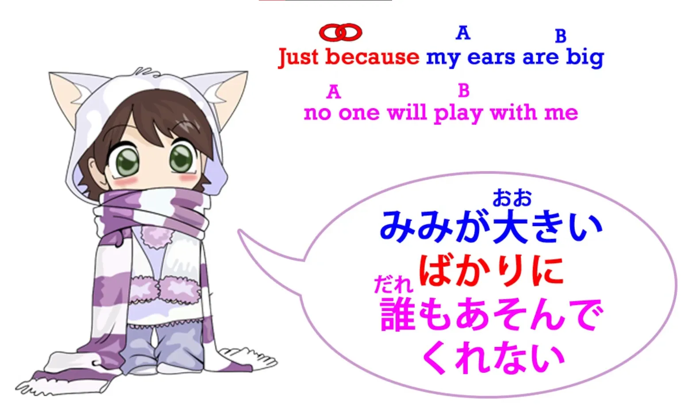

# **27. ばかり**

[**Урок 27: Значения ばかり bakari: безумная мешанина или логическая система?**](https://www.youtube.com/watch?v=jqC60f-c1ng&list=PLg9uYxuZf8x_A-vcqqyOFZu06WlhnypWj&index=29&pp=iAQB)

こんにちは。

Сегодня мы поговорим о <code>ばかり</code>, одном из тех японских выражений, которые учебники могут объяснять очень запутанно. Они расскажут вам, что у него есть несколько разных, казалось бы, случайных значений, которые присоединяются к разным грамматическим структурам, и вам придётся их заучивать. Это ещё один из тех длинных списков, которые так любят давать учебники.

К счастью, как это часто бывает, мы можем разобраться во всём этом, просто взглянув на то, что это слово на самом деле означает и как оно логически работает в разных ситуациях. Это даст нам ключ как к значениям, так и к структуре в различных его применениях. <code>ばかり</code> — это, по сути, существительное.

Вы услышите, как его описывают по-другому, но на практике оно функционирует как существительное. Мы используем <code>だ</code> после него, что мы можем делать только с существительным, хотя иногда <code>だ</code> или <code>です</code> опускаются в неформальной речи, как и в случае с <code>みたい</code>, которое мы обсуждали на прошлой неделе. Я заметила, что очень часто, когда <code>だ</code> или <code>です</code> опускаются, слово заканчивается на -い, поэтому я думаю, что это может быть небольшое влияние прилагательных, хотя это и не прилагательное.

Это существительное.

Так что же оно означает? Его значение очень простое. Оно означает <code>только что</code> или <code>ничего, кроме</code>. И одно из самых распространённых применений — это просто поставить его после утверждения в прошедшем времени, чтобы сказать, что это <code>только что</code> произошло.

Это работает точно так же, как в английском. Если мы говорим <code>来たばかり</code> — <code>Я только что пришёл/пришла</code> — это именно то, что мы говорим и по-английски: <code>I just came</code> или даже <code>I only just came</code>. Это означает, что что-то произошло очень короткое время назад.

Почему мы используем, как в английском, так и в японском, слово, означающее <code>ничего, кроме</code> в этом случае? Ну, как и многие слова, это гипербола. Мы обсуждали гиперболы в случае с <code>まるで</code> на прошлом уроке, не так ли?

Когда мы говорим <code>I just came/来たばかり(だ)</code>, мы говорим, что ничего не произошло, кроме того, что я пришёл/пришла. Я пришёл/пришла настолько недавно, что не было времени ни на что другое: <code>I just came/I only just came/来たばかり(だ)</code>. И это очень часто является гиперболой.

Предположим, например, что мы встречаем друга на улице, и друг говорит: «Пойдём выпьем кофе с пирожными», а мы говорим <code>食べたばかり</code> — <code>Я только что поел/поела</code>. То, что мы буквально говорим здесь, это то, что я поел/поела настолько недавно — миллисекунды назад — что между едой и сейчас ничего другого не произошло.

Конечно, это не буквально правда. Человек должен был покинуть место, где он ел, и пройти по улице, по крайней мере. Но гиперболически мы говорим, что мы поели, и ничего другого не произошло между тем моментом и сейчас.

Учебники скажут вам, что это использование <code>ばかり</code> присоединяется к простой прошедшей форме глагола. Это правда, но это также сбивает с толку по двум причинам. Во-первых, фраза <code>простая прошедшая форма</code> подразумевает целый мир, где нас учат, что «настоящие» формы глаголов — это формы на <code>ます</code>, поэтому мы должны деконструировать их каждый раз, когда что-то с ними делаем.

Нам не нужно говорить <code>простая прошедшая форма</code>, потому что всё, что мы делаем с глаголом внутри предложения, мы делаем с простой формой глагола, даже если мы используем формальный японский, добавляя **です** и **ます** в конце. <code>です</code> и <code>ます</code> — это не более чем декоративные приставки, которые мы ставим в самом конце предложения.

Другая вещь, которая делает это объяснение запутанным, заключается в том, что, хотя это правда, что мы ставим его после прошедшей формы глагола, мы на самом деле не присоединяем его к прошедшей форме глагола. Это не то, что происходит логически. И это одна из тех вещей, которая заставляет это звучать как случайное правило, хотя это не так.

То, к чему мы присоединяем <code>ばかり</code>, — это завершённое действие. И то, что мы говорим, это как давно это произошло. Мы говорим, что это произошло очень-очень короткое время назад.

Итак, у нас должно быть завершённое действие, и, конечно, оно должно быть в прошедшем времени, потому что именно об этом мы и говорим. Если бы оно было в непрошедшем времени, это не имело бы никакого смысла, не так ли? Так что мы можем сказать, что оно присоединяется к простой прошедшей форме глагола, или мы можем сказать, что оно присоединяется именно там, где оно логически должно присоединяться и где оно не имело бы смысла, если бы не присоединялось.

Теперь, следующее использование <code>ばかり</code> — это то, что иногда сбивает людей с толку, потому что оно выражает, что чего-то очень много. <code>ばかり</code>, очевидно, является ограничивающим словом, так почему же оно используется для выражения того, что чего-то очень много? И снова, это совершенно логично и естественно, и мы используем это и в английском языке.

Если мы говорим <code>There are nothing but cakes in that shop!</code> — <code>В этом магазине ничего, кроме пирожных!</code> — мы можем иметь в виду это буквально, но очень часто мы имеем в виду, что есть и другие вещи, но пирожных ужасно много. Когда я жила в японской деревне и собиралась на некоторое время переехать в Токио, один мой знакомый посчитал, что мне не стоит переезжать в Токио, и сказал: <code>東京は外人ばかりだ</code> — <code>В Токио одни иностранцы.</code>

Конечно, этот человек не имел в виду, что в Токио нет никого, кроме иностранцев; он имел в виду, что в Токио очень много иностранцев — и он знает, что я не хочу общаться с иностранцами, которые начнут говорить со мной по-английски. (Всё в порядке — я этого избежала.) Так что это очень очевидное, естественное использование <code>ばかり</code>.

Теперь мы можем расширить это, сказав, что кто-то делает что-то очень много или делает это непрерывно. Опять же, учебники дают вам эти два значения и заставляют это звучать немного сложно, но в этом нет ничего сложного. Это очень легко понять из контекста.

Мы делаем это, ставя <code>ばかり</code> после て-формы глагола.

Итак, если вы когда-нибудь слышали <code>犬のおまわりさん</code>, очаровательную детскую песенку о потерявшемся котёнке: <code>まいごのまいごのこねこちゃん</code> — я оставлю ссылку ниже, чтобы вы могли послушать её, если захотите. Когда полицейский-пёс (<code>犬のおまわりさん</code>) спрашивает котёнка, как её зовут и где она живёт, в песне говорится: <code>ないてばかりいるこねこちゃん</code>.

<code>ないてばかり</code> означает <code>ничего не делать, кроме как плакать</code>. Это то, что оно означает буквально, и в данном случае оно означает это довольно буквально. Она ничего не делала, кроме как плакала. Она продолжала плакать и не отвечала, не говорила, как её зовут и где она живёт.

И именно отсюда мы получаем идею продолжать что-то делать. Вы не прекращаете это делать, вы не делаете ничего другого, вы продолжаете это делать: <code>してばかり</code>. Оно также может использоваться фигурально. Вы можете сказать, что кто-то ничего не делает, кроме как играет в гольф.

В этом случае это гипербола, не так ли? Никто ничего не делает, кроме как играет в гольф. Все иногда едят, иногда спят и иногда играют в <code>Captain Toad</code>, потому что все иногда играют в <code>Captain Toad</code>.

Итак, у нас есть гипербола. Мы не говорим, что кто-то продолжает что-то делать и не делает ничего другого. Мы говорим, что они делают это ужасно много. Это достаточно простая гипербола, и точно такая же гипербола, как и в английском: <code>She does nothing but play Nintendo.</code>

Теперь, <code>ばかり</code> также может использоваться для образования двух союзов. Союзы, как мы знаем, — это то, что соединяет две полные логические части предложения в сложном предложении. Так, мы можем сказать <code>うたったばかりか、おどった</code> — <code>она не только пела, но и танцевала</code>.

Единственное, что вам действительно нужно понять здесь, это использование <code>か</code>.

<code>か</code>, как мы знаем, является вопросительным маркером и, как мы обсуждали на прошлой неделе, оно может превращать утверждение в гипотезу, вопрос для обсуждения. Но оно также может делать и другое: оно может, особенно в разговорной речи, придавать отрицательное значение.

И у нас есть то же самое в английском, не так ли? Когда мы задаём вопрос, чтобы показать отрицание. Мы можем сказать <code>Do you think I'm going to do that?</code> (<code>Думаешь, я это сделаю?</code>), имея в виду <code>I'm not going to do that.</code> (<code>Я этого не сделаю.</code>)

И то же самое с <code>か</code> в японском: в некоторых случаях мы ставим <code>か</code> после чего-то, чтобы сказать, что это не так. Так что, если мы говорим <code>ばかり</code>, мы говорим <code>только это имеет место быть</code>, а если мы говорим <code>ばかりか</code>, мы говорим <code>не только это имеет место быть</code>.

Другой распространённый союз, который мы образуем с <code>ばかり</code>, — это <code>ばかりに</code>. <code>に</code> иногда может добавляться к чему-либо для образования союза. Мы видели это с <code>のに</code>, и я сделала [**видео**](https://www.youtube.com/watch?v=Au5JOtcwE7A&ab_channel=OrganicJapanesewithCureDolly) об этом некоторое время назад, которое вы, возможно, захотите посмотреть.

<code>ばかりに</code> — это объяснительный союз. Мы говорим, что что-то произошло, а затем добавляем <code>потому что</code> в конце и говорим, что это произошло из-за чего-то другого. Наиболее распространённые объяснительные союзы — это <code>から</code> или <code>ので</code>, но <code>ばかりに</code> имеет особый подтекст.

Оно не просто говорит, что что-то произошло из-за чего-то, оно говорит, что это произошло ИМЕННО из-за чего-то. Опять же, мы можем сравнить <code>ばかり</code> с английским <code>just</code>. <code>耳が大きいばかりに、 誰も遊んでくれない</code> — <code>Именно потому, что у меня большие уши, никто со мной не играет.</code>

Учебники, возможно, предостерегут вас здесь, что <code>ばかりに</code> не обязательно означает этот союз, и это правда. Но понять это из контекста просто, потому что мы все знаем, что союз может находиться только в конце полной логической части предложения, за которой следует другая логическая часть.

Если <code>ばかりに</code> не находится в конце логической части предложения, то это не союз, и если оно находится в середине предложения, что обычно и бывает, то после него логично поставить запятую. Потому что все союзы логически должны требовать запятой после себя.