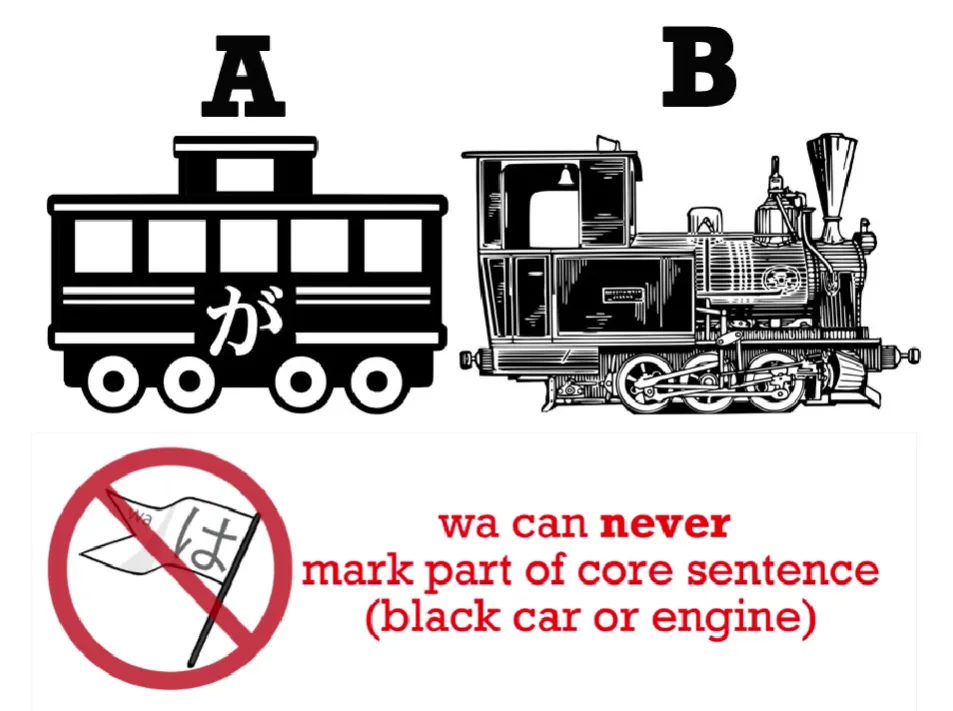
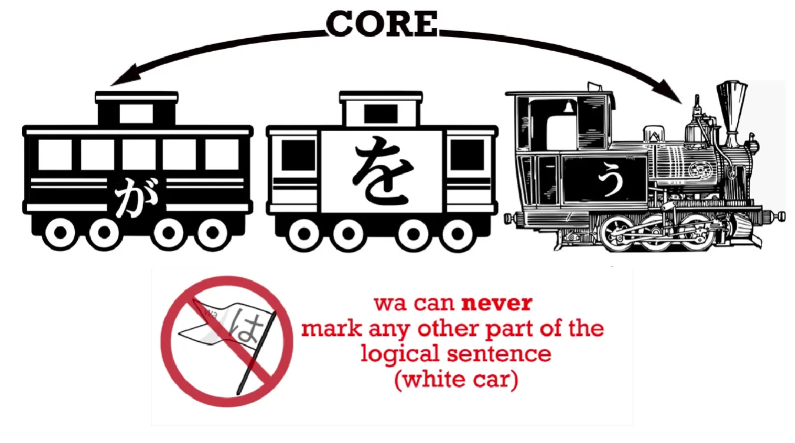
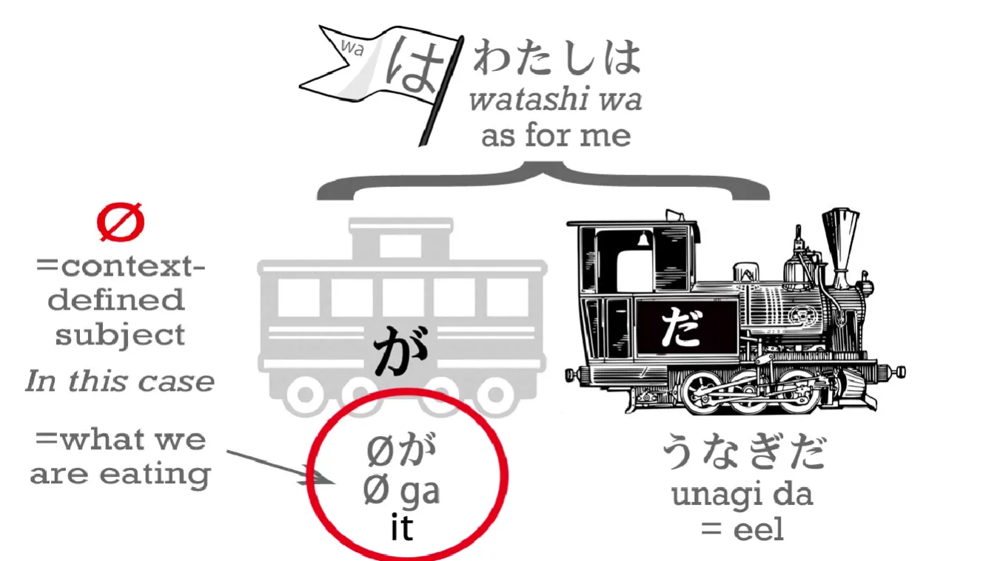
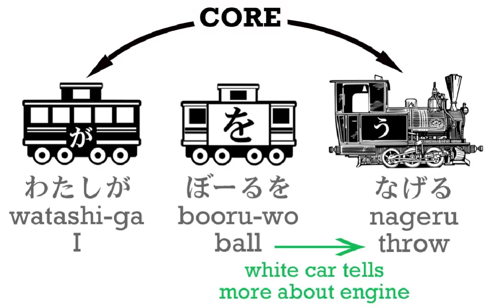
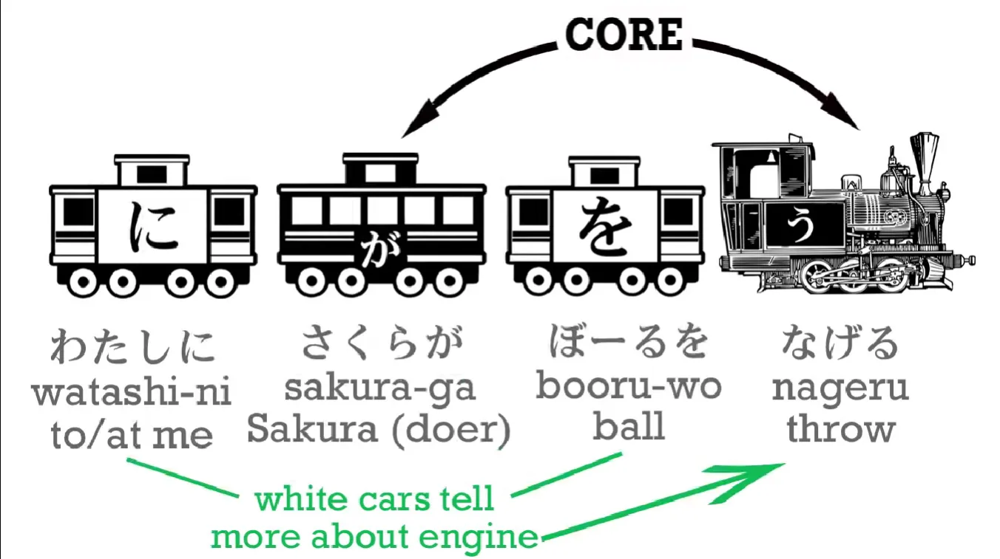
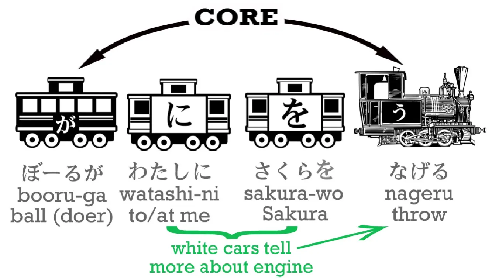
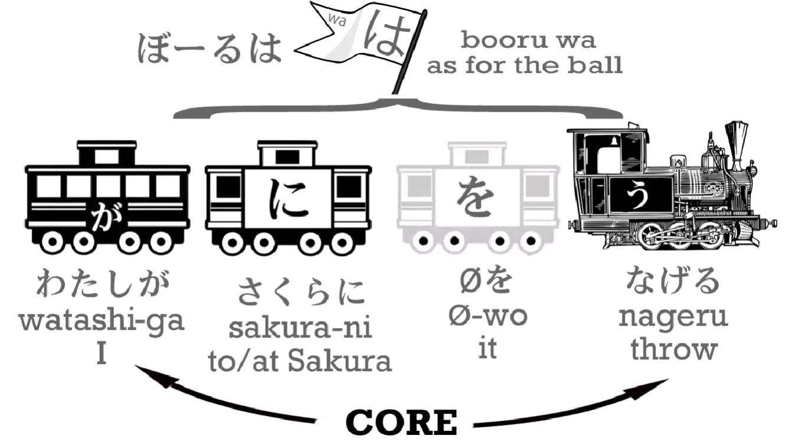

# **3. Частица は**

[**Урок 3: Секреты частицы WA, которым никогда не учат в школах. Как WA может создать или разрушить ваш японский**](https://www.youtube.com/watch?v=U9_T4eObNXg&list=PLg9uYxuZf8x_A-vcqqyOFZu06WlhnypWj&index=3&ab_channel=OrganicJapanesewithCureDolly)

こんにちは。

Добро пожаловать на Урок 3. Некоторые из вас, кто уже изучал японский, возможно, задаются вопросом, как мне удалось провести два целых урока, не используя и даже не упоминая частицу は *(всегда читается как wa)*. Я прекрасно знаю, что большинство курсов начинают с は с самого начала. <code>わたしはアメリカ人だ</code> <code>ペンはあおい.</code> И это на самом деле очень, очень плохая идея, потому что она оставляет вас в полном неведении относительно того, что на самом деле делают частицы, и о логической структуре предложений.

Однако теперь мы готовы рассмотреть частицу は и выяснить, что она делает, и, что не менее важно, чего она не делает. **Частица は никогда не может быть частью ядра предложения. Она никогда не может быть одним из чёрных вагонов**, **главным вагоном А** (тем, о чём мы что-то говорим) **или локомотивом В** (тем, что мы о нём говорим).

**Она также не может быть белым вагоном, потому что белые вагоны, такие как вагон を (wo), являются частью логической структуры предложения.**

**И существительное, отмеченное частицей は, никогда не является частью логической структуры предложения. は — это нелогическая частица.**

Итак, если は не является чёрным или белым вагоном, то что это за вагон? Ну, это вообще не вагон. Существительное, отмеченное частицей は, выглядит так…

Верно, это флаг. Почему мы изображаем его как флаг? Потому что именно это и делает は. **Она помечает что-либо как тему предложения. Она ничего не говорит об этом. Для этого и существует логическое предложение. Wa просто помечает тему.**

Итак, некоторые учебники скажут вам, что предложение вроде <code>わたしはアメリカ人だ</code> буквально означает <code>Что касается меня, я американец</code>, и это абсолютно верно. Если бы они придерживались этой логики и доводили её до конца, у нас не было бы тех проблем, которые у нас есть.

Итак, <code>[私]{わたし}は</code> означает <code>что касается меня</code>. <code>アメリカ人だ</code> означает <code>=американец</code> или <code>являюсь американцем</code>. Как видите, в таком предложении что-то отсутствует, как в японском, так и в английском. Мы не можем сказать <code>что касается меня, являюсь американцем</code>. Мы также не можем иметь предложение без вагона А, без деятеля, отмеченного частицей が. Итак, если мы добавим вагон А, это будет иметь смысл как в английском, так и в японском.

<code>私は<b>(zeroが)</b>アメリカ人だ</code> – <code>Что касается меня, (**я**) американец.</code>

Теперь некоторые из вас могут сказать: «Разве это не слишком сложно? Разве мы не можем просто притвориться, что **わたしは** — это главный вагон предложения?» И ответ на это: <code>**Нет**</code>. Потому что, хотя это работает в этом и некоторых других случаях, это не работает во всех случаях, и именно поэтому мы действительно не должны этого делать.

Давайте рассмотрим пример. Среди изучающих японский язык есть старая шутка, и она возможна только из-за того, насколько плохо преподают японский. Шутка такова: Группа людей обедает в ресторане и обсуждает, что они собираются есть, и кто-то говорит: <code>わたしはうなぎだ</code>. Унаги/うなぎ означает угорь, поэтому шутка в том, что этот человек буквально сказал: <code>Я — угорь</code>.

В конце концов, если <code>わたしはアメリカ人だ</code> означает <code>Я — американец</code>, то <code>わたしはうなぎだ</code> должно означать <code>Я — угорь</code>. Это абсолютно безупречная логика – **за исключением того, что <code>わたしはアメリカ人だ</code> не означает <code>Я — американец</code>. Это означает <code>Что касается меня, я — американец</code>.**

Как мы знаем, значение по умолчанию невидимого вагона, zero-местоимения, — это <code>[私]{わたし}</code>, но это не единственное его значение. Его значение зависит от контекста.

---

В <code>わたしはアメリカ人だ</code> (<code>Что касается меня, я — американец</code>) значение zero-местоимения действительно <code>[私]{わたし}</code>. Но в <code>わたしはうなぎだ</code>, которое является <code>わたしは<b>(zeroが)</b>うなぎだ</code>, zero — это не <code>私</code>. Zero — это <code>это</code>. <code>Это</code> — это то, о чём мы говорим, предмет разговора: что мы едим на ужин.

И это будет влиять на все виды предложений по мере того, как мы будем продвигаться в изучении японского. Итак, что мы сейчас сделаем, так это возьмём ещё один из вагонов, рассмотрим его, а затем посмотрим, как всё это работает вместе с は.

Вагон, который мы представим сегодня, — это белый вагон, и это вагон に (ni). Он образует своего рода трио с が (ga) и を (wo). В предложениях типа <code>А делает В</code>, が говорит нам, кто совершает действие, を говорит нам, над чем оно совершается, а **に говорит нам конечную цель этого действия**. Теперь, у нас не всегда есть を; у нас не всегда есть に.

Но давайте возьмём это を-предложение: <code>わたしがボールをなげる</code>

ボール — это мяч, а なげる означает бросать. Итак, это <code>Я бросаю мяч</code>. Ядро предложения — <code>Я бросаю</code> – <code>わたしがなげる</code>, а белый вагон говорит нам, что я бросил: это был мяч.

Теперь, если мы скажем <code>わたしがボールをさくらになげる</code>, это означает <code>Я бросаю мяч в Сакуру</code> (или <code>Сакуре</code>). **Сакура — это пункт назначения, цель моего броска.**

И **здесь очень важно отметить, что именно логические частицы – が, を и に – говорят нам, что происходит. Порядок слов на самом деле не имеет значения так, как в английском. Важна логическая частица.**

Итак, если я скажу <code>わたしにさくらがボールをなげる</code>, я говорю: <code>Сакура бросает мяч в меня</code>.

Если я скажу <code>ボールがわたしにさくらをなげる</code>, я говорю: <code>Мяч бросает Сакуру в меня</code>. Это не имеет никакого смысла, но мы могли бы захотеть сказать это в фэнтезийном романе или чём-то подобном.

**Мы можем говорить всё, что угодно, на японском, если логика частиц у нас правильная.** Но теперь давайте введём は в это предложение: <code>わたし**は**さくらにボールをなげる.</code> Это <code>わたし**は**(zeroが)さくらにボールをなげる</code>. Как мы знаем, это означает <code>Что касается меня, я бросаю мяч в Сакуру</code>.

Теперь давайте дадим は мячу: <code>ボールは私がさくらに<b>(zeroを)</b>なげる</code>. То, что мы говорим сейчас, это <code>Что касается мяча, я бросаю его в Сакуру</code>.

Важно заметить здесь, что когда мы меняем логическую частицу с одного существительного на другое, мы меняем то, что на самом деле происходит в предложении, **но когда мы меняем нелогическую частицу は с одного существительного на другое – я могу изменить её с меня на мяч – это не влияет на логику предложения. Это влияет на акцент: теперь я говорю о мяче, <code>что касается мяча...</code>**

---

Что происходит с мячом, так это то, что я бросаю его в Сакуру, но кто что делает, и с чем они это делают, и над чем они это делают, **ничто из этого не меняется, когда вы меняете частицу は**, и в этом разница между логической и нелогической частицей.