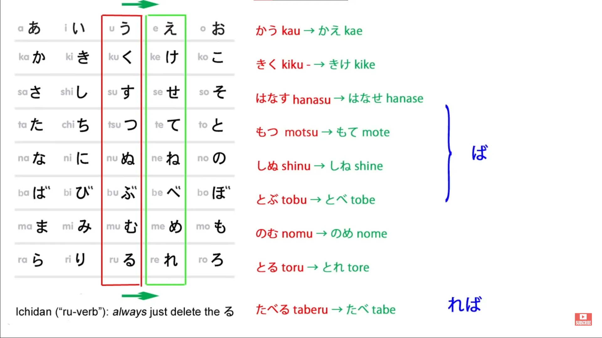
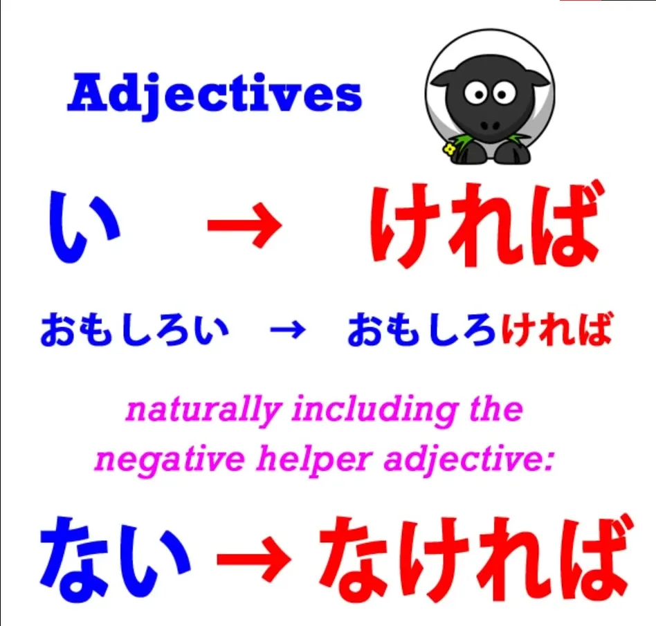
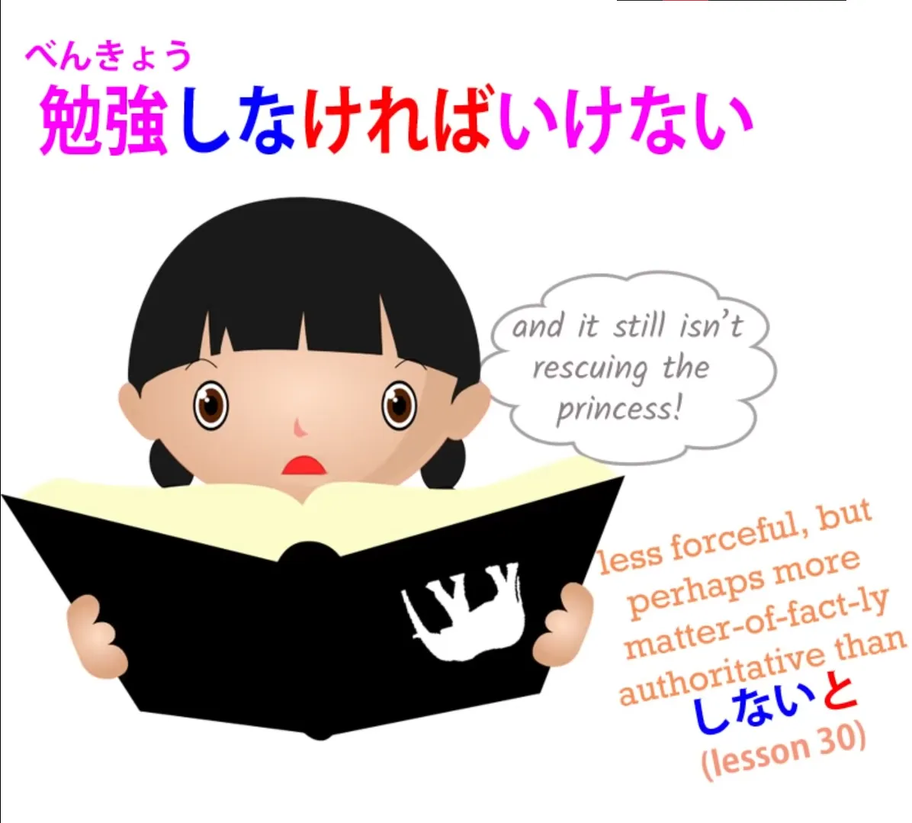
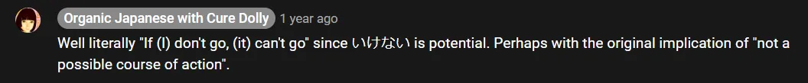
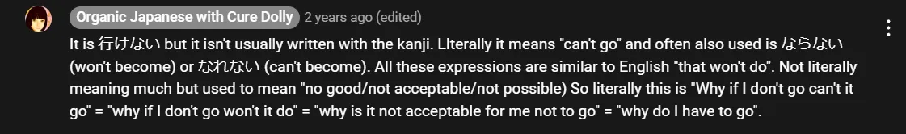

# **31. Условная конструкция ば / れば**

[**Урок 31: Условная конструкция BA. Что она на самом деле означает и как легко ее использовать.**](https://www.youtube.com/watch?v=O81EPCsPUpw&list=PLg9uYxuZf8x_A-vcqqyOFZu06WlhnypWj&index=33&pp=iAQB)

こんにちは。

Сегодня мы поговорим об условной конструкции ば/れば. На прошлой неделе мы рассмотрели условную конструкцию と и увидели, что ее особой характеристикой была ее исключительность, ее подразумевание того, что возможен только один результат. Во многих случаях мы можем использовать любую или большинство условных конструкций, не сильно меняя смысл, но каждая условная конструкция обладает своими особыми качествами.

Итак, сегодня мы рассмотрим особое качество ば/れば и некоторые вещи, которые она делает, а также почему она их делает. Прежде всего, что такое ば/れば? ば/れば — это вспомогательный элемент, который мы добавляем к え-основе глагола.

え-основа — одна из менее часто используемых основ, но ば/れば — одна из тех вещей, которые ее используют. Итак, для глаголов первого спряжения (godan) мы добавляем ее к え-основе, а для глаголов второго спряжения (ichidan), как всегда, мы просто добавляем ее к... мы просто убираем -る и добавляем форму второго спряжения, -れば.

Для двух неправильных глаголов в данном случае они работают точно так же, как обычные глаголы второго спряжения (ichidan). Итак, <code>来る</code> становится <code>来れば</code>, а <code>する</code> становится <code>すれば</code>. На самом деле, <code>来る</code> и <code>する</code>, я бы сказала, по сути являются глаголами второго спряжения (ichidan), но они сильные глаголы второго спряжения.

Сильный глагол — это глагол, который может менять свой гласный звук. В английском языке у нас есть <code>come</code> и <code>came</code>, <code>eat</code> и <code>ate</code>. И <code>来る</code>, и <code>する</code> в некоторых случаях меняют свой гласный звук. <code>来る</code> в отрицательной форме становится <code>こない</code>, <code>する</code> становится <code>しない</code>.

Но в данном случае они вообще не меняют свой гласный звук, так что это очень просто — они просто работают как глаголы второго спряжения (ichidan), которыми они, по сути, и являются. Для прилагательных мы убираем -い и используем вспомогательный элемент -ければ.

Вы могли заметить, что когда мы делаем что-либо с прилагательным, кроме простого удаления -い и добавления того, что мы собираемся добавить, все специфические прилагательные модификации происходят из ряда か-き-く-け-こ. Итак, отрицательная форма прилагательного — это -くない (<code>面白い</code> --> <code>面白くない</code>); прошедшее время — это -かった (<code>面白い</code> --> <code>面白かった</code>); и **условная конструкция ば — это -ければ** (<code>面白い</code> --> <code>面白ければ</code>).

Так что в некотором смысле мы могли бы сказать, что если бы у прилагательных была え-основа, это было бы -け. И это то, что мы используем в этом случае. Итак, какова особая характеристика ば/れば?

-と, как мы знаем, его особая характеристика — это исключительность. Особая характеристика ば/れば заключается в том, что она используется для гипотетических ситуаций. Поэтому она всегда должна означать <code>если</code>. **Она никогда не может означать <code>когда</code>**, потому что мы никогда не знаем наверняка, произойдет ли условие, и, следовательно, если мы используем ее в отношении чего-то, что произошло в прошлом, это должно быть что-то, что не произошло, потому что если бы это произошло, мы бы имели дело не с гипотезой, а с фактом.

Теперь эта гипотетическая природа ば/れば позволяет использовать ее во многих распространенных и очень важных японских выражениях. Например, <code>どうすればいい</code>. Буквально это означает <code>как, если я поступлю, будет хорошо</code>.

И я просто отмечу здесь, что хотя <code>する</code> обычно переводится как <code>делать</code>, во многих случаях лучший способ передать его на русский — это <code>поступать</code> или <code>вести себя</code>. Так, например, если мы говорим <code>静かにする</code>, мы не говорим <code>делать тихо</code>, мы говорим <code>вести себя тихо</code>.

Итак, <code>どうすればいい</code> — <code>как, если я поступлю, будет хорошо</code>. А по-русски мы обычно сказали бы <code>Что мне делать?</code> или <code>Что мне следует делать?</code> Но по-японски мы так не говорим.

Как мы увидим, это отчасти потому, что концепция <code>следует</code> не совсем такая же в японском языке, и ば/れば часто используется для решения этой проблемы. Мы вернемся к этому через мгновение.

Еще одно распространенное использование ば/れば — это в конструкции <code>すればよかった</code>. Например, <code>かさを持ってくればよかった</code>. По-русски мы бы сказали <code>Мне следовало взять зонт</code>.

Что мы на самом деле здесь говорим, так это <code>Если бы я взял зонт, было бы хорошо</code>. <code>持ってくる</code>, как я объясняла в другом месте, мы объединяем слово <code>нести</code> и слово <code>приходить</code>, чтобы получить значение <code>приносить</code> (<code>нести-сюда</code>), и мы замечаем, что <code>よかった</code> переводит это в прошедшее время.

Как вы знаете, в японском языке мы отмечаем прошедшее время в конце логического предложения. Так что, хотя это может быть правдой, что если сейчас идет дождь, то если бы я взял зонт, это было бы хорошо и до сих пор было бы хорошо, мы переводим все это в прошедшее время с помощью этого конечного <code>よかった</code>.

<code>かさを持ってくればよかった</code> — <code>Мне следовало взять зонт / Жаль, что я не взял зонт.</code> Теперь обратите внимание, что в обоих этих случаях, <code>どうすればいい</code> / <code>かさを持ってくればよかった</code>, мы используем эту конструкцию <code>если бы это было сделано, было бы хорошо</code>, чтобы выразить значение <code>следует</code>.

И это происходит снова в еще более распространенной японской конструкции. <code>勉強しなければいけない</code> — <code>Если я не буду учиться, это не пойдет / это не годится.</code> На самом деле здесь мы говорим <code>Я должен учиться</code>.

На самом деле в японском языке нет слова для <code>должен</code>, поэтому мы всегда строим это таким образом. Мы говорим <code>Если я не... (что бы это ни было)</code>, а затем мы можем сказать <code>это не будет хорошо / это будет плохо / это будет катастрофа...</code>

Что бы мы ни сказали, за этим следует какая-то отрицательная конструкция, и то, что мы говорим, это <code>Я должен идти / Мне нужно идти / Я должен сделать это / Я должен сделать то</code>, и это потому, что у нас нет такой конструкции <code>нужно</code> и у нас нет <code>должен</code> в японском языке. Она всегда имеет эту довольно многословную форму «Если я не сделаю, это не будет хорошо / если я не сделаю, это не годится / Если я не сделаю, это плохо» — <code>無ければ / なければダメ</code>.

И поскольку это действительно очень многословный способ сказать что-то обычное, вроде <code>должен</code> или <code>нужно</code>, в повседневной речи это часто сокращается до просто <code>しなければ</code> или даже <code>しなきゃ</code>, что является сокращением от <code>しなければ</code>, без добавления отрицательного окончания, потому что оно просто подразумевается. Однако, даже в очень повседневной речи это часто произносится полностью, и я думаю, это для того, чтобы подчеркнуть природу этого <code>долженствования</code>.

<code>なぜ行かなければいけない?</code> — <code>Почему я должен прийти/идти?</code>
::: info
если это поможет, более дословно что-то вроде <code>Почему если (я) не пойду, (это) плохо/это не годится?</code>
Или, как Долли-сэнсэй говорит в комментариях к 行かなければいけない + что означает это いけない:
:::

В таких случаях, когда мы делаем на этом акцент, в отличие от случаев, когда мы просто небрежно говорим <code>行かなきゃ</code> — <code>Мне нужно идти</code>.

::: info
буквально, возможно, <code>Если (я) не пойду…</code>, отрицание после этого просто подразумевается/не произносится
:::
Итак, это особая характеристика ば/れば: она имеет дело с гипотетическими ситуациями.