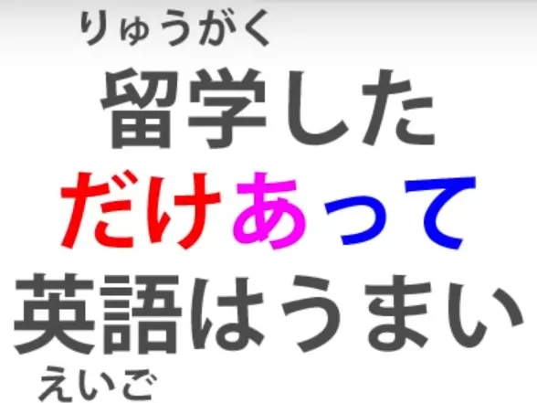
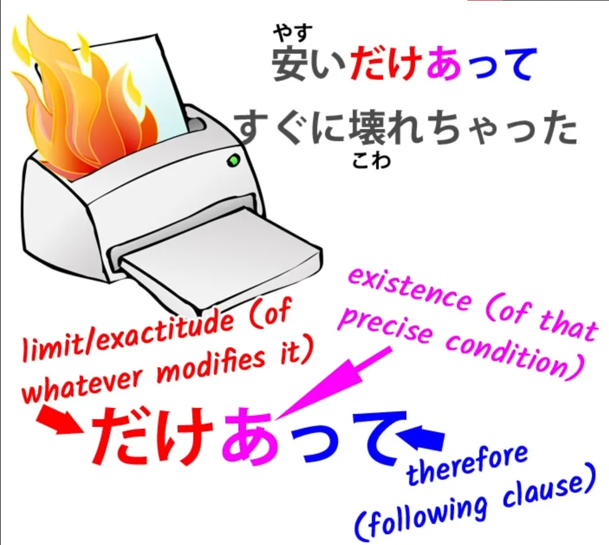
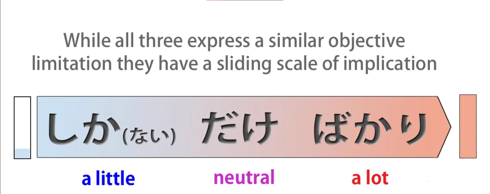

# **33. Ограничительные слова: だけ, しか, ばかり, のみ**

[**Урок 33: だけ, しか, ばかり, のみ: разбираемся в японских ограничительных словах.**](https://www.youtube.com/watch?v=OoJLexUR_o0&list=PLg9uYxuZf8x_A-vcqqyOFZu06WlhnypWj&index=35&pp=iAQB)

こんにちは。

Сегодня мы поговорим об ограничительных словах: <code>だけ</code>, <code>しか</code>, <code>ばかり</code> (мы уже рассматривали <code>ばかり</code> в отдельном видео, но сегодня посмотрим, как оно вписывается в эту тему) и <code>のみ</code>. <code>のみ</code> очень простое, и вам оно всё равно не понадобится, но важно понимать его, когда вы его видите.

Многие находят эти слова запутанными, но это только потому, что их преподают запутанно. Как только вы поймёте, как они на самом деле работают, они покажутся совсем несложными.

## だけ

Итак, давайте начнём с самого базового слова, <code>だけ</code>. <code>だけ</code> означает <code>предел</code>. Нам иногда говорят, что оно означает <code>только</code>, и в своей самой базовой форме выражения, это то, что мы бы перевели как «только».

Однако, при некоторых других его использованиях важно понимать, что на самом деле оно означает <code>предел</code>. Итак, если я говорю <code>千円だけ持っている</code>, я говорю: «У меня есть предел в тысячу иен / Тысяча иен — это предел того, что у меня есть».

<code>だけ</code> — это существительное, и когда мы ставим <code>千円</code> перед ним, мы используем <code>千円</code> как определение к существительному <code>だけ</code>.

Таким образом, мы говорим, что у меня есть предел в тысячу иен, тысяча иен — это всё, что у меня есть. Это достаточно просто. Мы вернёмся к <code>だけ</code> через мгновение.

Теперь давайте посмотрим на <code>しか</code>.

## しか

Итак, <code>しか</code> действительно сбивает людей с толку, и это потому, что им создаётся впечатление, что оно означает более или менее то же самое, что и <code>だけ</code>. А на самом деле оно означает противоположное <code>だけ</code>.

<code>しか</code> означает <code>больше, чем</code>.

И если мы это поймём, мы никогда не запутаемся в <code>しか</code>, потому что оно очень простое. Суть в том, что оно используется только в отрицательных предложениях. Итак, у нас всегда есть <code>ない</code> или <code>ありません</code>, когда мы используем <code>しか</code>, поэтому в итоге оно означает <code>не больше, чем</code>.

И это то, что делает его очень похожим на <code>だけ</code>. Но если мы не осознаём, что оно на самом деле означает <code>больше, чем</code>, мы очень путаемся в том, как оно структурно вписывается в предложение.

Итак, если мы говорим <code>千円だけ持っている</code>, мы говорим, что тысяча иен — это предел того, что у меня есть. Если мы говорим <code>千円しか持っていない</code>, мы говорим, что у меня нет больше тысячи иен. И, как вы видите, это отрицательное предложение, и акцент делается на отрицании.

Это очень похоже на то, что мы могли бы сказать по-английски: мы могли бы сказать <code>I only have a thousand yen</code> / *(<code>千円だけ持っている</code>)* или мы могли бы сказать <code>I don't have any more than a thousand yen</code> / *(<code>千円しか持っていない</code>)*. И вы видите разницу между этими двумя, и разница в японском языке точно такая же.

<code>だけ</code> не подразумевает, что тысяча иен — это много или мало; оно ничего не подразумевает, оно просто говорит, что это то, что у меня есть, и это всё, что у меня есть. <code>I don't have any more than a thousand yen/*千円しか持っていない*</code> делает акцент на том, что этого может быть слишком мало, или что если вы захотите больше, то не получите этого, или что-то в этом роде.

Оно имеет этот отрицательный акцент, потому что мы делаем весь акцент на том, чего у меня нет, а не на том, что у меня есть. И это, в данном контексте, разница между <code>だけ</code> и <code>しか... ない</code>.

И <code>しか... ない</code> также может использоваться в таких обстоятельствах, как <code>にげるしかない</code>. <code>にげる/*逃げる*</code> означает <code>убегать</code> или <code>спасаться</code>; если мы говорим <code>にげるしかない</code>, мы говорим: <code>Ничего не остаётся, кроме как бежать / Нет другого выхода, кроме как бежать</code>.

Итак, точно так же, как <code>千円しかない</code> означает (у меня) нет больше тысячи иен, <code>にげるしかない</code> означает, что нет ничего, что мы можем сделать, кроме как бежать. А теперь давайте вернёмся к некоторым другим использованиям <code>だけ</code>.

## Другие использования だけ

Одно из самых распространённых — это <code>できるだけ</code>, что означает <code>насколько возможно</code> или <code>если вообще возможно</code>. Теперь, видите, в этот момент, если мы думаем о <code>だけ</code> как о значении <code>только</code>, мы можем начать путаться.

Это совершенно другой вид <code>だけ</code>? Нет, это то же самое. <code>できるだけ</code> означает <code>до предела возможности</code>.

<code>できるだけ勉強します</code> — <code>Я буду учиться, если смогу</code> или <code>Я буду учиться столько, сколько смогу</code> / <code>до предела возможности я буду учиться</code>.

::: info
На случай, если кто-то задавался вопросом…

:::

Ещё одно использование, которое вы, безусловно, будете видеть довольно часто, это <code>だけあって</code>. Это <code>あって</code> — это <code>ある</code> — <code>быть</code>. И нам часто говорят, что оно означает что-то вроде <code>не зря</code>.

Итак, <code>留学しただけあって英語はうまい</code>.

И это буквально означает: <code>В силу ограничения, связанного с тем, что она училась за границей...</code> (и «потому что» здесь — это て-форма, которая часто подразумевает причину последующего эффекта) <code>... её английский превосходен</code>. Перевод, который нам дают: <code>Не зря она училась за границей, её английский превосходен</code>.

Но на самом деле здесь говорится: <code>Именно потому, и только потому, что она училась за границей, её английский превосходен</code>. Теперь вы можете подумать, что я придираюсь к мелочам и слишком занудствую по поводу точного значения.

Но давайте возьмём другой пример. <code>安いだけあってすぐに壊れちゃった</code>. Теперь это означает: <code>В силу ограничения, связанного с его дешевизной, оно быстро сломалось</code>.

Теперь, не имело бы никакого смысла здесь говорить: <code>Не зря оно было дешёвым, оно быстро сломалось</code>. На самом деле мы говорим: <code>Именно потому, что оно было дешёвым, оно быстро сломалось</code>.

Это <code>だけ</code> использует ограничительную функцию, чтобы сузить что-то до чего-то точного. Если мы хотим ввести аспект «только», то это работает так: мы говорим: <code>Только благодаря обучению за границей можно так хорошо выучить английский</code>. <code>Только что-то действительно дешёвое сломалось бы так быстро</code>.

Итак, вот как на самом деле работает функция ограничения, «только», у <code>だけ</code>. Мы используем её, чтобы придать точность утверждению: <code>Именно и только из-за этого последовал результат</code>; <code>だけあって</code> — <code>Оно существует из-за этого факта и ограничено им</code>.

Теперь давайте введём <code>ばかり</code>.

## ばかり

<code>ばかり</code>, как мы знаем, также выражает тот же вид ограничений. Оно означает <code>именно такая-то вещь</code>. Итак, давайте сравним его с двумя другими.

Если мы говорим <code>あのお店はパンだけ売る</code>, мы говорим: <code>Этот магазин продаёт только хлеб</code>. Если мы говорим <code>あのお店はパンしか売らない</code>, мы говорим: <code>Этот магазин не продаёт ничего, кроме хлеба</code>.

Если мы говорим <code>あのお店はパンばかり売る</code>, мы снова говорим: <code>Этот магазин продаёт только хлеб</code>, но, как мы знаем из урока о <code>ばかり</code>, мы, скорее всего, имеем в виду, что <code>Этот магазин продаёт ужасно много хлеба</code>. Может быть, даже неправда, что он продаёт только хлеб, потому что <code>ばかり</code> может использоваться гиперболически.

Мы можем сказать <code>東京は外人ばかりだ</code> — <code>В Токио нет ничего, кроме иностранцев</code>, что не означает, так же, как и в английском, что в Токио на самом деле нет японцев. Это означает, что в Токио ужасно много иностранцев. Итак, мы можем расположить эти три на скользящей шкале.

<code>パンしか売らない</code> подразумевает, что продавать только хлеб — это очень мало, этого недостаточно. Возможно, мы хотим что-то, кроме хлеба, но не можем это получить. <code>パンだけ売る</code> не имеет никаких подтекстов. Оно нейтрально.

Это может означать, что магазин специализируется на хлебе и поэтому очень хорош. Это может означать, что мы ничего не можем получить, если хотим что-то, кроме хлеба. Оно не имеет никакого особого подтекста. Оно просто нейтрально говорит, что магазин продаёт только хлеб.

<code>パンばかり売る</code> подразумевает, что там ужасно много хлеба. Тот факт, что оно ограничено хлебом, по сути, подчёркивает, что хлеба там в изобилии до такой степени, что мы могли бы гиперболически сказать, что там нет ничего, кроме хлеба, хотя с <code>ばかり</code> на самом деле это может быть не так.

## のみ

И прежде чем мы закончим, я просто расскажу о <code>のみ</code>. <code>のみ</code> очень простое, потому что всё, что оно означает, это <code>だけ</code> в его простейшем смысле.

Итак, мы говорим <code>パンだけ売る / パンのみ売る</code>. Они оба означают одно и то же. Они означают <code>продаёт только хлеб</code> без какого-либо особого подтекста.

<code>のみ</code> используется в формальных контекстах, в основном используется в письменной речи, и если вы не пытаетесь использовать очень формальный японский, вам оно на самом деле не понадобится. Причина, по которой важно его знать, заключается в том, что, например, если бы вы собирались войти куда-то, а вывеска сообщала бы вам, что допускаются только члены, это могло бы спасти вас от большого смущения, если бы вы знали, что это <code>のみ</code> означает то же самое, что и <code>だけ</code>.

И такой вид вывесок — именно там, где они использовали бы <code>のみ</code>, потому что оно, как правило, используется в таких формальных, официальных контекстах.