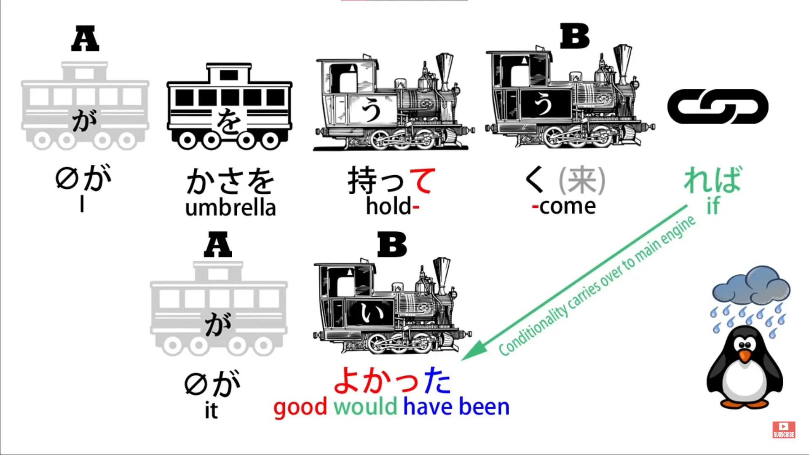
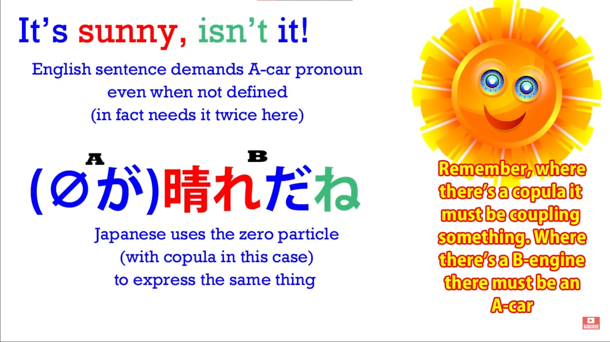
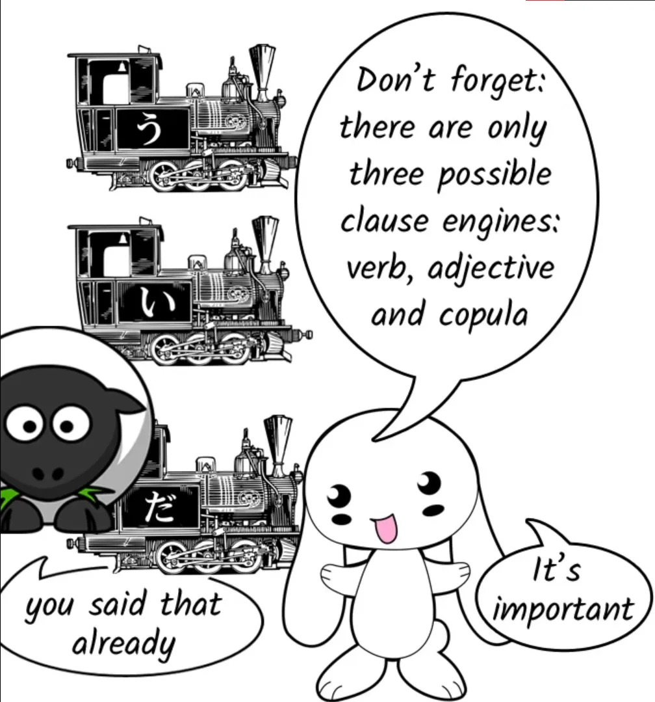
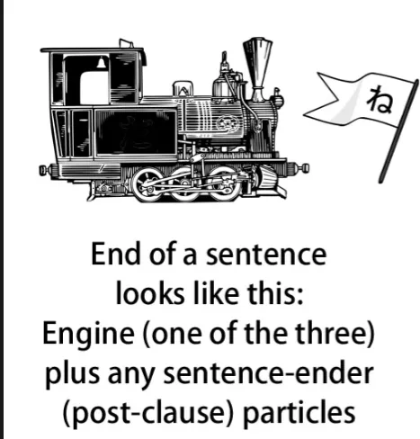
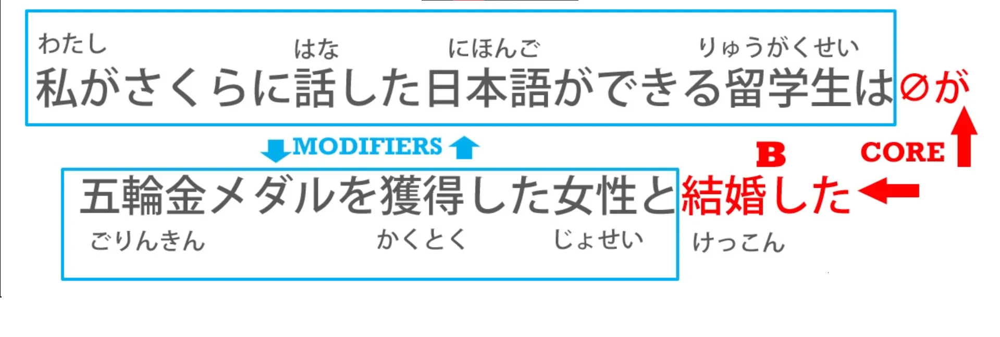

# **34. Поймите любое предложение**

[**Урок 34: Поймите любое предложение. Мощная техника анализа.**](https://www.youtube.com/watch?v=uot49Z85wNs&list=PLg9uYxuZf8x_A-vcqqyOFZu06WlhnypWj&index=36&pp=iAQB)

こんにちは。

Сегодня мы обсудим самую фундаментальную вещь в японском языке. И, если мы это поймём, мы сможем понять любое японское предложение. Если нет, то не сможем. Это действительно настолько фундаментально. И я представила это в нашем самом первом уроке, потому что если у нас этого нет, мы никуда не продвинемся.

Сегодня мы начнём говорить о том, как мы можем применить это к любому японскому предложению, которое встретим в дикой природе. Итак, фундаментальное ядро японского языка, как вы знаете, это ядро японского предложения. Это то, что я называю А-вагоном и Б-локомотивом. Оба этих элемента должны присутствовать в каждом предложении.

Мы всегда можем видеть Б-локомотив. Мы не всегда можем видеть А-вагон, но он всегда там. В английском языке они называются подлежащим и сказуемым, а в японском — [主語]{しゅご} и [述語]{じゅつご}, но мы продолжим называть их А-вагоном и Б-локомотивом, потому что таким образом мы можем визуализировать, что именно происходит в предложении, используя поезда.

Итак, этот урок начинается с вопроса, заданного моим покровителем Gold Kokeshi Пантелисом Хрисафисом-сама (и я надеюсь, что правильно произношу ваше имя). Это был очень простой вопрос, но очень хороший, очень фундаментальный. Он звучал просто: <code>Как мы узнаем, где заканчивается логическое придаточное предложение?</code>

И это, по сути, то же самое, что вопрос <code>Как мы идентифицируем логическое придаточное предложение?</code> Нам нужно знать, где оно заканчивается и где начинается. Факторы, усложняющие это, заключаются в том, что в сложносочинённом предложении может быть более одного логического придаточного предложения (но, как я покажу, это не так уж и сложно, как кажется), а также в том, что мы не всегда можем видеть А-вагон.

Другой усложняющий фактор заключается в том, что мы будем видеть элементы логических придаточных предложений и даже полные логические придаточные предложения, которые не являются частью ядра предложения. И если они не являются частью ядра предложения, то они либо модифицируют, либо сообщают нам больше информации об А-вагоне или Б-локомотиве.

Это единственное, что они могут делать, потому что предложение — это его ядро, и всё остальное в предложении связано с этим ядром и сообщает нам о нём больше. Итак, предложения, в которых есть более одного логического придаточного предложения, должны быть соединены каким-либо союзом. И это очень важно, потому что это даёт нам ключ к пониманию того, есть ли более одного ядра, и если да, то где они находятся и как работают.

В нашей недавней серии уроков о условных формах мы, по сути, имели дело с союзами. Существуют различные виды союзов: and, but, when, if и т.д.

И два других вида союзов, на которые нам нужно обратить внимание, это て-форма, которая может соединять два придаточных предложения в сложносочинённое предложение, как мы рассматривали в нашем первом уроке о сложносочинённых предложениях[[11]](./11-compound-sentences-くれる-あげる-and-more-uses-of-the-て-form.md), и い-основа глагола. Вы видели, как い-основа является главной соединительной основой из четырёх основ глаголов.

Она может соединять существительные с глаголами; она может соединять другие глаголы с глаголами; она может соединять различные вспомогательные слова с глаголами; и она также может соединять одно логическое придаточное предложение с другим. Это немного более литературно, немного более изощрённо, возможно, чем て-форма, но это ещё одна вещь, на которую вам нужно обратить внимание, когда вы исследуете, есть ли в предложении более одного логического придаточного предложения. Мы поговорим об этом подробнее в одном из следующих уроков.

Итак, давайте поговорим об осложнениях, которые могут возникнуть, и о том, как мы можем их преодолеть, как мы можем использовать наши детективные способности, чтобы увидеть, что на самом деле происходит. Я возьму простое условное предложение, которое мы использовали раньше. <code>かさを持って来ればよかった</code>, что означает «Мне следовало взять зонт / Жаль, что я не взял(а) зонт».

Буквально это означает <code>Если бы я взял(а) зонт, было бы хорошо.</code> Итак, мы легко можем увидеть первое логическое придаточное предложение, не так ли? Это <code>かさを持って来れば</code>, что является просто <code>かさを持ってくる</code> — <code>взять зонт</code> — превращённым в его условную форму — <code>если я возьму зонт</code> — и это будет переведено в прошедшее время конечным локомотивом в предложении, что является принципом работы японского языка.

Итак, у нас есть первое придаточное предложение, которое является <code>かさを持って来れば</code>. Мы знаем, что это полное придаточное предложение, и мы знаем, что за ним последует второе придаточное предложение, потому что у нас там есть союз в форме условной конструкции. Но то, что следует за ним, это просто <code>よかった</code>, что является прошедшим временем от <code>いい</code> и означает <code>хорошо</code>.

Это ядро предложения? Да, это так. Первое предложение — <code>かさを持ってくれば</code>; второе предложение — <code>(zeroが)よかった</code>. Мы знаем это, потому что <code>よかった</code> — это локомотив.

Это прилагательное, это описывающее слово, и оно должно что-то описывать. Всякий раз, когда у вас есть прилагательное, прилагательное должно что-то описывать. Всякий раз, когда у вас есть Б-локомотив, должен быть соответствующий А-вагон.

Так что же здесь А-вагон? Что описывает <code>よかった</code>? Что оно говорит нам, что <code>было бы хорошо</code>? Это очень важный момент.

Если мы переведём это на очень буквальный английский, то мы говорим: «If I had brought an umbrella, it would have been good.» И это именно то, что означает японский язык. <code>Это</code> было бы хорошо. А-вагон — это <code>это</code>.

Так что же такое <code>это</code>? Это важный момент: <code>Это</code>, или zero-вагон, не обязательно должно быть чётко определяемым, ни в английском, ни в японском. Что <code>это</code> означает здесь, так это <code>обстоятельство / вещи в целом (были бы хорошими)</code>.

И мы делаем это в японском всё время. И мы делаем это в английском всё время. Так, например, если мы говорим по-английски <code>It's sunny, isn't it!</code> В японском мы могли бы сказать <code>(zeroが)晴れだね!</code>

Они означают одно и то же. В английском мы должны сказать <code>It is sunny</code> — мы могли бы сказать <code>Sunny, isn't it?</code>, но это только потому, что мы опускаем <code>it</code>. И у нас всё ещё есть оно в конце, потому что мы никогда не говорим <code>Sunny, isn't!</code>

Мы говорим <code>Sunny, isn't it!</code>, что должно быть сокращением от <code>It is sunny, isn't it!</code> В японском мы говорим <code>晴れ...</code> (что означает <code>солнечно</code> или <code>ясно</code> в смысле ясного неба): <code>晴れだね!</code> Итак, <code>だ</code> — это связка.

Она должна соединять это <code>晴れ晴れ</code> с чем-то ещё, что является нашей zero-частицей. С чем она это соединяет? Ну, в данном случае мы не знаем.

Это мог бы быть день — <code>The day is sunny</code>. Это могла бы быть погода — <code>The weather is sunny</code>. Это могло бы быть небо — <code>The sky is clear</code> — потому что <code>晴れ</code> также может означать <code>ясно</code> в этом смысле неба.

Это не имеет значения. Не имеет значения ни в японском, ни в английском, что мы подразумеваем под <code>it</code>, когда говорим <code>If I'd brought an umbrella, it would have been good</code> или <code>It is sunny</code>.

Но мы не можем обойтись без этого. Мы не можем обойтись без этого ни в японском, ни в английском. Потому что как в японском, так и в английском у нас должны быть А-вагон и Б-локомотив.

Подлежащее и сказуемое. [主語]{しゅご} и [述語]{じゅつご}. В английском мы всегда должны иметь возможность видеть оба.

В японском нам не нужно видеть первый. Нам нужно видеть второй. Но первый всегда там, и если мы этого не поймём, у нас будут большие трудности с выделением ядра предложения, особенно по мере усложнения.

Итак, чтобы перейти непосредственно к вопросу, как мы находим конец логического придаточного предложения? Итак, главное логическое придаточное предложение, головное придаточное предложение предложения, всегда является последним, и мы можем найти его конец очень легко, потому что конец логического придаточного предложения — это конец предложения.

В японском предложении должно заканчиваться локомотивом, то есть прилагательным, связкой (<code>だ</code> или <code>です</code>) или глаголом. Таким образом, последний локомотив в предложении будет концом головного придаточного предложения предложения, главного конечного придаточного предложения предложения, всегда.

Это будет последнее в предложении, за исключением, возможно, одной или двух частиц-окончаний предложения, таких как <code>よ</code> или <code>ね</code> или <code>よね</code>. Мы называем их частицами-окончаниями предложения, но в некотором смысле было бы точнее называть их частицами, которые идут после конца предложения.

Конечный локомотив — это конец логического предложения, а частицы-окончания — это просто небольшое дополнение, которое мы ставим сразу после конца предложения. Так что очень легко найти конец последнего логического придаточного предложения в предложении или конец всего логического придаточного предложения, если в предложении только одно логическое придаточное предложение.

Более сложный вопрос — но он на самом деле не такой уж и сложный, но вопрос, который может вызвать проблемы, это вопрос о том, как мы находим или как мы исключаем возможность сложносочинённого предложения?

Как мы узнаем, что в предложении нет других логических придаточных предложений, или, если они есть, как мы их находим? И ответ на это снова очень прост и прямолинеен.

Логическое придаточное предложение всегда будет заканчиваться локомотивом: глаголом, существительным, за которым следует связка (<code>だ</code> — за ним не будет следовать <code>な</code>, потому что если связка <code>だ</code> стала <code>な</code>, то это должен быть модификатор, это не может быть само по себе логическое придаточное предложение) — существительным со связкой <code>だ</code>, или прилагательным. И если это придаточное предложение перед конечным придаточным предложением в сложносочинённом предложении, оно будет заканчиваться соединителем.

Оно должно, потому что оно должно соединяться со следующим логическим придаточным предложением. Итак, теперь мы рассмотрим тип сложного предложения, который может сбивать людей с толку, и посмотрим, как мы справляемся с этим предложением.

Итак, предложение: «私がさくらに話した日本語ができる留学生は *(zeroが)* 五輪金メダルを獲得した女性と結婚した» Как видите, это выглядит довольно сложно. Как нам к этому подойти, как нам это анализировать?

Джей Рубин-先生, к которому я отношусь с большим уважением, предлагает, что если мы действительно застряли, нам следует работать с японским предложением в обратном порядке. И в этом есть смысл, потому что японские предложения в определённом смысле и до определённой степени идут в обратном порядке по сравнению с английским предложением.

Однако мы можем делать это только с письменными предложениями. Мы не можем делать это с устными предложениями, потому что люди в большинстве случаев не будут говорить для нас задом наперёд. Однако, я считаю, что одна вещь, которая полезна, если вы чувствуете себя особенно застрявшим с предложением, это убедиться, что у вас в голове есть главный глагол, или главная связка, или главное прилагательное, что бы ни было главным в предложении.

Так что давайте сначала взглянем на это, чтобы знать, куда мы движемся. И главное в этом предложении очень просто, не так ли? Это <code>結婚した</code>.

Главный глагол — это просто <code>した</code> — <code>сделал(а)</code> — но это образует する-глагол с <code>結婚</code>; так что, <code>結婚した</code>. Предложение говорит нам, что кто-то женился/вышел замуж.

Хорошо. Но теперь давайте сделаем то, что, я думаю, мы должны делать, пока можем, и в большинстве случаев мы действительно можем — Начнём с начала. Хорошо.

Итак, первая часть предложения, первое придаточное предложение: <code>私がさくらに話した</code> Итак, это могло бы быть полным логическим предложением само по себе, не так ли? <code>Я поговорил(а) с Сакурой.</code>

Или это могло бы быть <code>Я сказал(а) Сакуре</code>, и в этом случае оно не могло бы быть полным само по себе, не так ли? Потому что я должен(на) был(а) бы ей что-то сказать. Итак, что это в данном случае?

Ну, мы знаем, что это не полное логическое придаточное предложение, <code>Я поговорил(а) с Сакурой.</code> Почему нет? Потому что оно не заканчивается никаким союзом, не так ли?

За ним непосредственно следует существительное, <code>日本語</code>. Нет соединительного слова, нет て-формы, и это не い-основа <code>話す</code>. Так что мы знаем, что это на самом деле модификатор для чего-то другого.

Итак, что у нас дальше? <code>日本語ができる</code> — это означает <code>японский возможен</code>. <code>日本語ができる</code> могло бы быть полным предложением само по себе, не так ли?

<code>Для меня японский возможен.</code> <code>Для меня</code> было бы подразумеваемым, но это нормально, мы так делаем постоянно. Но мы знаем, что это не так, потому что оно не заканчивается никаким союзом.

Так что это также не может быть полным логическим придаточным предложением в сложносочинённом предложении. Это должен быть модификатор для чего-то. И то, для чего мы ожидаем, что это будет модификатор, это человек: человек, для которого японский возможен.

И это именно то, что мы получаем дальше: <code>留学生</code>. <code>留学生</code> — это студент по обмену, обычно из зарубежной страны. Итак, <code>日本語ができる</code> модифицирует <code>留学生</code> — <code>студент по обмену, для которого японский возможен / японоговорящий студент по обмену.</code>

И <code>私がさくらに話した</code> модифицирует всё это. <code>Японоговорящий студент по обмену, о котором я рассказал(а) Сакуре</code> А затем за этим следует は.

Итак, <code>留学生は</code> указывает, что очень вероятно, не так ли, что это будет тема предложения и что тема предложения будет деятелем, А-вагоном предложения. Но давайте продолжим предложение и посмотрим, так ли это.

Теперь у нас есть <code>五輪金メダル</code>, и это означает олимпийская золотая медаль. <code>五輪</code> означает <code>пять колец</code>.

<code>五輪金</code> — что есть золото — <code>メダル</code> — олимпийская золотая медаль — <code>を獲得した</code>. Теперь это не, это не может быть логическим предложением, потому что это не логическое предложение, не так ли?

Это не логическое предложение без деятеля, и здесь не подразумевается никакого деятеля. Но у нас есть деятель сразу после, не так ли?

Итак, мы знаем, что здесь у нас модификатор для другого существительного, а не логическое предложение само по себе: <code>五輪金メダルを獲得した女性</code>. Итак, теперь у нас есть ещё одно модифицированное существительное: <code>Женщина, которая выиграла олимпийскую золотую медаль</code>.

И теперь мы подошли к главному глаголу предложения: <code>-と結婚した</code>.
::: info
об этом と*

:::

Итак, мы были правы. *(о предположении с は)* У нас есть А-вагон, который является студентом по обмену *(в предложении это было бы более конкретно zeroが после <code>留学生は</code>, что подразумевает упомянутого студента по обмену, то есть невидимое подлежащее, так что подлежащее здесь также является темой)*, который может говорить по-японски, о котором я рассказал(а) Сакуре, женился/вышла замуж *(Б-вагон — сказуемое)* на женщине, которая выиграла олимпийскую золотую медаль.

И, как видите, в этом предложении происходит множество различных действий; у нас есть различные вещи, которые при других обстоятельствах могли бы образовывать свои собственные логические придаточные предложения, но ни одна из них на самом деле не может. Теперь мы знаем, что это не сложносочинённое предложение.

Это одно довольно сложное предложение с одним А-вагоном *(zeroが = 留学生)* и одним Б-локомотивом *(結婚した).* Логическое придаточное предложение заканчивается либо в конце предложения, либо перед союзом.

И если вы сможете это сделать, вы сможете проанализировать практически любое японское предложение, каким бы сложным оно ни выглядело, и увидеть, что происходит в предложении.

::: tip
если всё ещё непонятно, рекомендую прочитать комментарии под этим **[видео](https://www.youtube.com/watch?v=uot49Z85wNs&list=PLg9uYxuZf8x_A-vcqqyOFZu06WlhnypWj&index=38&ab_channel=OrganicJapanesewithCureDolly).** При большом количестве входных данных мозг в конечном итоге должен всё рассортировать, но это требует работы и времени. Долли просто готовит вас к этому погружению. На этом этапе вы, возможно, захотите медленно начать с входных данных, если ещё не начали, вместе с грамматикой Долли. Закончив с транскрипцией, обращайтесь к ней, когда столкнётесь с чем-то непонятным или захотите повторить, но понятные входные данные/<code>погружение</code> — это ключ **([как сама Долли отстаивала](https://learnjapaneseonline.info/2015/07/01/japanese-immersion-why-massive-input-is-necessary/))**. Таким образом, вы будете готовы сразу же применять материал из Уроков 45-48.
Но это зависит от вас, было бы хорошо подготовить инструменты и т.д. сейчас, по крайней мере, и начать после 45-го урока.
Как упоминалось на первой странице, я написала длинный документ — [**ССЫЛКА ЗДЕСЬ**](https://docs.google.com/document/d/1kxYa53a2UjnpMZyHdU-YNuctkq6wHT3cJ00Z5poj2hY/edit#) — содержащий мои самые любимые сайты, на которых есть сотни чрезвычайно полезных и разнообразных ресурсов, советов, руководств, инструментов и всего необходимого для глубокого погружения в японский язык, что вы можете найти в некоторой степени полезным.
:::