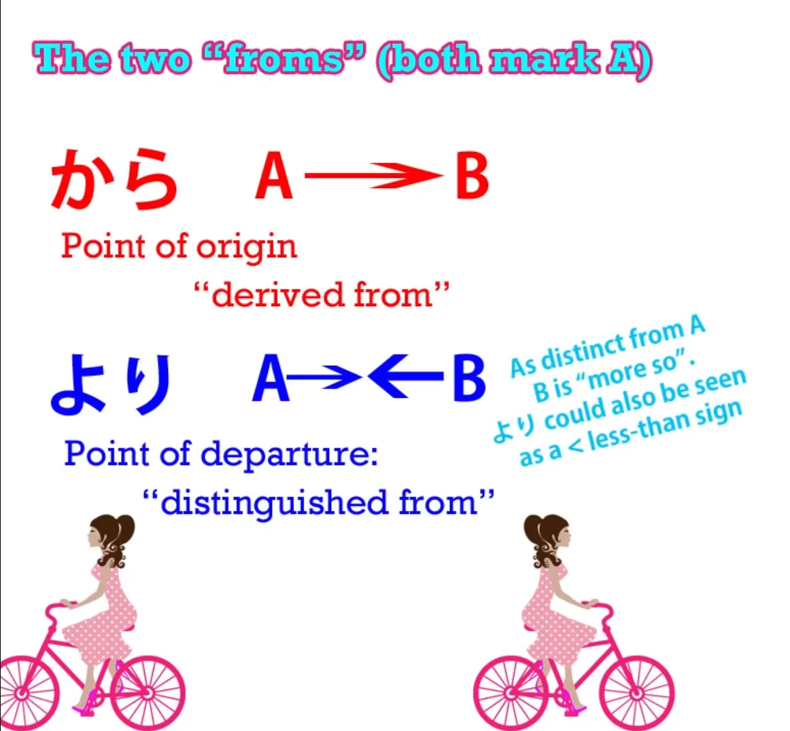
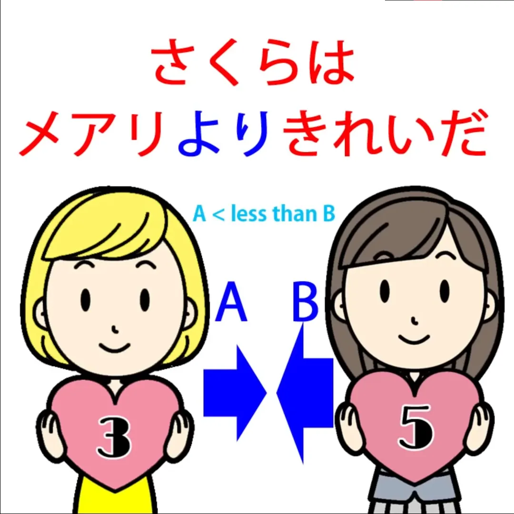
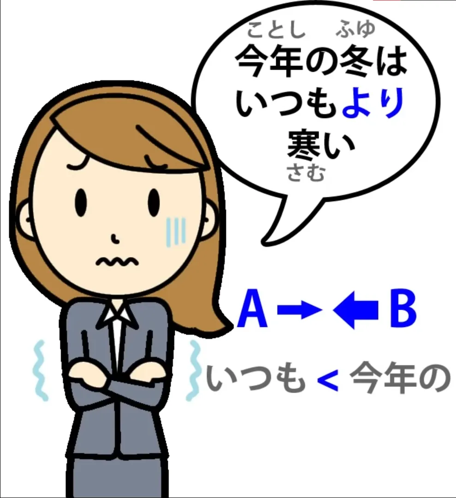

# **35. より, のほう, 一方**

[**Урок 35: より, のほう, 一方 — как они обретают смысл!**](https://www.youtube.com/watch?v=ma1yZwt1XAc&list=PLg9uYxuZf8x_A-vcqqyOFZu06WlhnypWj&index=37&pp=iAQB)

こんにちは。

Сегодня мы поговорим о <code>より</code> и <code>ほう</code>. Часто <code>より</code> и <code>ほう</code> вводятся вместе в предложениях вроде: <code>メアリよりさくらのほうがきれいだ</code>. И это немного многословный способ сказать <code>Сакура красивее Мэри</code>.

Я думаю, это неудачный способ введения этих двух терминов, потому что он легко может вызвать путаницу. Может быть трудно понять, какой термин что делает и как они соотносятся с остальной частью предложения. Гораздо проще, если мы рассмотрим эти два отдельных и независимых термина, каждый из которых важен сам по себе, по отдельности, а затем мы сможем объединить их.

Итак, давайте начнём с <code>より</code>.

## より

<code>より</code> — это частица. Это не одна из наших логических частиц, поэтому она не обязательно должна быть прикреплена к существительному. Она может стоять почти после чего угодно: полного логического предложения, существительного, прилагательного, глагола — чего угодно.

Её основное физическое значение — <code>от</code>. Когда мы отправляем письмо, мы можем сказать <code>さくらより</code> — <code>от Сакуры</code>. И все абстрактные слова имеют свою основу в физических метафорах, даже если мы иногда забываем физическую метафору, и с такими словами полезно начать с понимания изначального буквального значения, а затем увидеть, как работает метафора.

Итак, <code>yori</code> означает <code>от</code>, и у нас уже есть другое слово, означающее <code>от</code>, не так ли? И это <code>から</code>.

Между ними есть разница, которая особенно выражена, когда мы начинаем применять их метафорически. <code>から</code> отмечает А в конструкции <code>А от Б</code> таким образом, что оно рассматривает А как начальную точку или точку происхождения.

Итак, если я говорю <code>日本から来ました</code>, я говорю <code>Я приехал(а) (или приезжаю) из Японии / Япония — моя точка происхождения</code>. И это в некотором роде находится на полпути между буквальным, физическим значением и метафорическим значением, потому что это может буквально означать, что я только что прилетел(а) на самолёте из Японии, или это может подразумевать, что я японец/японка, или что я вырос(ла) в Японии, или что-то в этом роде.

Когда мы переходим к его чисто метафорическому значению, оно обычно означает <code>потому что</code>. Другими словами, А является точкой происхождения Б. <code>寒いからコートを着る</code> — <code>Потому что (холодно), я ношу пальто</code> / <code>Исходя из того, что холодно, я ношу пальто</code>.

Теперь <code>より</code> означает <code>от</code> в совершенно другом смысле. Направленная метафора концентрируется не на происхождении А от Б, а на расстоянии или различии А от Б. Итак, если мы говорим <code>さくらはメアリよりきれいだ</code>, мы говорим, что <code>от Мэри</code> Сакура красива.

Под этим мы подразумеваем, что, отличаясь от Мэри, Сакура красива. У этого есть что-то общее с <code>から</code>, потому что мы всё ещё используем Мэри как базовую точку, точку сравнения.

И из-за этого, поскольку оно имеет сравнительное значение, мы **не** говорим, что Сакура красива, а Мэри нет. Мы говорим, что, принимая Мэри за точку сравнения, Сакура красива — следовательно, более красива, красивее.

В сравнении с Мэри, исходя <code>от</code> Мэри, Сакура красива. И вы заметили, что мы сказали именно то, что говорило то первое предложение, <code>メアリよりさくらのほうがきれいだ</code>, и нам не понадобилось <code>ほう</code>.

Оно прекрасно работает, чтобы сказать то же самое без этого <code>ほう</code>. И мы используем <code>より</code> в других контекстах.

Например, мы можем сказать <code>今年の冬はいつもより寒い</code>, что буквально означает <code>Сравнивая с всегда, зима этого года холодна</code> или <code>Зима этого года холоднее, чем всегда</code>.

И на самом деле это означает <code>Зима этого года холоднее обычного, холоднее большинства других лет</code>. Так что это <code>всегда</code> — своего рода гипербола, в некотором смысле.

Аналогично, мы можем сказать <code>さくらは人より賢い(かしこい)</code> — <code>Сакура умна по сравнению с людьми</code>. И это снова означает: <code>Сакура умна по сравнению с большинством людей / Сакура умна по сравнению с людьми в целом</code> — другими словами, она умнее <code>чем</code> среднестатистический человек.

Хорошо, теперь давайте посмотрим на <code>ほう</code>.

## ほう

<code>ほう</code> совершенно другое. Это не частица, это существительное. Вот почему у нас есть <code>のほう</code>. И его буквальное значение — <code>направление</code> или <code>сторона</code>.

И когда мы говорим <code>сторона</code>, мы имеем в виду <code>сторону</code> в смысле <code>направления</code>, а не в смысле <code>края</code>.

Так, например, если мы говорим о двух сторонах поля с <code>ほう</code>, мы не имеем в виду два края поля, мы имеем в виду, что мы делим его примерно пополам и говорим о <code>левой стороне</code> и <code>правой стороне</code> поля. Как мы видим из этой аналогии, одна сторона всегда подразумевает другую сторону.

И это важно в отношении <code>ほう</code> в его метафорических применениях. В его буквальном использовании, когда я еду на велосипеде в Японии, я могу сказать незнакомцу, указывая в направлении, куда я еду: <code>それは本町の方向ですか?</code>

И это означает <code>Это направление Хонмати?</code>

Я не спрашиваю указания по маршруту, которые я не могу понять ни на английском, ни на японском, ни на каком-либо другом языке. Я спрашиваю буквальное направление: <code>Хонмати в ту сторону, или я еду в противоположном направлении?</code> — что часто бывает, потому что я <code>[方向音痴]{ほうこうおんち}</code>, что означает, что у меня нет чувства направления.

Итак, когда мы применяем это метафорически, мы имеем в виду одну вещь или обстоятельство или что-то ещё в противоположность другому. Мы можем поставить его после существительного с <code>の</code>, как мы делаем с Сакурой: <code>さくらのほう</code>, или мы можем поставить его после глагола или прилагательного, и в этом случае этот глагол или прилагательное описывает <code>ほう</code>, говоря нам, что это за <code>ほう</code>, какая это <code>сторона</code>.

Итак, если вы скажете мне <code>メアリがきれいだと思う?</code> — <code>Ты думаешь, Мэри красива?</code> — и я отвечу <code>さくらのほうがきれいだ</code>, я говорю <code>Сторона Сакуры красива</code> — другими словами, я думаю, Сакура красивее.

Опять же, это сравнительная конструкция, поэтому я не говорю, что Сакура красива, а Мэри нет, но я говорю, что сторона Сакуры красивее, чем другая сторона, которая является Мэри. И, опять же, давайте заметим, что нам не нужен <code>より</code> здесь.

<code>さくらのほうがきれいだ</code> прекрасно работает само по себе, чтобы означать то же самое. И очень часто вы будете видеть либо <code>より</code>, либо <code>のほう</code> по отдельности.

Мы иногда используем их вместе, и когда мы это делаем, мы либо говорим довольно формально, либо действительно пытаемся подчеркнуть суть различия и сравнения между двумя.

## 一方 (いっぽう)

Ещё один случай, когда мы видим <code>ほう</code>, это выражение <code>一方</code>, что означает <code>одна сторона</code>. И мы можем видеть, что это часто используется в повествовании, иногда прямо в начале предложения — не просто предложения, но абзаца, и даже целого раздела истории.

И то, что оно делает, когда мы так поступаем, это по сути говорит то, что мы имеем в виду на английском, когда говорим <code>meanwhile</code>. Но мы не должны говорить, что <code>一方</code> означает <code>meanwhile</code>, потому что это не так.

<code>Meanwhile</code> — это временное выражение. Оно говорит <code>в то же время</code>. <code>一方</code>, выполняя ту же функцию, делает это совершенно по-другому.

То, что мы говорим, когда произносим <code>一方</code>, прежде чем перейти к чему-то ещё, на самом деле отсылает к тому, о чём мы говорили раньше, что бы это ни было. И мы говорим: <code>Всё это была одна сторона; а теперь мы посмотрим на другую сторону</code>.

Это как <code>でも</code>, которое завершает всё, что было до этого, с помощью <code>で</code>, которое является て-формой от <code>です</code> – <code>всё, что было, всё, что существовало</code> — <code>も</code> даёт нам противопоставительный союз: <code>でも</code> — <code>но</code>. И мы говорили об этом в другом видеоуроке, не так ли?
::: info
Это видео не является частью этой серии грамматических транскрипций, но это **[вот это видео](https://www.youtube.com/watch?v=00nKUtmnzvI&ab_channel=OrganicJapanesewithCureDolly).**
:::
<code>一方</code>, вероятно, строго говоря, должно быть <code>一方で</code>; однако, поскольку это распространённое выражение, как это часто бывает с распространёнными выражениями, нам разрешено опускать эту связку.

Итак, если мы говорим, что Король Купа (это Боузер) завершал свои приготовления к свадебной церемонии с Принцессой Пич, а затем мы говорим <code>一方</code> Марио прыгает по блокам на пути к спасению принцессы. Так что с одной стороны, это то, что происходит с Боузером в Замке Боузера; с другой стороны, это то, что происходит с Марио в Грибном Королевстве.

Мы также можем использовать <code>一方</code> в качестве союза. И по сути это работает так же, как <code>一方</code>, которое означает <code>тем временем</code>.

Оно берёт одну сторону, а затем другую сторону, так что это противопоставительный союз. Так мы можем сказать <code>この辺りは静かな一方で不便だ</code> — <code>Здесь тихо, но неудобно / с одной стороны, здесь тихо, но неудобно</code>.

Буквально это <code>この辺りは静かな</code> (что, конечно, является <code>静かだ</code> в его соединительной форме) .. <code>эта область тихая</code> — и всё это является дескриптором для <code>一方</code>: <code>静かな一方</code>. <code>Одна сторона в том, что здесь тихо</code>.

Итак, мы описываем одну сторону, <code>一方で</code>, а затем <code>で</code>, это связка — <code>Одна сторона в том, что здесь тихо, а другая сторона...</code> (но мы на самом деле не говорим «но другая сторона в том, что», это уже подразумевается) — <code>Одна сторона в том, что здесь тихо, это неудобно</code>. И это <code>一方で</code> действует как союз.

И мы можем, опять же, опустить связку здесь.

---

Ещё одно использование <code>一方</code>, которое мы должны упомянуть, заключается в том, что оно также может использоваться после полного глагольного придаточного предложения, чтобы показать, что что-то происходящее продолжается в одном направлении.

Например, мы можем сказать <code>この村の人口が減る一方だ</code> — <code>Население этой деревни просто сокращается и сокращается / ... просто продолжает сокращаться</code>. <code>この村の人口が減る</code> означает <code>Население этой деревни сокращается</code>, и <code>一方</code> говорит нам, что оно просто продолжает двигаться в этом одном направлении: оно никогда не растёт, никогда не стоит на месте, просто сокращается и сокращается.