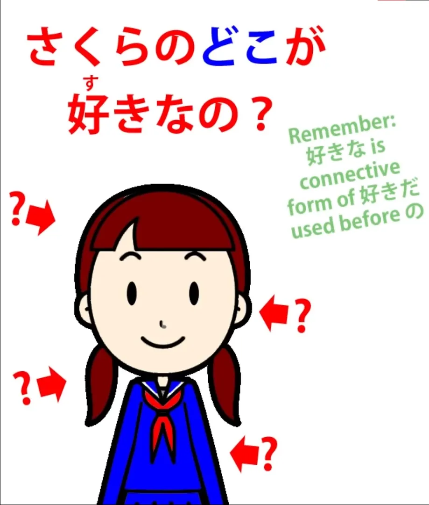

# **36. 所 — концепция <code>места</code>**

[**Урок 36: ところ — японская концепция места — Магия грамматики**](https://www.youtube.com/watch?v=z2cgY9o-cO0&list=PLg9uYxuZf8x_A-vcqqyOFZu06WlhnypWj&index=38&pp=iAQB)

こんにちは。

Сегодня мы поговорим о концепции <code>места</code> в повседневном японском языке, потому что это то, что часто сбивает людей с толку, и я видела, как даже довольно хорошие переводчики-любители ошибались в этом. Слово для <code>места</code> в японском языке, конечно же, <code>[所]{ところ}</code>, и мы изучаем его довольно рано.

Оно означает буквальное место и быстро приобретает слегка метафорические значения. Например, мы можем сказать <code>私のところ</code>, что означает «моя квартира или дом / место, где я живу». <code>Приходите потусоваться у меня.</code>

В английском это не означает <code>hang out</code> в смысле <code>высунуться из окна</code>. Это означает... о, забудьте, английский слишком сложен. Однако в японском переносное значение <code>места</code> заходит гораздо дальше, чем в английском.

Например, если я скажу <code>さくらのどこが好きなの?</code>

::: info
Цитируя Долли-сэнсэй в комментариях: «どこ означает то, что оно всегда означает: <code>какое-место?</code> Я просто демонстрировала использование метафоры <code>места</code> в более абстрактных областях. Если вы снова посмотрите на предложение, вы увидите, что если бы どこ означало просто <code>место</code>, это не имело бы смысла...»
:::

Итак, если я спрошу это, я не ожидаю ответа вроде <code>Мне нравится её левое ухо.</code> Подходящим ответом может быть что-то вроде <code>やさしいだ</code> — «Она нежная / Что мне в ней нравится, так это то, что она нежная / Место, которое мне в ней нравится, это то, что она нежная».

И мы могли бы сказать <code>This is, in my opinion, Sakura's いいところ'</code> — «Хорошее место Сакуры или одно из хороших мест Сакуры». Так что <code>место</code> здесь не означает ничего, даже отдалённо похожего на физическое местоположение.

Оно означает аспект чего-либо, даже чего-то очень абстрактного, например, личность человека. Если я слушаю сложную лекцию, кто-то может спросить меня <code>分かりましたか?</code> — <code>Вы поняли?</code> — и я могу ответить <code>分かるところがあったが分からないところもありました</code> — <code>Были места, которые я понял(а), и места, которые я не понял(а).</code>

И здесь, как вы видите, это ближе к тому, как мы могли бы использовать это в английском: <code>Я в основном понял(а), но были места, которые я не понял(а).</code> Это может привести к тонкому недопониманию, поскольку то, что я, скорее всего, говорю по-японски, это не то, что были моменты во время лекции, когда я не понимал(а), а то, что были аспекты или тонкости, которые я не совсем улавливал(а).

Итак, особенно если вы более продвинуты, хорошо быть в курсе этой метафорической глубины концепции <code>места</code>. Теперь <code>место</code> также часто используется для обозначения места не в пространстве, а во времени.

И если мы поймём эту аналогию, мы сможем понять определённые способы использования, которые часто объясняются без объяснения их структурной основы, что в конечном итоге просто даёт вам список вещей для запоминания и, как обычно, говорит: «Ну, это сочетается с этим и означает то, и мы не знаем почему». Итак, например, мы можем использовать <code>ところ</code> — <code>место</code> — с предложениями типа <code>А делает Б</code> во всех трёх временах, то есть в прошедшем, настоящем и будущем.

Итак, например, если мы скажем, используя простую словарную форму слова <code>食べる</code> — <code>есть</code> (которое, как мы знаем из нашего урока о временах, по умолчанию не является настоящим; оно по умолчанию является будущим). Если мы скажем <code>昼ご飯を食べるところだ</code>, то мы говорим <code>Я как раз собираюсь пообедать.</code>

Какова структура этого? Ну, оно заканчивается на <code>だ</code>, поэтому мы знаем, что у нас есть предложение типа <code>А есть Б</code>, хотя исходное предложение, вложенное в него, является предложением типа <code>А делает Б</code>.

Итак, мы говорим, что <code>(что-то) есть место</code>. Zero-вагон здесь — это <code>оно</code>, как и в английском, и это означает настоящее время, точно так же, как в английском, когда мы говорим <code>It's time to leave</code> — <code>настоящее время есть время уходить</code>.

<code>Оно</code> — это <code>настоящее время</code> как в японском, так и в английском в этих конструкциях. Итак, мы говорим <code>Оно (настоящее время) есть время, когда я пообедаю</code>, так что это означает <code>Я как раз собираюсь пообедать</code>.

Итак, то, как добавление <code>ところだ</code> к этому предложению меняет его значение по сравнению с тем, что оно означало бы, если бы мы просто сказали <code>昼ご飯を食べる</code>, заключается в том, что оно говорит нам, что мы прямо сейчас находимся в том месте, где я собираюсь пообедать, следовательно, я как раз собираюсь пообедать. НЕ <code>Я собираюсь пообедать, возможно, через полчаса.</code>

Я как раз собираюсь пообедать прямо сейчас. Это то место, где я как раз собираюсь пообедать. <code>昼ご飯を食べるところだ.</code>

Теперь, если мы используем это с фактическим настоящим, длительным настоящим, которое мы используем, когда фактически говорим, что делаем что-то прямо в этот момент, то мы говорим <code>昼ご飯を食べているところだ</code>, что мы говорим, это <code>Я ем обед прямо сейчас.</code> И, как и в предыдущем примере, то, что делает <code>ところだ</code>, это делает его немедленным.

Это разница в английском между <code>I'm eating lunch</code> и <code>I'm eating lunch right now.</code> Теперь, в прошедшем времени, если мы скажем <code>昼ご飯を食べたところだ</code>, то мы говорим <code>Я только что пообедал(а).</code>

<code>ところだ</code> добавляет к этому прошедшему времени немедленность: «Место во времени, где мы сейчас находимся, это место, где я пообедал(а) / Я только что пообедал(а)». Теперь, в этом случае мы могли бы сказать <code>昼ご飯を食べたばかり</code> — <code>Я только что пообедал(а).</code>

Эти два выражения означают примерно одно и то же. И я видела учебники, которые дают нам такой набор правил: «Вы можете использовать ばかり с существительным.

Вы можете сказать <code>このお店はパンばかり売る</code> — <code>Этот магазин продаёт только хлеб</code> — или мы можем сказать <code>昼ご飯を食べたばかりだ</code> — <code>Я только что пообедал(а).</code> Но вы должны помнить, что правила гласят, что <code>ところ</code> нельзя использовать с существительным».

Теперь, это правда, но это странно абстрактный способ изложения. Это излагается так, будто это просто какие-то случайные правила, которые кто-то придумал, возможно, в эпоху Хэйан, потому что им нечем было заняться.

На самом деле, если мы понимаем логику этого, нам даже не нужно об этом говорить, потому что это очевидно. Я могу сказать либо <code>Я только что пообедал(а)</code>, либо я могу сказать <code>Я нахожусь в том месте, где я пообедал(а)</code>.

Мы можем сказать <code>Этот магазин просто продаёт хлеб</code>, но <code>этот магазин хлеб место продаёт</code> не имеет никакого смысла, не так ли? *(あのお店はところ売る = неправильно)* И вот почему я считаю, что так важно изучать структуру.

Люди иногда говорят мне: «Должен ли я прорабатывать всю эту структуру, которую вы преподаёте, в каждом предложении, которое я говорю или читаю?» И, конечно же, ответ на это — <code>Нет</code>.

Что вы должны делать, так это привыкать к японскому языку, читая, слушая и, желательно, говоря тоже. *(=Важность погружения, заявленная прямо здесь (๑˃̵ᴗ˂̵))* Если вы этого не делаете, вы никогда не привыкнете к грамматике, сколько бы учебников вы ни изучали.

Но если вы понимаете структуру, вас не будут сбивать с толку такие вещи, как то, можно ли использовать <code>ところ</code> с существительным или нет, и почему нельзя использовать <code>ところ</code> с существительным, когда можно использовать <code>ばかり</code> с существительным, и вам не придётся всё это обдумывать. Вам не нужно этого делать, потому что вы понимаете, как это на самом деле работает.

Вот что учебники могли бы полезно преподавать, но они этого не делают. Теперь, изучив структуру, также важно знать о случаях, когда части структуры могут быть опущены.

Как и во многих обычных устойчивых выражениях, связка <code>だ</code> может быть опущена, и более того, даже конец <code>ところ</code> может быть опущен. <code>ろ</code> может быть опущено, и мы можем просто сказать <code>とこ</code>.

Так обстоит дело во всех языках: есть места, где в разговорной речи мы можем опускать части. И пока мы знаем, какова структура, понять пропуски тоже не очень сложно.

Итак, мы могли бы сказать <code>名古屋/なごやに着陸したとこ</code> — <code>Я только что приземлился(лась) в Нагое.</code> И мы часто используем эти сокращения, такие как <code>とこ</code> — опуская <code>ろ</code> и <code>だ</code> из <code>ところだ</code> — когда мы пытаемся выразить чувство немедленности.

Но люди делают это в различных случаях, точно так же, как они делают эквивалентные вещи в английском. Итак, мы видим, что <code>ところ</code> может быть буквальным, <code>местом в пространстве</code>.

Оно может выражать очень абстрактные понятия, такие как <code>аспект чьей-либо личности</code>, и очень часто может означать <code>место во времени</code>. И оно может использоваться различными способами как место во времени; например, если кто-то говорит <code>いいところに来たね?</code>

Это, скорее всего, будет означать <code>Вы пришли вовремя, не так ли?</code> НЕ <code>Вы пришли в хорошее место, не так ли?</code> хотя на самом деле это может означать и то, и другое.

Помните, что в японском языке контекст — король.