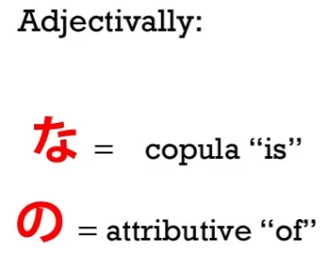
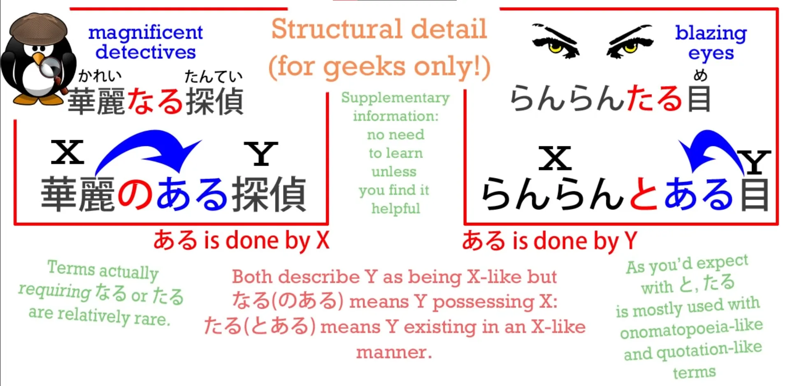

# **37. Новые секреты структуры + な vs の, なる & たる прилагательные**

[**Урок 37: Доминируйте над японским текстом! Новые секреты структуры + <code>na vs no, naru & taru adjectives</code>**](https://www.youtube.com/watch?v=GB8fWjQuz9A&list=PLg9uYxuZf8x_A-vcqqyOFZu06WlhnypWj&index=39&pp=iAQB)

こんにちは。

Сегодня мы немного углубимся в структуру японского языка. Но, возможно, неожиданно, это сделает вещи ещё проще, чем мы могли бы подумать. И это значительно облегчит просмотр страницы японского текста, и даже когда он выглядит очень сложным, у вас будет гораздо более чёткое представление о том, что представляют собой элементы и как они, вероятно, сочетаются друг с другом.

Вы, возможно, заметили, что я очень часто представляю предложения в виде поездов, и вы также могли заметить, что у нас относительно небольшое количество типов вагонов. У нас есть три локомотива: глагольный локомотив, прилагательный локомотив и локомотив «существительное плюс связка».

И у нас есть различные вагоны, все из которых представляют собой существительные с прикреплёнными к ним логическими частицами, которые сообщают нам, что существительные делают в предложении. Теперь, это относительно небольшое количество вагонов на самом деле сводится всего к трём типам слов.

У нас есть い-локомотив, который является прилагательными, у нас есть う-локомотив, который является глаголами, а всё остальное — это существительное. У нас есть локомотив «существительное плюс связка» и у нас есть различные вагоны-существительные с их различными частицами.

И мы можем заметить, что я не вводила вагон-наречие, и это потому, что большинство наречий — не все, но большинство — на самом деле являются вариантами прилагательных или вариантами существительных. Есть несколько действительно других видов слов, но большая часть того, что вы видите в японском, будет сводиться к одному из этих трёх, несмотря на то, что словари иногда будут вам говорить.

И если это не глагол или прилагательное, то это, вероятно, существительное. То, что словари называют な-прилагательными, является существительными, то, что они называют の-прилагательными, является существительными, то, что они называют する-глаголами, является существительными.

И большинство вещей, которые они помещают в другие категории — не все, но большинство — оказываются существительными. Японский язык очень ориентирован на существительные. Мы могли бы поддаться искушению приписать этот факт тому, что в японском языке много иностранных слов, и все они являются существительными.

Большая часть японского словарного запаса происходит из китайского языка. Есть также слова из английского, немецкого и других языков, но они меркнут по сравнению со старым китайским словарным запасом в японском, что похоже на большое количество английского словарного запаса, который является латинским, либо непосредственно из латыни, либо косвенно через французский.

Разница в том, что, как я уже говорила, в японском языке всё, что приходит из любого языка, кроме исконно японского, входит как существительное. И я сказала, что мы могли бы поддаться искушению приписать этому существительно-центричную природу японского, но на самом деле, я бы сказала, что всё наоборот.

Именно потому, что японский язык настолько фундаментально ориентирован на существительные, кажется естественным импортировать что угодно в язык как существительное. Как только оно входит как существительное, если мы хотим использовать его в качестве глагола или в качестве прилагательного, есть способы сделать это.

И мы в некоторой степени знакомы с этими способами, не так ли? Когда существительное приходит из китайского, если мы хотим использовать его как глагол, мы превращаем его в то, что словари называют <code>する-глаголом</code>. И в этом одном случае у меня нет претензий к словарям.

<code>する-глагол</code> — это реальная вещь, но это исключение, потому что почти во всех других случаях, когда существительное приходит, оно остаётся существительным, даже если используется для другой цели. Итак, давайте начнём с рассмотрения する-глаголов.

Они очень просты. Если мы возьмём слово <code>勉強</code> из китайского, которое входит как существительное, означающее <code>акт изучения</code>, мы можем сказать <code>勉強をする</code>, что означает <code>совершать акт изучения</code>, но мы также можем склеить слова напрямую и сказать <code>勉強する</code>, что означает <code>(изучать)</code>.

Мы, по сути, приварив <code>する</code> к существительному, превратили эту комбинацию в настоящий глагол. Итак, в этом конкретном случае мы можем сказать, что существительное пришло из китайского и действительно натурализовалось как する-глагол.

Однако, если мы хотим использовать существительное как прилагательное, скажем, существительное <code>[綺麗]{きれい}</code>, которое означает <code>красота</code> или <code>чистота</code>, оно никогда не перестаёт быть существительным.

Словари и учебники рассказывают нам о <code>な-прилагательных</code>, но это слово на самом деле бессмыслица. Не существует такой вещи, как な-прилагательное.

Существует адъективное существительное, которое продолжает действовать почти во всех отношениях как любое другое существительное. Единственное отличие между адъективным существительным и любым другим существительным заключается в том, что мы можем использовать с ним <code>な</code>.

А <code>な</code>, как мы знаем, это просто соединительная форма <code>だ</code>. Итак, мы можем сказать <code>女の子は [綺麗]{きれい} だ</code> — <code>ребёнок красивый</code> — или мы можем сказать <code>きれいな女の子</code>, что означает <code>красивая девочка</code>.

<code>きれいだ</code> означает <code>является красивой</code>, а <code>きれいな</code> также означает <code>является красивой</code>, так что мы говорим <code>ребёнок является красивым</code> или <code>является-красивой ребёнок</code>. <code>な</code> и <code>だ</code> — это одна и та же связка.

Причина, по которой они называются адъективными существительными, заключается в том, что мы не можем делать то же самое с другими существительными. Но мы можем сделать нечто очень похожее, и мы скоро к этому вернёмся.

Но я просто отмечу, прежде чем продолжить, что можно сказать, что существует по сути два типа адъективных существительных, а именно: те, как <code>[綺麗]{きれい}</code>, которые на самом деле вообще не используются как обычные существительные; они почти полностью предназначены для того, чтобы быть адъективными: мы не говорим о чьей-то <code>きれい</code>. И затем есть те, которые продолжают работать как независимые существительные, такие как <code>元気</code>.

Итак, мы можем сказать <code>子どもが元気だ</code> — <code>ребёнок живой/энергичный</code>; мы можем сказать <code>元気な子ども</code> — <code>живой/энергичный ребёнок</code>. Но мы также можем сказать такие вещи, как <code>元気を出して</code>, что в вольном переводе означает <code>взбодрись</code>, но в буквальном переводе означает <code>вытащи свою 元気</code>.

<code>元気</code> здесь — это вещь: она отмечена частицей を, а логическую частицу нельзя поставить ни на что, кроме существительного. Итак, <code>元気</code>, хотя оно в основном адъективное и классифицируется как адъективное существительное, работает как прилагательное, так и существительное.

Теперь, если существительное не классифицируется как адъективное существительное, мы всё равно можем использовать его адъективно. Так, слово <code>[魔法]{まほう}</code>, которое означает <code>магия</code>, может использоваться как существительное, точно так же, как в английском.

Мы можем говорить о магии как о вещи. Но мы также можем сказать <code>魔法の帽子</code> — <code>волшебная шляпа</code>.

Это не адъективное существительное, но, как видите, мы можем достичь практически того же эффекта, просто используя <code>の</code> вместо <code>な</code>. Есть также некоторые слова, которые могут быть как の-, так и な-адъективными.

Хорошим примером этого является <code>[不思議]{ふしぎ}</code>, что означает <code>тайна</code> или <code>чудо</code>. Оно очень часто используется как прилагательное, например, в <code>不思議な[屋敷]{やしき}</code> — <code>таинственный особняк</code> — но оно также довольно часто используется как существительное.

Мы можем говорить о школьных <code>七不思議</code> — что буквально означает <code>семь чудес</code> или <code>семь тайн</code> школы, и обычно это относится к историям о привидениях, связанных со школой, таким как <code>トイレのはなこさん</code>, о которой вы, возможно, слышали — девочка, которая обитает в туалете.

Теперь, <code>不思議</code>, если мы используем его адъективно, оно может быть тем, что словари называют либо <code>な-прилагательным</code>, либо <code>の-прилагательным</code>, то есть мы можем использовать либо <code>な</code>, либо <code>の</code>, когда используем его адъективно.

Есть ли разница между ними? Я бы сказала, да, есть тонкое различие.

<code>Алиса в Стране Чудес</code> на японском называется <code>不思議の国のアリス</code>. Конечно, её могли бы назвать <code>不思議な国のアリス</code>, но я думаю, что <code>不思議の国のアリス</code> — гораздо более подходящее название и гораздо лучший перевод оригинального названия <code>Alice in Wonderland</code>.

<code>不思議な国のアリス</code> означало бы <code>Алиса из таинственной страны</code>, буквально <code>Алиса из является-таинственной страны</code>. <code>不思議の国のアリス</code> больше подразумевает <code>Алиса из страны чудес</code>.

Мы оставляем <code>不思議</code> больше как существительное само по себе и приписываем его стране. Это тонкое различие, но его стоит иметь в виду, особенно когда есть выбор между двумя вариантами.

Но самое главное, что нужно помнить, это то, что независимо от того, является ли существительное адъективным существительным или обычным существительным, используемым как прилагательное с <code>の</code>, оно всегда будет функционировать как существительное. Теперь, словари также любят всё усложнять, говоря нам, что существуют и другие виды прилагательных.

## なる & たる <code>прилагательные</code> (существительные)

Они встречаются реже, но есть <code>なる-прилагательные</code> и <code>たる-прилагательные</code>, и что же они, чёрт возьми, означают и какова их история? Ну, правда в том, что они снова просто существительные.

### なる

Итак, если мы возьмём книгу, которую любит моя младшая сестра... она называется <code>アリスとペンギン:華麗なる探偵</code>, что означает <code>Алиса и Пингвин: Великолепные Детективы</code>. На самом деле, <code>[華麗]{かれい}</code> — это адъективное существительное, поэтому мы можем использовать его с <code>な</code>, но в данном случае автор предпочёл использовать <code>なる</code>.

Что означает <code>なる</code> здесь? Это то <code>なる</code>, которое означает <code>становиться</code>? Нет, это не оно.

Это сокращение от <code>のある</code>. И, как я объясняла в другом видео, <code>の</code> может использоваться вместо <code>が</code> в адъективных фразах.

И я объясняла, почему это так, в другом [**видео**](https://www.youtube.com/watch?v=wxX6poiuyAI&ab_channel=OrganicJapanesewithCureDolly). Итак, <code>華麗なる探偵</code> означает <code>華麗のある探偵</code>, что означает <code>華麗がある探偵</code>, что означает <code>детективы, обладающие **[華麗]{かれい}**</code>. (букв. 華麗-существуют детективы)

Что такое <code>[華麗]{かれい}</code>? Ну, это <code>великолепие</code> или <code>пышность</code>.

::: info
есть [**недавний комментарий**](https://www.youtube.com/watch?v=GB8fWjQuz9A&lc=UgzSIge_mK0a_8dz6s14AaABAg.9e0E5zhgA3t9fc3pGOOLln&ab_channel=OrganicJapanesewithCureDolly) от некоего Nihil, который даёт очень полезный и подробный разбор того, что этот なる является сокращением от にある, а не のある. Из моего изучения японских словарей я также обнаружила, что он относится к にある (от архаичного なり), а не のある. Таким образом, я настоятельно рекомендую прочитать комментарии Nihil под [**видео**](https://www.youtube.com/watch?v=GB8fWjQuz9A&lc=UgzSIge_mK0a_8dz6s14AaABAg.9e0E5zhgA3t9fc3pGOOLln&ab_channel=OrganicJapanesewithCureDolly). К сожалению, поскольку Долли больше нет, мы не можем полностью знать, что она имела в виду здесь, но она также признаёт в комментариях, что не нашла, что на самом деле означает なる (в полной форме). Конечно, это может быть не так уж важно для общего понимания для некоторых, но я думаю, что это хорошо знать, и ответы Nihil просто невероятны, поэтому они заслуживают признания:)

:::

---

Автор на самом деле даёт английский перевод, хотя книга полностью на японском, названия: <code>Alice and Penguin: The Excellent Detectives</code>. Но я бы сказала, что это не очень хороший перевод на английский.

<code>華麗</code> означает нечто большее, чем <code>отличный</code>, но даже больше того, выбор <code>なる</code> вместо <code>な</code> — что это означает? Есть ли в этом подтекст, как в <code>不思議の国のアリス</code>?

Я бы сказала, что мог бы быть, в прошлом, до определённого момента, но в современном тексте выбор <code>なる</code> имеет другое значение. Он выбран потому, что звучит немного более старомодно, немного более литературно, немного более как-то зловеще/знаменательно.

Поэтому на английском я бы выбрала довольно чрезмерно пышный термин <code>magnificent</code> (великолепный), потому что <code>華麗</code> само по себе довольно чрезмерно пышное слово, и выбор <code>なる</code> с ним ещё больше усиливает этот эффект.

### たる

<code>たる</code>, которое также иногда используется, является сокращением от <code>とある</code>, так что <code>ある</code> на самом деле приписывается описываемой вещи, а не вещи, которая её описывает.

Оно говорит, что описываемая вещь существует так, как подразумевается существительным, которое используется в качестве дескриптора. На практике разница невелика, но стоит иметь это в виду, чтобы увидеть, какие могут быть более тонкие подтексты.

---

Но суть здесь в том, что мы играем с очень небольшим количеством элементов. У нас есть глаголы и у нас есть прилагательные, а большая часть того, что не является одним из них, будет просто существительным.

Даже если оно работает как наречие, оно будет фундаментально либо существительным, либо прилагательным. И важно помнить, что поскольку каждое слово, импортированное из китайского, является существительным, если мы видим слово, состоящее из кандзи без окуриганы, без прикреплённой хираганы, мы знаем, что это слово почти наверняка будет существительным.

Итак, понимание существительно-центричной структуры японского языка облегчает нам понимание того, что происходит, когда мы смотрим на страницу японского текста. Однако одна вещь, которая может сбивать с толку, это тот факт, что мы иногда будем видеть группы кандзи, расположенные вместе без каны между ними.

Что происходит в этих случаях? Мы знаем, что отдельно стоящие кандзи будут существительными, так что когда мы видим много их вместе, что происходит?

Ну, происходит то, что одно существительное модифицирует другое. Мы видели, как существительные модифицируют друг друга с помощью <code>な</code> или <code>の</code> или даже <code>なる</code> или <code>たる</code>, но они также могут модифицировать друг друга без ничего, и мы уже знакомы с этим, когда два слова склеиваются, чтобы образовать другое слово, такое как <code>日本語</code>.

<code>日本</code> — это <code>Япония</code>, <code>語</code> — это <code>язык</code>, и если вы соедините их вместе, вы получите <code>日本語</code> — <code>японский язык</code>. Теперь, мы видим это во многих, многих случаях, некоторые из которых мы уже рассмотрели.

И это работает точно так же, как в английском. Например, в английском у нас есть слова вроде <code>bookshelf</code> (книжная полка) и <code>seaweed</code> (морские водоросли).

В японском мы можем делать то же самое. Итак, у нас есть <code>本棚</code> — <code>本</code> — это <code>книга</code>, <code>棚</code> — это <code>полка</code>: <code>本棚</code> — это <code>книжная полка</code>.

<code>海草</code> — <code>[海]{かい}</code> — это онъёми-чтение <code>[海]{うみ}</code>, <code>море</code>; <code>[草]{そう}</code> — это онъёми-чтение <code>[草]{くさ}</code>, <code>трава</code>, и вместе они образуют <code>海草</code> — <code>морские водоросли</code>, потому что <code>трава</code> может означать любой вид растительности, поэтому у нас есть травяные Покемоны.

И это также происходит в случае комбинаций, которых нет в английском, таких как <code>指輪</code>. <code>[指]{ゆび}</code> — это <code>палец</code>, <code>[輪]{わ}</code> — это <code>кольцо</code>, так что <code>指輪</code> — это кольцо для пальца.

Однако мы можем видеть и более крупные комбинации, для вещей, которые были бы фразами, а не словами в английском. И опять же, это делается точно так же, как это происходит в английском, так что это не должно вызывать тревоги.

Например, у нас есть <code>大学教育</code> — <code>大学</code> означает <code>университет</code>; <code>教育</code> означает <code>образование</code> или <code>обучение</code>. Итак, <code>[大学教育]{だいがくきょういく}</code> — это <code>университетское образование</code>.

И, как видите, опять же, это работает точно так же, как в английском. Нам не нужно в английском каждый раз говорить <code>education at a university</code> (образование в университете); мы можем сказать <code>university education</code> (университетское образование).

И в японском мы можем сказать <code>大学教育</code>, и нам не нужны никакие <code>な</code> или <code>の</code> или что-либо ещё, чтобы их соединить. Они сами по себе создают часто используемую фразу.

Мы не можем делать это каждый раз. Это как адъективные существительные. Есть определённые выражения, где это известно и принято, и определённые виды конструкций, где это часто делается.

Теперь, мы можем видеть более длинные блоки кандзи, которые могут выглядеть очень устрашающе, пока вы не поймёте, что они собой представляют, как они работают и чем они, вероятно, являются. Это часто делается в случае учреждений и тому подобного.

Например, <code>日本語能力試験</code>. Теперь, это выглядит довольно устрашающим блоком кандзи, возможно, когда вы не знакомы с этой идеей.

Но на самом деле это Экзамен по определению уровня владения японским языком, о котором вы, вероятно, слышали и большим сторонником которого я не являюсь. И мы видим, что в японском происходит то же самое, что и в английском эквиваленте:

<code>日本語</code> — <code>японский язык</code>; <code>能力</code> — <code>владение</code> или <code>способность</code>; <code>試験</code> — <code>экзамен</code>. И точно так же, как в английском, мы можем использовать одно существительное для модификации другого существительного, а затем их обоих вместе для модификации третьего существительного — и так далее.

Итак, <code>日本</code> модифицирует <code>語</code> (какой язык? японский язык). <code>日本語</code> модифицирует <code>能力</code> (какое владение? владение японским языком).

И затем всё это модифицирует <code>試験</code> (какой экзамен? экзамен по определению уровня владения японским языком). Так что даже когда вы видите кандзи, нагромождённые таким образом, нет нужды паниковать.

Просто сделайте вдох и посмотрите, из чего всё это состоит.