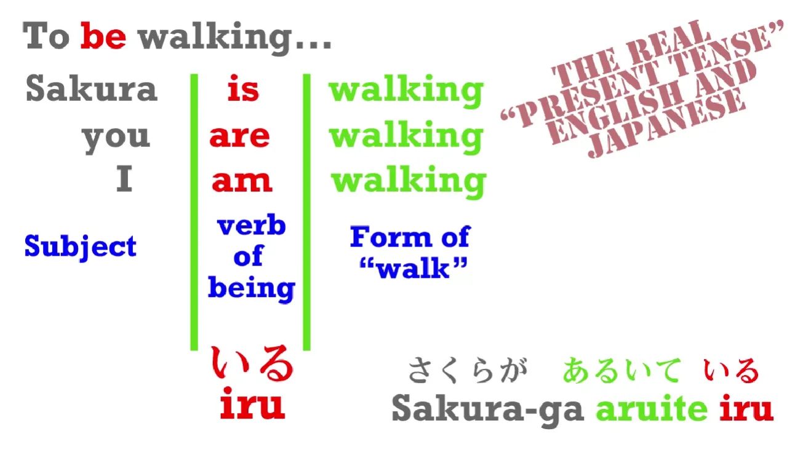
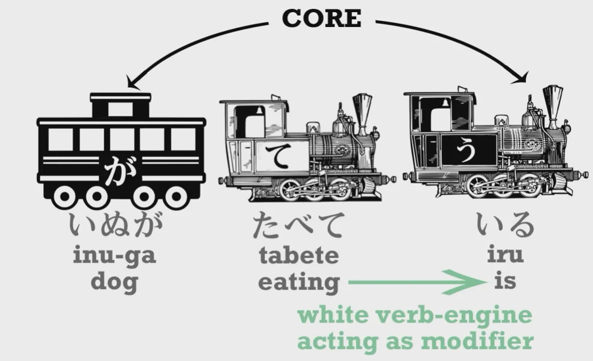
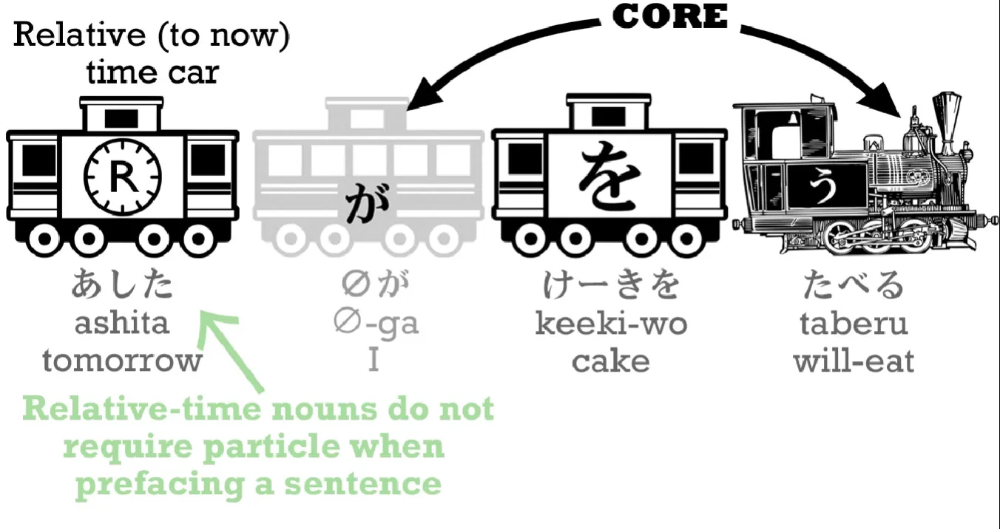

# **4. Японские глагольные времена**

[**Урок 4: Прошедшее, настоящее и будущее время в японском. Как на самом деле работают японские глагольные времена**](https://www.youtube.com/watch?v=lU5rmrAORDY&list=PLg9uYxuZf8x_A-vcqqyOFZu06WlhnypWj&index=4&ab_channel=OrganicJapanesewithCureDolly)

こんにちは。

Сегодня мы поговорим о временах. До сих пор мы использовали только одно время, и это то, которое представлено простой словарной формой глаголов: [食]{た}べる — есть; [歩]{ある}く — ходить, и так далее. Чтобы говорить на естественно звучащем японском, нам нужны три времени. Вы можете подумать, что это будут прошедшее, настоящее и будущее, но на самом деле это не так.

## Непрошедшее время

То, что мы использовали до сих пор, не является настоящим временем. Оно называется непрошедшим временем, и многие считают это запутанным. Почему в японском языке не может быть простого настоящего времени, как в английском, вместо чего-то расплывчатого и таинственного, как непрошедшее время?

Что ж, на самом деле это совсем не запутанно, и что делает это запутанным, на удивление, не тот факт, что японский преподаётся странным образом, а тот факт, что английский преподаётся странным образом. Правда в том, что японское непрошедшее время очень похоже на английское непрошедшее время.

Что такое английское непрошедшее время? Ну, это простая словарная форма английских слов: eat, walk и т.д. Почему я называю это непрошедшим временем? Давайте возьмём пример. Предположим, вы получаете сообщение на свой [携帯]{けいたい} (телефон), в котором говорится: <code>I walked to the cafe and now I eat cake and drink coffee</code>. Что бы вы узнали о человеке, который отправил это сообщение? Ну, вы бы узнали, что это не носитель английского языка, не так ли? Потому что ни один носитель английского языка не скажет <code>I eat cake and I drink coffee</code>, когда он имеет в виду <code>I am eating cake and drinking coffee right now</code>.

Когда же мы говорим <code>I eat cake</code>? Ну, мы можем сказать это, когда имеем в виду, что мы иногда едим торт: «I eat cake. Я не из тех, кто не ест торт. Я ем торт. Всякий раз, когда есть торт, я его ем. Но это не значит, что я ем торт прямо сейчас.»

Когда ещё мы используем английскую непрошедшую простую форму глаголов? Ну, иногда мы используем её для будущих событий: <code>Next week I fly to Tokyo.</code> <code>Next month I have an exam.</code> А иногда мы используем её для чего-то, что происходит прямо сейчас, но не в большинстве случаев. Например, в литературном описании: «The sun sinks over the sea and a small happy robot runs across the beach.» Но это не тот способ, которым мы используем её большую часть времени в повседневной речи, не так ли?

Итак, японское непрошедшее время очень похоже по своей функции на английское непрошедшее время. Если вы понимаете одно, вы в значительной степени можете понять и другое. **Большую часть времени японское непрошедшее время относится к будущим событиям.** <code>いぬがたべる</code> — <code>Собака будет-есть</code>; <code>さくらがあるく</code> — <code>Сакура будет-ходить.</code>

То, как мы использовали его до сих пор — <code>Сакура ходит</code> — возможно, но это не самый естественный способ. Мы использовали его так, потому что это было единственное время, которое мы знали.

## Продолжительные действия и ている

Если мы хотим сказать что-то более естественное, например, <code>Sakura is walking</code>, что мы делаем? Ну, что мы делаем в английском? В английском мы говорим, не так ли, <code>Sakura IS walking</code>. Мы используем слово <code>to be</code>. Вы можете <code>BE walking</code>. <code>Sakura IS walking</code>; <code>We ARE walking.</code>

К счастью, в японском языке у нас нет всех этих разных форм слова <code>to be</code>. Мы используем одно и то же слово каждый раз, и это слово — <code>いる</code>. <code>いる</code> означает <code>быть</code> **в отношении животных и людей**, и чтобы образовать это продолжительное настоящее время, мы всегда используем <code>いる</code>.

Итак, <code>Sakura is walking</code> — <code>さくらがあるいている</code>. <code>Dog is eating</code> — <code>いぬがたべている</code>

Теперь давайте заметим, что в предложении вроде <code>いぬがたべている</code> у нас есть нечто, чего мы ещё не видели, и это белый локомотив. **Белый локомотив — это элемент, который мог бы быть локомотивом, но в данном случае он НЕ является локомотивом этого предложения. Он модифицирует или сообщает нам больше информации об одном из основных элементов предложения.**

Итак, ядро этого предложения — <code>いぬがいる</code> — <code>собака есть</code>. Но собака не просто существует — собака что-то делает. И этот белый локомотив говорит нам, что она делает. Она <code>ест</code>. И мы будем видеть эту структуру с белым локомотивом снова и снова по мере углубления в японский язык.

И точно так же, как в английском мы не говорим <code>the dog is eat</code>, мы используем особую форму глагола, которая сочетается с глаголом бытия. Так, в английском мы говорим <code>is walking</code>, <code>is eating</code>. В японском мы говорим <code>[食]{た}べている</code>, <code>[歩]{ある}いている</code>.

---

Итак, как мы образуем эту <code>て-форму</code>, которую мы используем для образования продолжительного настоящего времени? Со словом вроде <code>[食]{た}べる</code> это очень легко. Всё, что нам нужно сделать, это убрать <code>る</code> и поставить <code>て</code> на его место. たべる становится たべて.

Плохая новость в том, что с другими глаголами у нас есть немного разные способы присоединения <code>て</code>. Помимо простой る-формы, есть ещё четыре способа. Учебники скажут пять, но на самом деле два из них настолько похожи, что мы можем рассматривать их как четыре. И я сделала видео о том, что это за способы.[[5]](./5-verb-groups-and-the-て-form.md) И это делает объяснение намного проще, чем большинство других.

Так что очень важно посмотреть это, чтобы вы могли научиться образовывать продолжительное настоящее время. Хорошая новость: это совершенно регулярно. Как только вы знаете окончание глагола, вы также знаете, как присоединить к нему <code>て</code>. Единственное, что немного сложно, это глаголы, оканчивающиеся на る, но видео объяснит это.

## Прошедшее время

Итак, как мы переводим вещи в прошедшее время? К счастью, это очень легко. **Всё, что мы делаем, это добавляем <code>た</code> — вот и всё.** Итак, <code>いぬがたべる</code> — <code>собака будет-есть</code> / <code>いぬがたべた</code> — <code>собака ела</code>.

Теперь, есть разные способы присоединения <code>た</code> к разным видам глаголов, глаголам с разными окончаниями, но хорошая новость здесь в том, что они точно такие же, как и способы присоединения <code>て</code>. Так что, как только вы выучите способы присоединения <code>て</code>, вы также выучите способы присоединения <code>た</code>. Так что, если вы посмотрите то видео о て-форме **[[5]](./5-verb-groups-and-the-て-form.md)**, вы сможете использовать как продолжительное настоящее, так и прошедшее время.

Теперь, есть ещё одна вещь о выражениях времени, которую полезно изучить сейчас. Если мы хотим прояснить, когда мы говорим <code>私はケーキを食べる</code>, что мы говорим о будущем событии, мы можем сказать <code>[明日]{あした}</code> (что означает <code>завтра</code>) <code>あしたケーキを食べる</code>. Это всё, что нам нужно сделать.

## Выражения времени

Мы просто говорим <code>завтра</code> перед тем, как сказать остальную часть предложения, точно так же, как мы делаем это в английском. <code>Tomorrow I'm going to eat cake</code> — <code>あした *(zeroが)* ケーキを食べる</code>.
::: info
Иногда я добавляю zeroが, даже если Долли не произносит это в транскрипции, НО она показывает это в видео, я, очевидно, добавляю это только тогда, когда это показано ею, я не делаю это по своему усмотрению…
:::

Итак, <code>завтра</code> — это то, что мы называем <code>**относительным** выражением времени</code>, потому что оно относительно сегодняшнего дня. Сегодня — это вчерашнее завтра.

И со всеми такими относительными выражениями времени: вчера, на прошлой неделе, в следующем году и так далее, временами, которые относятся к настоящему времени, мы просто делаем то, что делали тогда. **Мы ставим выражение времени в начало предложения, и это переводит всё предложение в это время.**

---

Однако, когда у нас есть <code>абсолютное выражение времени</code>, выражение, которое не относится к настоящему, такое как вторник или шесть часов, тогда **мы должны использовать <code>に</code>**.

Вторник — это <code>[火曜日]{かようび}</code>, и мы можем сказать <code>かようびに *(zeroが)* ケーキをたべる</code> — <code>Во вторник (я) съем торт.</code>

Важно здесь то, что может показаться немного сложным выяснять: <code>Время абсолютное или относительное?</code> И хорошая новость здесь в том, что это совсем не сложно, потому что это работает точно так же, как в английском.

В английском мы говорим: <code>Tomorrow I eat cake</code>, <code>Next week, I have an exam</code> и так далее, **но когда мы используем абсолютное выражение времени**, мы говорим: <code>**On Monday** I will eat cake</code>, <code>**At six o'clock** I have an exam</code>; если мы говорим о месяце, мы говорим: <code>**In July** I'm going to Tokyo</code>.

Теперь, японский работает точно так же, за исключением того, что нам не нужно запоминать, когда мы используем <code>on</code>, когда мы используем <code>at</code> и когда мы используем <code>in</code>. **В японском мы используем <code>に</code> каждый раз.**

Но в английском, когда нам нужно одно из этих маленьких слов: <code>on</code>, <code>in</code> или <code>at</code>, тогда нам нужно <code>に</code> в японском. А когда не нужно, тогда нам не нужно <code>に</code> в японском. **Английский и японский идентичны в этом отношении.**

Так что вместо того, чтобы сидеть и выяснять: <code>Это относительное или абсолютное?</code>, **просто подумайте, нужно ли вам <code>on</code>, <code>in</code> или <code>at</code> в английском, и если да, то вам нужно <code>に</code> в японском.** А если нет, то вам не нужно <code>に</code> в японском. Это действительно так просто.