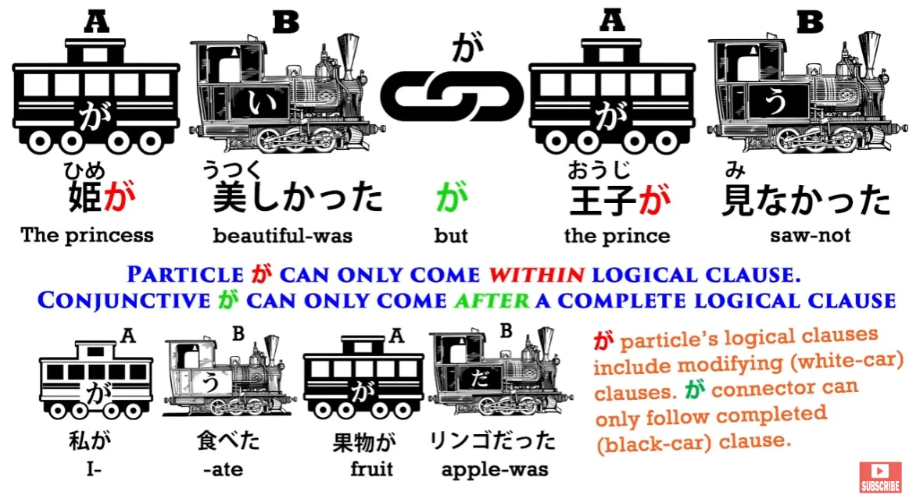
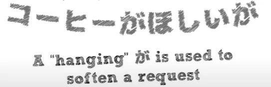
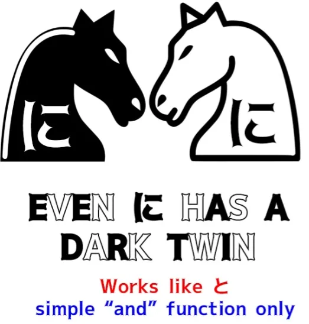

# **40. 3 подводных камня в японском языке и как их избежать**

[**3 ПОДВОДНЫХ КАМНЯ в японском языке и как их избежать 【Урок по структуре японского языка 40】**](https://www.youtube.com/watch?v=Qf7IGkrnnjY&list=PLg9uYxuZf8x_A-vcqqyOFZu06WlhnypWj&index=42&pp=iAQB)

こんにちは。

Сегодня мы обсудим некоторые подводные камни в структуре японского языка. Это очень маленькие элементы, элементы языка, состоящие из одной каны, но очень важные, которые, если вы о них не знаете, могут сильно сбивать с толку, потому что один элемент легко спутать с другим, идентично выглядящим.

И учебники во многих случаях вообще не рассказывают вам об этом. Они оставляют вас в полном недоумении.

## で (соединительная/て-форма связки)

Первый элемент, который мы рассмотрим, это <code>で</code>. Итак, <code>で</code>, как вы знаете, является логической частицей.

У неё есть очень чётко определённое применение, которое мы представили в Уроке 8b. Как и все логические частицы, она отмечает существительное и сообщает нам, что это существительное является местом, где произошло действие, или средством, с помощью которого действие было совершено.

Однако существует ещё одна <code>で</code>, которая не является частицей, но также очень часто используется в японском языке, и учебники не делают никаких попыток различить эти два совершенно разных, но идентично выглядящих элемента. Впервые большинство из нас встретит вторую из этих <code>で</code> при использовании адъективных существительных, которые учебники очень запутанно и вводяще в заблуждение называют <code>な-прилагательными</code>.

Итак, если мы говорим <code>さくらがきれいで優しい</code>, мы говорим, что Сакура красивая и добрая. <code>[綺麗]{きれい}だ</code> — это адъективное существительное.

Если мы хотим сказать <code>Цветок красивый</code>, мы говорим <code>花がきれいだ</code>. А если мы хотим сказать <code>красивый цветок</code>, мы должны поставить <code>きれいだ</code> по другую сторону от цветка, поэтому мы говорим <code>きれいな花</code>.

И эта <code>な</code>, как мы знаем, является соединительной формой <code>だ</code>. Но если мы хотим сказать <code>Сакура красивая и добрая</code>, мы не можем использовать <code>だ</code> и не можем использовать <code>な</code>, но мы должны использовать связку.

То, что мы используем теперь, это соединительная форма связки, то есть её て-форма. И て-форма <code>だ</code> — это <code>で</code>.

::: info
чтобы избежать путаницы, когда Долли использует слова «соединительная форма связки» как для な, так и впоследствии для で.

:::

Итак, если вы говорите <code>Сакура красивая и добрая</code>, это истинное прилагательное, <code>い-прилагательное</code>, и мы используем て-форму для его соединения: мы говорим <code>さくらが美しくて優しい.</code> Если это адъективное существительное, мы всё равно должны использовать связку, поэтому мы говорим <code>さくらがきれいで...</code>

Это て-форма связки. Я уже объясняла это в наших уроках по адъективам, но мы также находим эту <code>で</code>, て-форму <code>だ</code>, во многих других случаях в японском языке.

Итак, давайте рассмотрим пару случаев и посмотрим, сможете ли вы определить, какая из двух <code>で</code> используется. Очень распространённая фраза, которую говорят кому-то, когда прощаются, возможно, на некоторое время, это <code>お元気で</code>.

Итак, <code>元気</code>, как вы знаете, означает <code>хорошо</code>, или <code>здорово</code>, или <code>бодро</code>, а <code>お</code> — это просто почтительный префикс или украшение. Что же здесь за <code>で</code>?

Это логическая частица или て-форма связки? Это て-форма связки, а не частица.

Частица здесь не имеет никакого смысла, не так ли? Что же делает て-форма связки?

Ну, мы ведь знаем, не так ли, что て-форма часто используется для образования повелительного наклонения, чтобы сказать кому-то или попросить кого-то что-то сделать. Итак, если мы говорим <code>待って</code> — <code>жди</code> — это своего рода сокращение от <code>待ってください</code>, и мы просим кого-то подождать (<code>待って!</code> — <code>Жди!</code>).

Теперь, то же самое и с <code>で</code>, которая является て-формой связки. Итак, <code>元気だ</code> означает <code>является 元気</code>, кто-то бодр, кто-то здоров или полон жизни.

<code>元気で</code> говорит им *быть* бодрыми или полными жизни. <code>お元気で</code> — <code>будьте здоровы / будьте бодры / сохраняйте хорошее настроение</code>.

### [無事]{ぶじ}で

Хорошо. Вот ещё один пример: <code>無事でよかった</code> — это ещё одно очень распространённое выражение, и оно означает <code>Я рад(а), что с вами всё в порядке / хорошо, что вы не пострадали / хорошо, что вы в безопасности</code> — <code>無事でよかった</code>.

Что у нас здесь?

И снова у нас て-форма связки. <code>無事</code>, что буквально означает <code>нет происшествия</code>, а следовательно, <code>ничего не произошло / ничего плохого не произошло / вы не пострадали / вы в безопасности</code>.

Итак, <code>無事だ</code> означает <code>вы в безопасности / вы не пострадали / ничего не произошло</code>. <code>無事で</code> превращает эту <code>だ</code>, эту связку, в соединительную форму.

Мы ведь используем て-форму для соединения вещей, не так ли? Итак, точно так же, как мы могли бы сказать <code>遅くなってすみません</code> — <code>Извините, что опоздал(а)</code> — мы также говорим <code>無事でよかった</code> — <code>То, что вы не пострадали, было хорошо.</code>

И эта соединительная て-форма также используется в более длинных сложносочинённых предложениях. Так, например, мы можем сказать <code>さくらはいい子で毎日学校に行く</code> — <code>Сакура — хороший ребёнок, и она ходит в школу каждый день.</code>

У нас есть две полные клаузы, и, как и в случае с て-формой любого глагола, мы можем использовать её для соединения клаузы, оканчивающейся глаголом, со второй клаузой, так что мы можем сделать то же самое и со связкой. Итак, <code>さくらがいい子だ</code> — <code>Сакура — хорошая девочка</code> — это само по себе полное предложение.

Если мы хотим соединить его со второй клаузой, чтобы сделать его первой половиной сложносочинённого предложения, мы превращаем эту <code>だ</code> в её て-форму, <code>で</code>. Итак, <code>Сакура — хорошая девочка, и она ходит в школу каждый день.</code>

И, как это обычно бывает с て-формой-соединителем, она имеет тенденцию подразумевать положительную связь между двумя частями. Она несёт в себе это значение <code>Поскольку Сакура — хорошая девочка, она ходит в школу каждый день,</code> но не выражает это так сильно, как если бы мы использовали <code>から</code>.

---

Теперь, ещё одна путаница, которая не является такой уж глубокой, тёмной тайной для учебников, но они не всегда подчёркивают её достаточно ясно, и это очень важно, потому что это касается самого центра японского языка, и это — が-частица.

## が как соединитель клауз

が-частица, как мы знаем, это та единственная частица, без которой ни одно предложение или клауза в японском языке никогда не может обойтись, видим мы её или нет. <code>が</code> отмечает А-вагон каждого предложения, того, кто совершает действие в клаузе «А делает Б», и того, кто является чем-то в клаузе «А есть Б».

Но есть и другая <code>が</code>. Их нелегко спутать, при условии, что вы чётко о них осведомлены.

Другая <code>が</code> также является соединителем клауз. И обычно это контрастный соединитель клауз.

Итак, если мы говорим <code>お店に行ったがパンがなかった,</code> мы говорим <code>Я пошёл(ла) в магазин, но хлеба не было.</code>

::: info
Вторая が — это частица が, используемая для своей логической клаузы, отмечающая パン.
:::

Итак, это контрастный союз. Мы пошли в магазин, надеясь, что там будет хлеб, но его не было.

Это невозможно спутать с другой <code>が</code>, той <code>が</code>, которая отмечает подлежащее предложения, А-вагон, потому что эта <code>が</code>, частица <code>が</code>, может отмечать только существительное.

А соединитель клауз <code>が</code> может отмечать только полное предложение. Частица <code>が</code> не может отмечать полное предложение, потому что полное предложение не может заканчиваться существительным.

Оно должно заканчиваться глаголом, прилагательным или связкой, как мы узнали на нашем самом первом уроке. Так что невозможно спутать эти две, пока вы чётко о них осведомлены.

Ещё одна вещь, которую мы должны отметить, это то, что <code>が</code> не обязательно должна быть контрастной. Большую часть времени она такова, но её можно использовать как обычный, неконтрастный союз.

Стоит это знать, потому что если вы видите, что она соединяет две клаузы, и там, кажется, нет никакого контраста, вам не нужно ломать голову, чтобы найти контраст — иногда она используется неконтрастным образом. И ещё одна вещь, которую вам нужно знать, это то, что вы иногда будете находить эту контрастную <code>が</code> в конце предложения.

И я уже говорила о предложениях, которые заканчиваются союзом. Строго говоря, они неполные, потому что они подразумевают последующую клаузу.

<code>が</code> в конце предложения часто является проявлением вежливости, потому что <code>が</code> на самом деле более вежлива, чем <code>けど</code> или <code>でも</code>, другие способы сказать <code>но</code>. Итак, если мы скажем что-то вроде <code>*(私は)* コーヒーがほしいが</code> — <code>кофе является желаемым (для меня)</code>, а затем мы добавили <code>が</code>.

И эта <code>が</code> говорит <code>но...</code>, и она подразумевает вторую клаузу, но не выражает её, так что <code>コーヒーがほしいが</code> означает что-то вроде «Я бы хотел(а) кофе, но... если это доставит какие-либо неудобства, пожалуйста, не пытайтесь принести мне кофе» или что-то в этом роде.

## に, которая работает как <code>と</code>

Последний элемент, который мы рассмотрим, встречается реже, но если вы читаете сколько-нибудь японского, вы довольно скоро наткнётесь на него, и это — <code>に</code>. Итак, мы знаем <code>に</code>.

Это снова логическая частица. Это частица-цель, и я сделала целое видео об этом, потому что это важная и сложная частица.

Но есть и другая <code>に</code>. И эта другая <code>に</code>, которая является немного устаревшим употреблением — она происходит из старого японского — означает то же самое, что и <code>と</code>.

Её можно использовать для соединения двух существительных или списка существительных.

Так, в народной сказке «Красавица и Чудовище», когда отец спрашивает одну из менее хороших сестёр, что бы она хотела, чтобы он привёз ей, она говорит <code>靴に指輪に帽子</code>. Она говорит, что хотела бы туфли, и кольцо, и шляпу.

Итак, эта <code>に</code> может использоваться для соединения двух вещей или списка вещей, и она совершенно отличается от частицы <code>に</code>. Это немного литературное употребление, поэтому вы чаще будете видеть его в письменном японском.

Но если вы не знаете, что оно существует, вы можете долго ломать голову над тем, что означает <code>に</code> в этих контекстах. Оно также чаще используется в выражении <code>それに</code>, что означает <code>более того</code>, или <code>в дополнение к этому</code>.

::: info
В оранжевой заметке на картинке опечатка. それにとても должно быть それにしても.

:::

И, как вы видите, оно состоит из <code>それ</code>, что означает <code>то</code>, плюс <code>に</code> — не частица <code>に</code>, а <code>に</code>, которая означает <code>и</code>.