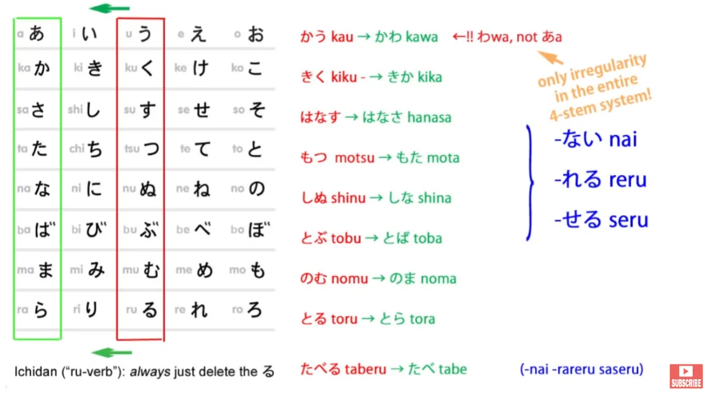
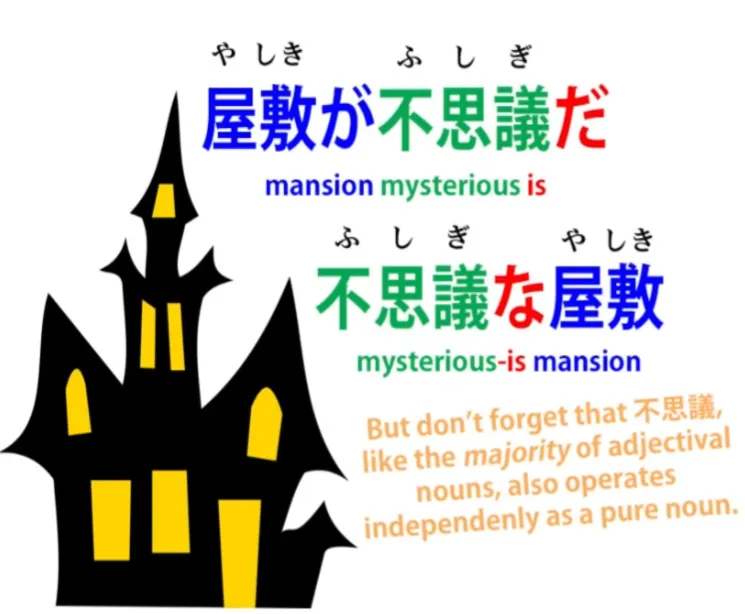
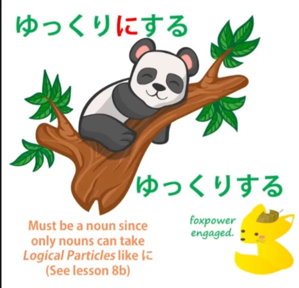
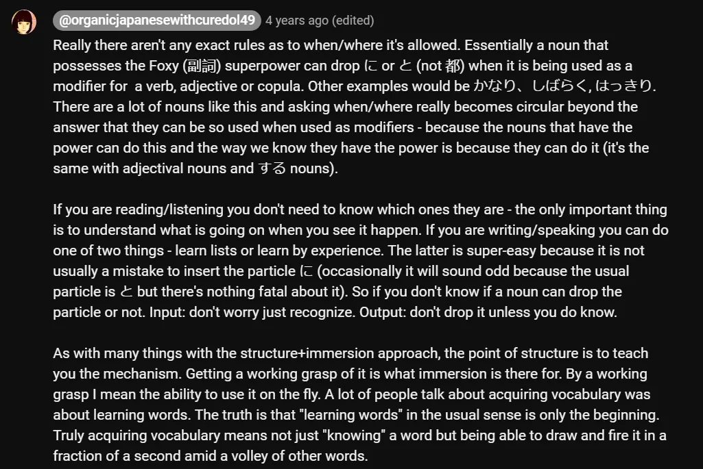

# **41. 5 ключевых фактов о базовой структуре японского языка**

[**5 ключевых фактов о базовой структуре японского языка, о которых вам никогда не расскажут. Урок 41**](https://www.youtube.com/watch?v=8AXyP5GeJFg&list=PLg9uYxuZf8x_A-vcqqyOFZu06WlhnypWj&index=43&pp=iAQB)

こんにちは。

Сегодня мы поговорим о чём-то очень важном, что влияет на всю структуру японского языка. И, сюрприз, сюрприз, учебники никогда не объясняют это должным образом. Мы поговорим о японских словах. Не о словарном запасе, а о самой природе слов и о том, как они структурно работают внутри языка. Это несложно. На самом деле, это очень просто. Но если вы этого не знаете, это очень сбивает с толку, потому что вы видите предложение и не понимаете, что слова на самом деле делают в этом предложении. И именно в таком положении оставляют вас учебники.

Дело в том, что японский язык гораздо проще английского и большинства языков по типам слов, которые в нём есть. Однако английские учебники и словари пытаются ассимилировать японские слова к различным английским типам, и это совершенно не работает и приводит к бесконечной путанице. Поэтому я представлю пять фактов, которые прояснят всю ситуацию.

## Факт 1

Факт 1: Почти все японские слова делятся на одну из трёх категорий. Всего три. И эти три категории: существительные, глаголы и прилагательные. Конечно, есть ещё частицы — это не слова, но они являются основой, которая скрепляет язык. И есть несколько — очень мало — специализированных слов, которые не попадают в эти три категории.

Например, есть союзные слова, которые соединяют две логические клаузы, образуя сложносочинённое предложение. Большинство союзов всё равно образуются не словами — они образуются с помощью て-формы, い-основы или групп частиц, таких как <code>でも</code> и <code>のに</code>. Но есть несколько специальных союзов, таких как <code>けど</code> и другая <code>が</code>, та <code>が</code>, которая не является частицей, а является союзом, которую мы обсуждали в недавнем видео. Итак, помимо них, всё, что вы видите, будет существительным, глаголом или прилагательным.

## Факт 2

Факт 2: Глаголы и прилагательные очень легко распознать и отличить.

Каждый глагол оканчивается на кану ряда -う — и это должна быть кана, она не может быть частью кандзи. И каждое прилагательное должно оканчиваться на кану い. Опять же, это должна быть кана, не может быть частью кандзи. Как мы знаем, существуют определённые совершенно регулярные преобразования, которые могут производить эта кана ряда -う и эта い.

Они могут переходить в て-форму или た-форму, а конечная кана ряда -う глагола может меняться на эквивалентную кану в том же ряду, чтобы присоединить вспомогательное слово, такое как отрицательное вспомогательное い-прилагательное <code>ない</code> или каузативный вспомогательный глагол <code>せる/させる</code>.

Итак, как только вы узнаете основные перестановки глаголов и прилагательных, что следует сделать очень рано, вы поймёте, что если слово не имеет одного из этих возможных глагольных окончаний или одного из этих возможных окончаний прилагательных, это существительное. Вы знаете, что если слово написано только кандзи или может быть написано только кандзи, то в 99 случаях из 100 это существительное. Таким образом, японский язык, как я уже говорила, является очень существительно-центрированным языком.

## Факт 3

Факт 3: Существует легион супер-существительных. Под этим я подразумеваю, что существуют определённые особые категории существительных, каждая из которых обладает одной и только одной суперсилой. То есть существительные в каждой из этих групп особых или супер-существительных отличаются от обычных существительных только в одном отношении. Две из этих групп мы уже знаем, поэтому в рамках Факта 4 я просто быстро их повторю.

## Факт 4

### Адъективные существительные

Первая группа — это адъективные существительные, которые ужасно неправильно названы в учебниках <code>な-прилагательными</code>. Они не прилагательные. Это существительные, которые при определённых обстоятельствах могут использоваться как прилагательные.

Суперсила адъективных существительных, единственное, что они могут делать, что отличает их от любого другого существительного, это то, что они могут использовать мягкую или соединительную форму связки <code>だ</code>. Итак, мы можем сказать <code>屋敷が不思議だ</code> — <code>особняк таинственный является</code>. Когда мы это делаем, мы просто делаем то, что можем делать с любым существительным. Мы можем сказать <code>さくらが日本人だ</code> — <code>Сакура японский человек является</code>.

Но мы также можем использовать эту мягкую форму <code>だ</code>, которая является <code>な</code>, и мы можем сказать <code>不思議な屋敷</code> — <code>таинственный-является особняк</code>.

Вы не можете сделать это с обычным существительным. И это единственное отличие обычного существительного от адъективного существительного.

### する-существительные

Вторая группа — это する-существительные, которые словари несколько сбивающе с толку называют <code>する-глаголами</code>. **На самом деле это существительные.**

**И их суперсила заключается в том, что им разрешено опускать маркер прямого дополнения, <code>を</code>.** Итак, **если мы возьмём существительное <code>勉強</code>, что означает <code>учёба</code>, мы можем сказать <code>勉強をする</code>**, что означает <code>делать учёбу</code>, но мы также можем сказать <code>勉強する</code>, что означает <code>учиться</code> (**глагол**).

::: info
Это просто очень тонкое различие, по сути.
<code>を</code> — это прямое дополнение (существительное) + глагол (勉強を + する), а 勉強する — это する-глагол.
:::

**Мы можем использовать <code>を</code> для обозначения прямого дополнения любого глагола, но мы можем опустить это <code>を</code> только в случае する-существительных.** В этом их суперсила. Итак, когда мы это делаем, **мы сливаем <code>勉強</code> с <code>する</code>** **и создаём то, что мы действительно можем назвать <code>する-глаголом</code>.**

**Но важно помнить, что когда <code>する</code> не присоединено к нему, это не する-глагол. Это вообще не глагол. Это существительное.**

::: info
Обратите внимание, что <code>КОГДА する НЕ присоединено к нему</code>, например, 勉強をする, где 勉強 является существительным. Но с 勉強する, する должно быть главой фразы 勉強する, поэтому это должен быть глагол.
:::

Итак, мы можем сказать <code>勉強が好きだ</code>. Это означает <code>учёба *(существительное)* мне нравится</code>. Мы не говорим <code>勉強するのが好きだ</code>, потому что, если бы мы так сказали, мы бы взяли существительное, превратили его в глагол с помощью <code>する</code>, а затем снова превратили бы его в существительное с помощью <code>の</code> *(номинализатора для глагола 勉強する)*. Нам не нужно этого делать, потому что это существительное изначально.

## Факт 5

### Наречные существительные

Итак, третья группа, которую мы ещё не представили, это наречные существительные. Их очень много, и ужасно много из них оканчиваются на кану <code>り</code>, но далеко не все.

Итак, мы рассмотрим два, которые оканчиваются на <code>り</code>, и одно, которое не оканчивается, и посмотрим на их суперсилу. Их суперсила очень похожа на суперсилу する-существительного, а именно: они могут опускать соответствующую частицу при определённых обстоятельствах. Как мы знаем, **любое существительное, подходящее для использования, может быть превращено в наречие путём добавления <code>に</code>.**

Итак, <code>静か</code>, которое является *(адъективным)* **существительным** <code>тихий</code>, **может использоваться наречно с <code>に</code>.** Мы можем сказать <code>**静かに**する</code> — <code>делать **тихо** / действовать **тихо**</code>. Мы можем сказать <code>**静かに**歩く</code> — <code>идти **тихо**</code>.

---

*(Но)* **С наречными существительными мы можем опустить это <code>に</code>.**

::: info
Я думаю, Долли здесь НЕ имеет в виду, что мы можем опустить <code>に</code> с <code>静か</code>, потому что это НЕ наречие (наречное существительное), как <code>ゆっくり</code>, а адъективное существительное. По крайней мере, я не могу найти ничего о <code>静かする</code> и т.д.
Долли также, кажется, неоднократно[[8]](./8-the-に-and-へ-particles.md) намекает на то, что наречия, такие как <code>ゆっくり</code>, могут быть классифицированы как своего рода существительные, хотя такие источники, как Jisho/Yomichan, перечисляют их как наречия, и их название 副詞 (ふくし), конечно, другое, означает «наречие», так что это был бы просто особый подкласс.
:::

*Я думаю, что термин <code>наречное существительное</code> может быть тем, что 副詞 означает для Долли, где обычно их называют наречиями, но они могут быть этим очень особым классом существительных в японском языке, поэтому Долли так их называет. Что касается того, почему мы можем опустить <code>に</code>, поскольку <code>ゆっくり</code> уже является 副詞 по умолчанию.*

Итак, возьмём одно, которое оканчивается на типичное <code>り</code>: <code>ゆっくり</code> — это означает **медленно** или **неспешно**, и мы можем сказать <code>**ゆっくりに**する</code> — <code>действовать **неспешно**</code>, <code>**ゆっくりに**歩く</code> — <code>идти **медленно**</code>. Но мы также можем сказать <code>ゆっくりする</code>, <code>ゆっくり歩く</code>. **Мы можем опустить это <code>に</code>.**

Итак, **это единственная суперсила наречного существительного.** И важно это понимать, потому что когда вы начинаете пытаться объяснить их, не признавая этого фундаментального факта, вы можете столкнуться со всевозможными трудностями.

Возьмём ещё одно: <code>[余]{あま}り</code>.

#### あまり

Итак, это существительное обычно объясняется совершенно сбивающим с толку образом. **<code>あまり</code> — это существительное**, и оно означает <code>избыток</code>.

Вы можете использовать его в совершенно буквальном смысле. Вы можете сказать <code>ご飯のあまり</code> — что означает <code>избыток риса / оставшийся приготовленный рис</code>.

Очень часто оно используется в более абстрактных смыслах. Итак, мы можем сказать <code>悲しみのあまり泣いた</code>.

Это означает <code>от избытка печали я плакал(а)</code>.

И, как видите, мы можем опустить частицу. **Мы обычно опускаем частицу с <code>あまり</code>.** **Таким образом, оно теперь используется наречно и всё ещё означает <code>избыток</code>.**

Учебники же обычно вводят его в другом контексте, что очень сбивает с толку, когда мы видим его в других контекстах, и особенно когда мы не понимаем, что это на самом деле существительное. Они показывают его использование наречно в выражениях вроде <code>あまり勉強しない</code>.

Что это буквально означает? Буквально это означает <code>Я не слишком много учусь / Я не делаю избыток учёбы</code>. Но, конечно, как мы знаем, на практике это означает <code>Я очень мало учусь</code>.

**И это то, что мы называем литотой.** Мы говорили о гиперболе в языке и о том, насколько это распространённое явление.

Литота — это противоположность гиперболы. Гипербола — это когда мы говорим больше, чем на самом деле имеем в виду; литота — это когда мы говорим меньше, чем на самом деле имеем в виду.

Слово <code>литота</code> не так хорошо известно, как <code>гипербола</code>. Возможно, это потому, что современная западная речь гораздо более склонна к гиперболе, чем к литоте.

Но у нас всё ещё есть литота в устойчивых выражениях. Итак, если мы собираемся на пикник и смотрим на тёмные тучи в небе и говорим <code>It doesn't look too good!</code>, что мы буквально говорим, это <code>Это не выглядит чрезмерно хорошо</code>, но что мы на самом деле имеем в виду, это <code>Это выглядит не очень хорошо!</code>

И то же самое с <code>あまり</code>. Если мы говорим <code>あまり勉強しない</code>, мы говорим <code>Я не слишком много учусь / Я не учусь чрезмерно</code>, но что мы на самом деле имеем в виду, это <code>Я вообще очень мало учусь</code>.

#### 随分

Итак, возьмём ещё одно, которое не оканчивается на <code>り</code>, это <code>[随分]{ずいぶん}</code>. На самом деле оно означает <code>достаточно</code>.

И вы можете сказать: <code>Ну, **достаточно** — это не существительное</code>. И это правда — в английском это не существительное.

В японском это так, и если мы посмотрим на кандзи <code>随分</code>, то оно на самом деле означает что-то вроде <code>подходящая часть</code> или <code>подходящее количество</code> — другими словами, <code>достаточный</code> или <code>достаточно</code>. И это ещё одна литота, которая распространена как в английском, так и в японском и многих других языках.

Когда вы говорите кому-то <code>ずいぶん上手だね</code>, вы буквально говорите <code>вы достаточно умелы / вы достаточно искусны</code>. Что вы на самом деле имеете в виду, это то, что человек очень искусен.

И это то же самое в английском. Вы могли бы сказать <code>You're pretty good</code>.

И <code>ずいぶん</code>, как <code>pretty</code> или <code>fairly</code> в английском, может охватывать весь диапазон от своего первоначального значения <code>достаточно</code> или <code>довольно</code> до своего более обычного значения литоты <code>очень / значительно</code>. Итак, что нужно помнить, это то, что в японском языке очень ограниченное количество типов слов.

Почти все слова — это либо глаголы, существительные, либо прилагательные. **И те, которые не являются глаголами или прилагательными, что бы вам ни говорили словари,** **практически всегда являются существительными.** *(Это, кажется, подтверждает мою теорию о 副詞 выше)*

Когда вы это понимаете, у вас гораздо более ясное представление о том, что происходит в предложении.

::: info
Проверьте это:

:::