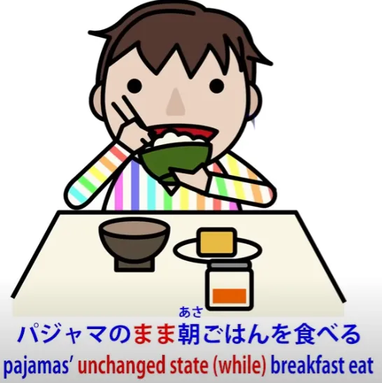
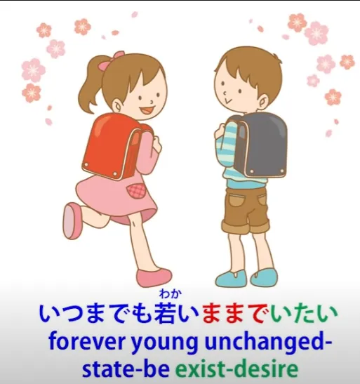
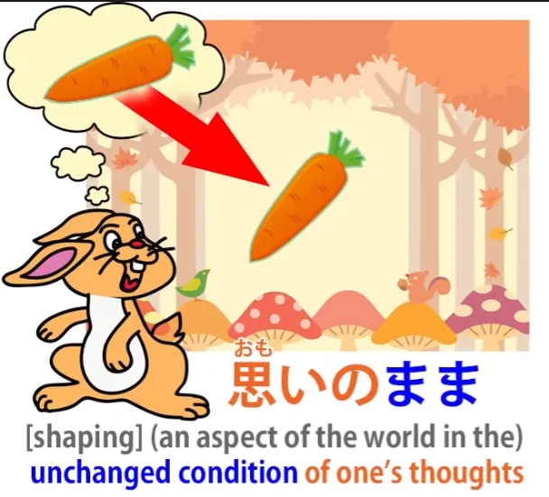
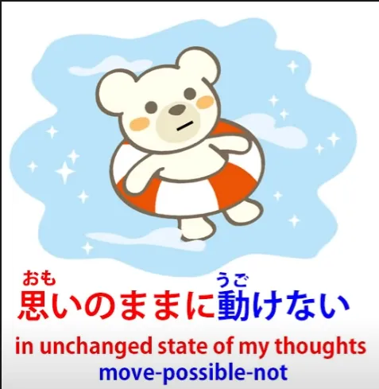

# **42. Базовая путаница со словами | まま**

[**Почему «грамматические пункты» в учебниках так вводят в заблуждение. Базовая путаница со словами | まま mama | Урок 42**](https://www.youtube.com/watch?v=rCdhDCmhMZc&list=PLg9uYxuZf8x_A-vcqqyOFZu06WlhnypWj&index=44&pp=iAQB)

こんにちは。

Сегодня мы поговорим о том, как стандартные, общепринятые объяснения японского языка заводят вас в пустыню, а затем улетают на вертолёте, смеясь. В предыдущих уроках этой серии мы говорили о том, как это происходит в отношении фундаментальной структуры языка. Но это также случается и на более позднем этапе, при объяснении всевозможных так называемых <code>грамматических пунктов</code>. И одна из главных причин этого заключается в том, что они не могут распознать, чем слова на самом деле являются и что они на самом деле делают.

Итак, в качестве примера мы возьмём <code>まま</code>, слово <code>ママ</code>. Оно может означать «мать» или «хозяйка бара/кафе», но мы говорим о нём в другом, более абстрактном смысле, относительно которого, если мы посмотрим на традиционные объяснения, у них, кажется, есть разные мнения о том, к какой части речи оно относится.

::: info
Во избежание путаницы, ママ в катакане означает <code>мама</code> или <code>хозяйка бара</code>. Тогда как まま — это то, о чём будет говорить Долли. У него также есть форма кандзи 儘 или 侭, но она не используется.
Итак, まま ≠ ママ, это разные вещи. まま обозначает неизменное состояние, ママ означает <code>мама/хозяйка бара</code>...
:::

Я даже видела, как его описывали как частицу, чем оно, конечно, не является. И они говорят вам, что оно означает <code>как есть / как мы хотим, чтобы это было / как нам хотелось бы, чтобы это было</code>, что оно означает состояние или условие. Все эти вещи — это то, что мы могли бы сказать по-английски в отношении определённых употреблений этого слова. Но ни одно из них не выражает того, что слово на самом деле означает.

В любом случае, если бы оно означало <code>как есть</code> или <code>как мы хотим, чтобы это было</code>, что это было бы за слово? Итак, первое, что мы должны спросить себя: <code>Что это за слово?</code> И, как я объясняла в нашем прошлом уроке, почти все японские слова делятся на одну из трёх категорий: существительные, глаголы и прилагательные. Так вот, <code>まま</code> — это не глагол: оно не оканчивается на -у или на любую кану ряда у.

Это не прилагательное: не оканчивается на -и. Так что, скорее всего, это существительное, и это именно так. Это существительное.

Итак, что это за существительное? Что оно означает? Что такое <code>まま</code>? <code>まま</code> — это вещь; это существительное. Что это за вещь? Ну, это очень простая вещь, очень понятная, и как только мы узнаем, что это такое, мы сможем понять её во всех обстоятельствах.

<code>まま</code> — это неизменное состояние. Всякий раз, когда вы видите <code>まま</code>, вы можете читать <code>неизменное состояние</code>. Есть одно обстоятельство, при котором оно имеет немного расширенное значение, и помимо этого — что очень просто, и мы скоро к этому вернёмся — у нас есть определение, понимание <code>まま</code>: <code>неизменное состояние</code>.

Итак, давайте посмотрим на некоторые способы его использования. Мы можем сказать <code>自然のままの森</code> — это <code>лес в его естественном *(неизменном)* состоянии</code>.

<code>自然</code> — это <code>природа</code>, а <code>まま</code> — это <code>неизменное состояние</code> или <code>неизменное условие</code>. Итак, <code>自然のまま</code> — это <code>неизменное состояние природы</code>. <code>自然のままの森</code> — это <code>лес в неизменном состоянии природы</code>.

Теперь, когда вы в Японии, кто-то может предложить вам [枝豆]{えだまめ}, это бобы, которые растут на ветвях деревьев, поэтому они и называются 枝豆 (что означает <code>ветвистый боб</code>). И вы можете посмотреть на них, они не приготовлены или что-то в этом роде, вы можете сказать <code>そのままで食べられるの?</code> — <code>Можно ли их есть прямо так / можно ли их есть в их неизменном состоянии?</code>

Так вот, это <code>で</code> на самом деле является связкой, поэтому мы говорим: <code>будучи их неизменным состоянием, можем ли мы их есть?</code> Теперь, есть одна вещь, которую мы можем сделать с <code>まま</code>, чего мы не можем сделать со всеми существительными, а именно: мы можем опустить это <code>で</code>. Так что мы можем сказать <code>そのまま食べられる?</code>

Мы можем сказать, что это потому, что <code>まま</code> — это что-то вроде наречного существительного, которое мы обсуждали на прошлой неделе, где вам разрешено опускать частицу в определённых случаях, но я не думаю, что нам обязательно нужно заходить так далеко. <code>Неизменное состояние</code> по определению является состоянием, которое могло бы измениться, но не изменилось.

Итак, я думаю, что в таких случаях, если мы говорим <code>そのまま食べられる</code>, мы говорим <code>そのまま食べられる</code> без <code>で</code>, я бы сказала, это трактует <code>そのまま</code> как относительное временное выражение. Мы говорим <code>пока они находятся в своём неизменном состоянии</code>, то есть мы, по сути, говорим о временном периоде, периоде времени, в течение которого они находятся в своём неизменном состоянии. Так что я бы склонна рассматривать это именно так.

<code>В течение периода, когда они находятся в своём неизменном состоянии, можем ли мы их есть?</code> В любом случае, нет сомнений в том, что означает это слово. Оно означает <code>неизменное состояние</code>.

Мы можем сказать <code>パジャマのまま朝ごはんを食べる</code>. Это означает <code>Есть завтрак, пока мы ещё в пижаме</code>. Другими словами, <code>в неизменном состоянии пребывания в пижаме, есть завтрак</code>.

И, как мы видим, снова подразумевается, что состояние могло бы измениться, но не изменилось. <code>いつまでも若いままでいたい</code> — <code>Я хотел(а) бы оставаться молодым(ой) навсегда.</code> <code>Я хотел(а) бы оставаться в неизменном состоянии молодости навсегда.</code>

И обратите внимание, что здесь мы говорим <code>若いまま</code>, так что вы видите, что <code>若い</code>, прилагательное, делает то, что прилагательные всегда делают, — определяет существительное. И существительное, которое оно определяет, это <code>まま</code>: <code>неизменное состояние молодости</code>.

---

Теперь, есть одно употребление <code>まま</code>, с которым вы, вероятно, будете сталкиваться довольно часто, это <code>思いのまま</code> или <code>心のまま</code>. И это означает <code>в неизменном состоянии, которое находится в наших мыслях</code> или <code>...в наших сердцах</code>.

Так что же это на самом деле означает? Ну, это всегда применяется к чему-то, что находится вне нас, поэтому мы говорим о чём-то вне нас, находящемся в неизменном состоянии, в точно таком же состоянии, как и то, что находится внутри нас. Так что это, по сути, означает приведение внешнего мира в соответствие с нашими мыслями, нашими желаниями, нашей волей.

И это может при определённых обстоятельствах подразумевать эгоизм, но не обязательно. Я думаю, что впервые я услышала это в аниме, где персонажи были под водой.

Они могли дышать, но обнаружили, что не могут двигаться так, как им хотелось бы, точно так же, как нельзя в воде. И они сказали <code>思いのままに動けない</code> — <code>мы не можем двигаться в неизменном состоянии наших мыслей</code> или <code>...неизменном состоянии нашей воли или желания</code>.

Теперь, мы должны понимать, что <code>思い</code> иногда подразумевает желание. Например, когда мы говорим <code>片思い</code>, что буквально означает <code>односторонняя мысль</code> или <code>мысль с одной стороны</code>, на самом деле это означает <code>безответная любовь</code>.

Это означает иметь желание к кому-то, но это только одна сторона желания. Другой человек не отвечает взаимностью на это желание. Так что это <code>片思い</code> — <code>односторонняя мысль</code> или <code>одностороннее желание</code>.

Итак, <code>思いのまま</code> означает <code>в неизменном состоянии чьей-либо мысли или желания</code>. И именно из этого употребления <code>まま</code> мы получаем <code>わがまま</code>, которое, я уверена, вы слышали, и которое означает <code>эгоистичный</code> или <code>эгоизм</code>.

Почему это так? Ну, <code>[我]{わ}が</code> означает <code>я</code> или <code>мы</code>, и его можно поставить рядом с существительным, чтобы обозначить владение им. Так что мы можем сказать <code>わが家</code>, что означает <code>мой дом</code> или <code>наш дом</code>.

<code>わがまま</code> означает <code>моё неизменное состояние</code>, но это явно находится под влиянием выражений вроде <code>思いのまま</code> или <code>心のまま</code>. Так что это <code>わがまま</code> означает <code>моё неизменное состояние</code>, подразумевая <code>мою волю</code>, <code>желание, чтобы мир шёл в соответствии с моей волей</code>, желание, чтобы мир был <code>思いのまま</code>, <code>心のまま</code>.

Итак, когда мы видим <code>まま</code> целиком, нам не нужно иметь все эти разные определения для него. Мы видим, что каждый раз, когда мы его используем, оно означает одно и то же. Оно означает <code>неизменное состояние</code>...