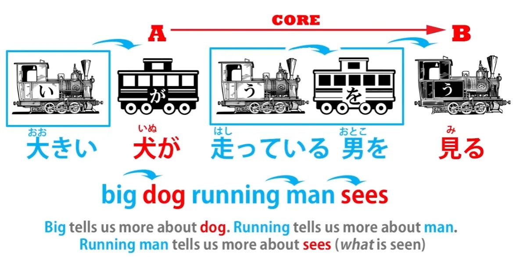
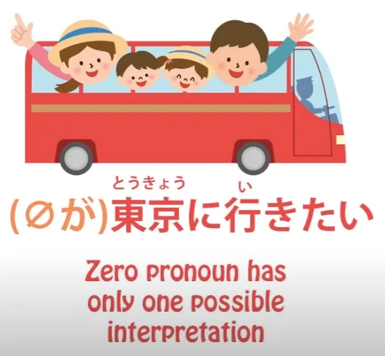
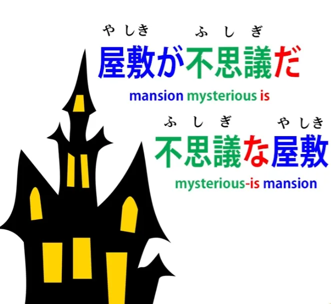

# **43. СМЕНА ПАРАДИГМЫ: Прорубитесь сквозь путаницу**

[**Japanese learning PARADIGM SHIFT: Cut through the confusion. Lesson 43**](https://www.youtube.com/watch?v=X_HlngOAvX8&list=PLg9uYxuZf8x_A-vcqqyOFZu06WlhnypWj&index=45&pp=iAQB)

こんにちは。

Сегодня мы поговорим о том, что я довольно-таки драматично называю <code>Последней Проблемой</code>. Что я имею в виду? Мы собираемся открыть новую область японского языка, и сделаем это тем же методом, с которого начали, то есть, рассматривая японский как японский, а не как английский, написанный неким секретным кодом. Причина, по которой я называю это <code>последней проблемой</code>, заключается в том, что это единственная проблема, которую некоторые из моих самых проницательных и аналитически мыслящих учеников находят в моих моделях японской структуры.

По большей части, если кто-то понимает мои модели, они становятся самоочевидными. И именно на этом я основываю свою работу. Я никого не прошу мне доверять. Посмотрите, работают ли они. Если не работают, выбросьте их. Если работают, используйте. Здесь нет никакого акта веры. Я воспринимаю эту единственную проблему как дань уважения моей работе. Отчасти потому, что, конечно, есть только одна проблема, что из целой и очень радикальной модели японского языка довольно интересно. Но вторая причина в следующем: у людей возникает эта проблема, потому что я их избаловала.

Я говорю это с долей юмора, но правда в том, что люди выходят из этого мира английских <code>объяснений японской грамматики</code> в Genki и различных (так называемых) сайтов по японской грамматике, и они покидают мир запутанной массы странных вещей, которые просто так означают то, что они означают, без какой-либо особой причины, с целым рядом исключений и случайных правил, и попадают в мир кристальной логики, где всё имеет смысл, где всё является тем, чем оно является, по веской причине.

И поэтому, когда они сталкиваются с чем-то, что выглядит как исключение или случайное правило, они хотят от этого избавиться. Они больше не потерпят даже одной такой вещи, и я не могу их винить. Однако это не случайное правило. Это нечто очень понятное, если мы сможем совершить ту же смену парадигмы, которую совершили в самом начале, и увидеть это таким, какое оно есть на самом деле в японском, а не смотреть на это английскими глазами. Так что же это? Давайте рассмотрим пример.

Если мы говорим <code>クレープが好きだ</code>, мы узнали, что это не означает <code>Я люблю блины</code>. Если вы думаете, что это означает <code>Я люблю блины</code>, то вы действительно отказались от всякой надежды когда-либо понять японскую структуру. Потому что, как мы знаем, каждое японское предложение имеет два основных элемента. Оно может иметь любой из трёх локомотивов, которыми могут быть глагол, прилагательное или существительное плюс связка. И вторая часть ядра предложения всегда одна и та же: это существительное, отмеченное частицей が. Мы не всегда можем его видеть, но оно всегда там.

И эти два элемента, локомотив и подлежащее, отмеченное частицей が (или главный вагон), являются ядром любого предложения. Это единственное, что нам нужно в предложении. У нас должны быть эти два, и всё остальное в логическом предложении рассказывает нам больше либо о локомотиве, либо о вагоне, отмеченном частицей が. Оно не может делать ничего другого.

Ядро предложения — это само предложение, а всё остальное является дополнением к одному из этих двух основных элементов. Итак, с <code>*(私は)* クレープが食べたい</code>, вагон, отмеченный частицей が, — это не <code>Я</code>, поэтому это не может быть <code>Я хочу есть блины</code>.

Потому что <code>Я</code> здесь ничего не делаю, блины — это главный вагон, отмеченный частицей が. А глава предложения, локомотив, — это не глагол, это прилагательное. Это вспомогательное прилагательное <code>-たい</code>. Оно присоединяется к глаголу, но фактический локомотив предложения — это не глагол, это прилагательное <code>-たい</code>. Оно не может означать <code>хотеть</code>, потому что <code>хотеть</code> — это глагол.

Итак, на самом деле это означает, что качество блинов таково, что оно вызывает во мне желание. Это многословный способ выразить это, но он позволяет избежать любого неправильного прочтения предложения, основанного на английском языке. Вот что это на самом деле означает. Оно описывает блины прилагательным образом, и то, что оно говорит о них, это то, что они обладают качеством, заставляющим меня хотеть их есть. И то, что мы узнали с самого начала, это то, что английский — очень эгоцентричный язык.

Если есть действие, субъективность, он всегда хочет поставить эго-актора в центр. В японском нет такого сильного императива.

Теперь, если мы посмотрим на это с точки зрения субъективностей — потому что многое из этого связано с субъективными чувствами, как и большая часть языка, — мы можем смотреть на субъективности двумя способами. Мы можем либо рассматривать их с вещью, которая вызывает субъективность, как фокус, как точку опоры этой субъективности, так что <code>блины, которые вызывают во мне желание</code>, являются точкой опоры этого предложения. *(Японский)* <code>Блины вызывают во мне желание есть.</code> Или мы можем рассматривать субъективность как действие — желание — и тогда мы ставим <code>меня</code> в центр. Мы ставим эго в центр и говорим <code>Я желаю есть блины</code>. *(Английский)*

Оба эти способа довольно естественны. Субъективность на самом деле — это то, что мы пассивно переживаем и что вызывается в нас чем-то извне. Это совершенно верный способ смотреть на вещи, и, возможно, более верный, чем английский эгоцентричный способ. Уж точно не менее верный. Японский предпочитает этот способ смотреть на это; английский предпочитает другой. И это распространяется на всевозможные области.

Так, например, японский язык очень рад сказать <code>水が犬に飲まれた</code>, что означает <code>Вода получила-питьё от собаки</code>. Ключевой актор этого предложения — вода, а не собака. Вода получает акт питья от собаки. Английский настолько предвзят к этому, что почти невозможно перевести это на английский, не превратив его в пассивный залог. В японском это не пассивный залог.

И эта предвзятость заходит так глубоко, что весь вспомогательный глагол <code>-れる/-られる</code>, который является глаголом получения действия, называется <code>пассивным залогом</code> этой псевдояпонской грамматикой, которую преподают на английском языке. Это не пассивный залог — просто единственный способ перевести это на английский — это превратить его в пассивный залог. Теперь вернёмся к нашим блинам.

Если мы говорим <code>クレープが食べたい</code>, центром действия являются блины. Они вызывают во мне желание. Если мы говорим <code>お腹が空いた、 *(zeroが)* 早く食べたい</code>, мы говорим <code>Я голоден; Я хочу есть скорее.</code> Теперь, у <code>早く食べたい</code> нет видимого актора, но актор этого — этот zero — это <code>я</code>, так что это <code>(zeroが) 早く食べたい</code> — <code>Я хочу есть скорее.</code>

Итак, это последняя проблема. Это то, против чего возражали некоторые из моих самых проницательных учеников. Им не нравится тот факт, что вспомогательное прилагательное <code>-たい</code> меняет полярность, что оно может описывать как нечто, вызывающее желание есть, так и человека, испытывающего желание есть, если индуктор явно не присутствует. *(Если это сбивает с толку, посмотрите Урок 9c о たい)* Они даже предлагали — и несколько человек предлагали мне это независимо друг от друга — предлагали обходное решение, говоря: <code>Ну, разве мы не можем сказать, что актор, отмеченный частицей が, на самом деле еда? Просто еда в целом, возможно: «Еда заставляет меня хотеть её есть».</code>

И я понимаю, почему они пытаются это сделать. Они пытаются избавиться от того, что выглядит как единственная аномалия в остальном совершенно логичной системе. Но на самом деле это не аномалия, и мы к этому скоро вернёмся. Обходное решение не работает, во-первых, потому что, если вы много знаете о японском, вы понимаете, что это не то, что происходит.

Человек не говорит, что он хочет есть что-либо или еду в целом, он *просто говорит, что хочет есть.* Это то, что, я думаю, вы интуитивно поймёте, но я также понимаю, что интуиция — это не аргумент. Даже Genki, вероятно, мог бы использовать карту интуиции для поддержки некоторых своих довольно диковинных интерпретаций японского языка.

Но нам не нужно на это полагаться. Мы можем представить доказательство. Давайте возьмём предложение <code> *(zeroが)* 東京に行きたい.</code> Это означает <code>Я хочу поехать в Токио.</code>

Теперь, в этом предложении нет никакого другого возможного <code>zeroが</code>, кроме <code>Я</code>. Это не может быть Токио, потому что это уже пункт назначения, отмеченный частицей に. Это не может быть <code>идти</code>, потому что это глагол, и мы никогда не можем отмечать что-либо, кроме существительного, частицей が или любой другой логической частицей.

Итак, мы знаем наверняка, что на самом деле возможно для <code>-たい</code> менять свою полярность, указывать не на объект, вызывающий желание что-то сделать, но также и на человека или животное, испытывающее желание что-то сделать. И это распространяется на другие области японского языка.

---

Например, потенциал. Когда мы говорим <code>本が読める</code>, мы говорим <code>Книга делает читабельным.</code>

Мы не можем перевести это напрямую на английский, потому что это глагол, а <code>читабельный</code> не является глаголом в английском, но в японском мы говорим <code>Книга делает читабельным.</code> Теперь это субъективность в определённом смысле, потому что речь идёт не о том, что в целом возможно читать книгу. Это было бы <code>[可能性]{かのうせい}</code>.

Речь идёт о том, что книга читабельна для конкретного человека или людей. Но опять же, подлежащее, отмеченное частицей が, — это книга. Так что сказать <code>Я могу читать книгу</code> или <code>Мы можем читать книгу</code> — просто ложно.

Это не то, что делает предложение, и если мы так думаем, мы придём к этой совершенно разрушительной идее, что が иногда может отмечать дополнение предложения. Она никогда не может. Она может отмечать только подлежащее, А-вагон предложения.

И это так крайне важно для японского языка, потому что именно из этого состоит каждое предложение, которое вы когда-либо увидите, когда-либо в вашей жизни: А-[вагона], отмеченного частицей が, и В-локомотива. Нарушьте это, и вы нарушите всё. Итак, актор <code>本が読める</code> — это книга: <code>Книга делает читабельным.</code>

Но если мы говорим <code>私が読める</code> или <code>さくらが読める</code>, то мы говорим <code>Я могу читать</code> / <code>Сакура может читать.</code> Не может читать конкретную книгу, не может читать газету, не может читать мангу, но может читать, является грамотным. Итак, ещё раз, потенциал может менять свою полярность.

Если есть конкретная читабельная вещь, то именно она <code>делает читабельным</code>, но если её нет, если речь идёт просто о грамотности в целом, то она меняет полярность и указывает на человека или людей, которые умеют читать. Теперь, почему это так?

Мы говорили о том, что неэгоцентричность японского языка фундаментально укоренена в более анимистическом способе видения мира. Я здесь ничего не говорю о том, во что верят японцы как отдельные личности в наши дни. Я говорю о том, как язык смотрит на мир.

Английский требует эго в центре; японский — нет. Он гораздо охотнее имеет не-эго акторов в качестве центра даже субъективно-ориентированного предложения. Но на этом всё не заканчивается.

И как только вы это осознаете, мы покончили с последней проблемой. Дело не только в том, что он не считает проблемой наличие не-эго актора в центре и что во многих случаях он предпочитает это, но и в том, что он видит двух — индуктора субъективности и получателя, испытывающего субъективность, — как нечто неразрывно связанное.

Действие субъективного желания, страха или хотения и т.д. — это то, что происходит между двумя, между индуктором и испытывающим. И мы можем смотреть на это с любой точки зрения, и это не имеет большого значения.

Предвзятость, так сказать, условие по умолчанию, состоит в том, чтобы приписывать это индуктору, но нет никаких трудностей в перемещении этого на испытывающего. Потому что эти двое не рассматриваются как полностью отдельные. Они — две половины одного и того же действия.

И если мы это поймём, мы будем смотреть на это гораздо больше японскими глазами. Нам не придётся перенаправлять это через странных английских посредников.

И это влияет на всевозможные вещи, не только на грамматические области, о которых мы говорили, но и на всевозможные вещи. Например, возьмём слово <code>不思議</code>. <code>不思議</code> означает <code>тайна</code>. Это существительное, оно означает <code>тайна</code>.

И оно может использоваться как адъективное существительное, в этом случае оно означает что-то вроде <code>таинственный</code>. Так что, если мы говорим <code>不思議な屋敷</code>, мы говорим <code>таинственный особняк</code>.

Но мы также можем присоединить <code>そう</code> к <code>不思議</code>, что, как мы обсуждали ранее, означает <code>кажется</code> или <code>похоже</code>. Так что <code>不思議そう</code>, казалось бы, означает <code>кажется таинственным</code> или <code>похоже на таинственное</code>.

Теперь, это само по себе бессмысленно, потому что <code>таинственный</code> — это субъективность. Если мы говорим, что что-то таинственно, это не объективное качество, как быть красным или быть трёх футов в высоту. Это субъективность. Это таинственно, потому что мы находим это таинственным.

Если мы не находим это таинственным, то оно не таинственно. Так что сказать, что это похоже на таинственное или кажется таинственным, бессмысленно, потому что сказать, что это таинственно, в первую очередь, означает именно это.

Но это не то, что означает <code>不思議そう</code>. <code>不思議そう</code> используется в предложениях вроде <code>「これはなーに？」とさくらは不思議そうに言った</code> — <code>«Что это?» — спросила Сакура с озадаченным видом.</code>

<code>不思議そう</code>, видите ли, снова меняет полярность. Оно не относится к вещи, которая вызывает чувство тайны, оно относится к человеку, испытывающему чувство тайны. Так что <code>不思議そう</code> означает что-то вроде <code>озадаченный</code>, иногда, возможно, <code>сбитый с толку</code>, но в любом случае это означает <code>воспринимающий качество **不思議** в чём-то другом</code>.

Итак, вы видите это полное изменение полярности, которое основано на более едином взгляде на мир, не просто более <code>анимистическом</code>, если использовать этот термин, но едином. Больше в том смысле, что внутреннее и внешнее не полностью разделены, а являются двумя сторонами одного и того же восприятия.

И если мы сможем это понять, последняя проблема будет решена, и целая область японского языка откроется и освободится от необходимости пропускать её через английский.

::: info
Как обычно, если этот урок кажется запутанным или сложным, я рекомендую заглянуть в комментарии к [**видео**](https://www.youtube.com/watch?v=X_HlngOAvX8&list=PLg9uYxuZf8x_A-vcqqyOFZu06WlhnypWj&index=47&ab_channel=OrganicJapanesewithCureDolly), где Долли обсуждает некоторые вещи более подробно.
:::