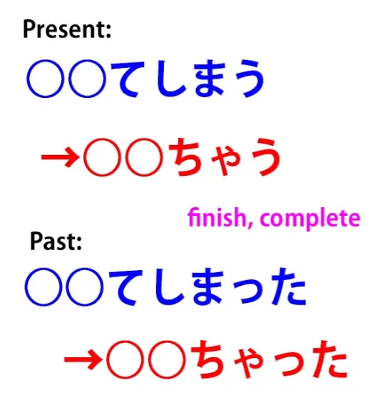
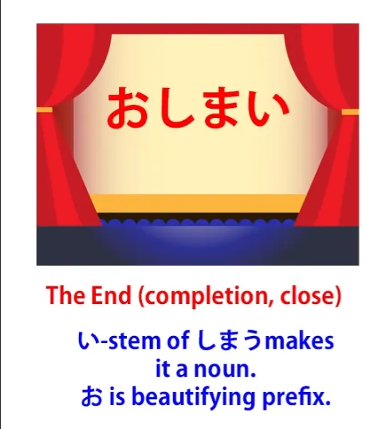
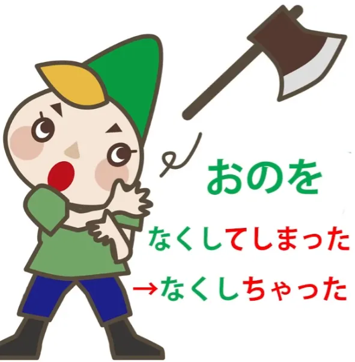

# **44. Как использовать естественный японский: ちゃう, ちゃった**

[**Как использовать естественный японский: chau, chatta, как они на самом деле работают ちゃう、ちゃった | Урок 44**](https://www.youtube.com/watch?v=VyZWoJCSQ5Q&list=PLg9uYxuZf8x_A-vcqqyOFZu06WlhnypWj&index=46&pp=iAQB)

こんにちは。

Сегодня мы поговорим о том, с чем вы постоянно сталкиваетесь в аниме, манге, повседневной беседе, ранобэ и везде, где встречается настоящий, так называемый повседневный — то есть неформальный — японский язык. Нам придётся использовать небольшой приёмчик, чтобы понять, как это работает с английской точки зрения. И, конечно, стандартные объяснения не дали бы вам такого приёма, потому что они даже не объясняют основы основополагающих принципов японской структуры. Так что мы получаем эффект трёх слепцов и слона.

Я уверена, вы слышали эту историю. Первый ощупывает одну из ног слона и говорит, что слон похож на дерево, второй ощупывает его хобот и говорит, что он похож на змею, третий ощупывает его хвост и говорит, что он похож на верёвку. И, конечно, ни одно из этих утверждений не является абсолютно неверным. Слон действительно проявляет все эти качества, но если вы представляете их как изолированные факты, не объясняя, что в основе всего лежит слон, который придаёт этому смысл, вы делаете всё гораздо сложнее, чем должно быть.

И стандартная английская так называемая японская грамматика делает это с самого начала со структурой языка, что катастрофично, а затем она делает это снова, и снова, и снова с тем, что она называет <code>грамматическими пунктами</code>. И сам факт того, что она называет их <code>грамматическими пунктами</code>, является частью проблемы, потому что по большей части это на самом деле не пункты, это логические структуры, и если мы понимаем структуру, нам не нужно запоминать их как отдельные бессмысленные <code>пункты</code>.

Итак, то, что мы обсудим сегодня, это выражения <code>-ちゃった</code> или <code>-じゃった</code>, которые присоединяются к концу глаголов. Если мы посмотрим на общепринятые объяснения, мы прочитаем, что это указывает на действие, которое было завершено или закончено, или на действие, о котором мы сожалеем или сделали случайно, или на что-то, что просто произошло неожиданно. Обычно они не добавляют к этому, что это также может указывать на что-то очень хорошее, или что это на самом деле может использоваться в будущем времени как <code>-ちゃう</code> или <code>-じゃう</code>, что, казалось бы, противоречит всему, что мы только что узнали, не так ли?

Итак, вместо того чтобы смотреть на хвост, ноги и хобот, давайте начнём с того, что посмотрим на настоящего слона. Прежде всего, <code>-ちゃう</code> или <code>-ちゃった</code> на самом деле является сокращением прошедшего времени слова <code>しまう</code>, что означает «завершить» или «закончить».

Так что, если вы когда-нибудь слушали японские сказки, вы обнаружите, что они часто заканчиваются формулой <code>おしまい</code>. А <code>しまい</code> — это い-основа, которая делает его существительным от <code>しまう</code>, так что оно означает <code>завершение / окончание / конец</code>.

Теперь, если вы поставите это в прошедшее время, это будет <code>しまった</code>, и <code>しまった</code> может использоваться само по себе как выражение, и оно обычно означает <code>Что-то пошло совсем не так / Это совершенно неудовлетворительно</code>: <code>しまった!</code> Возможно, лучший способ выразить это на русском — сказать что-то вроде <code>Вот и всё!</code> или <code>Это конец!</code> или что-то в этом роде.

Теперь мы можем использовать это <code>しまった</code> как вспомогательный глагол, который мы присоединяем к て-форме другого глагола. И мы делаем это так: мы ставим другое слово в て-форму, а затем добавляем <code>しまった</code>. И <code>-てしまった</code> сокращается до <code>-ちゃった</code>.

Теперь, если て-форма — это <code>で</code> (как мы знаем, это так в некоторых словах, и если вы этого не понимаете, я объясняла это в предыдущем видео[[5]](./5-verb-groups-and-the-て-form.md)[[40]](./40-3-pitfalls-in-japanese-and-how-to-avoid-them.md)), если て-форма — это <code>で</code>, то вместо <code>-ちゃった</code> оно становится <code>-じゃった</code>, точно так же, как <code>では</code> становится <code>じゃ</code>. Теперь это имеет гораздо более широкий спектр значений, чем просто <code>しまった</code> само по себе.

Его можно использовать для вещей, которые мы сделали случайно или о которых сожалеем. Например, мы часто говорим <code>忘れちゃった</code>, что является <code>忘れる</code> — <code>забыть</code> — плюс <code>-ちゃった</code>. Есть знаменитая песня <code>ネコ踏んじゃった</code>, которая очень забавная, и я оставлю [**ссылку**](https://www.youtube.com/watch?v=GpqGiKJt3cQ&ab_channel=ichigoclub15) в информационном разделе ниже.

И это означает <code>Я наступил на кошку</code>: <code>踏む</code> — <code>наступать (на что-то)</code>. Итак, мы видим, что здесь есть негативный оттенок, но это также может быть что-то очень хорошее.

Мы могли бы сказать <code>スーパーヒーローになっちゃった</code> — <code>Я стал супергероем</code>. Так что же общего у этих вещей? Случайные вещи, вещи, о которых мы сожалеем, вещи, которыми мы очень довольны.

Я бы выразила это, перевела бы на английский, используя слово <code>done</code> (сделано/готово), потому что, на мой взгляд, оно охватывает практически все случаи использования <code>-ちゃった</code>. <code>忘れちゃった</code> — <code>I done forgot</code> (Я *взял да и* забыл); <code>猫踏んじゃった</code> — <code>I done trod on the cat</code> (Я *взял да и* наступил на кошку); <code>スーパーヒーローになっちゃった</code> — <code>I done became a superhero</code> (Я *взял да и* стал супергероем).

Во всех этих случаях идея очень похожа. Мы говорим, что это произошло, это сделано, это завершено, это факт, и подразумевается, что мы не ожидали, что это станет фактом, или что большинство людей обычно не ожидали бы, что это станет фактом, но это так. Это *взяло да и* случилось. И если мы это поймём, будет очень легко понять все различные обстоятельства, при которых используется <code>-ちゃった</code>.

Единственное реальное отличие этого от <code>done</code> в английском заключается в том, что мы используем это не только в отношении прошлых событий. Мы также используем это в отношении будущих событий. Так, мы можем сказать <code>夏休みが終わってしまう</code>, и это означает <code>the summer vacation will done end</code> (летние каникулы *возьмут да и* закончатся). Конечно, вы не можете так сказать по-английски, но по сути это то, что вы говорите.

Они просто возьмут и закончатся. Вот что произойдёт, и это будет сделано, и мы ничего не сможем с этим поделать. Если вы собираетесь рассказать кому-то что-то смущающее, вы можете сказать <code>君のは笑っちゃうだろう</code> — <code>You'll probably laugh</code> (Вы, вероятно, рассмеётесь) или <code>You'll probably done laugh / You'll probably just up and laugh</code> (Вы, вероятно, *возьмёте да и* рассмеётесь / Вы, вероятно, *просто возьмёте и* рассмеётесь).

Опять же, это та же идея, но в японском мы можем проецировать эту идею и в будущее. Мы можем сказать <code>今日はどんどん飲んじゃう</code>, и это <code>Сегодня я буду пить как сумасшедший</code>.

<code>どんどん</code> означает <code>один за другим, быстро, без остановки</code>; <code>飲んじゃう</code> — <code>done drink</code> (возьму да и выпью). Опять же, мы не можем поставить это в будущее по-английски, но можем поставить в будущее по-японски.

Итак, если мы понимаем, как это работает, нам не нужно иметь множество сложных объяснений всех их различных случаев. Они работают одинаково всё время, если мы просто думаем о том, как они работают, а не о том, каков их конечный результат при переводе на английский.

::: info

:::