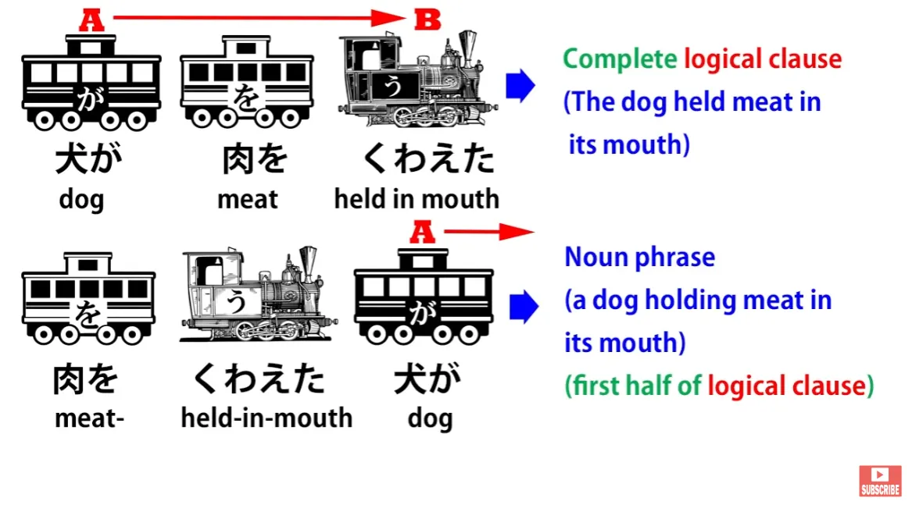
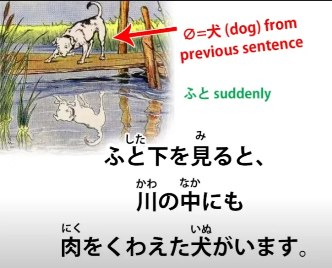
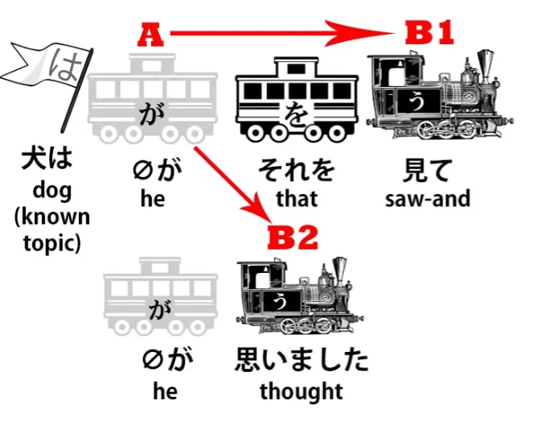
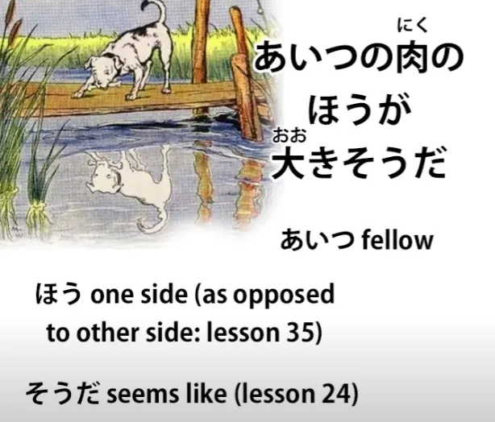
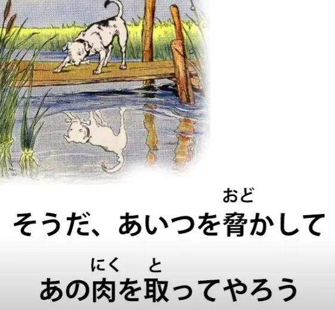
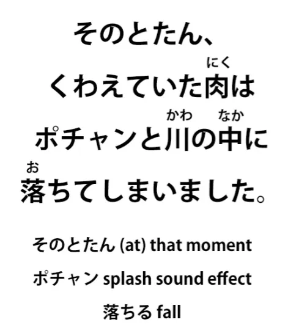
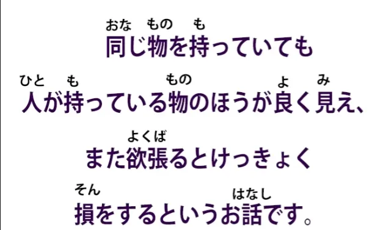

# **45. Руководство по первому шагу в технику самостоятельного погружения**

[**Погружение в японский. Руководство по первому шагу в технику самостоятельного погружения | Урок 45**](https://www.youtube.com/watch?v=g5uyGx5OnuE&list=PLg9uYxuZf8x_A-vcqqyOFZu06WlhnypWj&index=47&pp=iAQB)

こんにちは。

Сегодня мы собираемся совершить прыжок из абстрактного теоретического японского — грамматики, структуры и словарного запаса — в настоящее прямое погружение в реальный японский материал, предназначенный для японцев. Как вы знаете, я рекомендую делать это на как можно более раннем этапе, но это довольно сложно, потому что, оказавшись в реальном японском материале, вы столкнетесь со словарным запасом, которого вы не знали раньше, даже в очень простом материале, потому что маленькие японские дети обладают огромным словарным запасом по сравнению даже с иностранцами, которые сдавали довольно сложные экзамены по японскому языку. Вот почему я не рекомендую колоды с базовой лексикой и тому подобное. Способ освоить базовую лексику, выходящую за рамки небольшой основы, — это осваивать ее по мере продвижения по реальному японскому материалу. Таким образом, вы получите тот словарный запас, с которым вы действительно будете сталкиваться и который будете использовать.

Итак, что я собираюсь сделать, так это взять простую японскую историю, которая никоим образом не адаптирована для иностранцев. Она такая, какая есть. И у нее также есть аудио, ссылку на которое я оставлю в комментариях ниже. Итак, как только мы пройдемся по истории, и она станет вам понятна, вы сможете загрузить аудио на свой телефон или mp3-плеер и слушать ее снова и снова. Это закрепит любой новый словарный запас; это закрепит ритм и устную форму японского языка, а также структуру, потому что нам нужно перевести структуру и словарный запас из абстрактной области, где вы их знаете, но должны очень тщательно обдумывать, чтобы что-то сделать, в область, где это начинает становиться инстинктивным.

Поэтому, пожалуйста, используйте [**это аудио**](https://www.youtube.com/watch?v=jjmWN2rI8e4&ab_channel=hukumusume), как только мы пройдемся по истории. Она очень короткая, и я собираюсь создать страницу, на которую я [**дам ссылку**](http://learnjapaneseonline.info/taking-the-plunge-japanese-self-immersion-links-to-all-structure-points/) ниже, где я приведу ссылки на различные видео, в которых я рассказываю о грамматических моментах, с которыми мы сталкиваемся. Вы увидите, что даже в такой короткой и простой истории мы используем много структур, с которыми мы сталкиваемся в моих различных уроках. Итак, давайте начнем.

Это короткая и простая басня о жадной собаке. И первое предложение: <code>肉をくわえた犬がはしをわたっていました.</code>

Итак, вы видите, что это японский в стиле です/ます, поэтому, если вы немного не уверены в этом, пожалуйста, обратитесь к моему видео о です/ます. <code>肉をくわえた犬が.</code> Итак, <code>肉</code> означает <code>мясо</code>, а <code>くわえる</code> означает <code>держать во рту</code>. Это одно из тех слов, которые вы могли бы изучить с помощью огромной колоды базовой лексики и все равно не знать. И то, что здесь происходит, — это очень распространенный прием инвертирования простого логического предложения, чтобы превратить его в описательное.

Итак, <code>犬が肉をくわえた</code> означает <code>собака держала мясо во рту</code>, но <code>肉をくわえた犬</code> означает <code>собака, которая держала мясо во рту</code>. Итак, эта собака является подлежащим нашего предложения, отмеченным частицей が. <code>肉をくわえた犬がはしをわたっていました.</code> <code>[橋]{はし}</code> — это <code>мост</code>, а <code>わたる</code> — <code>пересекать</code>. Итак, собака была в процессе (<code>-ている</code>) пересечения моста. <code>肉をくわえた犬がはしをわたっていました.</code> Итак, это задало сцену. Мы знаем, что происходит.

<code>ふと下を見ると、川の中にも肉をくわえた犬がいます.</code>

Итак, первое, на что здесь стоит обратить внимание, это то, что это второе предложение находится в непрошедшем времени, не так ли? Так что это различие между японской и английской повествовательной конвенцией. В английском повествовании, если повествование ведется в прошедшем времени, оно остается в прошедшем времени, и каждое предложение находится в прошедшем времени. В японском повествовании это не так.

Мы можем начать повествование в прошедшем времени, но иногда, когда мы хотим придать чему-то больше непосредственности, мы просто переходим в настоящее время. Это недопустимо в английском повествовании, но совершенно допустимо в японском, поэтому нам нужно знать об этом и не позволять этому сбивать нас с толку. Итак, что здесь происходит?

<code>ふと</code> означает <code>внезапно</code> — я не буду объяснять здесь самый простой словарный запас, потому что предполагаю, что у вас есть очень базовый словарный запас, чтобы начать погружение в японское повествование. Итак, <code>ふと</code> означает <code>внезапно</code>. <code>ふと下を見ると</code> — <code>(собака) внезапно посмотрела вниз</code>.

Нулевое местоимение здесь — <code>оно</code>, собака. Итак, собака внезапно посмотрела вниз, и это <code>と</code> — условный союз, <code>если</code> или <code>когда</code>, и я дам ссылку на это[[30]](./30-japanese-conditionals-と.md). Итак, это означает <code>Когда собака внезапно посмотрела вниз...</code> или <code>Собака внезапно посмотрела вниз, и...</code> <code>Когда собака внезапно посмотрела вниз... 川の中にも</code>.

<code>川の中に</code> означает <code>в реке</code>, а <code>も</code> здесь говорит нам <code>также</code>: <code>также в реке</code>. <code>川の中にも肉をくわえた犬がいます.</code> Итак, <code>также в реке есть собака, несущая мясо во рту</code>. Не только на мосту, но и в реке есть собака, несущая мясо во рту.

<code>犬はそれを見て思いました.</code> Теперь собака упоминается с は, а не с が, и это потому, что собака уже была представлена, так что это больше не <code>собака</code>, это <code>та самая собака</code>. И я [**дам ссылку**](https://www.youtube.com/watch?v=9l_ZlQQU4ZE&ab_channel=OrganicJapanesewithCureDolly) на видео, где я это объясняла.

<code>犬はそれを見て</code>; <code>それ</code> — это <code>то</code>, и это первая часть сложного предложения: <code>Собака увидела это и...</code> — て-форма здесь дает нам <code>и</code>.

И я дам ссылку на сложные предложения[[4]](./4-japanese-verb-tenses.md). Я перестану говорить вам, на что я даю ссылки, но если вы посмотрите на специальную страницу, которую я создала — на которую я [**дам ссылку**](http://learnjapaneseonline.info/taking-the-plunge-japanese-self-immersion-links-to-all-structure-points/) ниже — я приведу все ссылки на различные части этой истории. Вам, вероятно, не нужно просматривать их все, но если какие-то моменты вас смущают, вы можете перейти к видео, где я объясняла эти конкретные моменты. Хорошо.

Итак, <code>犬はそれを見て</code> — это само по себе логическое предложение: <code>Собака увидела это и... 思いました.</code> <code>Собака увидела это и подумала (или почувствовала).</code> <code>あいつの肉のほうが大きそうだ.</code>

<code>あいつ</code> — это <code>тот парень/тот тип/тот персонаж</code>. <code>あいつの肉のほうが</code>, то есть <code>сторона мяса того персонажа...</code> (мясо того персонажа в отличие от моего мяса) <code>...大きそうだ.</code> Итак, это соединение <code>そう</code> с прилагательным <code>大き</code> — <code>выглядит</code> — что означает, что оно выглядит или кажется больше. <code>Мясо того персонажа выглядит больше, чем мое.</code>

Как мы узнаем, что это сравнительная степень? Из-за <code>ほう</code>, которое говорит нам, что мы говорим о стороне мяса того персонажа в отличие от какой-то другой стороны, которая в данном случае будет <code>моим мясом</code>.

---

<code>犬は悔しくてたまりません.</code> <code>悔しい</code> — это прилагательное, и оно означает, что что-то <code>раздражает</code> или <code>досаждает</code>. Но, как и все прилагательные субъективной эмоции, когда оно применяется непосредственно к индивиду, оно может относиться не к раздражающей природе объекта, а к раздражению индивида. Так оно и происходит здесь.

<code>犬は悔しい</code> означает <code>собака была раздражена</code>. Это могло бы означать <code>собака была раздражающей</code>, но в данном случае это означает <code>собака была раздражена</code>. И затем, <code>たまりません</code>. <code>たまる</code> означает <code>терпеть</code> или <code>выносить</code>, поэтому <code>たまりません</code> означает <code>не выносить</code>. Теперь, когда вы добавляете <code>-てたまりません</code> к чему-либо, мы говорим, что это было <code>в невыносимой степени</code>. Собака была невыносимо раздражена, увидев эту другую собаку с тем, что, как он считал, было куском мяса большего размера, чем его собственный.

---

И затем у нас есть цитата от собаки: <code>そうだ、あいつを脅かしてあの肉を取ってやろう.</code>

<code>そうだ</code> — <code>Ладно/так и есть</code>; <code>あいつを脅かして</code> — <code>脅かす</code> означает **запугивать** или <code>пугать (кого-то)</code>, так что: <code>Я собираюсь напугать того парня и... あの肉を取ってやろう.</code>

<code>あの肉</code>, конечно, это <code>то мясо</code>; <code>取る</code> — <code>брать</code>. <code>取ってやろう</code> связано с <code>-てあげる</code>, что означает <code>совершить действие для кого-то / дать кому-то выгоду от вашего действия</code>.

<code>-てやろう</code> похоже на <code>-てあげる</code> тем, что оно означает «сделать это для кого-то другого», но вместо того, чтобы быть почтительным, оно является противоположностью этого. Это действие свысока по отношению к кому-то другому, действие по отношению к тому, кого вы считаете ниже себя. Так, например, было бы уместно использовать <code>-てやろう</code> для кормления собаки, потому что собака действительно законно считается ниже.

В таком случае это просто довольно грубый способ говорить. И, конечно, то, что он собирается сделать, не является одолжением для собаки: он собирается украсть что-то у этой бедной собаки в реке. И это скорее похоже на то, как кто-то мог бы сказать по-английски: <code>I'm going to punch your head for you,</code> что формулируется так, будто вы делаете кому-то одолжение, хотя на самом деле вы делаете кому-то что-то, что не является одолжением. <code>Я заберу это мясо для него.</code>

<code>そこで、犬は川の中の犬に向かって思いっきり吠えました.</code>

<code>犬は川の中の犬に向かって.</code> <code>向かう</code> означает <code>смотреть в сторону</code>, поэтому собака повернулась лицом / направила свое действие к собаке в реке. <code>思いっきり吠えました.</code> <code>吠える</code> означает <code>лаять</code>, а <code>思いっきり</code> — это... <code>思い</code> — это <code>мысль</code> или <code>чувство</code>, и когда мы добавляем это <code>-っきり</code>, которое на самом деле является <code>切り</code> от <code>cut</code> (резать), это означает сделать что-то полностью, до предела, можно сказать.

Итак, <code>思いっきり</code> означает <code>вложить в это всю свою мысль, все свое сердце</code>. Итак, собака повернулась к собаке в воде *(реке)* и вложила все свои силы в лай на нее, чтобы напугать.

Ван-ван-ван-ван. Как мы все знаем, <code>ワンワン</code> — это <code>гав-гав</code> по-японски.

<code>そのとたん...</code> <code>そのとたん</code> означает <code>в тот же момент</code>. <code>とたん</code> означает <code>как только что-то происходит или сразу после того, как это происходит</code>. Итак, <code>そのとたん</code> — <code>в этот момент / в этот момент / в тот же момент</code>.

<code>くわえていた肉はポチャンと川の中に落ちてしまいました</code> Итак, в этот момент мясо, которое держалось во рту — <code>くわえていた肉は</code> — <code>ポチャン</code>, что является звуковым эффектом брызг, <code>ポチャンと</code> — и -と, конечно, отмечает звуковые эффекты — <code>川の中に</code> — <code>в реку</code> — <code>落ちて</code> — <code>落ちる</code>, падать — <code>しまいました</code>. И это <code>しまいました</code> говорит <code>оно взяло да и упало в реку</code>, и я дам ссылку на видео об этом <code>しまいました / ちゃった</code>, что означает <code>оно взяло да и случилось</code>.[[44]](./44-how-to-use-natural-japanese-ちゃう-ちゃった.md)

Ах! <code>川の中には、がっかりした犬の顔が映っています</code>

И снова мы переключились на настоящее время, чтобы придать этому больше непосредственности. <code>Внутри реки... がっかりした</code> — <code>がっかり</code> означает <code>расстроенный / подавленный / разочарованный / унылый</code>, <code>映る</code> — <code>отражать</code>, <code>顔</code> — <code>лицо</code>. Итак, внутри реки отражалось лицо разочарованной, несчастной собаки.

<code>さっきの川の中の犬は水に映った自分の顔だったのです</code> <code>のです</code> — <code>Дело в том, что это было...</code> Дело в том, что это было что?

Дело в том, что... <code>さっきの川の中の犬は</code> — <code>さっき</code> в данном случае означает <code>только что</code> или <code>предыдущий</code>. Итак, <code>さっきの川の中の犬</code> — это <code>собака в реке, которая была только что</code>; <code>水に映った自分の顔だった</code> — <code>自分</code> — это <code>сам</code>, так что это <code>собственное лицо, отраженное в воде</code>: <code>水に映った自分の顔だったのです.</code>

Дело в том, что это было... дело в том, что предыдущая собака в реке была собственным лицом, отраженным в воде. И теперь есть две морали, которые следуют из этой истории. И они объединены в одно длинное сложное предложение, которое выглядит немного сложным, поэтому давайте просто разделим его на две части.

<code>同じ物を持っていても人が持っている物のほうが良く見え、</code> Итак, прежде всего, это <code>見え</code> — это <code>[連用形]{れんようけい}</code>, い-основа глагола <code>見える</code>, означающего <code>быть видимым или выглядеть как</code>. Она не выглядит как い-основа, потому что это ichidan-глагол, и, как мы знаем, все основы ichidan-глаголов выглядят одинаково. Но い-основа глагола может использоваться, особенно в литературных контекстах, подобно て-форме, для соединения двух логических предложений внутри сложного предложения. Итак, это <code>見え</code> завершает логическое предложение, а затем ведет ко второму логическому предложению, которое является другой моралью истории.

Итак, давайте сначала рассмотрим первую мораль. <code>同じ物を持っていても</code> — теперь, окончание <code>-ても</code>, как мы знаем, означает <code>даже если</code>, поэтому мы говорим <code>同じ物</code> — <code>то же самое</code> — <code>を持っていても</code> — <code>находится в состоянии ношения</code> (или держания, или обладания). Итак, даже если они обладают тем же самым (<code>同じ物</code>) <code>人が持っている物</code> — <code>то, что есть у людей</code> — и <code>人</code> здесь означает <code>другие люди</code>.

Вы часто будете видеть это в японском: <code>人</code> в целом может означать <code>другие люди</code>; оно означает <code>люди в целом</code>, но оно означает <code>люди, отличные от самого себя</code>. <code>人が持っている物</code> — <code>то, что есть у других людей... のほうが良く見える</code> — <code>のほう</code>, снова, это сравнительная степень, <code>сторона (того, что есть у других людей)</code>; <code>良く</code>, конечно, это <code>いい</code>, поэтому <code>良く見える</code> означает <code>выглядеть хорошо</code>. Итак, то, что есть у других людей, выглядит хорошо; другими словами, по сравнению с собственными вещами, их вещи выглядят хорошо. Итак, первая мораль: даже если это одно и то же, то, что есть у других людей, может выглядеть лучше.

В английском мы, вероятно, сформулировали бы это наоборот и сказали: <code>Вещи других людей кажутся лучше наших, но на самом деле они те же самые.</code>

---

<code>また</code> — <code>また</code> означает <code>снова</code> или в таких случаях означает <code>также</code>. Итак, также вторая мораль: <code>欲張るとけっきょく損をするというお話です.</code> <code>欲張る</code> означает <code>быть жадным / быть полным желаний и хотений</code> — <code>欲張る</code>.

<code>欲張ると</code> — это снова этот союз <code>と</code>, означающий «если» или «когда»; в данном случае, <code>если кто-то **欲張る**</code>, если кто-то полон эгоистичных желаний — <code>けっきょく</code>, что означает <code>в конце концов</code>, <code>けっきょく損をする</code> — <code>損</code> означает <code>потеря</code>, <code>損をする</code> буквально означает <code>сделать потерю</code>, но на самом деле означает <code>понести потерю</code> или <code>пострадать от потери</code>. Итак, это означает: если вы полны эгоистичных желаний, в конце концов, вы понесете потери.

<code>というお話です</code> — <code>という</code>, так что это цитирует то высказывание <code>Если вы полны эгоистичных желаний, вы понесете потери</code> — <code>というお話です</code> — <code>お話</code> — это история, <code>物語</code> — <code>お話</code>. Итак, <code>это история, которая говорит: «если вы полны эгоистичных желаний, вы понесете потери».</code>

Вот так. Это очень короткая история, как вы видите, в ней много всего. Даже в такой короткой и очень простой истории мы сталкиваемся со всеми видами вещей, которые мы изучили в ходе серии «Структура». И если мы используем то, что мы изучили, мы можем понять все в истории.

Итак, теперь вы внимательно, не торопясь, просмотрите это, используя это видео. Убедитесь, что вы все в ней поняли, а затем загрузите ее на свой телефон или mp3-плеер или что бы вы ни использовали, и слушайте, слушайте, слушайте. Запомните новый словарный запас, но что еще важнее, усвойте структуру, ее ощущение, чтобы это перестало быть абстрактной работой, такой, как та, что мы проделали здесь, объясняя все, и начало становиться интуитивным пониманием языка...