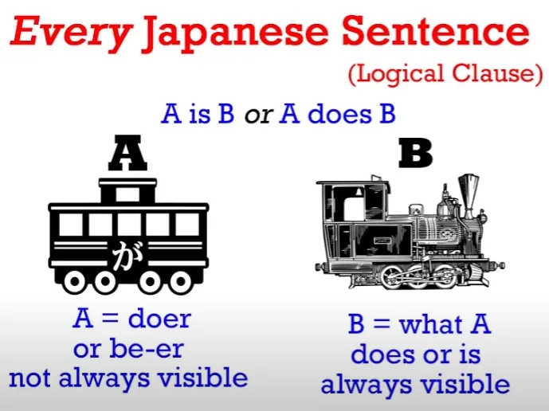
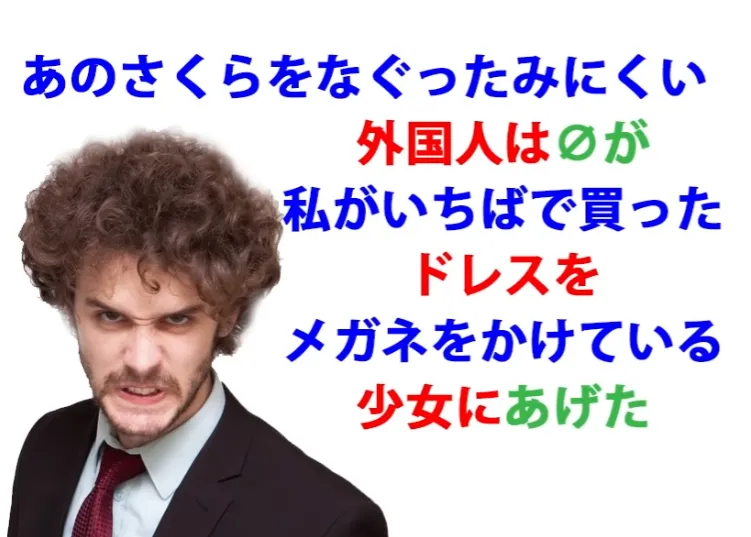
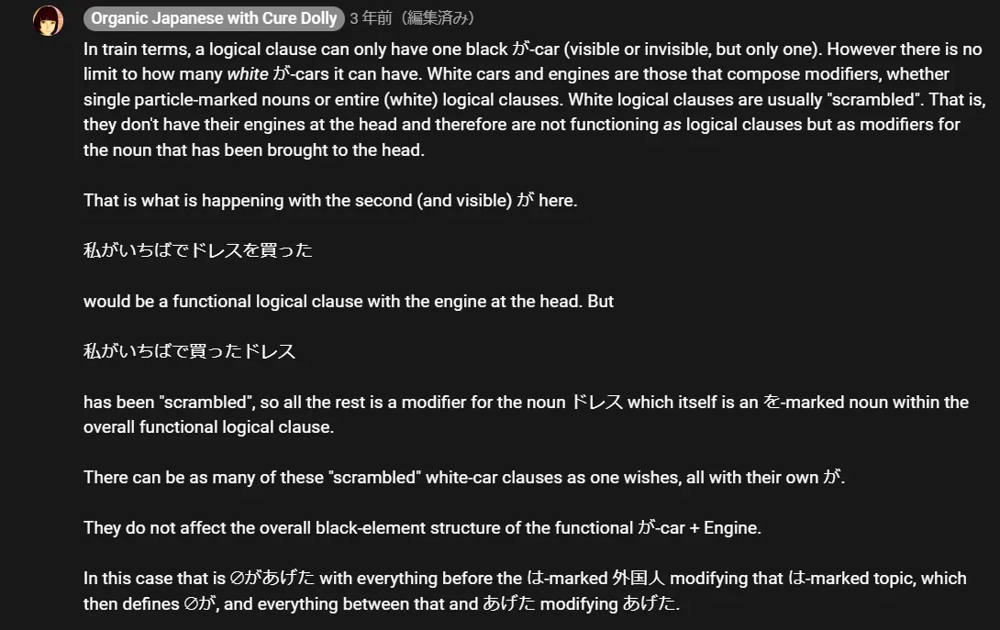
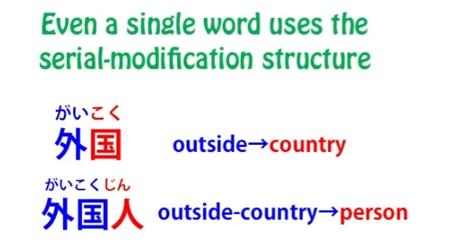
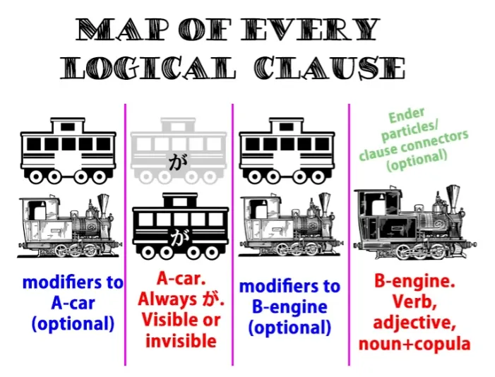

# **47. Как понять японский: Ваше секретное оружие для разбора предложений**

[**Как понять японский: Ваше секретное оружие для разбора предложений | Урок 47**](https://www.youtube.com/watch?v=z9S2J8tlnUE&list=PLg9uYxuZf8x_A-vcqqyOFZu06WlhnypWj&index=49&pp=iAQB)

こんにちは。

Сегодня мы поговорим о секретном оружии, которое позволит вам понять любое японское предложение, независимо от того, насколько сложным оно может показаться. Многие японские предложения на самом деле выглядят гораздо сложнее, чем они есть, из-за того, что я называю модульной структурой или структурой модификации языка. Но как только мы поймем, как это на самом деле работает, эта структура перестанет быть нашим врагом и станет нашим другом, потому что она позволяет нам разбить любое сложное японское предложение на нечто до смешного простое.

Я говорила вам с самого начала этого курса, что каждое японское предложение состоит из двух элементов: это А-вагон (подлежащее) и Б-локомотив.

А-вагон всегда отмечен частицей が. Мы не всегда можем его видеть, но, видим мы его или нет, он всегда логически присутствует и всегда отмечен частицей が. Б-локомотив может быть только одним из трех типов.

Это может быть глагол, прилагательное или существительное плюс связка <code>だ</code> или <code>です</code>. Существует только два типа предложений: предложения типа <code>А есть Б</code> и предложения типа <code>А делает Б</code>.

В предложении типа <code>А делает Б</code>, А — это то, что делает Б, которое является локомотивом, и которое должно быть глаголом. В предложении типа <code>А есть Б</code>, А — это то, что является Б, и которое должно быть прилагательным или существительным плюс связка. Мы видели гораздо более сложные предложения с тех пор и убедились, что каждое из них имеет те же А и Б в качестве своего фундаментального ядра.

Но важная вещь, которую мы рассмотрим сегодня, заключается в том, что А и Б — это не просто ядро предложения: они — *само предложение*. Все остальное не делает ничего, кроме как сообщает нам что-то еще об А или что-то еще о Б. Единственное, что может иногда усложнять это, — это тот факт, что, когда мы говорим <code>предложение</code>, на самом деле мы имеем в виду логическое предложение.

Иногда мы используем эти два термина как взаимозаменяемые, и очень часто мы можем использовать их взаимозаменяемо, но разница в следующем: логическое предложение по определению является полным предложением, то есть мы могли бы поставить <code>○ / まる</code> или точку в конце него, и тогда это будет предложение. Оно может существовать само по себе; оно грамматически верно; ему ничего больше не нужно. Это предложение. Но причина, по которой мы называем его <code>логическим предложением</code>, заключается в том, что *предложение может содержать более одного логического предложения.*

То есть оно может содержать в себе два элемента, каждый из которых мог бы быть полным предложением. Очень простой пример этого — если мы скажем <code> *(zeroが)* お店に行って *(zeroが)* パンを買った</code>, что по-английски означает <code>I went to the shops and bought bread</code> (Я пошел(ла) в магазин и купил(а) хлеб).

И в английском, и в японском это два логических предложения, объединенных в одно сложносочиненное предложение. И я говорила о сложносочиненных предложениях в другом видео. Итак, здесь у нас есть логическое предложение <code> *(zeroが)* お店に行った</code> — <code>Я пошел(ла) в магазин</code> — и <code> *(zeroが)* パンを買った</code> — <code>Я купил(а) хлеб</code>.

В английском это <code>I went to the shops and I bought bread</code>. В японском нам не нужно, чтобы <code>Я</code> было видимым, но оно должно быть логически там, и оно логически несет частицу が. Иногда говорят, что английский требует, чтобы подлежащее было видимо в каждом предложении, но это на самом деле не так, хотя и близко к истине.

И это пример того, как это не всегда верно. Английский на самом деле использует нулевое местоимение так же, как и японский. Просто он делает это не так часто. Так что с этим предложением в английском мы обычно не говорим <code>I went to the shops and I bought some bread</code>.

Мы обычно говорим <code>I went to the shops and bought some bread</code>. Так что вы видите, что здесь английский на самом деле использует нулевое местоимение. Нам не нужно говорить <code>I</code> дважды.

Нам разрешено переносить его из контекста во второе логическое предложение, точно так же, как японский гораздо свободнее позволяет нам это делать. Но во всех случаях подлежащее присутствует. Хлеб не покупает себя сам. Я его покупаю, независимо от того, виден ли я как подлежащее или нет.

Итак, один из навыков, который нам нужен для понимания сложного предложения, — это способность видеть, где заканчиваются логические предложения, видеть, когда что-то на самом деле является полным логическим предложением со своим собственным А-вагоном и Б-локомотивом. И я сделала целое видео, объясняющее, как это делать, так что вы можете посмотреть это видео после этого.[[34]](./34-understand-any-sentence.md)

Сегодня мы сосредоточимся на логическом предложении и на том, как оно может, казалось бы, усложняться. На прошлой неделе мы говорили о концепции модификаторов и рассматривали ее, возможно, в самой простой и доступной форме, а именно о модификаторах существительных. И чтобы понять модификаторы, вы должны понимать порядок слов в японском языке, потому что порядок слов в японском чрезвычайно важен. По мере того как предложения становятся сложнее, вы должны понимать порядок слов, чтобы понять, что они делают.

Так что те люди, которые говорят вам, что в японском нет установленного порядка слов или что японский — это SOV-язык, на самом деле водят вас за нос, потому что ни одно из этих утверждений не соответствует истине, как мы обсуждали на прошлой неделе.[[46]](./46-word-order-matters-2-simple-rules-to-crack-tough-sentences.md) Итак, первый закон порядка слов в японском языке заключается в том, что локомотив предложения, который может быть глаголом, прилагательным или существительным плюс связка, всегда должен стоять в конце предложения.

И второй закон, и это самый важный для наших нынешних целей, заключается в том, что все, что модифицирует что-либо, должно стоять перед ним. На прошлой неделе я сформулировала это так: <code>Все, что модифицирует любую \*ВЕЩЬ\*, должно стоять перед ней</code>, то есть все, что модифицирует существительное, должно стоять перед этим существительным.

Но мы можем пойти дальше, и это то, что мы сделаем на этой неделе. И мы можем просто сказать: <code>Все, что *модифицирует* ЧТО-ЛИБО, всегда стоит ПЕРЕД ним</code>. Это не обязательно должно быть существительное.

Что еще это может быть? Ну, это может быть главный глагол предложения.

Итак, давайте вернемся к несколько сложному предложению, которое мы анализировали на прошлой неделе. <code> *(zeroが)* いちばで買ったドレスをメガネをかけている少女にあげた.</code> — <code>Я отдал(а) платье, которое купил(а) на рынке, девочке в очках.</code>

Я раскрасила это, чтобы показать процесс модификации существительных. В этом предложении у нас есть А-вагон, который невидим (это <code>Я</code>, zeroが), и у нас есть локомотив, который является <code>あげた</code>. И это ядро предложения: <code>Я отдал(а)</code>.

Теперь внутри предложения у нас есть два существительных, и оба они модифицированы дополнительной информацией. И в обоих случаях эта информация дается путем взятия логического предложения и извлечения одного элемента и помещения его в начало предложения, в конец предложения, где находится локомотив.

Итак, мы могли бы сказать <code>いちばで *(zeroが)* ドレスを買った</code>, и тогда у нас локомотив в конце, и мы говорим <code>Я купил(а) платье на рынке</code>, но мы также можем извлечь любой элемент из этого предложения и поместить его в конец, и это становится модифицированным существительным. Итак, мы можем сказать, как мы говорим здесь, <code>いちばで *(zeroが)* 買ったドレス</code>, что означает <code>платье, которое я купил(а) на рынке</code>.

Мы также могли бы сделать то же самое с рынком: <code> *(zeroが)* ドレスを買ったいちば</code> — <code>рынок, на котором я купил(а) платье</code>. И ни одно из них не является логическим предложением, потому что оно не могло бы существовать само по себе как предложение, не так ли? Теперь это существительное, которое должно играть какую-то роль в более крупном предложении.

Итак, синие элементы здесь — это модификаторы, красные элементы — это существительные, отмеченные логическими частицами. *(последнее изображение)* И вот этот фундаментальный, радикальный факт, который вам нужно потратить мгновение, чтобы усвоить. **В предложении типа <code>А делает Б</code> существительные, отмеченные основными логическими частицами, кроме が,** **то есть частицами を, に, で и へ, являются модификаторами глагола.**

Логическая частица が сообщает нам, что является подлежащим предложения, что является А-вагоном. Логическая частица の является здесь исключением, потому что она связывает два существительных. Но основные логические частицы глагольных предложений — を, に, で и へ — делают одно и только одно.

**Они модифицируют глагол; они сообщают нам о нем больше.**

Итак, в этом предложении само предложение — это <code>(zeroが)あげた</code>, а все остальное сообщает нам больше об <code>あげた</code>.

::: info
Я приведу здесь прямые примеры японских предложений, но отнеситесь к ним с долей скептицизма.
(zeroが)あげた
:::

<code>Я отдал(а).</code> Что я отдал(а)? Объект, отмеченный частицей を *(прямой)*, сообщает нам это: <code>Я отдал(а) платье</code>. *(zeroが)ドレスをあげた*

Модификатор сообщает нам больше о платье: <code>платье, которое я купил(а) на рынке</code>. *いちばで(zeroが)買ったドレス (если неясно насчет zeroが здесь, проверьте Урок 46, раздел Правило 2)*

Кому я это отдал(а)? Объект, отмеченный частицей に *(косвенный)*, сообщает нам это: <code>Я отдал(а) это девочке</code>. *(zeroが)少女にあげた*

Какая девочка? Ну, модификатор сообщает нам больше о девочке: <code>девочка в очках</code>. *メガネをかけている少女。。。*

Итак, само предложение — это <code>(zeroが)あげた</code>, а все остальное сообщает нам больше об <code>あげた</code>. И независимо от того, насколько длинным и сложным оно становится, эта структура всегда остается неизменной.

Мы должны определить локомотив предложения, и это очень легко, потому что локомотив предложения неизменно находится в конце предложения. После него может быть пара частиц-окончаний предложений (и я сделала видео об этом), но логическим концом предложения является глагол, прилагательное или существительное плюс связка, которые являются последними в предложении.

Итак, мы всегда знаем, где найти локомотив: он находится в конце предложения. А А-вагон — это тот, кто выполняет этот глагол или является этим прилагательным или существительным плюс связка. Еще одна полезная вещь, которую нужно помнить, это то, что обычно достаточно легко найти даже невидимого актера, потому что за ним ничего не будет.

В этом предложении, как мы видим, происходит много модификаций, но все они модифицируют глагол.

Мы не можем иметь ничего, что модифицирует А-вагон, актера, отмеченного が, потому что актер, отмеченный が, невидим, а мы можем модифицировать только то, что мы можем фактически видеть в предложении.

::: info
Возможно, я не до конца понимаю, что Долли имеет в виду здесь под тем, что за zeroが ничего не стоит, поскольку она приводит примеры (в Уроке 46), где у невидимых актеров с が что-то стоит перед ними — даже в логических предложениях, например, место — いちばで(zeroが)青いドレスを買った в Уроке 46.
Я думаю, она просто имеет в виду, что это не сработало бы без упомянутого 私が, потому что платье модифицируется всей премодифицирующей фразой <code>私がいちばで買った</code>, которая является премодификатором для платья, вместо того чтобы быть собственным полным предложением, образующим самостоятельное предложение, как это было бы, если бы это было — 私がいちばでドレスを買った. Где глагол является последним в качестве главы предложения.
:::

Здесь же это просто премодификатор, а главный глагол предложения — あげた в конце.
*Итак, если бы мы хотели модифицировать оба элемента предложения, нам нужно было бы сделать первый видимым.

Давайте попробуем это сделать. <code>あのさくらをなぐったみにくい外国人は *(zeroが)* 私がいちばでかったドレスをメガネをかけている少女にあげた.</code> — <code>Тот уродливый иностранец, который ударил Сакуру, отдал платье, которое я купил(а) на рынке, девочке в очках.</code>

Теперь мы начинаем предложение с нелогической темы, отмеченной частицей は. Но эта тема определяет для нас нулевое местоимение, А-вагон предложения, отмеченный が, который является zeroが.

Теперь мы могли бы сказать <code>みにくい外国人がさくらをなぐった</code> — <code>Уродливый иностранец ударил Сакуру</code> — но то, что мы делаем здесь снова, это извлекаем один из элементов, в данном случае <code>外国人</code>, и помещаем его в конец предложения, **так что это не функциональное логическое предложение, это модифицированное существительное:** <code>уродливый 外国人, который ударил Сакуру</code>. Итак, это сообщает нам больше об этом 外国人: <code>Что касается того уродливого 外国人, который ударил Сакуру, он сделал...</code>

Что он сделал? <code>Он сделал...</code> — это <code>zeroが</code> — <code>он сделал...</code>, а затем мы говорим, что он сделал.

::: info
Я помещу этот комментарий здесь.
*
:::

И давайте заметим, что все, абсолютно все в этом предложении, кроме ядра, состоит из того, что мы могли бы назвать <code>последовательной модификацией</code>. Даже слово <code>外国人</code>, которое так часто встречается вместе, что мы склонны считать его самостоятельным словом, и оно является самостоятельным словом, на самом деле является примером *последовательной модификации*, когда одна вещь модифицирует то, что идет после нее.

Итак, <code>[国]{コク}</code> — это он-ёми от <code>[国]{くに}</code> — <code>страна</code>. <code>外国</code> — в <code>外国</code>, <code>外</code> модифицирует <code>国</code>. Что это была за страна? <code>Внешняя</code> страна, <code>иностранная</code> страна. И затем <code>[人]{ジン}</code>, которое является он-ёми от <code>[人]{ひと}</code> — <code>человек</code> — модифицируется этими двумя вместе.

Что это был за человек? Человек <code>из внешней страны</code>, человек <code>из иностранной страны</code> — <code>外国人</code>.

---

Итак, все в этом предложении модифицирует то, что идет после него, пока мы не дойдем до А-вагона, а затем у нас есть первый фундаментальный элемент предложения, а затем все после этого модифицирует локомотив. И это все, что может когда-либо произойти.

Так устроено каждое японское предложение. У нас есть А-вагон, у нас есть Б-локомотив. Если что-то модифицирует А-вагон, оно стоит непосредственно перед ним.

Если что-то модифицирует Б-локомотив, оно стоит непосредственно перед ним. Каждое существительное, отмеченное основной логической частицей, детективы нашего видео о логических частицах[[8b]](./8b-particles-explained.md):

を, に, で и へ, на самом деле **модифицируют глагол.** Они сообщают нам больше о глаголе, и я сказала в том видео, что эти логические частицы — кроме が, которая дает нам подлежащее любого предложения, и の, которая связывает два существительных — эти четыре фундаментальные логические частицы работают только в глагольных предложениях, предложениях типа <code>А делает Б</code>.

Или, в терминах детективов, они работают только с делами. И это потому, что их функция — сообщать нам больше о глаголе, модифицировать глагол.

Итак, каждое предложение имеет одну и ту же структуру: А-вагон, Б-локомотив, то, что модифицирует А-вагон, и то, что модифицирует Б-локомотив.

И больше ничего не может быть в предложении, кроме таких вещей, как частицы-окончания предложений. **Но в предложении может действовать более одного логического предложения**, и, как я уже сказала, определение логических предложений несложно…