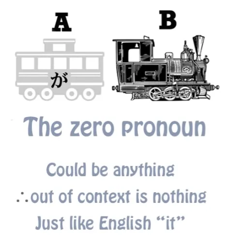
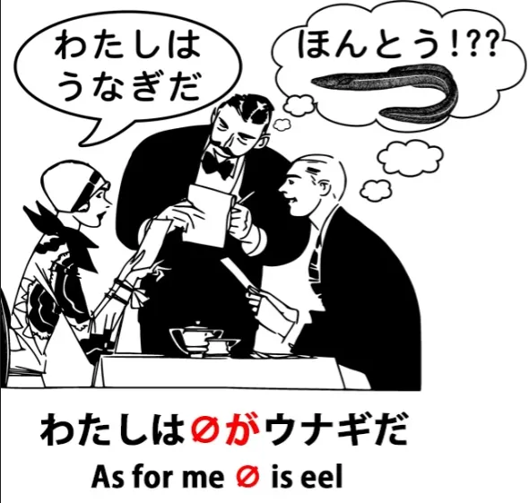
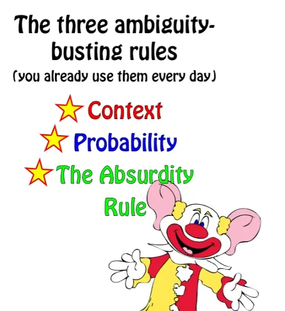
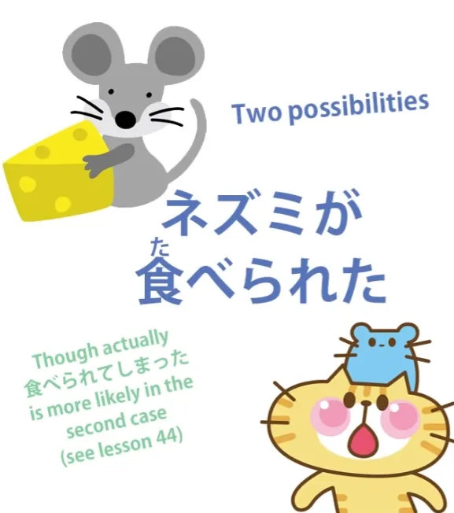
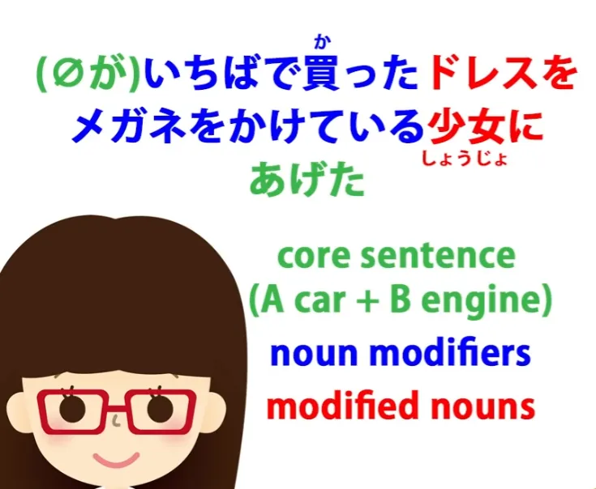
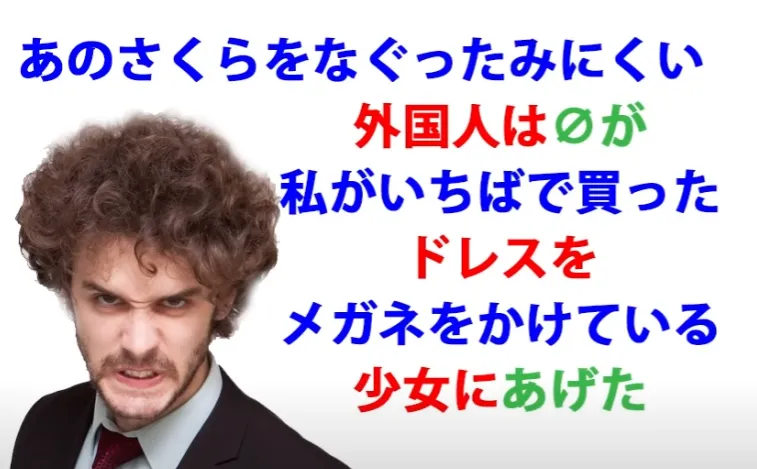

# **48. Как справляться с двусмысленностью в японском языке**

[**Как справляться с двусмысленностью в японском языке: 3 закона, которые всё проясняют! Урок 48**](https://www.youtube.com/watch?v=gcbbSW-KuTQ&list=PLg9uYxuZf8x_A-vcqqyOFZu06WlhnypWj&index=50&pp=iAQB)

こんにちは。

Сегодня мы поговорим о двусмысленности в японском языке, потому что это то, что значительно усложняет понимание языка для многих иностранных учащихся. У японского языка есть репутация двусмысленного языка. И независимо от того, правда это или нет, восприятие двусмысленности затрудняет понимание предложений. Итак, я хочу рассмотреть реальную и воспринимаемую двусмысленность в японском языке и как с ней справляться.

Японцы не испытывают никаких трудностей в понимании друг друга, и у вас тоже нет причин испытывать трудности. Большая часть воспринимаемой сложности проистекает из того факта, что язык преподается таким образом, что не объясняет его реальную структуру. Итак, давайте рассмотрим некоторые различные аспекты реальной и воспринимаемой японской двусмысленности.

Вероятно, первое, что делает японский язык двусмысленным и трудным для иностранцев, — это нулевое местоимение.

Для многих людей это настолько сбивает с толку, что в Сети есть умные и уважаемые преподаватели японского языка, которые даже заходят так далеко, что утверждают, будто в японском языке нет грамматического подлежащего. В нем, безусловно, есть грамматическое подлежащее, и оно присутствует в каждом предложении. Дело в том, что вы не всегда можете его видеть. Я уже объясняла раньше, что японское невидимое местоимение (или нулевое местоимение) на самом деле не более запутанно, чем английское <code>it</code>.

Слово <code>it</code> может означать галактику Андромеды, оно может означать дерево, оно может означать мою коленную чашечку (у меня есть коленные чашечки), оно может означать хвост шимпанзе, если предположить, что у шимпанзе есть хвосты, и даже если их нет, это может быть воображаемый хвост шимпанзе. Суть в том, что поскольку <code>it</code> может означать почти всё, оно на самом деле ничего не означает, кроме как в контексте. И именно так работает нулевое местоимение. И одно не более двусмысленно, чем другое.

Но некоторые люди скажут: <code>Но тот факт, что вы его не видите, означает, что мы даже не знаем, есть оно там или нет.</code> И ответ на это таков: да, мы можем знать. Пока мы понимаем структуру языка, мы знаем, что оно там, потому что оно должно быть там. Оно логически присутствует.

Так что нет никаких трудностей в точном определении нулевого местоимения, при условии, что мы понимаем структуру языка. И одна из трудностей, конечно, заключается в том, что традиционные учебники и веб-сайты по японской грамматике не учат реальной структуре языка и поэтому оставляют нас в сомнении по этому, как и по многим другим вопросам.

Но для этого и существует мой курс, так что если вы следуете моему курсу или следовали ему, вы должны достаточно ясно понимать структуру языка. Итак, может ли нулевое местоимение когда-либо вызвать двусмысленность?

Да, может. Точно так же, как <code>it</code> может в английском.

Например, если я скажу: <code>Моя правая антенна была так сломана, что отвалилась</code> (вы ведь не видели моих антенн, не так ли? Ну, это небольшой секрет, так что давайте пропустим) <code>Моя правая антенна была так сломана, что отвалилась</code>, вы из контекста знаете, что <code>it</code> относится к моей правой антенне. Но предположим, я скажу: <code>Я пытался починить дверную ручку, но моя правая антенна была так сломана, что отвалилась.</code> Тогда вы можете не знать, имею ли я в виду, что отвалилась моя правая антенна или что отвалилась дверная ручка.

И такого рода двусмысленность может возникнуть в любом языке, и на самом деле не чаще в японском, чем в любом другом языке. Что мы делаем, когда это происходит?

## Правило контекста

Ну, по сути, это задача говорящего — выразиться ясно, или слушателя — попросить ее уточнить, если она не выразилась ясно. Если вы смотрите аниме, читаете книги или играете в игры, или в целом имеете дело с любым видом профессионального письма или речи, люди будут выражаться ясно, если только они на самом деле не хотят играть с двусмысленностью.

Так что это то же самое, что и в английском или любом другом языке. В этом контексте в японском нет ничего особенного. Если мы вернемся к примеру, который мы использовали еще в нашем первом уроке о нелогическом маркере темы は, <code>私はうなぎです</code>. <code>私は *(zeroが)* アメリカ人です</code> означает <code>Я американец/американка.</code> / *Что касается меня, (я) американец/американка-есть* <code>私は *(zeroが)* うなぎです</code> обычно не означает <code>Я угорь.</code> *Что касается меня, (еда?) угорь-есть*

Если это сказано в ресторане и темой разговора является то, что мы собираемся есть, то будет понятно, что нулевое местоимение этого предложения — это не <code>私</code>, а то, о чем мы говорим: что мы собираемся есть.

---

Может ли это когда-либо означать <code>Я угорь</code>? Да, может.

Например, если я подойду к незнакомцу на улице и укажу на свой нос (что в Японии является способом указать на себя) и скажу: <code>私はうなぎです</code>, они поймут, что я говорю, что я угорь, и, вероятно, подумают, что я немного странная, потому что я не похожа на угря. Я немного похожа на человека, но, надеюсь, не очень похожа на угря. Теперь, если в ресторане мы вообще не говорили о еде, может быть, о погоде, и я вдруг скажу <code>私はうなぎだ</code>, люди, вероятно, все равно поймут, что я имею в виду, что я решила съесть угря.

Итак, как это работает? Ну, в японском — и это то же самое в английском или любом другом языке — у нас есть три правила, которые мы применяем для интерпретации предложений, которые могут быть каким-либо образом двусмысленными. И это: **контекст, вероятность и правило абсурда.**

Контекст — это очевидное правило, которое мы уже обсуждали. Если я скажу <code>Моя левая антенна была так сломана, что отвалилась</code>, вы из контекста знаете, что <code>it</code> означает мою левую антенну.

## Правило вероятности

Вероятность — это тот факт, что когда две возможности обе возможны, а контекст на самом деле не указал нам, какую из них выбрать, мы выберем ту, которая наиболее вероятна. И это не просто случайность. Это то, что каждый знает о языке. Так что слушатели делают это, говорящие ожидают, что слушатели будут это делать, и язык приспособлен для работы с этими правилами — в японском или в английском.

Так что в этом нет ничего загадочного. Например, если я скажу <code>I saw a man on a hill with a telescope</code> (Я видел(а) человека на холме с телескопом), вероятно, вы интерпретируете это как то, что я использовал(а) телескоп, чтобы увидеть человека на холме. Так что это вероятность, я на самом деле ничего не сказал(а), чтобы указать на эту интерпретацию, но это наиболее вероятная интерпретация по умолчанию.

Однако, если бы вы сказали мне: <code>Как думаешь, за нами следят?</code>, а я ответил(а): «Думаю, да. Я видел(а) человека на холме с телескопом», тогда вы, вероятно, интерпретировали бы мои слова как то, что я видел(а) невооруженным глазом человека на холме, у которого был телескоп, и поэтому он, вероятно, следил за нами. Теперь, есть и другие интерпретации.

Я могла бы иметь в виду, что я видела человека на холме, на котором был один из этих общественных платных телескопов, так что <code>холм с телескопом</code> было бы местом, где я видела человека. И можно даже иметь в виду, что я использую телескоп как пилу, чтобы распилить человека на холме. Теперь, последнее, как и <code>Я угорь</code>, несколько абсурдно, и поэтому такая интерпретация находится очень низко по шкале вероятности. *Здесь также помогает контекст.*

## Правило абсурда

И правило абсурда заключается в том, что бремя выражения лежит на абсурде. И это похоже на юридический принцип, что бремя доказывания лежит на обвинении. Другими словами, мы предполагаем, что ответчик невиновен, если только мы не можем доказать, что он виновен.

Аналогично, мы предполагаем, что утверждение не абсурдно, если нет четких доказательств того, что абсурдность подразумевается. Так, например, <code>Я ужинал(а) с Сакурой вчера вечером</code> обычно не считается двусмысленным предложением. <code>Я ужинал(а) палочками вчера вечером</code> также не считается двусмысленным предложением. Но вы видите, что они структурированы идентично, но работают по-разному.

Теперь, если бы я хотел(а) сказать <code>Я ужинал(а) с Сакурой вчера вечером</code>, имея в виду, что я использовал(а) Сакуру в качестве столового прибора, или если бы я хотел(а) сказать <code>Я ужинал(а) палочками вчера вечером</code>, имея в виду, что дружелюбная анимированная пара палочек для еды была моим спутником за ужином, моей обязанностью было бы прояснить это. Я не могу передать вам идею, что я использовал(а) Сакуру в качестве столового прибора, сказав <code>Я ужинал(а) с Сакурой вчера вечером</code>.

Вы всегда будете придавать этому более вероятную и менее абсурдную интерпретацию.

---

Язык оставляет за собой право, и должен оставлять за собой право, выражать невероятное и абсурдное. В противном случае у языка были бы целые области, которые он не смог бы выразить. Но чем дальше вы отходите от нормы, тем выше обязанность говорящего ясно выражать то, что она говорит.

Так что если я действительно хочу сказать, что я использовал(а) Сакуру в качестве столового прибора, мне придется сказать <code>Я ужинал(а) вчера вечером и использовал(а) Сакуру в качестве пары палочек для еды.</code> Всё, что содержит хоть какую-то двусмысленность, будет иметь абсурдную возможность исключенной. Это не логика, это не грамматика, но это то, как работают человеческие языки — английский, японский, любой другой язык.

Чтобы привести конкретный пример в японском, кое-что, что иногда беспокоит людей, это тот факт, что вспомогательный глагол потенциала ICHIDAN <code>-られる</code> и вспомогательный глагол страдательного залога ICHIDAN <code>-られる</code> идентичны.

::: info
Для потенциала см. Урок 10, потенциал Godan — это え-основа + -る. Для страдательного залога — Урок 13.

:::

::: info
Также на картинке в видео есть ошибка, где говорится, что оба присоединяются к あ-основе (глаголы Godan), но потенциал присоединяется к え-основе, тогда как страдательный залог — к あ-основе.
:::

И люди часто думают: <code>Ну, это действительно тревожно. Эти два одинаковы. Как я когда-нибудь узнаю, что есть что?</code> И часть проблемы здесь проистекает из всего учебникового подхода к японскому, который связан с изучением вещей в отрыве от контекста и работой с этими вырванными, изолированными, внеконтекстными предложениями.

Хотя нам нужно изучать структуру, **способ, которым мы изучаем японский, — это погружение в японский язык, используя реальный японский язык в контексте.** Итак, давайте рассмотрим эту проблему с <code>-られる</code>.

Например, <code>食べられる</code>: <code>食べられた</code>, если это потенциал, может означать либо <code>Я смог(ла) поесть</code>, либо <code>Я смог(ла) съесть (что-то) / Я смог(ла) съесть (эту конкретную вещь)</code>. С другой стороны, если это страдательный залог, это означает <code>Я получил(а) действие поедания</code>.

В английском мы бы сказали <code>Меня съели</code> или <code>Меня съели</code>, что ближе к японскому. В английском это обычно переводится как пассивное предложение — <code>Меня съели</code>. Что это на самом деле означает, буквально: <code>Меня съели / Я получил(а) акт поедания</code>. И если мы будем думать об этом как о пассивном залоге, мы очень запутаемся со структурой этих предложений.

Но это на самом деле не тема этого видео, и вы можете посмотреть мое видео[[13]](./13-passive-conjugation-receptive-helper-verb.md) о японском страдательном залоге, чтобы все это прояснить. Двусмысленность здесь заключается в том, что если я скажу <code>食べられた</code>, я могу иметь в виду <code>Я смог(ла) поесть</code> или я могу иметь в виду <code>Меня съели</code>. Теперь, в этом случае вступает в игру правило абсурда: я могла бы говорить, что меня съели, но, учитывая, что я стою здесь и говорю вам это, это не очень вероятно.

Так что мне пришлось бы сказать что-то большее, чтобы вы зарегистрировали возможность того, что я могла бы сказать, что меня съели. Так что это простой случай, когда правило абсурда и правило вероятности определят, что говорится, исходя из вероятностей конкретного случая, о котором мы говорим. Могут быть случаи, когда существует настоящая двусмысленность.

Например, в случае с домашней мышью. Если мы скажем <code>ネズミが食べられた</code>, мы можем иметь в виду, что мышь смогла съесть что-то, что мы ей дали, или смогла есть в целом, или, к сожалению, это может означать, что мышь была съедена, возможно, кошкой.

Как мы разрешаем эту двусмысленность? Ну, мы не можем сделать это структурно. Как и в случае с телескопом в английском, есть некоторые случаи, когда лингвистические структурные двусмысленности разрешимы только внешними соображениями, вероятностями конкретного случая. Теперь, люди склонны вести себя так, будто в японском происходит что-то особенное и странное, что заморозило бы нас и сделало неспособными понять, но это не более верно для японского, чем для английского.

Японский — это не какой-то волшебный язык, управляемый странными, непроницаемыми правилами. Это просто язык, и это гораздо более логичный язык, чем английский, но, как и во всех языках, в нем есть много потенциальных двусмысленностей, все из которых разрешаются говорящим, слушателем и ситуацией. Время от времени возникает подлинная двусмысленность, когда кто-то может неправильно понять, но не чаще, чем в английском.

Большую часть времени люди передают то, что хотят передать, без каких-либо трудностей, используя как структуру языка, так и внешние вероятности — а также знание того, как работает язык. И чтобы привести пример этого, в нашем последнем уроке мы рассмотрели предложение <code> *(zeroが)* いちばで買ったドレスをメガネをかけている少女にあげた</code> — <code>Я отдал(а) платье, которое купил(а) на рынке, девочке в очках.</code>

А затем мы разработали более сложное предложение: <code>あのさくらをなぐったみにくい外国人は *(zeroが)* 私がいちばで買ったドレスをメガネをかけている少女にあげた</code> И это означает: <code>Тот уродливый иностранец, который ударил Сакуру, отдал платье, которое я купил(а) на рынке, девочке в очках.</code>

Теперь, кто-то спросил меня: "Как мы знаем, что первая часть этого, после 'уродливого иностранца', не работает так же, как оригинальное предложение? Как мы знаем, что это **私が** не является подлежащим предложения? Ведь в конце концов, は-утверждение — это нелогическое утверждение.

Оно не обязательно должно определять подлежащее предложения. Оно может просто стоять само по себе. Так как же мы знаем, что эта вторая часть предложения не означает просто 'Я отдал(а) платье, которое купил(а) на рынке, девочке в очках'?"

И ответ на это — знание того, как работает японский язык. Хотя は-утверждения нелогичны, они на самом деле грамматичны. Они являются частью японской грамматики. Когда мы делаем は-утверждение, оно должно быть напрямую связано с остальной частью того, что мы говорим.

Даже в английском, например, если бы мы сказали: <code>Кстати о галактике Андромеды, у Сакуры прыщик на носу</code>, вы бы озадачились, не так ли? Какое отношение прыщик Сакуры имеет к галактике Андромеды? Но в японском это еще более выражено, потому что は-утверждение не просто означает <code>кстати о</code>. Это на самом деле **грамматическая связь**.

Так что если бы я сказал(а): «Кстати о том уродливом иностранце, который ударил Сакуру, я отдал(а) платье, которое купил(а) на рынке, девочке в очках», это не имело бы смысла. Почему мы говорим <code>кстати о том уродливом иностранце, который ударил Сакуру</code>? Теперь, это возможно, так же как возможно для <code>私はうなぎだ</code> означать <code>Я угорь</code> при определенных обстоятельствах, это просто возможно, учитывая окружающие обстоятельства, учитывая что-то, что слушатель знает, что связывает две вещи вместе, что это могло бы на самом деле работать таким образом.

Если, например, именно из-за присутствия уродливого иностранца мы в итоге отдали платье девочке в очках. Но, опять же, бремя доказывания лежит на маловероятной возможности. Если у нас нет веских причин полагать, что существует какая-то связь между уродливым иностранцем, который ударил Сакуру, и тем фактом, что я отдал(а) платье девочке в очках, мы не будем придавать этому такую интерпретацию.

Так что, опять же, как и в предложении с телескопом в английском, мы интерпретируем предложения не только в соответствии с их строгой структурой, но и в соответствии с обстоятельствами и вероятностями ситуации. Поскольку японский — очень логичный язык, я думаю, иногда люди ожидают, что все должно определяться структурной логикой языка.

Но это не так в японском. Это не так в английском. Это не так ни в одном языке.

Так что для того, чтобы интерпретировать предложения с возможной двусмысленностью, мы можем делать это в 99% случаев. Мы делаем это в английском; мы можем делать это в японском. Японцы делают это в японском; мы можем делать это в японском.

Это не волшебный язык со странными, непостижимыми связями. Это язык, точно такой же, как английский в этом отношении, который работает по структуре, но также работает по повседневным критериям здравого смысла языка, которые учитывают контекст, вероятность и всегда исключают абсурдность, если только не сделано очень ясно, что абсурдность подразумевается…

::: info
К этому моменту вы уже должны знать ключевые основы грамматики. Если вы еще не начали с вводом, я НАСТОЯТЕЛЬНО рекомендую начать прямо сейчас. Обратитесь к вводным ссылкам в [**моем документе**](https://docs.google.com/document/d/1kxYa53a2UjnpMZyHdU-YNuctkq6wHT3cJ00Z5poj2hY/edit#) или прочитайте весь [**MoeWay**](https://learnjapanese.moe/). [**Потребление и использование японского языка**](https://learnjapaneseonline.info/2015/07/01/japanese-immersion-why-massive-input-is-necessary/) имеет решающее значение для усвоения, так что не бойтесь погрузиться!
:::