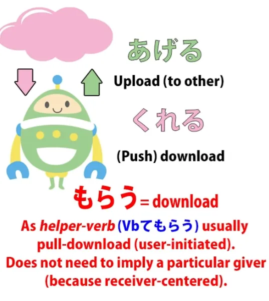
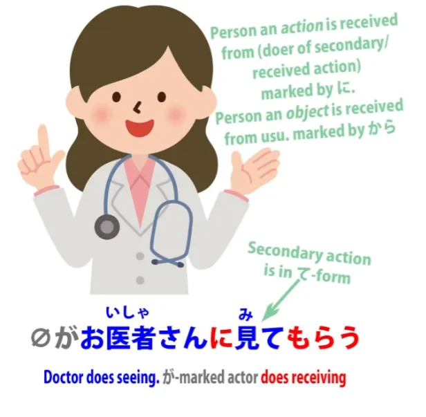

# **49. Японская точка зрения: больше никакой путаницы! -もらう・てもらう**

[**Японская точка зрения: больше никакой путаницы! -もらう・てもらう morau, te-morau | Урок 49**](https://www.youtube.com/watch?v=CESFJaFp8FI&list=PLg9uYxuZf8x_A-vcqqyOFZu06WlhnypWj&index=51&pp=iAQB)

こんにちは。

Сегодня мы поговорим о том, что довольно часто встречается в японском языке и проявляется по-разному, и вызывает немало путаницы из-за довольно странного способа преподавания в традиционных えいほんご / англоязычных учебниках по японской грамматике. И это слово <code>もらう</code>, которое используется во всевозможных контекстах и может быть очень запутанным и трудным для понимания учащимися того, что на самом деле происходит в этих предложениях.

Частично причина такой путаницы заключается в том, что <code>もらう</code> обычно группируют вместе с <code>くれる</code> и <code>あげる</code>, как будто эти три слова принадлежат друг другу и работают одинаково. И до определённой степени это правда. Но такой подход на самом деле больше запутывает, чем помогает.

Довольно давно я уже разбирала <code>くれる</code> и <code>あげる</code>[[11]](./11-compound-sentences-くれる-あげる-and-more-uses-of-the-て-form.md), и тогда я совершенно намеренно не включила <code>もらう</code>, потому что считаю, что их совместное преподавание, как это принято, вызывает много ненужной путаницы. Сейчас я быстро пробегусь по <code>くれる</code> и <code>あげる</code>, и мы поговорим о том, в чём они похожи на <code>もらう</code>, о гораздо более важных различиях с <code>もらう</code>, и с чем на самом деле следует сравнивать <code>もらう</code>, что значительно облегчит понимание целого ряда японских выражений и предложений.

Итак, как мы знаем, <code>あげる</code> и <code>くれる</code> означают соответственно «отдавать вверх» кому-то другому или «отдавать вниз» себе, или своей внутренней группе, или тому, с кем вы себя отождествляете.

Это может относиться к передаче реального объекта, подарка или чего-то ещё, или же к передаче действия, совершению действия в пользу другого человека, или совершению действия другим человеком в вашу собственную пользу.

И прежде чем мы двинемся дальше, я просто хочу отметить один момент, который люди иногда неправильно понимают: хотя «отдавать вверх» и «отдавать вниз» изначально были почтительными, рассматривая другого человека как бы выше себя, это происхождение настолько старо, что почти утрачено. Так что, в некотором смысле, несмотря на своё почтительное происхождение, мы могли бы рассматривать это более нейтрально, скорее как загрузку и скачивание: скачивание означает «к себе», а загрузка — «к кому-то другому».

И причина в том, что <code>あげる</code> на самом деле не является почтительным, и **обычно считается грубым использовать его по отношению к начальству, когда вы говорите о действии**, потому что <code>してあげる</code> означает «делать что-то в пользу (кого-то другого)», по сути, оказывать кому-то услугу.

**Поэтому, если вы говорите с начальством таким образом, что подразумеваете, будто оказываете им услугу,** **это вызовет обиду**, поэтому мы не должны считать <code>あげる</code> и <code>くれる</code> на самом деле почтительными или скромными. **Они не [敬語]{けいご}.**

**<code>くれる</code> может подразумевать благодарность, но не подразумевает скромности.** **А <code>あげる</code> не подразумевает почтения к человеку, к которому оно применяется.** Хорошо. А теперь давайте перейдём к <code>もらう</code>.
::: info
Кандзи — <code>貰う</code>. Некоторые тексты используют его.
:::

## もらう・てもらう

Его сходство с другими заключается просто в том, что оно представляет собой «скачивание». И если <code>くれる</code> — это, так сказать, «push-скачивание» — кто-то другой проявляет инициативу, чтобы «скачать» вам, то <code>もらう</code> больше похоже на «pull-скачивание».

И на этом сходства, по сути, заканчиваются, потому что <code>もらう</code> во многом работает совсем иначе, чем <code>くれる</code> и <code>あげる</code>, и гораздо ближе к чему-то другому, к чему мы сейчас перейдём. Когда вы используете <code>もらう</code> с существительным — «получение чего-либо» — **оно не обязательно подразумевает конкретного дающего вообще.**

Если мы говорим <code> *(zeroが)* 一万円をもらった</code>, мы говорим: <code>Я получил(а) десять тысяч иен</code>. Подразумевается, что это откуда-то взялось, возможно, было дано кем-то, или, по крайней мере, досталось очень легко. **Но мы ничего не говорим о том, кто нам это дал, откуда это взялось или как это произошло,** **в отличие от <code>くれる</code> и <code>あげる</code>, которые привязаны к конкретному дающему и получателю.**

---

Теперь, когда мы используем его с *глаголом*, <code>もらう</code> сильно контрастирует с <code>くれる</code> в том смысле, что <code>くれる</code> подразумевает, что дающий проявил инициативу, тогда как <code>もらう</code>, поскольку акцент делается на получателе, подразумевает, что *получатель* проявил инициативу. Иногда это переводится как <code>Я заставил(а) (кого-то) сделать (что-то)</code>, и в некоторых случаях это неплохой перевод.

Это также может относиться к получению услуги, где, конечно, вы проявляете инициативу, платите за неё и тому подобное. И я вернусь к этому через мгновение. Давайте заметим, что если дающий не упомянут, то дающий не обязательно подразумевается.

Когда дающий упомянут, он отмечается частицей に. Теперь, это точно так же, как с вспомогательным глаголом восприятия <code>-れる/-られる</code>, потому что <code>もらう</code>, как и <code>-れる/-られる</code> (воспринимающая, так называемая пассивная форма, которая вовсе не пассивна), оба они на самом деле о получении, не так ли? Так что это то, что мы могли бы назвать «pull-предложениями», а не «push-предложениями».

В «push-предложении» частица に отмечает косвенный объект, конечного получателя действия. Так, если мы говорим <code>メアリーにボールを投げた</code>, мы говорим: <code>Я бросил(а) мяч в Мэри</code>. Мяч — это **прямой** объект (то, что я бросил(а)). Мэри — это **косвенный** объект (конечный получатель действия).

В «pull-предложении», где получатель является が-отмеченным действующим лицом, тогда に-отмеченный человек является конечным дающим, конечным источником действия. Так что на самом деле гораздо полезнее сравнивать <code>もらう</code> с <code>-れる/-られる</code>, вспомогательным глаголом восприятия, потому что он делает почти то же самое.

Он берёт глагол, добавляет к нему другой, вспомогательный глагол, который сообщает нам, что действие воспринимается, и что действующее лицо предложения совершает действие по получению действия от кого-то другого. И это сходство, эта похожесть между <code>もらう</code> и <code>-れる/-られる</code> не указывается в традиционной японской грамматике, хотя это, безусловно, лучший способ её понять, потому что, конечно, они запутывают весь вопрос, называя вспомогательный глагол восприятия <code>-れる/-られる</code> «пассивным».

Это не пассив, **это восприятие, точно так же, как *<code>もらう</code>***.

::: info
Кстати, вы не можете использовать оба этих воспринимающих глагола одновременно. Долли объясняет это в [**комментариях**](https://www.youtube.com/watch?v=CESFJaFp8FI&lc=UgwTi3XYA1fzqe30n-14AaABAg.8x4VnfQdsss8x57oxMYR66&ab_channel=OrganicJapanesewithCureDolly).

:::

И они работают очень похоже. Разница между ними в том, что <code>-れる/-られる</code> подразумевает, что действие просто произошло с нами. Мы могли хотеть этого или нет, но это было не совсем наше дело.

<code>もらう</code> подразумевает, что мы предприняли действие, что мы активно привлекли это действие к себе от кого-то другого; мы заставили их сделать это для нас. Итак, давайте поговорим о получении услуги.

Очень, очень распространённое выражение — <code>(zeroが)お医者さんに見てもらう</code>, которое в словарях и англоязычных грамматиках переводится как <code>пойти к врачу</code>. И это ужасный, ужасный, ужасный, безответственный перевод.

Я не знаю, почему они так делают. Думаю, потому что им кажется, что сходство с распространённым английским выражением облегчает понимание. Это не облегчает, это делает гораздо сложнее, потому что это путает всё ваше восприятие того, что здесь происходит.

<code>お医者さんに見てもらう</code> не означает <code>Я пойду к врачу</code>; это означает <code>Я попрошу врача осмотреть меня / Меня осмотрит врач</code>. Теперь мы можем увидеть это гораздо яснее, если говорим о парикмахерских услугах или стрижке.

<code>[散髪]{さんぱつ}</code> означает <code>парикмахерские услуги</code> или <code>стрижка</code>. И если мы говорим <code>散髪をしてもらう</code>, мы говорим: <code>попросить кого-то постричь мне волосы</code>.

<code>お医者さんに見てもらう</code> — <code>попросить врача осмотреть меня / обследоваться у врача</code>. Так что видите, эти два выражения работают совершенно одинаково.

И мы также видим, что если с <code>お医者さん</code> мы указываем дающего, то с <code>散髪をしてもらう</code> — <code>постричься</code> — мы не указываем конкретного исполнителя. Кто-то может сказать <code>散髪をしてもらったほうがいい</code> — <code>тебе стоит постричься</code> — но это ничего не говорит о том, кем. Не говорится, хотят ли они, чтобы вы пошли к парикмахеру, или чтобы это сделала ваша старшая сестра, это не имеет значения.

Просто <code>попросить кого-то постричь вам волосы</code>. И это подводит нас к ещё одному очень важному моменту: действующее лицо <code>もらう</code>, тот, кто «получает» (<code>もらう</code>-ит), не обязательно должен быть говорящим.

И сравнивая его с <code>くれる</code>, многие люди очень путаются и приходят в замешательство, когда видят, что кто-то говорит о том, что кто-то другой, помимо них самих, «получает» (<code>もらう</code>-ит). Но никаких правил против этого нет.

Вы не можете использовать <code>くれる</code> для кого-то, кто не является вами самими или членом вашей внутренней группы, или, например, в романе, это может быть персонаж, потому что писателю разрешено находиться внутри головы персонажа. Таким образом, <code>くれる</code> привязано к человеку или внутренней группе, а <code>もらう</code> — нет.

Мы можем свободно говорить о том, как другие люди «получают» (<code>もらう</code>-ят), что-то получают. Теперь, ещё одна важная область, которая ужасно сбивает людей с толку, но с которой мы готовы разобраться сейчас, это <code>させてもらう</code>, что является комбинацией вспомогательного глагола каузатива с <code>もらう</code>, и теперь мы знаем достаточно о логике <code>もらう</code>, чтобы справиться с этим, но нам нужно будет узнать немного больше о логике вспомогательного глагола каузатива <code>-せる/-させる</code>...