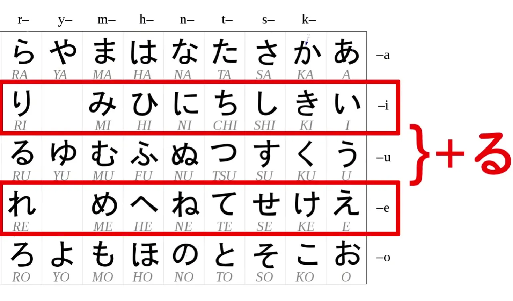
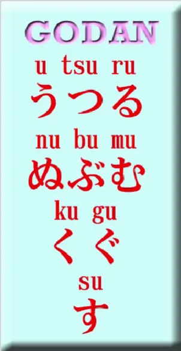
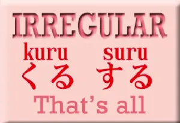
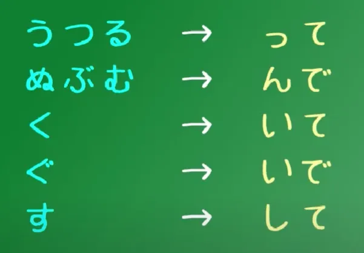
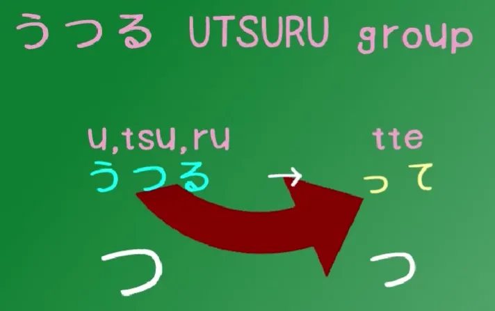
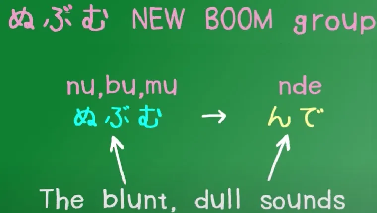
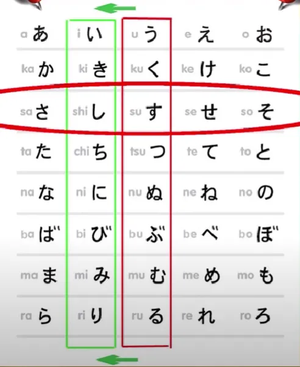
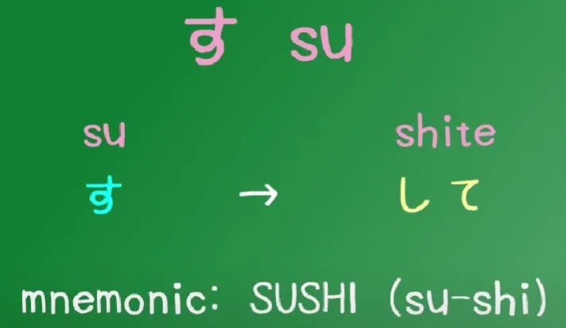

# **5. Группы глаголов и て-форма**

[**Урок 5: Японские группы глаголов и て-форма. Группы глаголов 1, 2, 3 — это просто. Organic Japanese**](https://www.youtube.com/watch?v=GzEVLMDC8nw&list=PLg9uYxuZf8x_A-vcqqyOFZu06WlhnypWj&index=5)

こんにちは。

Сегодня мы поговорим о японских группах глаголов. Японские глаголы делятся на три группы, и это не имеет значения, за исключением тех случаев, когда мы собираемся изменить форму глагола. Но поскольку мы делаем это довольно часто, важно понимать эти три группы.

## Итидан-глаголы

Первая группа японских глаголов называется итидан-глаголами или <code>одноуровневыми</code> глаголами. Некоторые называют их <code>る-глаголами</code>, что очень глупое название. Если уж и называть их так, то, наверное, следовало бы называть их <code>いる/える глаголами</code>. Это самый простой и базовый тип глаголов.

Когда мы хотим внести какие-либо изменения, мы всегда делаем это одним и тем же способом. **Всё, что мы делаем, это убираем -る с конца и добавляем то, что хотим добавить.** Итидан-глаголы могут оканчиваться только на -いる или -える, то есть на одну из кан из い-ряда или одну из кан из え-ряда плюс -る.

## Годан-глаголы

Вторая группа глаголов на сегодняшний день является самой большой, и **любое окончание, которое может иметь глагол, глаголы этой группы могут иметь.**

Глаголы всегда оканчиваются на う-звук, но не все う-каны могут быть окончанием глагола, однако многие из них могут, и все они могут образовывать годан-глаголы. Они называются годан-глаголами, или <code>пятиуровневыми</code> глаголами, по причинам, которые мы скоро увидим, и, как я уже сказала, **они могут оканчиваться на любой う-звук, включая -いる или -える.** В отличие от итидан-глаголов, **они также могут оканчиваться на -おる, -ある или -うる.**

Таким образом, единственная двусмысленность возникает, когда у нас есть глагол, оканчивающийся на -いる или -える. Большинство таких глаголов — итидан-глаголы, но существует значительное меньшинство годан-глаголов, оканчивающихся на いる/える. Различить их не так сложно, как вы могли бы подумать, и я сделала [**видео**](https://www.youtube.com/watch?v=VDmaSJ4s6Qo) об этом, хотя оно немного более продвинутое, чем этот урок.

## Неправильные глаголы

Третья группа глаголов — это неправильные глаголы, и хорошая новость здесь в том, что их всего два.

Помните те страницы и страницы неправильных глаголов в вашем учебнике испанского или французского? Что ж, в японском их всего два. Есть пара других глаголов, которые неправильны лишь в одном небольшом аспекте, но их очень мало. **Неправильные глаголы — это くる (приходить) и する (делать).**

## て-форма

Итак, теперь, когда мы знаем три группы, мы рассмотрим, как преобразовать их в て- и た-форму. Как я объясняла на прошлой неделе[[4]](./4-japanese-verb-tenses.md), нам нужны эти две формы для образования японских настоящего и прошедшего времён. И у них есть ряд других применений, которые мы будем изучать по ходу этого курса.

И, как я демонстрировала на прошлой неделе, итидан-глаголы всегда очень просты. **Вы никогда не делаете ничего, кроме как убираете -る и добавляете то, что собираетесь добавить, в данном случае て или た.**

Что касается годан-глаголов, они делятся на пять групп, как и следовало ожидать ([五段]{ごだん}, пятиуровневые глаголы), и я сделала видео об этом некоторое время назад. Так что сейчас я запущу это видео, потому что оно объясняет всё довольно чётко.

Хорошо, запускаем видео.

Годан-глаголы имеют пять видов возможных окончаний — вот почему они называются годан-глаголами: пятиуровневыми глаголами.

И хотя это кажется немного сложным, на самом деле это не так. Мы всё равно можем объединить два уровня, потому что они настолько близки, что нам нужно выучить их только один раз. И я собираюсь пройтись по основным группам.

### Первая группа годан-глаголов

Первая группа — это то, что я называю UTSURU/うつる глаголами. Это глаголы, оканчивающиеся на -う, -つ и -る. Слово うつる в японском — если вы его не знаете, сейчас самое время выучить — うつる означает «перемещаться от одного к другому», и это именно то, что мы здесь делаем — перемещаем наши глаголы из одного типа в другой.

Итак, глаголы, которые оканчиваются на -う, -つ и -る, все преобразуются одинаково в て-форму. **Мы убираем -う, -つ или -る и заменяем их на маленькое -っ плюс て (или た в た-форме).**

Итак, わらう — смеяться, становится わらって (Waratte);
もつ — держать, становится もって (Motte);
и とる — брать, становится とって (Totte).

Теперь вы заметите, что в слове うつる есть つ посередине.

И て-форма глаголов うつる образуется с помощью маленького っ плюс て. **Это единственная группа, в которой есть つ, и это единственная группа, в которой есть つ в окончании て-формы.**

Так что это очень легко запомнить.

::: tip
Вы можете набрать маленькое っ, набрав t перед T-каной った (tta), или нажав X + tsu. Это также относится к канам <code>あ, い, う, え, お</code> — ぁ (X + a), ぃ (X + i)... Обратите внимание также на づ (набирается как - Du) и ぢ (Di) — неправильные формы кан ず и じ. На случай, если вам когда-нибудь понадобится их набрать, такое может случиться. А ん — это <code>nn</code>.
:::

### Вторая группа годан-глаголов

Вторая группа — это то, что я называю группой NEW BOOM. В японском, когда что-то действительно набирает обороты, когда становится популярным, мы называем это ブーム (BUUMU). Это английское слово, не так ли? Буум, Новый Буум!

Итак, эту группу я называю группой New Boom, потому что нет японского слова, которое можно было бы составить из ぬ, ぶ и む, насколько мне известно, и что я хочу, чтобы вы заметили в этой группе глаголов, так это то, что **все они оканчиваются на то, что я бы назвала глухим звуком — ぬ, ぶ, む.**

Это не резкий звук, как す, つ, く, и не нейтральный звук, как る или う. Это глухой звук — ぬ, ぶ, む (Nu, Bu, Mu). И это важно, потому что окончание также является глухим звуком. **Окончание て-формы — -んで, た-формы — -んだ.**

Итак, しぬ, **единственный глагол, оканчивающийся на -ぬ**, становится しんで / しんだ;
のむ — пить, становится のんで / のんだ; あそぶ — играть, становится あそんで / あそんだ.

Итак, это группа New Boom, глаголы с глухим окончанием. И поскольку только ограниченное число возможных кан может использоваться в качестве окончания глагола, они включают все глухие звуки, **кроме ぐ (Gu).** Мы перейдём к этому прямо сейчас.

### Третья и четвёртая группа годан-глаголов

Я говорила вам, что две группы можно объединить — это группа く и ぐ. **Чтобы образовать て-форму глагола, оканчивающегося на -く, мы отсекаем -く и добавляем -いて, или -いた в た-форме.**

Итак, あるく — ходить, становится あるいて / あるいた.

Теперь, если у нас есть 〃(тэн-тэн) на этом -く, чтобы превратить его в -ぐ, это абсолютно то же самое, за исключением того, что на て-окончании также есть тэн-тэн.

Итак, あるく становится あるいて, но およぐ — плавать, становится およいで.

Но, как видите, эти два варианта более или менее идентичны. Просто если есть тэн-тэн на исходном глаголе, то есть тэн-тэн и на て-форме. あるく, あるいて; およぐ, およいで.

### Пятая группа годан-глаголов

И теперь у нас остался только один, и это す. **А глаголы, оканчивающиеся на -す, отбрасывают -す и добавляют -して.** Как вы заметите, если вы следили за нашим последним уроком *(Не уверена, каким именно, но это будет обсуждаться),* мы просто делаем обычную вещь — сдвигаем кану す к её эквиваленту из い-ряда, し.

Итак, はなす — говорить, становится はなして; вспомогательный глагол ます, который превращает глаголы в формальные *(вежливые)* глаголы, в прошедшем времени становится ました.

::: info
Всякий раз, когда Долли использует термин <code>formal</code> для です или ます, вместо него следует использовать ВЕЖЛИВЫЙ, поскольку в японском языке существует разница между этими двумя терминами. Не уверена, почему она не упомянула это, но это довольно важно различать: если вы посмотрите их определения, словари помечают их как вежливые. **Они являются частью 丁寧語 (вежливого языка). Поэтому точнее называть их вежливыми.**
:::

Итак, теперь у нас есть все годан-глаголы. Разве я не выглядела молодо в том старом видео?

### Исключения

Теперь мы просто рассмотрим исключения. **Всего их только три: наши два неправильных глагола и ещё один маленький.**

И они очень просты. くる (приходить) становится きて; する (делать) становится して.

И いく – глагол いく (идти) – поскольку он оканчивается на -く, вы могли бы ожидать, что он станет いいて, но это не так, он становится **いって**.

И это единственные исключения. Так что, если вы просмотрите видео / *этот урок* пару раз, я думаю, вам будет довольно легко точно узнать, как образовывать て- и た-формы во всех случаях.