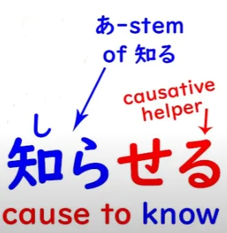
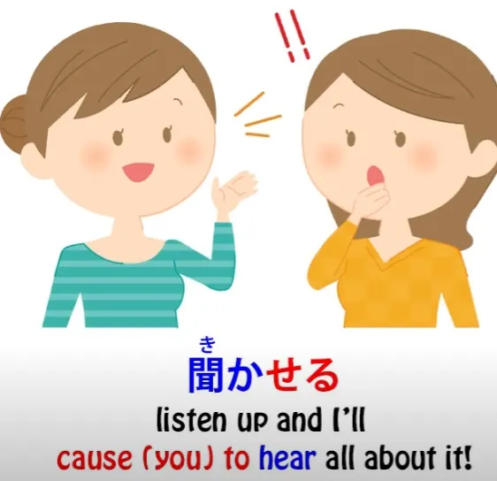
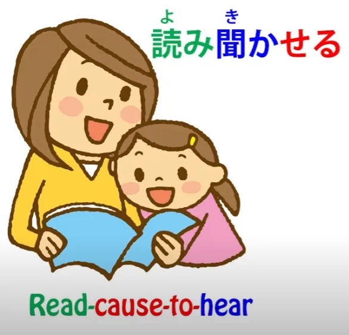
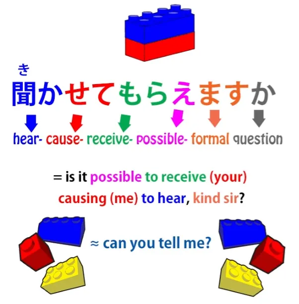
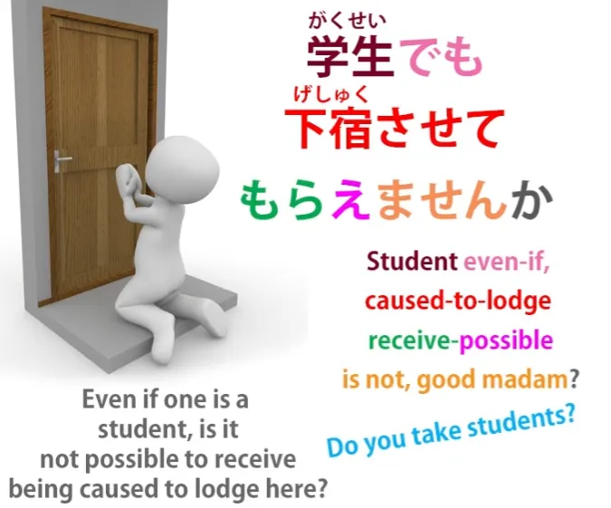

# **50. 2 аспекта японского языка, которые иностранцы не могут постичь: させてもらう Последний секрет потенциала**

[**2 Aspects of Japanese that Foreigners Can't Fathom: させてもらう Last Secret of the Potential | Lesson 50**](https://www.youtube.com/watch?v=r2j1o9wj2oA&list=PLg9uYxuZf8x_A-vcqqyOFZu06WlhnypWj&index=52&pp=iAQB)

こんにちは。

Сегодня мы поговорим о целом ряде выражений в японском языке, которые вызывают много трудностей и путаницы у иностранных учащихся. На прошлой неделе мы говорили об использовании <code>もらう</code> с て-формой, то есть <code>〇〇てもらう</code>, что также вызывает много путаницы и кажется очень неинтуитивным для иностранноговорящего, изучающего японский, хотя, как только мы поймем, как оно на самом деле устроено, оно становится очень даже интуитивным. Опираясь на это, мы затем находим множество выражений, которые сочетают て-форму + <code>もらう</code> со вспомогательным каузативным глаголом <code>-せる/-させる</code>, так что мы получаем <code>させてもらう</code>.

И это действительно слишком сложно для многих иностранных учащихся, потому что кажется очень запутанным. Но как только мы поняли, как <code>もらう</code> работает с て-формой, все это становится довольно логичным, за исключением того факта, что нам также необходимо усвоить важный факт о каузативном вспомогательном глаголе <code>-せる/-させる</code>. Я посвятила этому целый урок[[19]](./19-causative-causative-receptive.md), и мы обсудили большинство аспектов, которые вызывают проблемы у иностранцев. Однако есть одна часть, в которую я не углублялась, потому что на тот момент это было неактуально, поэтому мы рассмотрим ее сейчас.

Как я уже говорила тогда, каузативный вспомогательный глагол, на удивление, очень хорошо назван в англоязычной японской грамматике, потому что это именно то, чем он является — это каузативная форма. Так что, когда мы присоединяем его к другому глаголу, мы говорим: <code>заставить кого-то сделать этот глагол</code>. Теперь, одна вещь, которая сбивает с толку англоговорящих, это то, что он может означать либо <code>позволить кому-то это сделать</code>, либо <code>заставить или принудить кого-то это сделать</code>, и сам по себе каузативный глагол не проводит различия между этими двумя значениями.

Это сбивает с толку англоговорящих, потому что английский язык проводит это различие. Мы говорим <code>make someone do something</code> (заставить кого-то что-то сделать) или <code>let someone do something</code> (позволить кому-то что-то сделать); мы не говорим <code>cause someone to do something</code> (вызвать у кого-то действие). Теперь нам нужно понять, что японский каузатив может означать <code>заставить</code>, он может означать <code>позволить</code>, но он не обязан означать ни то, ни другое.

Он означает ровно то, что написано на упаковке. Он означает <code>*вызвать — любыми средствами*</code>, не уточняя, какие средства мы используем, чтобы заставить кого-то что-то сделать. И это сбивает с толку англоговорящих, потому что у них нет способа выразить это.

Вы не можете по-настоящему сказать <code>cause someone to do something</code> (заставить кого-то что-то сделать), по крайней мере, в современном английском. И на самом деле английский язык иногда ощущает эту потерю и вынужден компенсировать ее, жульничая с тем, что у него есть. Так, примером этого является, когда мы говорим <code>Would you let me know tomorrow?</code> (Вы дадите мне знать завтра?) или <code>I'll let you know tomorrow</code> (Я дам вам знать завтра).

На самом деле мы не имеем в виду <code>let you know</code> (позволить вам узнать) или <code>let me know</code> (позволить мне узнать). Мы имеем в виду <code>cause me to know</code> (заставить меня узнать). Мы не имеем в виду <code>allow me to know</code> (позволить мне узнать); мы не имеем в виду <code>force me to know</code> (заставить меня узнать). Мы имеем в виду <code>cause me to know</code> (заставить меня узнать).

Но поскольку у нас нет этого выражения <code>cause someone to do something</code> (заставить кого-то что-то сделать) в современном английском, нам приходится жульничать и говорить <code>let me know</code> (дайте мне знать), что не совсем то, что мы на самом деле имеем в виду. В японском, конечно, мы используем для этого каузатив.

Итак, <code>知る</code> — это <code>знать</code>, а <code>知らせる</code> — это <code>заставить кого-то узнать</code>.

Так что это, по сути, делает то же, что и английское <code>let me know</code> (дайте мне знать), не изгибая грамматику так, как это делает английский. И этот каузатив может использоваться многими другими способами, которые не означают ни <code>заставить</code>, ни <code>позволить</code>. Так, <code>聞く</code>, например, означает <code>слышать</code>; так что <code>聞かせる</code> означает <code>заставить услышать</code>.

И мы могли бы сказать <code>後で聞かせよう</code>, что означает «Я расскажу вам завтра *(позже)* / завтра я заставлю вас услышать / завтра я дам вам всю информацию».

И мы можем соединять это с другими словами, так что у нас может быть что-то вроде <code>読み聞かせる</code>, что означает <code>читать и заставлять услышать</code>/*читать-заставлять-услышать*.

И это то, что мы говорим, если читаем кому-то историю, читаем кому-то письмо или что-то в этом роде: <code>読み聞かせる</code>. И как только мы понимаем этот способ работы каузативного вспомогательного глагола, мы можем увидеть, как он образует て-форму, чтобы к нему присоединилось <code>もらう</code>. Например, мы могли бы сказать <code>聞かせてもらえますか</code>, что означает <code>Можете ли вы мне сказать?</code>

<code>聞かせて</code> — <code>заставить меня услышать</code>; <code>もらえる</code>, что является потенциальной формой <code>もらう</code>, другими словами <code>возможно получить</code>.

<code>Возможно ли получить, чтобы вы заставили меня услышать?</code> что по-английски мы, вероятно, сказали бы <code>Can you tell me?</code> (Можете ли вы мне сказать?). Итак, это <code>聞かせてもらえますか</code> может показаться очень запутанным для иностранноговорящего, потому что это не то, как мы выражаем это по-английски, но, как видите, структурно это очень просто. Оно построено из элементов, которые мы уже знаем и понимаем, и имеет идеальный смысл.

Мы могли бы взять предложение <code>学生でも下宿させてもらえませんか</code>. И это обычно переводится как <code>Вы принимаете студентов?</code> Но буквально это означает <code>Даже если кто-то студент...</code> — <code>学生でも</code> — <code>...невозможно ли получить, чтобы меня заставили здесь поселиться?</code>

Такова структура этого, так что, когда вы видите это <code>学生でも下宿させてもらえませんか</code> и вам говорят, что это означает <code>Вы принимаете студентов?</code>, вы можете смотреть на это назад, вперед и вверх ногами и удивляться, как эти слова могут означать это. И, конечно, они на самом деле вовсе не означают этого.

Это просто то, что мы сказали бы по-английски. По-японски мы говорим: <code>Даже если кто-то студент, невозможно ли получить, чтобы меня заставили здесь поселиться?</code> И не обязательно, чтобы в этих предложениях именно себя заставляли что-то делать.

Например, если мы говорим <code> *(zeroが)* メガネを合わせてもらった</code>, это переводится как <code>Мне подобрали очки</code>, но буквально это означает <code>получить, чтобы очки были подогнаны</code>.

Итак, это очки, которые заставляют. Это они подвергаются <code>させる</code>-действию, но я тот, кто получает их подгонку. Так что не обязательно, чтобы я лично получал, что меня заставляют.

Я также могу получать, что что-то другое заставляют. Итак, мы должны посмотреть на предложение и понять, что оно означает, и, конечно, применять правила, о которых мы говорили в уроке о разрешении двусмысленности *[[48]](./48-dealing-with-ambiguity-in-japanese.md)* — мы смотрим на то, что наиболее вероятно, зная, что если говорится что-то невероятное, говорящий должен будет это прояснить, точно так же, как это делается в английском.

Теперь, конечно, иногда это может на самом деле означать <code>позволить</code>, так, например, если мы говорим <code>帰らせてもらいます</code>, то буквально мы говорим: <code>Я получу ваше разрешение уйти домой</code>. Таково буквальное значение.

Это скорее похоже на то, как по-английски говорят: <code>With your permission, I'll leave now</code> (С вашего разрешения, я сейчас уйду), что вполне может означать <code>Я сейчас уйду, с вашего разрешения или без него</code>, но это придает делу налет вежливости. И является ли это искренней вежливостью или просто информированием кого-то о том, что вы уходите, с тонким налетом вежливости, это то, что вы, очевидно, поймете из контекста и тона голоса и т.д., точно так же, как и в английском.

Существует значительная разница между тем, чтобы сказать «С вашего разрешения я сейчас пойду домой» \[мягко\] и сказать «С вашего разрешения я сейчас пойду домой» \[резко\] — и это точно так же в японском, как и в английском. Итак, как видите, существует множество способов, которыми эти элементы могут быть объединены, но если мы понимаем каждый из них и понимаем, как они сочетаются, у нас есть необходимые инструменты для усвоения из погружения того, как эти вещи используются.

Помните, *структура не учит нас понимать японский язык.* **Она дает нам базовые инструменты, необходимые для того, чтобы усвоить его из единственного места, где вы можете** **по-настоящему научиться тому, как работает язык** — и это **прямое погружение**.

---

И я просто добавлю, прежде чем мы закончим... Я не преподаю 敬語/けいご на данном этапе. 敬語 — это сверхвежливый японский, который почти является своим собственным маленьким подъязыком. Это не так уж сложно, но потребуется несколько уроков, чтобы углубиться в него.

Но я хочу упомянуть здесь, что существует слово 敬語 для <code>もらう</code>. И это <code>頂く/いただく</code>. Поскольку оно сверхвежливое, оно обычно используется в ます-форме, поэтому это обычно <code>いただきます</code>. И, несомненно, вы знакомы с этим как с тем, что люди говорят перед едой: <code>いただきます!</code>

Но буквально это означает что-то вроде <code>Я смиренно принимаю</code>. Оно, очевидно, означает <code>Я получаю</code>, потому что <code>いただく</code> означает <code>もらう</code>, но это форма 敬語, называемая <code>謙譲語/けんじょうご</code> или <code>скромный язык</code>, так что вы говорите <code>Я смиренно принимаю</code>. И я упоминаю это сейчас, потому что вы, вероятно, увидите некоторые из этих форм типа <code>させてもらう</code>, используемые с <code>いただく</code>: <code>させていただきます</code> и т.д.

И эта часть 敬語 может использоваться немного чаще, чем обычная 敬語, потому что она добавляет вежливости к концепции <code>もらう</code>.

Так что иногда, если кажется, что есть опасность быть немного требовательным или наглым, говоря о том, что вы собираетесь получить или что вы хотите получить, вы можете использовать <code>いただく</code>, чтобы сгладить это и показать, что вы на самом деле скромны и вежливы. Так что, если вы увидите <code>いただく / いただきます</code>, используемые в любом из этих мест, это означает то же самое, что и <code>もらう</code>. Это просто придает ему более вежливый оттенок. Так что вам не нужно путаться, когда вы это увидите.