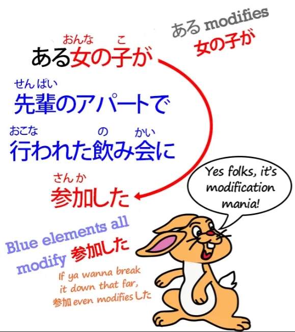

# **51. Как читать японскую [怪談]{かいだん} (историю о привидениях)**

[**Урок 51: Практический японский: как читать японскую кайдан (историю о привидениях)**](https://www.youtube.com/watch?v=uO1rHcwjADA&list=PLg9uYxuZf8x_A-vcqqyOFZu06WlhnypWj&index=53&pp=iAQB)

こんにちは。

Сегодня мы разомнем наши мышцы, взявшись за настоящий живой японский язык. И я рада объявить, что мы сотрудничаем с другим YouTube-каналом под названием *Akasic Tails*. Они специализируются на повествовании, и мне очень нравится их работа, поэтому я очень рада, что мы можем работать вместе с этим японским каналом, чтобы предоставить вам настоящий японский материал, который мы сможем разобрать и применить принципы, изученные нами до сих пор, к реальным ситуациям.

Итак, сегодня мы послушаем <code>怪談</code> — страшную историю — и нам потребуется пара уроков, чтобы пройти ее, потому что я хочу разобрать каждое предложение и рассмотреть различные проблемы по мере их возникновения, чтобы вы смогли делать это самостоятельно, когда будете слушать настоящий японский материал.

Хорошо. Итак, давайте начнем с прослушивания той части истории, которую мы будем слушать сегодня, а затем разберем ее по частям.

Итак. Первое слово здесь — <code>それは</code>, и оно довольно похоже на английское <code>It was</code>. И мы часто начинаем историю, особенно историю о привидениях, с такого рода выражения, не так ли?

<code>Это была темная и бурная ночь...</code>

Итак, вы можете начать с вопроса: «Почему это **それは**, которое означает 'то есть' или 'то было', а не 'это было'?»

Что ж, причина очень проста. В японском языке нет видимого слова для <code>it</code>. Функция того, что в английском является <code>it</code>, в японском всегда выполняется нулевым местоимением.

И это очень важно понять, потому что это один из фундаментальных ключей к пониманию японского языка. У нас есть местоимения в японском для <code>me</code> (я), <code>you</code> (ты/вы), <code>they</code> (они), <code>she</code> (она) и <code>he</code> (он), и нулевое местоимение используется в тех местах, где они использовались бы в английском, чаще всего, но в японском вообще нет слова для простого нейтрального местоимения <code>it</code>.

Итак, в таких случаях, когда мы действительно хотим сделать топиком то, что в английском было бы <code>it</code>, мы используем чуть более определенное местоимение <code>that</code> (то). Поэтому мы говорим <code>that was</code> (то было). Здесь мы говорим <code>it was</code> (это было).

На данном этапе мы не знаем, что это <code>it was</code>, и, по сути, никогда не узнаем этого напрямую. Итак, если вы хотите понять это предложение, мы можем пройтись по нему по частям, и если мы слушаем его, не имея слов перед собой, мы должны это сделать. И это не так уж сложно.

Но я воспользуюсь здесь ярлыком, потому что, когда у вас есть текст перед глазами, вы можете это сделать. Я не думаю, что нам следует работать в обратном порядке, как предлагает Rubin-先生, хотя я во многом большой поклонник Rubin-先生. Но что мы можем сделать, так это взглянуть на конец, потому что он покажет нам, куда на самом деле движется это довольно сложно выглядящее предложение.

Итак, конец предложения — а мы знаем, что локомотив предложения всегда находится в конце, и затем за ним могут следовать пара конечных частиц предложения, но локомотив находится в конце, кроме этого. И то, что находится в конце этого предложения, это <code>日</code> — <code>день</code>.

Итак, когда мы видим существительное, заканчивающее предложение таким образом, мы знаем, что это будет предложение типа <code>А есть Б</code> и что связка <code>だ</code> или <code>です</code>, которая должна быть там, чтобы превратить его в предложение, была опущена.

Это происходит относительно часто в повседневной речи. И это повседневная речь — <code>повседневная речь</code> это немного собирательный термин, но это тот вид языка, который мы будем использовать, возможно, на ночевке или где-то еще, где мы рассказываем <code>怪談</code>, где мы рассказываем друг другу жуткие истории. И поэтому мы используем такой уровень языка, где иногда связка будет опускаться.

И мы увидим, как еще несколько вещей будут опускаться по ходу этой истории. Итак, у нас здесь структура предложения.

<code>それは</code> задает топик, и это также будет подлежащее, так что это <code>それは(zeroが)</code>. И затем <code>日</code>, вот и все. <code>Это был... день.</code>

И мы даже не знаем, что это <code>был</code>, потому что нам нужна связка в конце, чтобы дать нам время. Итак, если бы связка была <code>だ</code>, она бы заканчивалась на <code>だった</code>; если бы это было <code>です</code>, она бы заканчивалась на <code>でした</code>.

В данном случае у нас нет маркера времени. Но поскольку мы знаем, что это задает сцену для истории, мы можем по этому факту сказать, что это утверждение типа <code>Это был</code>, утверждение, задающее сцену.

Так что насчет остальной части этого предложения?

<code>ある女の子が先輩のアパートで行われた飲み会に参加した</code>

Итак, как видите, между <code>それは</code> и <code>日</code> находится полное логическое предложение само по себе. И мы видим, что каждая часть в этом логическом предложении, как мы уже видели в наших видео о порядке слов[[46]](./46-word-order-matters-2-simple-rules-to-crack-tough-sentences.md) и структуре предложения, работает путем последовательного модифицирования каждого элемента.

<code>ある女の子が先輩のアパートで行われた飲み会に参加した</code>

***Это мания модификации!***

Итак, это предложение, опять же, мы можем разбить на его А-вагон, который, очевидно, <code>女の子が</code>, и его локомотив, который <code>した</code> — <code>сделал</code>. И затем <code>参加した</code> — «<code>参加</code> сделал» — 'принял участие'.

И затем вся остальная часть этого предложения последовательно модифицирует элементы, которые модифицируют <code>参加した</code>: <code>先輩のアパートで行われた飲み会</code>. Итак, <code>飲み会</code> — это <code>вечеринка с выпивкой / встреча с выпивкой</code>.

<code>飲み</code> — это い-основа, существительная форма <code>飲む</code> — пить — которая соединяется с <code>会</code> — встреча или вечеринка — чтобы дать нам <code>вечеринку с выпивкой</code>.

И затем все, что перед этим, модифицирует <code>drinking party</code>. <code>先輩のアパートで行われた飲み会</code> — <code>вечеринка с выпивкой, проведенная в квартире сэмпая</code>.

Итак, у нас есть <code>ある女の子が</code> — <code>некая девушка</code> — <code>先輩のアパートで行われた飲み会に</code> – и это дает нам место, где она пошла принять участие. Это была вечеринка с выпивкой, проведенная в квартире сэмпая.

Итак, у нас есть вся эта логическая часть предложения:

<code>некая девушка — приняла участие в — вечеринке с выпивкой — проведенной в — квартире сэмпая</code>

и все это является модификатором для <code>day</code> (дня).

Итак, <code>それは...</code> — <code>Это был день, когда некая девушка посетила вечеринку с выпивкой, проведенную в квартире сэмпая.</code> Итак, вы видите, что это не построено так, как мы обычно ожидаем от английского, но это нормально, потому что у нас теперь есть некоторый опыт того, как строится японский язык. И я думаю, вы согласитесь, что все это имеет смысл.

Итак, это задает сцену. Это говорит нам о дне, когда это произошло, и дополняет детали об этом дне, которые будут актуальны по мере того, как мы будем продвигаться в истории.

Что ж, это заняло гораздо больше времени, чем я ожидала для одного предложения, но я думаю, что стоит рассмотреть это подробно, не так ли? Так что, боюсь, нам придется оставить это на немного более коротком клиффхэнгере, чем я изначально предполагала, но следующие несколько предложений, я думаю, будут содержать меньше вопросов, так что в следующий раз мы сможем продвигаться по тексту немного быстрее.