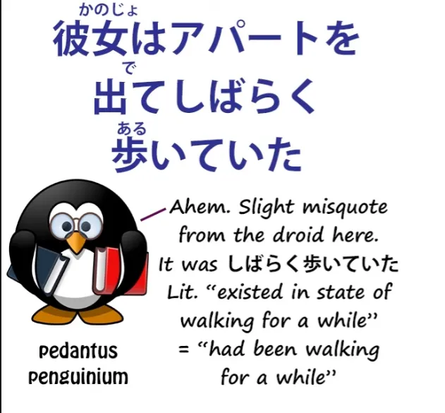
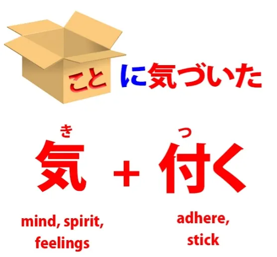

# **52. Глубокий анализ японских предложений в реальном контексте**

[**ГЛУБОКИЙ анализ японских предложений в реальном контексте | Урок 52**](https://www.youtube.com/watch?v=I38yhYh4Lfg&list=PLg9uYxuZf8x_A-vcqqyOFZu06WlhnypWj&index=54&pp=iAQB)

こんにちは。

Сегодня мы засучим рукава и погрузимся в настоящий живой японский язык благодаря нашему японскому каналу-партнеру Akasic Tails. Мы рассмотрим некоторые реальные японские структуры, с которыми столкнемся в жизни, и научимся их анализировать, а как только мы это четко уясним, мы сможем понимать их на лету.

На прошлой неделе мы рассматривали японскую <code>怪談</code> — страшную историю — и в первом предложении было так много важного материала для анализа, что мы не продвинулись дальше него. Поэтому на этой неделе, я думаю, мы сможем продвинуться немного дальше и немного быстрее в историю. Итак, я сейчас проиграю вам ту часть, которую хочу сегодня проанализировать, а затем мы начнем анализ. Конечно, мы начнем со второго предложения, потому что первое мы уже довольно тщательно проанализировали.

Итак, следующая часть — <code>飲み会が終了した後</code>, и это временное утверждение. Оно задает время действия, которое мы сейчас будем описывать.

Строго говоря, мы должны были бы сказать <code>後に</code>, а не просто <code>後</code>, но опять же, мы можем опустить это, потому что мы говорим относительно неформально. Итак, задав время, мы затем говорим, что произошло: <code>彼女はアパートを出てしばらく歩いていた</code>.

Итак, она вышла из квартиры и некоторое время шла.

Затем у нас есть <code>ふと先輩の家に携帯電話を忘れてきたことに気づいた</code>.

<code>ふと</code> — внезапно — <code>先輩の家に</code> — в доме сэмпая — <code>携帯電話</code> — портативный телефон — <code>を忘れてきたことに気づいた</code> — 忘れてきた — это 忘れる, забыть, соединенное с <code>来る</code>.

<code>忘れてくる</code> буквально означает <code>забывая-приходить</code> — или то, что это на самом деле означает, это <code>оставить позади</code>: <code>忘れてきた</code>, прийти, забыв свой портативный телефон в квартире сэмпая. <code>ことに気づいた</code> — она поняла, что это то, что она сделала. <code>こと</code> делает существительное или объединяет все, что перед ним, в это существительное.

Итак, забыть свой телефон в квартире сэмпая было тем <code>こと</code>, что она теперь осознала.

Так почему же это <code>ことに気づく</code>, а не <code>ことを気づく</code>?

Англоязычные японские словари и учебники скажут вам, что <code>気づく</code> — это глагол, который означает то же самое, что и английское <code>realize</code> (осознавать). И на практике он означает примерно то же самое, но структурно он отличается. Он состоит из слияния двух слов, которые мы уже хорошо знаем.

Одно из них — <code>気</code>, что означает <code>дух</code>, <code>разум</code> или <code>чувства</code>, а другое — <code>付く</code>, что означает <code>прилипать</code> или <code>приставать</code>. Итак, буквально это означает <code>дух прилипает</code>, и то, что мы делаем, это приклеиваем наш дух к чему-то, то есть наше внимание, наш разум, наши чувства прилипают к определенной вещи.

А в английском мы выражаем это по-другому, говоря, что мы <code>realize</code> (осознаем) — делаем реальным — факт. В японском наш дух прилипает к факту.

В японском очень распространенное выражение — <code>気を付けてください</code>, которое переводится как <code>будьте осторожны</code>, но буквально означает <code>приклейте свой дух</code>. Приклейте его к чему? Ну, приклейте его к своему окружению, приклейте его к тому, что вы делаете.

Другими словами, будьте внимательны. Теперь, перевод <code>будьте осторожны</code> на самом деле культурно лучше, чем <code>будьте внимательны</code>, потому что <code>будьте внимательны</code> звучит как приказ, не так ли?

И это не та атмосфера, когда говорят <code>気を付けて</code>.
::: info
Долли-сэнсэй говорит <code>気をつくて</code>, но я думаю, она имела в виду сказать 気を付けて, так как первое не имеет особого смысла, и я не смог найти ничего об этом, особенно указывающего на <code>будьте осторожны</code> или что-то подобное... моя теория в том, что она оговорилась, но никто не заметил.
:::
На практике, культурно это означает что-то вроде <code>будьте осторожны</code>, так что перевод не ошибочен, но структура не та же.

Итак, теперь мы понимаем, почему мы говорим <code>ことに気づく</code>, а не <code>ことを気づく</code>. Если мы приклеиваем плакат к стене, стена, то, к чему он приклеен, не является прямым дополнением, не так ли? Прямое дополнение — это плакат; стена — это конечная цель этого действия.

А конечные цели в японском всегда отмечаются частицей に. Как мы знаем, косвенное дополнение, конечная цель, отмечается частицей に.

Теперь, даже если мы уберем человеческого деятеля из этого и просто скажем <code>Плакат прилипает к стене</code>, мы все равно говорим <code>к стене</code>, не так ли? Мы не говорим <code>Плакат прилипает стену</code>, что мы сказали бы, если бы стена была прямым дополнением.

Мы говорим <code>Плакат прилипает к стене</code>. Стена — это цель прилипания плаката. По той же логике, если мы приклеиваем наш дух к чему-то или если наш дух прилипает к чему-то, то это что-то, к чему он прилипает, является целью, а не прямым дополнением этого прилипания.

Теперь, это важно знать, потому что это еще один небольшой пример того, как <code>えいほんご</code> — так называемая англоязычная японская грамматика, то, что вы находите в учебниках и на веб-сайтах повсюду –

это еще один способ, которым она просто запутывает наше понимание логики и структуры очень, очень логичного языка.

Потому что они скажут вам, что <code>気づく</code> — это глагол, который означает **осознавать**, но он «принимает に».

Теперь, оставив в стороне тот факт, что ни один глагол не может «принимать» に или любую другую логическую частицу (только существительное может когда-либо «принимать» логическую частицу), мы знаем, что они имеют в виду. Они имеют в виду, что это слово, которое означает <code>realize</code> (осознавать), и которое в английском рассматривает осознаваемое как прямое дополнение, на самом деле рассматривает осознаваемое как цель и поэтому отмечает его частицей に, и «это одна из тех странных причуд японского языка, которую вы должны изучать в каждом отдельном случае, потому что это так случайно и иррационально». Это вовсе не случайно и не иррационально.

Хотя <code>気づく</code> в целом эквивалентно <code>realize</code> в английском, это не та же структура. Мы не «реализуем», не делаем что-то реальным, мы приклеиваем наш дух к чему-то, и это что-то является целью, и поэтому оно отмечается частицей に, точно так же, как цели всегда отмечаются частицей に.
::: info
очевидно, что это に-отмеченное что-то является существительным, как こと. А не глагол 気づく, который «принимает に», как говорят некоторые учебники. Просто на всякий случай упоминаю это снова, так как это может быть немного запутанным.
:::
Японский язык не любит случайных иррациональностей.

Если вы хотите этого, вам нужно обратиться к европейским языкам.

И если я могу просто вставить здесь небольшую сноску. Эти разговоры о том, что глаголы «принимают» частицы, чрезвычайно, чрезвычайно вводят в заблуждение.

Это не просто придирка, когда я говорю, что логические частицы могут принадлежать только существительным, никогда не глаголам. Я сказала, что понимала, о чем они говорят, когда речь шла о глаголах, «принимающих» частицы, но то, о чем они говорят, ужасно неправильно в каждом случае. Это основано на заблуждении, что логические частицы могут выполнять разные функции по отношению к разным глаголам.

И они никогда, никогда не могут. Единственная причина так думать — это, как в данном случае, неправильное понимание того, что на самом деле делает глагол, обычно потому, что они предполагают, что он работает точно так же, как его ближайший английский эквивалент, что очень часто не так.

И, как мы видели в случае с потенциальным вспомогательным глаголом и прилагательными субъективности, это заблуждение охватывает огромную область японского языка и вносит очень большой вклад в неспособность многих студентов понять японский. Потому что это кажется таким нелогичным и случайным, хотя на самом деле это совершенно логично. Вот почему мы называем их <code>логическими частицами</code>.

Они никогда не меняют свою функцию, независимо от того, какое прилагательное или глагол участвует в предложении. Они всегда, всегда делают одно и то же. И если вы хоть немного запутались в том, что я здесь говорю, пожалуйста, посмотрите девятый урок этого курса. И я сейчас выведу карточку для этого.

<code>彼女はアパートで引き返し先輩の部屋に戻って呼び鈴を押す</code>

Итак, она вернулась в квартиру сэмпая. <code>引き返し</code> означает <code>возвращаться</code>, и, как мы видели раньше, い-основа глагола — глагол <code>引き返す</code>, что означает <code>возвращаться</code> — и особенно в повествовании мы можем использовать い-основу глагола почти так же, как мы используем て-форму глагола, чтобы сделать ее первой частью сложного предложения.

Итак, она вернулась в квартиру сэмпая — <code>先輩の部屋に戻って呼び鈴を押す</code>. Она вернулась в комнату сэмпая и нажала на звонок.

<code>呼び鈴</code>: <code>呼ぶ</code> — это <code>звать</code>, <code>[鈴]{りん}</code> — это он-чтение <code>[鈴]{すず}</code>, <code>маленький колокольчик</code>, так что <code>呼び鈴</code> — это <code>звонок / колокольчик для вызова</code>.

<code>押す</code>: она нажимает на звонок. И, как мы видели раньше, в японском повествовании допустимо использовать предложения в настоящем времени внутри повествования в прошедшем времени, чтобы добавить непосредственности. И смысл здесь в том, что мы пришли к точке, почти как к площадке на лестнице, где мы на мгновение останавливаемся и делаем это нашим настоящим.

Она нажала на звонок.

<code>ところが反応がない</code>

<code>ところが</code> — это выражение, которое мы часто будем встречать в повествовании. <code>が</code>: Это <code>が</code>, очевидно, не частица が. Это другое <code>が</code>, которое является противительным союзом и по сути означает <code>но</code>.

Почему мы добавляем к нему <code>ところ</code>? Ну, как мы обсуждали в предыдущем уроке, <code>ところ</code>, что означает <code>место</code>, также может означать место во времени. Это почти как место отдыха во времени.

Оно дает нам временное <code>сейчас</code>, так сказать. Итак, когда мы говорим <code>ところが</code>, мы говорим <code>в тот момент / в то время, но</code>.

Итак, мы используем это как повествовательный союз, чтобы отметить тот факт, что происходит что-то, что противоречит нашим ожиданиям или желаниям.

Итак, <code>ところが反応がない</code>. То есть, хотя она нажала на звонок, ответа не было, неожиданно или вопреки нашим надеждам, нашим желаниям.

И когда она повернула дверную ручку... <code>回す</code> Как мы знаем, <code>回る</code> означает <code>вращаться</code>, <code>回す</code> — это версия <code>回る</code>, обозначающая действие, направленное на что-то другое, то есть <code>заставлять вращаться</code>.

Когда она заставила дверную ручку повернуться, когда она повернула дверную ручку, <code>鍵は掛かっていなかった</code>. Замок находился в состоянии незапертости, не был зацеплен, подвешен или закреплен. Выражение, кажущееся немного запутанным, потому что оно происходит от того факта, что японцы часто объединяют понятия ключа и замка в одно. Строго говоря, это можно было бы назвать неправильным.

На самом деле мы говорим <code>錠前が掛かった</code> — замок был закреплен или зацеплен, но в японском языке принято говорить, что ключ был закреплен или зацеплен (<code>鍵が掛かった</code>), и даже казалось бы немного неестественным сказать это правильно.

---

И поскольку дверь была не заперта, <code>彼女はそのまま中に入っていた</code> — она вошла.

<code>そのまま</code> мы обсуждали в другом видео[[42]](./42-basic-word-confusion-まま.md), и, как мы знаем, <code>まま</code> — это неизменное состояние. <code>そのまま</code> означает <code>в этом неизменном состоянии / как есть</code>. И мы можем видеть здесь, как это понятие немного расширяется таким образом, что мы часто будем это встречать.

Так, например, если мы говорим об эдамаме и говорим <code>そのまま食べる</code>, мы имеем в виду «ешьте их как есть, ешьте их, не меняя их состояния, ешьте их, не делая ничего дополнительного для подготовки к еде», и это то, что означает <code>そのまま</code> здесь.

Поскольку дверь была не заперта, она вошла просто так, прямо в своем текущем состоянии. Она не нажала на звонок снова, не ждала приглашения, но <code>そのまま</code> — в неизменном состоянии того момента — она вошла…