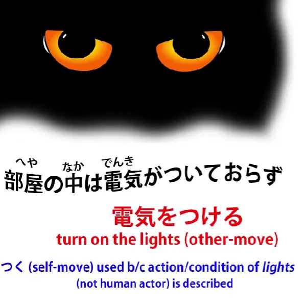
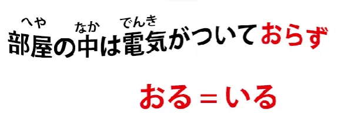
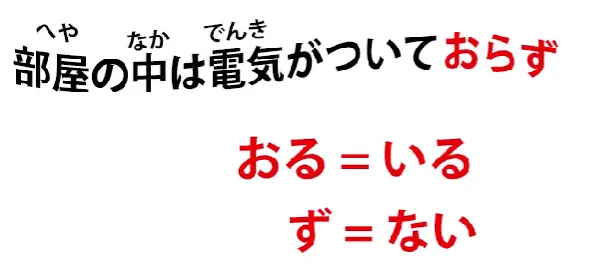
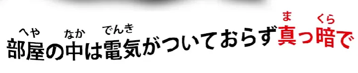
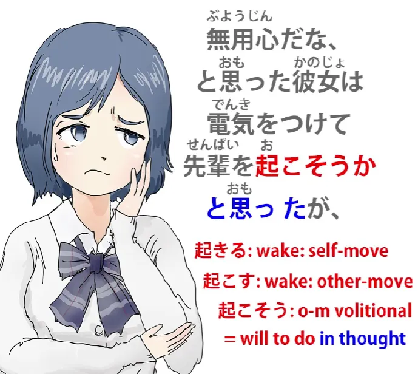
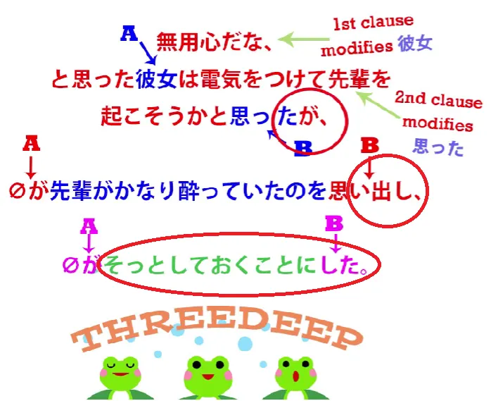
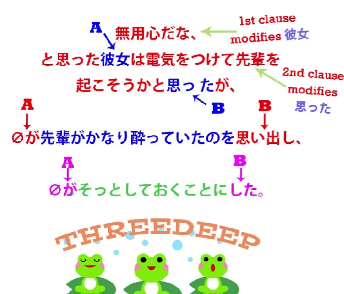

# **53. Наслаждайтесь японскими ужасами на японском**

[**ГЛУБОКИЙ анализ японских предложений в реальном контексте | Урок 53**](https://www.youtube.com/watch?v=8DHRS4B5SQA&list=PLg9uYxuZf8x_A-vcqqyOFZu06WlhnypWj&index=55&pp=iAQB)

こんにちは。

Сегодня мы столкнемся со многими структурными моментами японского языка, которые мы изучили в этом курсе уроков, в действии, в реальных ситуациях. И мы сделаем это, продолжив чтение <code>怪談</code>, японской истории, которую мы читали на протяжении последних нескольких уроков, благодаря нашему японскому каналу-партнеру Akasic Tails.

И на этот раз мы рассмотрим так много моментов, что я выведу карточки для некоторых из основных, но я также создала вспомогательную [**страницу**](http://learnjapaneseonline.info/2019/08/10/groping-in-the-darkness-links-to-structure-points-covered/) на Kawajapa, где вы можете найти любой из этих моментов и изучить их подробнее, если вам это необходимо. И я думаю, было бы очень хорошей идеей изучить подробнее всё, что вам не совсем понятно после того, как мы пройдем эту историю.

Итак, чтобы напомнить вам, на чём мы остановились в конце урока на прошлой неделе: наша героиня отправилась на вечеринку с выпивкой в квартиру своего сэмпая. После того как она покинула вечеринку и шла домой ночью, она осознала, что оставила свой <code>携帯電話</code>, свой портативный телефон, в квартире сэмпая. Поэтому она вернулась, нажала на звонок, но ответа не было, повернула ручку двери и обнаружила, что она не заперта.

Так что она просто вошла.

Итак, давайте посмотрим, что произошло дальше.

<code>部屋の中は電気がついておらず</code>

Итак, если мы понимаем, что <code>電気をつける</code> означает «включать свет» (буквально это означает «включать электричество», но на самом деле относится к свету), единственная проблема с этим придаточным предложением — это <code>おらず</code>. Что это значит?

Что ж, <code>おる</code> означает то же самое, что и <code>いる</code>, то есть «быть».

Обычно нам говорят, что это означает «быть» для одушевлённых существ, таких как животные и люди. Это не так просто, и я объясняла это в другом уроке, на который я дам [**ссылку**](https://www.youtube.com/watch?v=PsTsliRe2Cg&ab_channel=OrganicJapanesewithCureDolly).
<code>おる</code> — это довольно старая форма <code>いる</code>, но мы встречаем её в различных обстоятельствах.

Например, она используется в кэйго как скромная форма, форма <code>[謙譲語]{けんじょうご}</code>, от <code>いる</code>, которую мы используем, чтобы смирить наши собственные действия и владения, но она также используется в диалектах, например, в кансай-бэн, и используется в литературных контекстах, чтобы придать повествованию литературный оттенок. И именно так она используется здесь.

Итак, <code>おる</code> означает <code>いる</code>, но что означает <code>おらず</code>? Что ж, вы также должны понимать, что <code>-ず</code> — это тоже часть старого японского языка, которая придает повествованию литературный оттенок, и это просто отрицательный вспомогательный элемент, как <code>-ない</code>.

Так почему же это <code>おらず</code>? Что ж, это потому, что, хотя <code>いる</code>, как мы знаем, является итидан-глаголом, <code>おる</code>, как оказалось, является годан-глаголом. Итак, как и со всеми годан-глаголами, отрицательный вспомогательный элемент присоединяется к <code>あ-основе</code>.

Так что именно это здесь и происходит. <code>おらず</code> означает то же самое, что и <code>いない</code>.

Итак, <code>電気がついておらず</code> означает «электричество существовало в состоянии невключённости», или, проще говоря, «свет был выключен».

<code>真っ暗で</code>: <code>真っ暗</code> — это «кромешно-тёмный», буквально «истинно тёмный / полностью тёмный». <code>暗</code>, конечно, мы знаем как <code>暗い</code>, прилагательное «тёмный», и мы знаем, что когда мы видим прилагательное без его <code>-い</code> на конце, если оно вообще образует слово, это будет существительное.

Мы также знаем, что если мы видим слово, которое полностью состоит из кандзи, оно почти наверняка будет существительным. Итак, <code>真っ暗</code> — это «кромешная тьма».

<code>真っ暗で</code> — <code>で</code> здесь — это <code>て-форма</code> от <code>だ</code> или <code>です</code>. Итак, <code>部屋の中は電気がついておらず真っ暗で</code> — «Что касается внутренней части комнаты, свет был выключен, было кромешной тьмой».

---

<code>どうやら先輩はもう寝てしまったらしい</code>

<code>どうやら</code>: в данном случае означает «кажется, похоже, что это так», и это на самом деле работает в тандеме с <code>-らしい</code> в конце, что также означает «кажется, похоже».

И мы это тоже рассматривали в предыдущем уроке.[[25]](./25-らしい-vs-そうだ-そうです-っぽい-ppoi.md)

Итак, между этим «сэндвичем», который дает нам значение «похоже, что это так», говорится <code>先輩はもう寝てしまった</code> — «сэмпай уже *сделал* и лёг спать / *сделал* и отправился в постель». Как мы знаем, <code>しまう</code>, <code>しまった</code> дают это значение «*сделал*». И это действительно лучший способ выразить это на английском.

На английском это звучит немного по-деревенски, но нет ничего другого на английском, что, по моему мнению, передает смысл <code>しまう</code>, <code>しまった</code>, <code>ちゃった</code> так же хорошо, как «*сделал*». Она, казалось, уже *сделала* и легла спать.

<code>無用心だな</code>: <code>無用心</code> буквально означает «не использовать своё сердце», но «сердце» здесь означает разум или дух. <code>用心</code> — это «забота» или «осторожность»; <code>無用心</code> — это «отсутствие заботы» или «отсутствие осторожности».

::: info
Альтернативное написание — 不用心. Они должны означать одно и то же.
:::

Но это конкретное слово <code>無用心</code> обычно означает отсутствие осторожности в отношении преступной или иной враждебной деятельности. Так, мы могли бы сказать, что прогулка в одиночестве в опасном месте — это <code>無用心</code>, или оставление ценностей на виду в нашей машине — это <code>無用心</code>. И здесь, оставление двери незапертой на ночь, чтобы любой мог просто войти, — это <code>無用心</code>.

<code>無用心だな</code>: <code>な</code>, как мы знаем, это частица, используемая для обращения комментария к самому себе, поэтому она думает про себя <code>無用心だ</code> — «это безрассудное, опасное поведение».

<code>無用心だな、と思った彼女は電気をつけて先輩を起こそうかと思ったが</code>.

Ладно, это выглядит немного сложно, и мы ещё не закончили предложение, но давайте разберём его по частям. Прежде всего, она подумала <code>無用心</code> — «небезопасное, опасное поведение»; она подумала — <code>と思った彼女</code> — она, которая так подумала, затем подумала что-то ещё; <code>電気をつけて</code> — <code>[点]{つ}ける</code>, конечно, это версия <code>[点]{つ}く</code>, обозначающая действие, направленное на что-то другое, поэтому она подумала включить свет; <code>先輩を起こそう</code> — теперь, как мы знаем, это окончание <code>そう</code> является волитивным окончанием; <code>起こそうか</code> — она подумала о том, чтобы разбудить сэмпая.

<code>起こす</code> — «будить кого-то»; <code>起きる</code> — вы просыпаетесь сами; <code>起こす</code> — окончания на <code>-す</code>, как мы знаем, означают глаголы, обозначающие действие, направленное на что-то другое, поэтому <code>起こす</code> — это «будить кого-то другого». <code>起こそうか</code> — итак, она думает об этом действии.

<code>か</code>, как мы знаем из другого урока[[39]](./39-the-か-particle-buried-questions-かな-もんか-かどうか.md), обозначает вопрос, то есть предложение. Итак, предложение заключалось в том, чтобы разбудить сэмпая.

Это то, о чём она подумала, но... (<code>が</code> — «но») <code>先輩がかなり酔っていたのをおもいだし、</code>.

Итак, <code>かなり</code> — это ещё одно из тех наречных существительных, которые могут изменять глагол или прилагательное без <code>に</code> или <code>-と</code>, которые обычно требуются для того, чтобы существительное изменяло глагол или прилагательное, поэтому <code>かなり酔っていた</code> — <code>酔う</code> означает «быть больным» или «быть пьяным», в данном случае «пьяным».

<code>かなり</code> означает «достаточно», или «довольно», или «очень». Итак, она была довольно пьяна, она была в состоянии довольно сильного опьянения: <code>かなり酔っていたの</code> — <code>の</code>, конечно, упаковывает это утверждение в существительный вагон — <code>のを思い出し</code> — <code>思い出し</code> означает «вспомнить», поэтому она вспомнила тот факт — <code>の</code> — что сэмпай был довольно пьян.

<code>思い出す</code> — это «вспомнить»; <code>思い出し</code>, опять же, как мы обсуждали на прошлой неделе[[7.5]](./7-5-conjugation.md), это <code>い-основа</code> от <code>思い出す</code> — «вспомнить» — и <code>い-основа</code> здесь *(<code>し</code>)* используется как <code>て-форма</code>, чтобы сделать это придаточное предложение частью сложного предложения.

Итак, теперь у нас есть тройное сложное предложение. Прежде всего, мы используем <code>が</code> — «но» — как соединитель для первой части, а во второй части мы используем <code>-し</code> как <code>て-форму</code> в качестве соединителя для третьей части, и третья часть — это <code>そっとしておくことにした</code>.

<code>そっと</code> — это ещё одно из этих наречных существительных, означающее «мягко», «нежно» или «тихо». <code>そっとする</code> означает «делать мягко, нежно или тихо». Это как <code>静かにする</code>, что означает «делать тихо».

<code>そっとする</code> также означает «делать тихо», но <code>静か</code> означает скорее «соблюдать тишину». Вы могли бы сказать это классу: <code>静かに!</code> — «Тихо!»

<code>そっとする</code> — это скорее «делать (что-то) тихим образом». Теперь, <code>静か</code> тоже может использоваться таким образом, но <code>そっとする</code> означает «делать что-то тихо»; это может даже означать «тайно».

<code>静か</code> не может означать «тайно»; <code>そっと</code> может означать «тайно». Здесь это не означает «тайно», но это означает «делать что-то тихо, чтобы кто-то другой не знал, что вы это делаете», что является своего рода подтекстом, который часто имеет <code>そっと</code>.

<code>そっとしておく</code> — <code>しておく</code>, как мы знаем, означает «привести действие в действие». <code>[置]{お}く</code> означает «поместить (что-то)».

Присоединение <code>おけ</code> к <code>て-форме</code> глагола означает «привести это действие в действие». И, как мы знаем, учебники часто говорят, что это означает «делать это заранее» или «делать это в качестве подготовки», но на самом деле это означает «привести действие в действие».

Итак, она по сути говорит здесь: «делать то, что она должна сделать, привести своё действие в действие, тихо». <code>そっとしておくことにした</code>: теперь, <code>ことにする</code>, как мы также рассматривали в предыдущем уроке, означает «решить сделать». Итак, эта последняя часть означает, что она решила тихо привести своё действие в действие, буквально.

Итак, у нас здесь целое предложение:

<code>無用心だな、と思った彼女は電気をつけて先輩を起こそうかと思ったが、 *(zeroが)* 先輩がかなり酔っていたのを思い出し、 *(zeroが)* そっとしておくことにした</code>

Итак, ««Это опасно, не так ли, оставлять дверь открытой», — подумала она; она подумала включить свет и разбудить сэмпая, но она вспомнила, что сэмпай был довольно пьян, и поэтому решила действовать тихо».

<code>真っ暗の中で自分の携帯電話を探し出すと</code> –

«В кромешной тьме — <code>真っ暗の中で</code> — <code>自分の携帯電話</code> — её собственный телефон — <code>探し出す</code>». <code>探す</code>, как мы знаем, это «искать»; <code>探し出す</code> буквально означает «выискивать», поэтому она выискала его, она нашла его — <code>と</code>.

<code>「忘れ物をしたので取りに戻りましたー」とひと声かけて部屋を後にした</code>

Итак, она сказала что-то вслух здесь, но, предположительно, довольно тихо, чтобы не разбудить сэмпая. Она сказала: <code>忘れ物</code> — «забытая вещь» — <code>をしたので</code> — «Я *сделала* забытую вещь / Я забыла вещь / Я оставила вещь» — <code>忘れ物をしたので</code> — из-за этого — <code>取りに戻りました</code> — «Я вернулась, чтобы взять это / чтобы взять это, я вернулась» — <code>とひと声かけて</code> — <code>声 (を) かける</code> означает «сказать что-то кому-то», «вступить с ним в разговор», здесь <code>ひと声</code> — она просто сказала это одно слово, она просто издала этот один звук, буквально, она просто сказала это — <code>部屋を後にした</code> — так что она просто сказала это, предположительно тихо, чтобы сэмпай даже не услышал её, но она чувствовала, что должна что-то сказать — <code>部屋を後にした</code> — <code>後にする</code> буквально означает «превратить это в «позади»», другими словами, «оставить это позади», другими словами, «уйти» — она покинула комнату — <code>部屋を後にした</code> — она сделала комнату тем, что осталось позади, покинув её.

И на этом вечер закончился. Что ж, она ведь хорошо из этого выбралась, не так ли?

Было немного страшно, но мы не услышали, что произошло на следующий день. Об этом мы поговорим на следующей неделе...