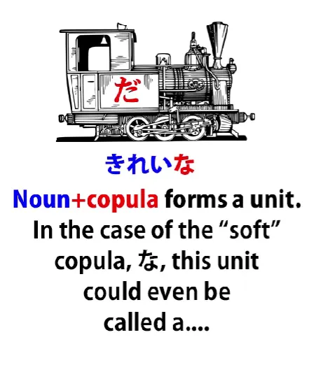
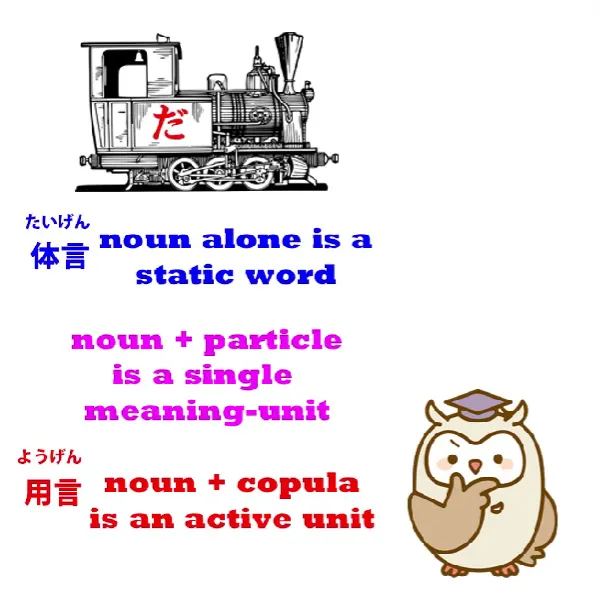
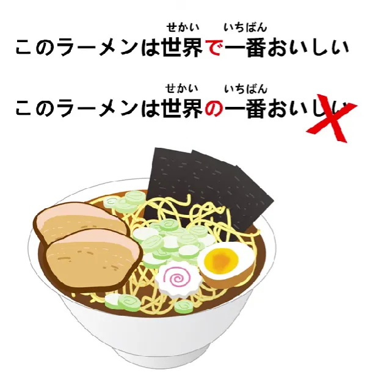

# **55. Секреты частицы で. Почему мы говорим みんなで行く? и 世界で一番?**

[**Секреты частицы で. Почему мы говорим みんなで行く? и 世界で一番? | Урок 55**](https://www.youtube.com/watch?v=OiKgudW9xB8&list=PLg9uYxuZf8x_A-vcqqyOFZu06WlhnypWj&index=57&pp=iAQB)

こんにちは。

Сегодня мы углубимся в некоторые области японской структуры. Я рассмотрю некоторые аспекты частицы で, которые мы ещё не затрагивали, и для этого нам придётся рассмотреть некоторые новые структурные концепции, которые мы до сих пор не учитывали. Мы не учитывали их отчасти потому, что в начальном японском можно продвинуться довольно далеко, не зная их, но по мере того, как мы переходим к более сложным областям, полезно иметь эти инструменты в нашем арсенале.
Итак, давайте начнём.

Как я уже говорила, почти все японские слова делятся на три типа: существительные, глаголы и прилагательные.

Есть несколько слов, которые выходят за рамки этих трёх, но их не так много. Большинство вещей, которые не являются глаголами и прилагательными, на самом деле оказываются существительными.

## 体言 и 用言

Однако есть ещё один способ деления японских слов, который используется в японской грамматике, и это деление на <code>体言</code> и <code>用言</code>, что буквально означает <code>слова-тела</code> и <code>слова-использования</code>, но термины, которые я буду использовать, это <code>статичные слова</code> или <code>статичные элементы</code> и <code>активные слова</code> или <code>активные элементы</code>.

Итак, статичные слова, или слова-тела, по сути, сводятся к существительным, так что в некотором смысле это подчёркивает существительно-центричную структуру японского языка, потому что мы делим их на существительные и всё остальное, то есть на два других типа. И очень легко понять, как это работает. Под <code>активными словами</code> мы подразумеваем те слова, которые могут трансформироваться, которые могут модифицировать.

И это относится как к прилагательным, так и к глаголам. И на самом деле они трансформируются очень похожим образом. В обоих случаях то, что трансформируется, — это всегда последняя кана слова.

И мы знаем, что как глаголы, так и прилагательные всегда должны заканчиваться на кану. Они не могут состоять только из кандзи, иначе они были бы существительными. Все глаголы заканчиваются на кану ряда う; все прилагательные заканчиваются на кану い. И это та часть, и единственная часть, которая меняется.

В годан-глаголах кана ряда う меняется на её эквивалент в одном из других рядов. Так, -す может стать -さ, -し, -せ или -そ. А итидан-глаголы просто отбрасывают -る.

Глаголы также могут модифицироваться в て-форму, и опять же, это по сути вопрос либо изменения, либо отбрасывания конечной каны и добавления -て или で. И то же самое, конечно, с た-формой.

Прилагательные могут менять -い на -く, -か или -け, так что мы можем получить <code>美味しく</code>, <code>美味しかった</code> или <code>美味しければ</code>. Или мы можем полностью отбросить -い и добавить что-то ещё, как, например, в <code>美味しそう</code>.

---

Существительные, с другой стороны, вообще не могут модифицироваться. Вы не можете ничего сделать с последней каной существительного или любой другой частью существительного в плане грамматической модификации.

Но вы можете добавлять логические частицы к существительному, а также можете добавлять связку <code>だ</code> или <code>です</code> к существительному. Итак, у нас есть два набора слов: <code>用言</code>, активные слова, которые вы можете модифицировать, изменяя конечную кану и добавляя что-то, но к ним нельзя добавлять логические частицы или связку,

---

и существительные, а также местоимения и другие существительные-подобные сущности, <code>体言</code> или статичные слова, которые вы не можете модифицировать, но к которым вы можете добавлять логические частицы или связку.

И важно понимать, что когда мы добавляем логическую частицу или связку к существительному, мы рассматриваем эти две вещи, соединённые вместе, как единое целое.

---

Так, например, когда мы добавляем мягкую связку <code>な</code> к адъективному существительному, такому как <code>[綺麗]{きれい}</code>, мы получаем <code>綺麗な</code>, и <code>綺麗な</code> рассматривается как единое целое.

И на самом деле эту единицу *можно* было бы назвать <code>な-прилагательным</code>, потому что <code>綺麗</code> плюс <code>な</code> или <code>だ</code> становится адъективной единицей. Так что, хотя я очень возражаю против термина <code>な-прилагательное</code> в том виде, в каком он используется в западных учебниках, то есть они скажут вам, что <code>綺麗</code> — это <code>な-прилагательное</code>, а это не так — это существительное, это не какое-либо прилагательное — мы могли бы сказать, что <code>綺麗な</code> или <code>綺麗だ</code> является な-прилагательным.

Я бы не рекомендовала это, просто потому что этот термин настолько злоупотребляется в западной так называемой японской грамматике, что лучше его не трогать. У него есть название в японском языке, но поскольку его объяснение заняло бы довольно много времени, я не буду вдаваться в это здесь. Но это совсем не похоже на <code>な-прилагательное</code>.

---

Теперь, другое, что нужно понять, это то, что когда мы присоединяем связку к существительному, эта комбинация на самом деле является <code>用言</code> или активной единицей.

И это очевидно, потому что, как только вы присоединили к нему связку, мы можем фактически модифицировать его. Связка имеет て-форму, которая является <code>で</code>, так что <code>綺麗な</code> может стать <code>綺麗で</code>, чтобы соединить её с чем-то ещё.

Мы также можем модифицировать <code>綺麗だ</code>, скажем, в <code>綺麗だった</code>. Итак, как только мы присоединяем связку к существительному, мы получаем <code>用言</code>, активную единицу, и, как я уверена, вы уже поняли, это означает, что все три локомотива, три возможных способа завершения предложения, являются <code>用言</code>, или активными единицами.

Это три возможных локомотива предложения, и они также являются тремя возможными <code>用言</code>. Мы склонны называть их <code>用言</code>, когда они модифицируют что-то другое, когда они находятся внутри предложения.

Итак, вооружившись этой информацией, мы теперь можем глубже взглянуть на частицу で.

## Более глубокий взгляд на частицу で

Когда я представляла её в видео о логических частицах[[8b]](./8b-particles-explained.md), я говорила, что она, как и другие логические частицы, кроме が (которая, конечно, есть в каждом предложении) и の (которая является логической частицей, но не говорит нам, что её существительное делает по отношению к действию предложения; она говорит нам о существительном по отношению к другому существительному), но другие частицы, включая で, я говорила, были активны только в предложениях типа «А делает Б», то есть в глагольных предложениях.

Теперь, это некоторое упрощение. Есть ещё один способ, которым они могут действовать. Незнание этого в начале не является большой проблемой, но по мере нашего продвижения нам нужно это понять.

И чтобы понять это, нам нужно знать то, что мы только что изучили. Нам нужно знать о <code>体言</code> и <code>用言</code>, статичных и активных элементах.

Потому что **правда не в том**, что で абсолютно ограничена глагольными предложениями, предложениями типа «А делает Б», хотя большую часть времени это так. Она ограничена придаточными предложениями, которые модифицируют <code>用言</code>. А <code>用言</code>, как мы знаем, может быть глаголом, но также может быть прилагательным или даже адъективным существительным-плюс-связкой.

И есть некоторые случаи, когда это происходит. Так что же на самом деле делает で?

Что ж, как мы знаем, есть три позиционные логические частицы, и это целевая частица に (которая говорит нам, куда что-то направляется или где оно находится, где оно остаётся, когда туда попадает), есть へ, которая является частицей направления, и есть で. И что で на самом деле делает, так это указывает нам границу или предел, в пределах которого что-то происходит.

Обычно это физическая граница, физическая область, хотя это не всегда так. Итак, に указывает, куда направляется существительное (человек, животное, вещь) или где оно находится; へ указывает направление, в котором оно движется; で указывает границу, в пределах которой происходит действие или состояние бытия. Обычно это действие, поэтому мы так её и представляем, но это может быть и состояние бытия.

Другими словами, **это может быть адъектив.**

Так, например, возьмём фразу <code>世界で一番美味しいラーメン</code>. Теперь люди спросят: <code>Почему で? Почему мы используем で в этом случае?</code> И ответ в том, что <code>世界で</code> — и помните, что мы всегда рассматриваем логическую частицу плюс существительное, к которому она присоединена, как единое целое — <code>世界で</code> определяет предел, в пределах которого что-то происходит, но в данном случае она определяет предел, в пределах которого применяется состояние бытия.

Итак, мы говорим о <code>самом вкусном рамене в мире</code>. <code>Мир/**世界**</code> — это предел, который мы применяем. И в этом случае, конечно, с <code>миром</code> мы стараемся задать максимально большой предел.

Но мы могли бы сказать <code>この町で一番美味しいラーメン</code>, и тогда мы говорим <code>самый вкусный рамен в этом городе</code>. Таким образом, мы очертили вокруг него границу. Мы не говорим, что это самый вкусный рамен из всех возможных, но мы говорим, что в определённых пределах, в пределах этого города, это самый вкусный рамен.

Итак, **вот что делает で**. Точно так же, как с действием она указывает нам, где происходит действие, место, границу, в пределах которой оно происходит, с другим видом <code>用言</code>, адъективом, она указывает нам границу, в пределах которой преобладает это адъективное качество.

---

Теперь, мы также можем сказать <code>世界の一番美味しいラーメン</code>. Это говорится реже, но так можно сказать. И это означает <code>самый вкусный рамен мира</code>, но здесь важно понять, что で очерчивает границы <code>用言</code>, активного элемента, глагола или в данном случае прилагательного; **の делает что-то другое.**

Мы знаем, что делает の: она связывает одно существительное с другим. Так что она не модифицирует качество <code>美味しい</code>, как это делает で. Она модифицирует <code>ラーメン</code>.

---

И из-за этого **мы также можем сказать** <code>このラーメンは世界で一番美味しい</code> — мы говорим <code>Этот рамен самый вкусный в мире.</code>

Но мы **не можем** сказать <code>このラーメンは世界の一番美味しい</code>

Почему не можем? Потому что, как мы знаем из урока о порядке слов[[46]](./46-word-order-matters-2-simple-rules-to-crack-tough-sentences.md), в японском языке слова модифицируют только те слова, которые идут после них. Они не могут модифицировать слова, которые идут перед ними.

И поскольку の не может модифицировать <code>美味しい</code>, она может модифицировать только <code>ラーメン</code>, которое является другим существительным, и поскольку <code>ラーメン</code> находится не с той стороны от неё, мы на самом деле не можем это использовать. Поэтому мы должны сказать <code>このラーメンは世界で一番美味しい</code>, потому что で устанавливает границу, в пределах которой преобладает <code>美味しい</code>.

---

Теперь, поскольку мы знаем, что существительное-плюс-связка также функционирует как <code>用言</code>, активный элемент, мы также можем сказать <code>世界で一番有名なアンドロイド</code>. И в этом случае <code>世界で</code> модифицирует <code>有名な</code>. Оно не могло бы модифицировать <code>有名</code> само по себе, потому что <code>有名</code> — это существительное, но оно может модифицировать <code>有名な</code>.

Таким образом, она указывает нам границы, в пределах которых действует эта известность. <code>Она самый известный андроид в мире</code>. Возможно, она не самый известный андроид в Солнечной системе, но она самый известный андроид в мире.

То же самое происходит, когда мы говорим что-то вроде <code>みんなで踊る</code> — <code>мы все танцуем</code>. Почему мы говорим <code>みんなで</code>? Что ж, если мы говорим <code>二人で踊る</code>, мы говорим <code>мы вдвоём танцуем</code>. Если мы говорим <code>一人で踊る</code>, мы говорим <code>танцую в одиночку</code>.

Количественное предложение плюс で описывает пределы людей, которые это делают. Итак, как я уже говорила, граница, область или демаркация, которую で очерчивает для нас, обычно является физической, местом.

Если мы говорим <code>部屋で踊る</code>, мы говорим <code>Я танцую в комнате.</code> **Но** если мы говорим <code>一人で踊る</code>, мы говорим <code>Я танцую в одиночку.</code> В обоих случаях мы очерчиваем границу, чтобы сказать, каковы пределы. Физические пределы — это комната, а числовые или количественные пределы — это <code>一人</code>, <code>二人</code>, <code>みんな</code> и т.д.