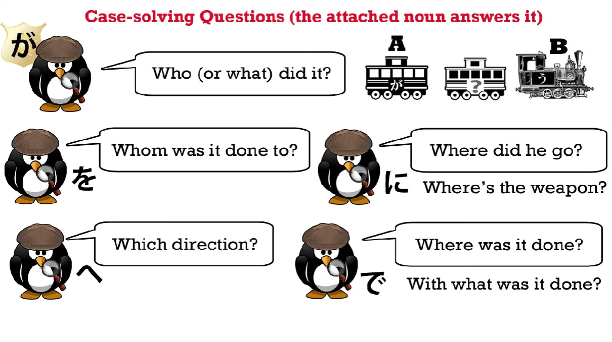
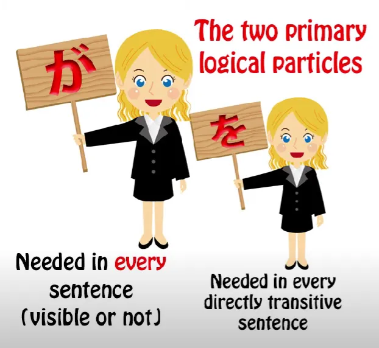

# **58. Японские двойные частицы. Как они работают**

[**Японские двойные частицы. Как они на самом деле работают | Урок 58: Комбинации частиц**](https://www.youtube.com/watch?v=iPiLVZoYhfM&list=PLg9uYxuZf8x_A-vcqqyOFZu06WlhnypWj&index=60&pp=iAQB)

こんにちは。

Сегодня мы поговорим о <code>комбинированных частицах</code> или <code>двойных частицах</code>, или как бы там ни называли их в учебниках и на сайтах по японской грамматике. И я объясню через мгновение, почему я называю их <code>глупыми</code>. Я имею в виду частицы в комбинациях вроде <code>には</code>, <code>にも</code>, <code>-とは</code>, <code>のが</code> и так далее.

И если вы посмотрите на эти сайты, вы найдёте множество правил, таких как <code>вы можете использовать に с は и も, но не можете использовать её с が или で</code>; <code>вы можете использовать -と с этим, но не с тем</code>, и так далее. И вам не нужно учить ни одно из этих правил. Если вы понимаете, что происходит и почему это происходит, всё это имеет полный логический смысл. Здесь нет никаких случайных правил, только простая логика.

Причина, по которой это становится таким запутанным в так называемой японской грамматике на английском языке, заключается в том, что они не просто дают неправильные ответы. Они дают неправильные ответы на неправильные вопросы. Они задают вопросы, которые вообще не должны были быть заданы.

**На самом деле не существует такой вещи, как <code>двойная частица</code> или <code>комбинированная частица</code>.** Всё время происходит то, что частицы просто выполняют свою работу так, как они всегда это делают.

Так что же насчёт всех этих случайных правил о том, когда они могут это делать, а когда нет? Ну, все они на самом деле основаны на том, чем являются частицы и что они на самом деле делают.

Итак, первое различие, которое нужно сделать, и которое никогда не делают учебники и веб-сайты, это различие между логическими и нелогическими частицами. Это абсолютно критично.

## Логические и нелогические частицы

Итак, давайте начнём с рассмотрения пяти основных логических частиц. Это частицы, которые сообщают нам, что происходит в предложении. Они отмечают каждое существительное той ролью, которую оно играет в предложении, будь то человек, совершающий действие, вещь, над которой совершается действие, вещь, к которой совершается действие, место, где совершается действие, и так далее.

Теперь, первое очевидное, что нужно понять, это то, что вы не можете комбинировать ни одну из этих пяти логических частиц с любой другой. Почему нет? Из-за того, что они делают. Они отмечают каждое существительное его функцией в предложении. Существительное на самом деле не может быть более чем одной частью речи одновременно, поэтому было бы просто бессмысленно комбинировать любые из этих пяти друг с другом.

---

Но то, с чем вы можете их комбинировать, это нелогические частицы, в частности два нелогических маркера темы, は и も. Вы можете комбинировать их, потому что они не конфликтуют логически.

は и も ничего не говорят нам о том, что делает существительное в предложении. Они лишь отмечают эту вещь как тему, либо чтобы сделать её темой предложения, либо чтобы сделать её подтемой по стратегическим причинам, о чём мы поговорим через мгновение.

## Первичные и вторичные частицы

Теперь, следующее, что нужно знать, это то, что две первичные частицы, или, точнее, первичная и вторичная частицы, а именно **が и を, не комбинируются с нелогическими частицами.**

Почему нет? Ну, が — это первичная частица: она должна быть в каждом предложении любого типа; を — это вторичная частица: она отмечает прямое дополнение. Это означает, что в любом предложении, которое является прямопереходным, を должна присутствовать, видим мы её или нет.

---

Теперь, что я имею в виду под прямопереходностью? Все учебники и словари путают переходность с японскими глаголами самодвижения и чужедвижения. И в некотором смысле это понятно, потому что между ними есть большое совпадение.

**Но это не одно и то же.**

Итак, давайте посмотрим, что мы имеем в виду под фактической переходностью. Если я говорю <code>Я иду</code>, <code>Я пою</code>, <code>Я ем</code>, все они непереходные, потому что я совершаю действие глагола и не совершаю его ни над чем другим. У него нет прямого дополнения. Если я говорю <code>Я пою песню</code> или <code>Я читаю книгу</code> или <code>Я ем хлеб</code>, то это переходный глагол, потому что у глагола есть прямое дополнение.

Теперь, когда я говорю <code>прямопереходный</code>, я имею в виду глаголы, которые совершаются непосредственно над объектом. Например, я могу сказать <code>I talk to Sakura</code> (Я говорю с Сакурой), но в английском, как вы видите, у нас должен быть там предлог.

Мы не говорим <code>I talk Sakura</code> (Я говорю Сакуру), поэтому мы не прямопереходны, мы косвенно переходны через посредство предлога.

Теперь, в японском языке есть такое же различие. Мы **не** говорим <code>さくらを話す</code>, что было бы эквивалентом английского <code>I talk Sakura</code>. Мы говорим <code>さくらと話す</code> или <code>さくらに話す</code>.

Теперь, пожалуйста, не уходите с мыслью, что частицы вроде に и -と такие же, как английские предлоги. Это не так. Если вы собираетесь сравнивать их с чем-либо в европейских языках, вы должны сравнивать все логические частицы с падежными структурами немецкого или латинского языков. Вы можете не знать, что это такое, и вам не нужно, потому что я моделирую их таким образом, который не требует знания европейской грамматики.

Но суть здесь в том, что они не предлоги, но для наших целей здесь мы можем сказать, что они используются в тех же обстоятельствах, в которых предлоги используются в английском языке.

Итак, если мы говорим <code>I eat bread</code> (Я ем хлеб), это прямопереходный глагол. Если мы говорим <code>I talk to Sakura</code> (Я говорю с Сакурой), это косвенно переходный глагол. В японском, если мы используем частицу を, это прямопереходный глагол. Если мы используем другую частицу, такую как -と или に, это косвенно переходный глагол.

В некоторых случаях английский и японский языки будут расходиться во мнениях относительно того, что является прямопереходным, а что косвенно переходным, но очень часто они на самом деле совпадают, потому что это довольно базовые факторы человеческого общения.

---

Теперь, суть здесь в том, что эти две прямые частицы — если мы говорим <code>I hit Sakura</code> (Я ударил Сакуру), здесь нет никаких предлогов. Это полностью прямое действие. Я совершаю удар, и я бью что-то, я бью Сакуру. Я не бью *к* Сакуре, или *по* Сакуре, или *рядом с* Сакурой.

Я напрямую бью Сакуру. Теперь, из-за прямоты этих двух частиц, к ним нельзя присоединить нелогическую частицу.

Итак, если вы хотите использовать здесь нелогическую частицу, вы можете это сделать. Но способ, которым вы это делаете, всегда заключается в простом присоединении нелогической частицы **и опускании логической частицы**.

И поскольку они настолько фундаментальны для каждого предложения, они могут быть поняты слушателем в японском языке.

Итак, если мы говорим <code>さくらはなぐった</code> — <code>Я ударил Сакуру</code> — это означает <code> *(zeroが)* さくらは**zeroを**なぐった</code>,

**но мы не говорим <code>さくらはをなぐった</code> или <code>さくらをはなぐった</code>.** Потому что вы не можете поставить что-либо между этими двумя прямыми фундаментальными логическими частицами и тем, к чему они напрямую подключаются.

Итак, теперь мы понимаем основу практически всех странных правил, о которых вы услышите. Вам просто нужно запомнить эти два факта: **вы не можете соединить одну из этих пяти основных логических частиц с любой из четырёх других** и
**вы не можете поставить нелогическую частицу до или после двух первичных частиц が и を.**

Теперь, как только мы это знаем, что у нас остаётся и как это работает? Мы можем сочетать нелогические частицы с любой из оставшихся логических частиц. И причина, по которой мы это делаем, не в том, чтобы создать какую-то странную, необычную парную комбинацию. Мы просто используем функции обеих одновременно.

Итак, самое простое, что мы здесь делаем, это просто превращаем что-то в тему. Если мы говорим <code> *(zeroが)* 冬には雪だるまを作る</code>, мы говорим <code>Зимой мы делаем снеговика.</code>

Теперь, мы могли бы сказать <code> *(zeroが)* 冬に雪だるまを作る</code>. **Нам не обязательно иметь там は.**

Так почему же мы иногда выбираем иметь там は? Ну, в этом случае мы делаем это темой предложения. Мы говорим <code>вот зима/кстати о зиме, вот что мы делаем.</code>

И она также играет другие роли, которые は всегда играет как расширение своей функции создания темы. И я сделала [**видео**](https://www.youtube.com/watch?v=9l_ZlQQU4ZE&ab_channel=OrganicJapanesewithCureDolly) об этих многочисленных использованиях は, так что если вы не знакомы с этим, пожалуйста, посмотрите его, потому что это довольно важно для понимания того, что здесь происходит.

Итак, мы делаем зиму темой, а также отличаем зиму от других времён года. Мы говорим <code>冬には</code> — <code>Что касается зимы, в отличие от других времён года, мы делаем снеговика.</code>

Теперь, если бы человек, с которым вы разговаривали, был из очень, очень холодного места, он мог бы сказать <code> *(zeroが)* 春にも雪だるまを作る</code>.

Итак, они говорят: <code>Мы делаем снеговика и весной тоже.</code> Таким образом, мы можем использовать исключающую частицу は или включающую частицу も. И обе они добавляют эту степень значения.

Теперь, почему у нас здесь に? Потому что нам на самом деле нужна に. **Нам нужна に, чтобы отметить тот факт, что мы совершаем действие в определённое время.** Это логическая функция に. И сделав это, мы также можем сделать из этого тему. И это именно то, что мы здесь делаем.

В других случаях мы могли бы сказать <code>明日学校に行く</code>, и это просто означает <code>Я иду в школу</code>. Если мы говорим <code>明日学校には行く</code>, подразумевается, что мы идём в школу, но не идём куда-то ещё, куда, как они думали, мы могли бы пойти.

Если мы говорим <code>明日学校にも行く</code>, мы говорим <code>Я иду в школу, а также куда-то ещё, о чём вы уже знаете</code>.

Итак, вы видите, в каждом из этих случаев наша нелогическая частица просто добавляет значение к уже существующей логической частице. Они не конфликтуют, потому что одна логическая, а другая нелогическая, поэтому они не сообщают нам противоречивую информацию.
**Они сообщают нам дополнительную информацию.**

Именно поэтому вы можете использовать их таким образом и почему вы не можете комбинировать одну логическую частицу с другой логической частицей или одну нелогическую частицу с другой нелогической частицей.

---

Теперь, есть и другие частицы, которые могут сочетаться с другими частицами, но опять же, вся эта концепция «сочетания» — это неправильный способ смотреть на это. Как всегда, частицы просто делают то, что они делают.

Например, частица の, если это номинализирующая の, та の, которая превращает что-то в существительное, так, например, <code>泳ぐの</code> — это <code>плавание</code>, **существительное** <code>плавание</code>, действие, называемое <code>плаванием</code>.

Мы можем сказать <code>泳ぐのが好きです</code>. Мы можем сказать <code>泳ぐのをします</code>.

**Вы можете комбинировать любую логическую частицу с の, потому что такая の превращает то, что стоит перед ней, в то, что фактически является существительным, а существительное может принимать любую из логических частиц.**

Это может быть более длинное логическое предложение: <code>さくらと一緒に泳ぐのが好きだ</code> — <code>Мне нравится плавать вместе с Сакурой</code>. / **Сакура вместе с плаванием приятна есть.**
::: info
Здесь приведён более буквальный перевод на всякий случай, 好き — это прилагательное-существительное. Но следуйте объяснениям Долли.
:::

Но суть в том, что как только вы добавили эту номинализирующую の в конец, **когда это の, которая превращает что-то в существительное, вы затем относитесь к этому как к существительному**.

А что вы делаете с существительным? Вы добавляете к нему логическую частицу, не так ли? Итак, это простая логика.

Если у вас есть какие-либо вопросы или комментарии, пожалуйста, оставьте их в комментариях ниже, и я отвечу, как обычно.

Я хотела бы поблагодарить моих патронов Gold Kokeshi, и всех моих патронов и сторонников на Patreon и везде.