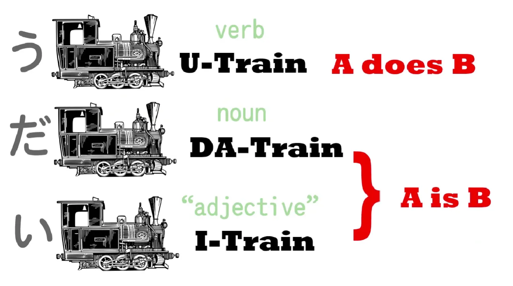
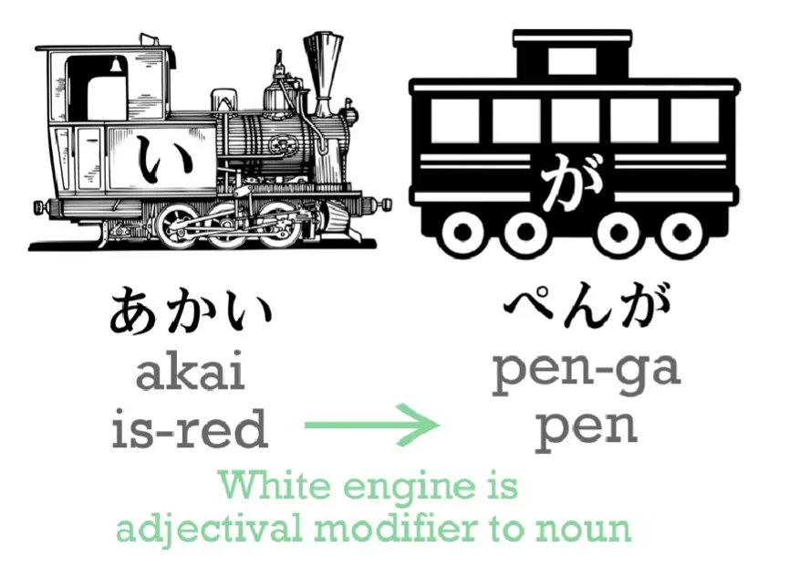
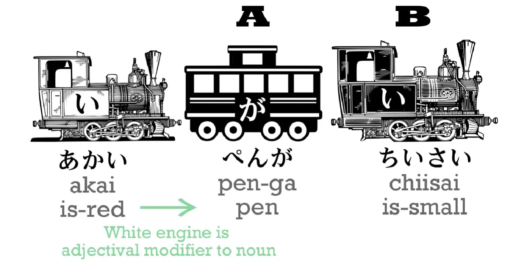
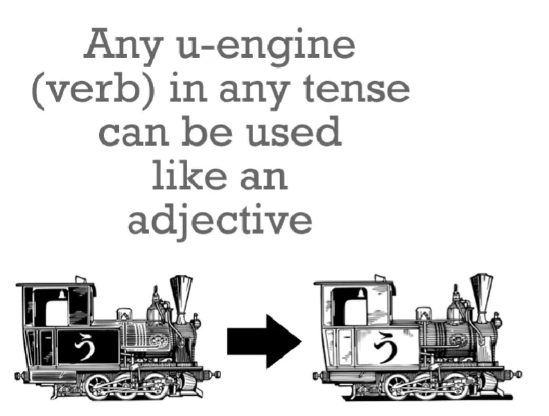
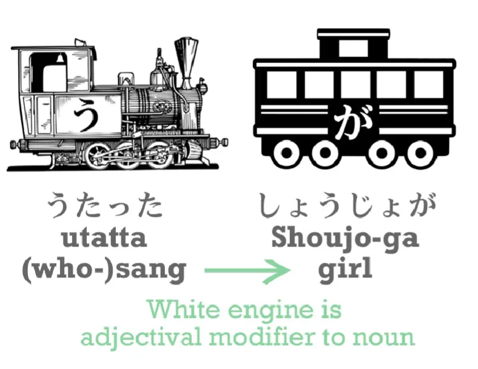
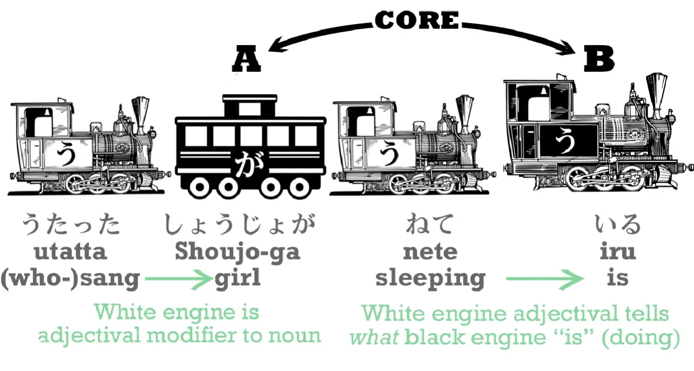
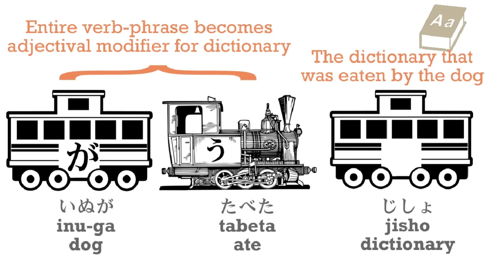
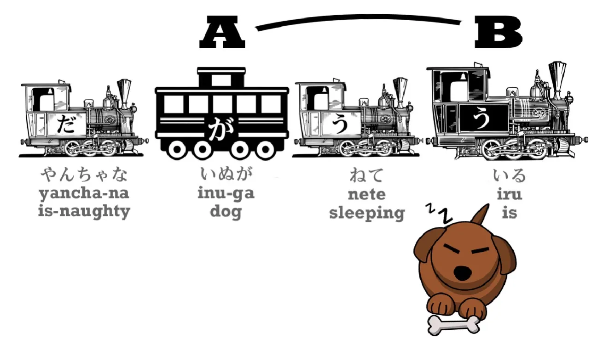
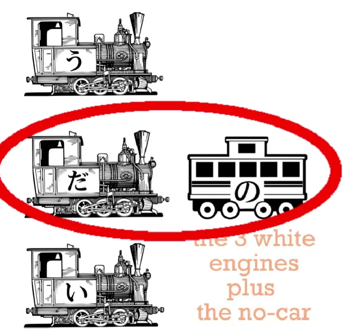

# **6. Прилагательные**

[**Урок 6: Японские <code>прилагательные</code> — настоящий секрет, который делает их лёгкими. То, чему никогда не учат в школах.**](https://www.youtube.com/watch?v=iyVZlaEqU24&list=PLg9uYxuZf8x_A-vcqqyOFZu06WlhnypWj&index=6)

こんにちは。

Сегодня мы поговорим о прилагательных. Японские прилагательные — это не то же самое, что английские прилагательные. Как мы знаем, японские предложения бывают трёх основных видов, в зависимости от типа их локомотива.

У нас есть う-Поезд, глагольные предложения; だ-Поезд, именные предложения; и い-Поезд, который является так называемыми адъективными предложениями. **Но правда в том, что любой из трёх типов локомотивов может использоваться как прилагательное.**

Итак, давайте начнём с самого очевидного, того, что в английском называется <code>прилагательным</code>.

## い-Поезд прилагательные

Простое い-Поезд предложение — это <code>ペンがあかい</code>. Как вы знаете, <code>あかい</code> означает не <code>красный</code>, а <code>является-красным</code>.

Теперь мы можем превратить этот чёрный локомотив в белый и поставить его за ручкой. Теперь у нас есть <code>あかいペンが</code>.

<code>あかいペン</code> означает <code>является-красной ручка</code> или, как мы говорим по-английски, <code>красная ручка</code>. Как видите, **это уже не полноценное предложение само по себе, потому что белый локомотив не тянет поезд, он просто сообщает нам больше о том, за чем он стоит.**

Итак, <code>あかい</code>, как только он становится белым локомотивом, просто сообщает нам больше о главном вагоне предложения, которым является <code>ペン</code>. И если мы хотим превратить это в полноценное предложение, нам нужен новый локомотив. Итак, давайте возьмём <code>ちいさい</code>, что означает <code>является-маленьким</code>.

<code>あかいペンがちいさい</code> – <code>Красная ручка маленькая</code>. *(или, я полагаю, <code>является-красной ручка является-маленькой</code>)*

Так что это достаточно просто.

## Использование глаголов как прилагательных

Теперь давайте посмотрим на глаголы. Если вы беспокоитесь о так называемых な-прилагательных, не волнуйтесь. **Это существительные**, и мы к ним вернёмся через минуту. **Любой う-локомотив, любой глагол, в любом времени, может использоваться как прилагательное.**

Итак, мы можем сказать: <code>しょうじょがうたった</code>. <code>[歌]{うた}った</code> означает <code>пела</code>. Слово <code>петь</code> — это <code>うたう</code>, поэтому た-форма, как мы знаем из нашего последнего урока, — это <code>うたった</code>.

<code>しょうじょがうたった</code> – <code>Девочка пела</code>,

и если мы превратим этот локомотив в белый и поставим его за девочкой, у нас получится <code>うたったしょうじょ</code> – <code>девочка, которая пела</code>.

И, конечно, это снова не предложение. Но мы можем вставить его в любое предложение, которое нам нравится, например: <code>うたったしょうじょがねている</code> – <code>девочка, которая пела, спит</code>.

**И это ужасно важно, потому что большая часть японского языка построена именно так. Мы можем использовать целые глагольные предложения в качестве адъективных, если захотим, и это происходит очень часто.**

Например, <code>いぬがじしょをたべた</code> – <code>собака съела словарь</code>.

Мы можем перевернуть это в <code>じしょをたべたいぬが</code> – <code>собака, которая съела словарь</code>.

Или мы можем сказать: <code>いぬがたべたじしょ</code> – <code>словарь, который был съеден собакой</code>.

::: info
В японском языке это, очевидно, не пассивное предложение. Просто его немного трудно перевести на английский так, как оно звучит на японском. Как видно, японские части намного проще.
:::

И затем это может превратиться в полное предложение: <code>じしょをたべたいぬがやんちゃだ</code>. <code>やんちゃ</code> — это существительное, которое означает <code>непослушный</code> или <code>плохой</code>, так что <code>собака, которая съела словарь, плохая</code>.

## Использование адъективных существительных как прилагательных

Это подводит нас к именному локомотиву. Если мы просто скажем <code>いぬがやんちゃだ</code>, у нас получится простое именное предложение. Но мы можем превратить и этот локомотив в белый и поставить его за собакой. Однако есть одно изменение, которое нам нужно внести.

**Когда мы превращаем <code>だ</code> или <code>です</code> в белый локомотив, при присоединении к чему-либо он меняет свою форму с <code>だ</code> на <code>な</code>.**

Итак, мы говорим <code>いぬがやんちゃだ</code>, но мы говорим <code>やんちゃないぬ</code>, что то же самое, что <code>やんちゃだいぬ</code> – <code>является-плохой собака / собака, которая плохая / плохая собака</code>.

Итак, мы можем сказать <code>やんちゃないぬがねている</code> – <code>плохая собака спит</code>.

**Важно отметить, что вы не можете делать это с каждым существительным. Есть только некоторые существительные, которые часто используются в адъективном смысле, и которые вы можете использовать так, как мы показали здесь.**

Это то, что в учебниках называют <code>な-прилагательными</code>, и это немного сбивающий с толку термин, потому что, как мы видим, на самом деле это существительные, **но это определённый класс существительных.**

::: info
Обратите внимание, что <code>определённый класс существительных</code>, они НЕ являются настоящими собственными существительными. Просто подкласс. Их нельзя использовать отдельно, как собственные существительные (например, в качестве подлежащего). По этой причине у них есть разные названия — адъективные существительные, な-прилагательные, адъективы, номинальные прилагательные и т.д...

Просто они в основном напоминают форму, похожую на собственные существительные, и принимают связку, как и они, поэтому их можно считать (и, вероятно, они являются) классом существительных, но не собственными существительными.
:::

---

**Можем ли мы использовать другие существительные как прилагательные? Да, можем, но мы используем их несколько иначе, и они не являются локомотивами.**

## の-вагон

Чтобы объяснить это, мы должны ввести новый тип вагона для нашего поезда. И это の-вагон. **の \[no\] — очень простая частица, потому что она работает точно так же, как апостроф-s \['s] в английском языке.**

Итак, <code>さくらのドレス</code> означает <code>платье Сакуры</code>. <code>わたしの[鼻]{はな}</code> означает <code>мой нос</code>.
::: info
Или, как показано, буквально <code>Нос меня</code>.
:::
К счастью, нам не нужно беспокоиться о таких вещах, как <code>мой</code>, <code>твой</code>, <code>её</code> и <code>его</code> в японском; **мы всегда просто используем <code>の</code>.**

---

Теперь, поскольку <code>の</code> является притяжательной частицей, её можно использовать и другим, немного отличающимся способом. В начале своих старых видео я всегда говорила: <code>カワジャパのキュアドリです</code> – <code>(Я) Кьюр Долли из KawaJapa</code>. (\*です = だ)

**Другими словами, KawaJapa — это группа, или сообщество, или веб-сайт, к которому я принадлежу.**

И мы можем использовать это шире для определения группы или класса, к которому что-либо принадлежит. Итак, <code>あかい</code> означает <code>красный</code>, потому что мы можем превратить существительное <code>あか</code> в адъективную форму <code>あかい</code>. **Но мы не можем сделать это со всеми цветами.**

Например, <code>ピンクいろ</code>. <code>[色]{いろ}</code> означает <code>цвет</code>, и мы говорим <code>ピンクいろ</code>, что означает <code>розовый</code>. **Но у этого нет い-формы. И оно также не считается адъективным существительным, な-прилагательным, как их называют в английском.**

Итак, что мы с ним делаем, это используем <code>の</code>. <code>ピンクいろのドレス</code> – <code>розовое платье</code>. И это означает <code>**платье, принадлежащее к классу розовых вещей**</code>.

::: info
Долли использует здесь хирагану для <code>Pink</code>. Обычно это пишется катаканой, как заимствованное слово.
:::

Если мы хотим сказать <code>Оскар Кролик</code>, мы говорим <code>ウサギのオスカル</code>, что буквально означает <code>кролика Оскар</code>, а означает <code>**Оскар, который принадлежит к классу **кроликов**** </code>.

<code>ゼルダのでんせつ</code> означает <code>легенда о Зельде</code>; <code>でんせつのせんし</code> означает <code>легендарный воин / **воин, который принадлежит к классу легендарных вещей**</code>.

Итак, у нас есть четыре способа образования адъективов: **три локомотива плюс の-вагон.**

И используя это, мы можем составлять всевозможные предложения, и они могут стать очень сложными, особенно с глагольными прилагательными, в которых мы можем использовать целые сложные предложения в адъективной манере.

И я собираюсь сделать несколько [**рабочих листов**](https://learnjapaneseonline.info/2022/03/28/worksheets/), которые помогут нам привыкнуть к некоторым из этих более сложных предложений, и я размещу их в разделе информации под [**этим видеоуроком**](https://www.youtube.com/watch?v=iyVZlaEqU24&list=PLg9uYxuZf8x_A-vcqqyOFZu06WlhnypWj&index=12).

Теперь, возможно, вы думаете: <code>Поскольку некоторые существительные используются как прилагательные с **な**, а некоторые с **の**, должен ли я начать учить списки, какие из них идут с **の**, а какие с **な**?</code>

И мой ответ на это: **Я не вижу никаких веских причин для этого, если только вам не нужно учить их для экзамена.**

Почему нет? Ну, посмотрите на это логически. Если вы услышите, как кто-то использует их с <code>の</code> или <code>な</code>, вы поймёте, что они говорят. Если вы используете их сами и ошибаетесь, никто не будет испытывать трудностей с пониманием того, что вы говорите, и это очень маленькая и типичная ошибка иностранца, и, честно говоря, это наименьшая из ваших ваших забот на ранней стадии. Если вы пишете, вы, конечно, можете очень легко их найти.

---

**По мере того, как вы будете больше использовать японский, больше слушать японский, больше читать японский, вы поймёте, какие из них используются с <code>の</code>, а какие с <code>な</code>.** А если вы не собираетесь много использовать японский, ну, зачем вам это знать?

Для меня японский — это не игра в изучение абстрактной информации без особой причины. Это язык, который по большей части мы можем изучать естественным образом, и понимание его реальной структуры очень помогает нам в этом.

::: info
Если это слишком много для восприятия, я всегда рекомендую проверять комментарии под [видео](https://www.youtube.com/watch?v=iyVZlaEqU24&list=PLg9uYxuZf8x_A-vcqqyOFZu06WlhnypWj&index=12). И, очевидно, перечитывать и усваивать небольшими порциями. Вы справитесь! ＼(⌒▽⌒)
:::
