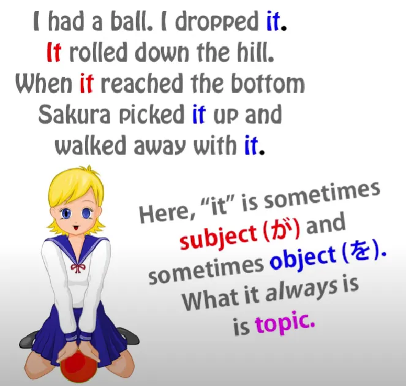

# **60. ДРУГАЯ ПОЛОВИНА Японской Структуры — нелогическая структура «тема-комментарий»**

[**ДРУГАЯ ПОЛОВИНА Японской Структуры — нелогическая структура «тема-комментарий» | Урок 60**](https://www.youtube.com/watch?v=_nXHpkTTfGs&list=PLg9uYxuZf8x_A-vcqqyOFZu06WlhnypWj&index=62&pp=iAQB)

こんにちは。

Сегодня мы поговорим об одной из важнейших тем в японской структуре. По сути, это другая половина японской структуры.

Мы упоминали о ней много раз. Без неё вы не сможете по-настоящему многого сделать в японском. Но мы никогда не подходили к ней вплотную, и именно это мы сейчас и сделаем.

Мы поговорим о структуре «тема-комментарий». И она так же важна, как и логическая структура «подлежащее-сказуемое», «А-вагон-Б-локомотив».

В моей книге <code>*Unlocking Japanese*</code> я называла が королём японского языка, а は — королевой японского языка. が — глава логических частиц, логической стороны языка.
は — глава нелогических частиц и стратегий, нелогической стороны языка.

И мы можем зайти так далеко, что скажем: не только каждое японское предложение имеет А-вагон, отмеченный частицей が, видим мы его или нет, **каждое японское предложение также имеет тему, отмеченную частицей は, видим мы её или нет.**

## Тема

Итак, что такое тема? В каждом языке есть тема; большинство языков, в отличие от японского, не являются темоцентричными. Но чтобы объяснить, что такое тема в английском, вот очень быстрый пример.

В английском языке мы отслеживаем темы, используя местоимения, и именно поэтому в английском так много местоимений. Вот почему там постоянно говорится <code>it</code>.

Итак, мы можем сказать: «I had a ball. It rolled down the hill. It reached the bottom. It was a red ball.»

Как видите, каждый раз мяч обозначается <code>it</code>, и вы могли бы сказать, что здесь отслеживается подлежащее, потому что именно мяч скатился с холма, именно мяч достиг дна, именно мяч был красным.

Но мы также могли бы сказать: «I had a ball. I dropped it. It rolled down the hill. When it reached the bottom, Sakura picked it up and walked away with it.»

Теперь, видите, первое <code>it</code> является дополнением к моему действию бросания: <code>I dropped it.</code> Второе и третье <code>it</code>: <code>It rolled down the hill... it reached the bottom</code> — в этих двух случаях мяч является подлежащим.

А затем <code>Sakura picked it up</code>, и оно снова стало дополнением, на этот раз дополнением к действию Сакуры. Так что <code>it</code> отслеживает не подлежащее, не дополнение, оно отслеживает тему, то, о чём мы говорим.

Вот что такое тема.

И, как я уже сказала, в японском языке всегда есть тема, даже если мы не всегда её видим.

Итак, если мы говорим <code>アメリカ人です</code>, обычно мы бы представили это как <code>zeroがアメリカ人です</code> – <code>Я американец/американка</code>, но чтобы быть абсолютно точными, мы должны были бы представить это как <code>**zeroは**zeroがアメリカ人です</code>, то есть <code>Я — тема, я — подлежащее, и я американец/американка.</code>

Нам не нужно проходить через всё это каждый раз, но важно знать, что это существует. Когда тема и подлежащее совпадают, это не так важно, но, как мы знаем, они часто не совпадают.

И в японском языке гораздо чаще, чем в английском, они очень часто не совпадают. Итак, в предложениях вроде <code>コーヒーが好きだ</code>, <code>頭が痛い</code>, <code>おなかが空いた</code>, <code>クレープが食べたい</code>, все они являются полными логическими предложениями: <code>Кофе приятен</code>; <code>Голова болит</code>; <code>Желудок пуст</code>; <code>Блины вызывают желание съесть</code>.

В каждом случае у нас есть А-вагон, у нас есть Б-локомотив, у нас есть полное логическое предложение. Но хотя оно логически завершено, оно не является грамматически завершённым без понимания того, что существует также невидимая тема, отмеченная частицей は:

<code>**zeroは**コーヒーが好きだ</code>; <code>**zeroは**頭が痛い</code>;
<code>**zeroは**おなかが空いた</code>; <code>**zeroは**クレープが食べたい</code>.

<code>**По отношению ко мне**, кофе приятен/доставляет удовольствие</code>; <code>**По отношению ко мне**, голова болит</code>; <code>**По отношению ко мне**, желудок пуст</code>; <code>**По отношению ко мне**, блины вызывают желание съесть</code>.

И хотя, как и в случае с местоимением, отмеченным (zeroが), по умолчанию это <code>Я</code>, но это не обязательно должно быть <code>Я</code>, то же самое относится и к местоимению (zeroは).

Например, если мы видим, как проходит высокий человек, и говорим <code>背が高い、ね?</code>, буквально <code>спина высокая, не так ли?</code>, и именно так мы говорим, что кто-то высокий. Но, как видите, это неполно без местоимения (zeroは): <code>zeroは背が高い</code> – <code>По отношению к этому человеку, спина высокая</code>.

И поскольку в японском языке так много конструкций, которые не центрируются на «я», как мы говорили в одном из наших предыдущих видео[[9]](./9-the-subject-of-the-japanese-sentence-expressing-desire-ほしい-たい-たがる.md), так много конструкций, в которых ни А-вагон, ни Б-локомотив на самом деле не являются заинтересованным лицом, как во всех примерах, о которых мы только что говорили, **во многих случаях очень необходимо, чтобы мы понимали, что тема, отмеченная частицей は, присутствует.**

И ещё одна вещь, которую нам нужно понять о структуре «тема-комментарий», это то, что **комментарий всегда является полным логическим предложением.**

Тема обычно является существительным (это может быть что-то другое), **но комментарий всегда и обязательно должен быть полным логическим предложением.** Это то, что учебники не объясняют, и, возможно, хорошо, что они этого не объясняют, потому что, если бы они это сделали, я думаю, мы знаем, как бы они к этому подошли.
Они бы представили это как некое странное восточное правило, которое мы должны запомнить.

Но это не так: это логическая необходимость. Как мы знаем, каждое предложение, каждое логическое предложение, должно иметь А-вагон и Б-локомотив, подлежащее и сказуемое, и, как мы знаем из нашего третьего урока о は, **は никогда не может отмечать ни А-вагон, ни Б-локомотив, ни любой другой элемент логического предложения. Оно может отмечать только нелогическую тему.**

Это означает, что если мы вообще хотим иметь предложение, оба его элемента должны находиться вне темы. У нас должна быть тема, а также А-вагон, а также Б-локомотив.

---

Следовательно, каждое предложение «тема-комментарий» имеет только два элемента: тему и комментарий. **Оба элемента логического предложения должны находиться в комментарии.** Следовательно, логически, в предложении «тема-комментарий» комментарий всегда является логическим предложением.

В другом [**видео**](https://www.youtube.com/watch?v=9l_ZlQQU4ZE) я говорила, и собираюсь говорить снова, о некоторых последствиях того, что называется выбором между は и が; что это означает, когда мы отмечаем что-то частицей は, что это означает, когда мы отмечаем это частицей が.

И здесь много последствий. Я не буду вдаваться в них в этом видео, но вы можете посмотреть [**другое**](https://www.youtube.com/watch?v=9l_ZlQQU4ZE), и я поставлю карточку для этого.

Но что здесь важно помнить, поскольку мы говорим о фактической структуре, так это то, что когда люди говорят о выборе между は и が, это сбивает с толку и несколько вводит в заблуждение, потому что это подразумевает, что は и が в чём-то похожи, что они выполняют схожую работу.

**И мы знаем, что это не так. Мы знаем, что они абсолютно разные виды частиц.**

И что мы знаем из этого урока, так это то, что на самом деле мы делаем, **когда выбираем между は и が: мы выбираем, какой из двух всегда присутствующих элементов сделать видимым — делаем ли мы видимой частицу は, частицу が, или не делаем видимым ни один из них.**

Итак, мы можем сказать <code>アメリカ人です</code>, мы можем сказать <code>私はアメリカ人です</code>, и мы можем сказать <code>私がアメリカ人です</code>. И каждое из них имеет немного разное значение.

Мы на самом деле не выбираем между は и が, мы выбираем подчеркнуть, сделав его видимым, тематическую природу подлежащего или субъектную природу темы, или ни то, ни другое.

И то, что из этого мы выбираем подчеркнуть, имеет большое значение для того, что мы говорим и что подразумеваем…