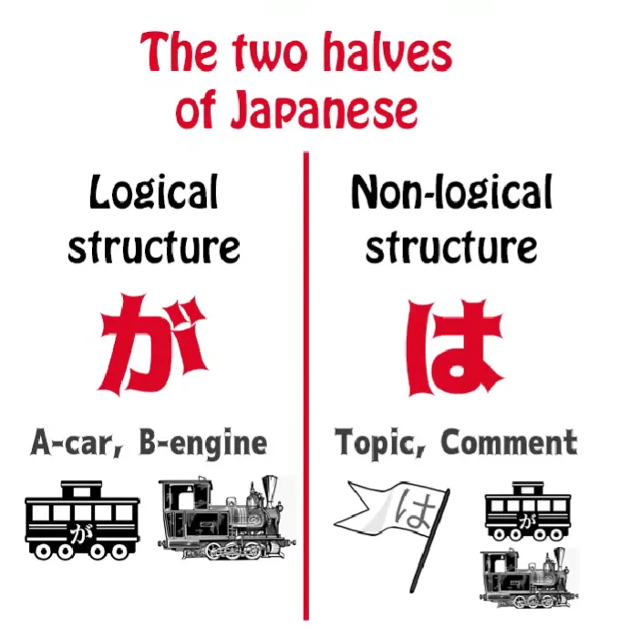
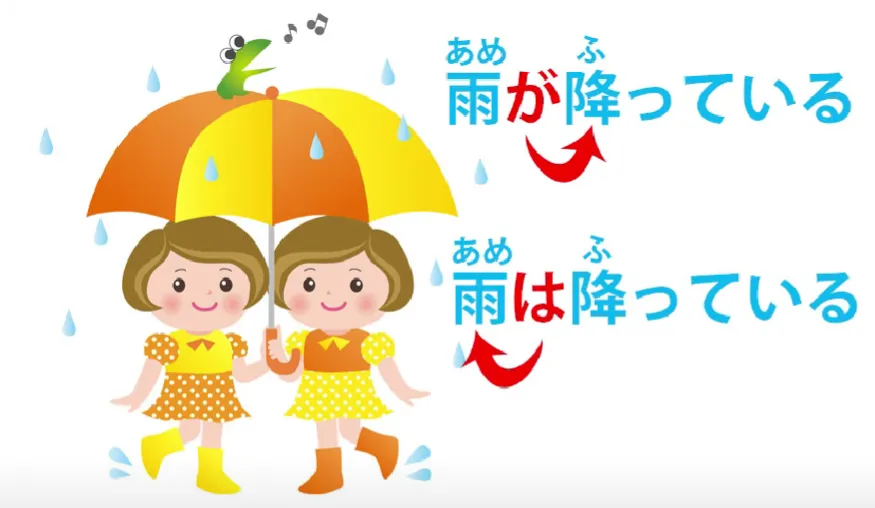

# **61. は и が: Глубокие секреты! Инь-ян структура японского языка**

[**は и が: Глубокие секреты! Инь-ян структура японского языка | Урок 61**](https://www.youtube.com/watch?v=o-hK4-qv9Yk&list=PLg9uYxuZf8x_A-vcqqyOFZu06WlhnypWj&index=63&pp=iAQB)

こんにちは。

Сегодня мы поговорим о более тонких значениях частиц は и が и о последствиях, которые они могут иметь при различном использовании. На прошлой неделе[[60]](./60-the-other-half-of-japanese-structure-non-logical-topic-comment-structure.md) мы рассмотрели тот факт, что структура «тема-комментарий» фундаментальна для японского языка.

Каждое японское предложение имеет тему, а также подлежащее, так что мы можем сказать, что там, где тема и подлежащее не сделаны явными, японские предложения имеют как невидимый が, так и невидимый は. Так, <code>日本人です</code>, что означает <code>Я японец/японка</code>, строго говоря, это <code>zeroはzeroが日本人です</code> — <code>Я — тема, я — подлежащее, и я японец/японка.</code>

В целом, нам не нужно беспокоиться о невидимом は, и это потому, что в английском и родственных языках нам обычно не нужно, чтобы тема была сделана явной. Нам нужно, чтобы подлежащее многократно делалось явным, поэтому мы чувствуем себя немного потерянными, если не знаем, где оно. И именно поэтому мы используем модель невидимого が.

Но важный вывод, к которому мы пришли в нашем последнем уроке, заключался в том, что так называемый выбор между は и が, который, конечно, существует только в предложениях, где тема и подлежащее случайно совпадают, и то, что мы делаем, на самом деле не является созданием темы или созданием подлежащего: мы подчеркиваем тот факт, что что-то является либо темой, либо подлежащим. И этот выбор важен для того значения, которое мы придадим этой теме/подлежащему. А чтобы понять это значение, мы должны иметь представление о том, каков наиболее естественный способ выразить что-либо.

Именно поэтому я всегда говорю, что структура важна, но вы не можете понять японский язык, используя только структуру. **Вы должны иметь достаточное погружение, чтобы понять, что звучит естественно.** И из этого, плюс использование структуры, вы можете понять, какие подразумеваются значения в конкретном утверждении.

---

Итак, когда мы рассматриваем что-то как тему и отмечаем это частицей は или も, **это не может быть новой информацией.** Точно так же, как в английском, если мы говорим <code>Speaking of Melfrog Pooftoofular</code> (Кстати о Мелфроге Пуфтуфуларе), нет смысла говорить это, если ваш слушатель не знает, кто или что такое <code>Melfrog Pooftoofular</code>. Вы должны сначала представить <code>Melfrog Pooftoofular</code>.

**Таким образом, маркер темы может отмечать только старую информацию.** И это важно, потому что старая информация — это неважная информация. Новая информация — это то, что вы на самом деле пытаетесь донести до кого-то. Так работает язык. Мы не должны рассказывать людям то, что они уже знают. Мы должны добавлять что-то, чего они не знают, и это является фактическим информационным содержанием утверждения.

Итак, в некотором смысле, は работает как <code>the</code> в английском, только в этом одном отношении: оно не может отмечать новую информацию. Так что, если мы скажем <code>I fed the iguana</code> (Я покормил игуану), если только люди уже не знают об этой игуане, они сразу же скажут: «Какая игуана? Ты никогда раньше не говорил ни о какой игуане. О чем ты говоришь, 'the iguana'?»

Если вы скажете <code>I fed an iguana</code> (Я покормил игуану), это нормально. И нам также нужно понимать, что **эта концепция старой против новой информации и важной против неважной информации тесно связаны.**

Так что вы можете на самом деле сказать <code>I fed the dog</code> (Я покормил собаку), даже если никто не знает, что у вас вообще есть собака, потому что это очень нормально и естественно для человека — иметь собаку. Они не особо хотят останавливаться и объяснять этот момент. Так что <code>I fed the dog</code> будет воспринято как <code>Я покормил собаку, которую держу дома, хотя вы и не знали, что я держу собаку дома, теперь вы знаете</code>.

Если я скажу <code>I fed the iguana</code>, это остановит разговор. Если вы сначала не представите игуану, никто не примет это как должное — <code>Да-да, у нее дома игуана, как и у большинства людей.</code>

Итак, вы видите, что хотя мы лингвистически говорим «новая информация» против «старой информации», это немного тоньше. Это «новая, важная, релевантная информация» против «старой информации или информации, которую мы можем легко принять как должное». И даже это довольно грубый способ описания.

Давайте посмотрим, как это работает на практике в японском языке. Если мы скажем <code>本を買った</code>, это самый обычный способ сказать <code>Я купил книгу</code>. Как мы знаем, zero-местоимение по умолчанию означает <code>Я</code>, когда контекст не указывает на что-либо другое. Так что <code>本を買った</code> не делает особого акцента ни на чем; это просто нейтральное утверждение <code>Я купил книгу</code>.

Теперь, в этом предложении <code>Я</code> является подлежащим и темой. Если мы решим подчеркнуть <code>Я</code> как тему и скажем <code>私**は**本を買った</code>, **мы делаем <code>私</code> старой информацией, а покупку книги — новой информацией, и из-за этого は имеет различительную функцию.**

---

Когда мы используем は, мы либо устанавливаем, либо меняем тему.
И даже установление темы в большинстве случаев является ее изменением, потому что мы можем предположить, что какая-то тема была раньше. Итак, мы меняем тему на <code>Я</code> и говорим, что я купил книгу.

И мы знаем, что は не только меняет тему на то, что оно отмечает (в данном случае <code>Я</code>), **но также подразумевает, что комментарий к новой теме отличается от комментария к старой теме.** И если старой темы на самом деле не было, это все равно подразумевает, что он отличается от комментария **к другим возможным темам.**

Итак, <code>私は本を買った</code> по сути означает: «Что я сделал, так это купил книгу. Вы, возможно, купили что-то другое, другие люди, возможно, вообще ничего не купили, но что я сделал, так это купил книгу». Мы подчеркиваем тот факт, что **я купил книгу в отличие от других возможных тем, которые не купили книгу.**

Это означает, что это неявно является ответом на вопрос, который, возможно, на самом деле не был задан: <code>Что ты сделал?</code> Ответ на <code>Что я сделал?</code> — это <code>Я купил книгу</code>, когда вы отмечаете <code>Я</code> частицей は.

---

Теперь, если вы скажете <code>私が本を買った</code>, вы изменили акцент. **Вы изменили акцент на противоположный.** Старой информацией теперь является покупка книги, а **новой информацией является <code>Я</code>.**

Итак, при каких обстоятельствах вы это скажете? Ну, предположим, люди смотрят на пустое место на книжной полке и интересуются, что произошло, и вы говорите <code>私が本を買った</code> – <code>Я тот, кто купил книгу.</code> Мы все знаем, что книга исчезла, мы знаем, что что-то случилось с книгой, теперь я даю вам новую информацию: **<code>Я</code> тот, кто купил книгу.**

Итак, в то время как <code>私は本を買った</code> неявно является ответом на вопрос <code>Что ты сделал?</code>, <code>私が本を買った</code> неявно является ответом на <code>Кто купил книгу?</code>

---

Также важно понимать, каков естественный, нейтральный способ сказать что-либо. Мы знаем в данном случае, что естественный, нейтральный способ сказать <code>Я купил книгу</code>, не подчеркивая ничего, — это просто сказать <code>本をかった</code>.

Так что, если мы говорим <code>私は</code> или <code>私が</code>, **мы специально делаем акцент здесь. Мы добавляем что-то к нейтральному утверждению, что я купил книгу.**

Теперь, исходя из этого направления акцента вперед или назад,
は и が могут отмечать частности в отличие от общих понятий.

Так, например, если мы скажем <code>花が綺麗だ</code>, мы подчеркиваем <code>花</code> как подлежащее, и это означает <code>Цветок (или эти цветы) красивы</code>. <code>Красивы</code> важно, но настоящим подлежащим являются <code>эти цветы</code>. Эти цветы — это то, что красиво, это красивые цветы.

Если мы скажем <code>花は綺麗だ</code>, мы, скорее всего, говорим, что цветы в целом красивы. Мы не выделили какие-либо цветы как подлежащее; мы сделали <code>цветы</code> темой, и важной новой информацией является красота. **Цветы сами по себе не являются чем-то новым.** Мы знаем о них давно. **Тот факт, что они красивы, — это мой комментарий, моя оценка их.**

<code>花が綺麗だ</code> – цветы воспринимаются как нечто новое. Они воспринимаются как конкретное подлежащее сами по себе, и поэтому мы, скорее всего, говорим о конкретных цветах, а не о цветах в целом.

---

Теперь, все время мы говорим здесь о тенденциях, не так ли? Нет логической, структурной причины, по которой <code>I fed the iguana</code> (Я покормил игуану) отличается от <code>I fed the dog</code> (Я покормил собаку). Оно становится другим из-за ожиданий.

Мы ожидаем, что у кого-то, скорее всего, есть собака, и поэтому это не новая или важная информация. Мы не ожидаем, что у кого-то есть игуана, поэтому это считается новой, важной информацией, и вы не можете проскользнуть с <code>the</code> так же, как с собакой.

**Аналогично, が может отмечать как новый, так и старый материал, но は не может отмечать новый материал. は может отмечать как конкретные вещи, так и общие понятия, но が на самом деле не может отмечать общие понятия.**

Так что мы говорим здесь о довольно тонких оттенках. Теперь, знание обычного способа сказать что-либо, опять же, придает использованию другой стратегии ее акцент.

Итак, как я говорила в [**предыдущем видео**](https://www.youtube.com/watch?v=9l_ZlQQU4ZE) о は и が (которое я бы рекомендовала посмотреть, потому что оно охватывает материал, который я здесь не рассматриваю), мы знаем, что <code>雨が降っている</code> означает <code>идет дождь</code>. Это обычный способ сказать, что идет дождь. Мы используем が. Мы не можем ничего не использовать, потому что мы должны сказать, что падает, и мы обычно не используем は.

Итак, <code>雨が降っている</code> просто означает <code>дождь падает</code>. <code>雨は降っている</code> — это то, что вы бы сказали, если, возможно, ожидалось, что пойдет снег.

Дождь — это тема, и комментарий к ней заключается в том, что он падает, с подразумеванием, что если бы тема была другой, комментарий также был бы другим, потому что **мы используем は**, а не も, и **は является исключительным маркером темы в отличие от も, который является включающим маркером темы.**

---

Теперь, это используется не только для дифференциации; это также используется, потому что это переносит акцент вперед. Это также используется для акцента.

Итак, я возьму пример из одного из моих любимых аниме, это «Ария: Анимация». К сожалению, я не думаю, что у него есть японские субтитры, так что вам, возможно, придется немного подождать, прежде чем вы его посмотрите. Я знаю, что вы больше не смотрите ничего с английскими субтитрами, и я поздравляю вас с этим.

Итак, предложение: <code>おまえみたいな半人前に休みはない</code>. <code>おまえみたいな半人前に休みはない</code>. И это означает: <code>Для таких стажеров, как ты, нет отдыха</code>.

Теперь интересно заметить, что здесь происходит. Какова тема этого предложения? На самом деле, это <code>стажеры, как ты</code>: <code>おまえみたいな半人前に</code> могло бы быть <code>おまえみたいな半人前には</code>, и это сделало бы <code>стажеров, как ты</code> темой, а комментарием к этому было бы логическое предложение <code>休みがない</code> — <code>нет отдыха</code>.

---

**Однако говорящий решил поступить иначе. Она решила снизить акцент на теме, не отметив ее частицей は, но это не мешает ей быть темой.** Она по-прежнему является темой, к которой логическое предложение является комментарием.

И **она сделала <code>休み</code> — <code>отдых</code> — подтемой.** Почему она это сделала?

**Потому что, когда вы делаете что-то темой, даже если это своего рода подтема, как здесь, вы переносите акцент вперед, на то, что следует за ней.** Вы делаете то, что следует за ней, наиболее заметной, важной информацией предложения.

Итак, здесь говорится <code>休みは *(zeroが)* ない</code> — <code>Что касается отдыха, то *(его)* нет</code>: <code>Для таких стажеров, как ты, что касается отдыха, то *(его)* нет.</code> Теперь, это не так громоздко, как звучит в английском, потому что は — гораздо более гибкая частица, которую можно использовать гораздо легче, чем такие вещи, как <code>as for</code> (что касается) в английском.

Но она использует ту же самую основную стратегию, чтобы перенести весь акцент этого предложения на последнее слово, <code>ない</code> — <code>его нет</code> — <code>забудьте об отдыхе, вы его не получите.</code>

Надеюсь, это немного проясняет более глубокие и тонкие значения は, отмечающей тему, и が, отмечающей подлежащее…

::: info
Это может быть довольно сложно понять, как всегда, комментарии под [**видео**](https://www.youtube.com/watch?v=o-hK4-qv9Yk&ab_channel=OrganicJapanesewithCureDolly), возможно, немного помогут. Мозг в конечном итоге разберется с этим посредством естественного, понятного ввода через активное органическое воздействие на язык и его активное использование. Просто продолжайте в том же духе (•̀o•́)ง
:::