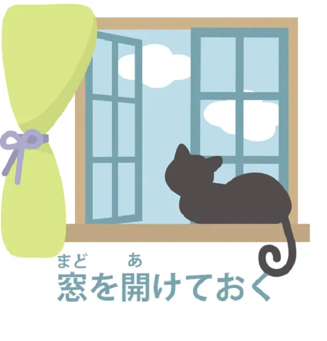

# **62. ておく vs てしまう, секреты вспомогательных глаголов**

[**ておく vs てしまう, секреты вспомогательных глаголов. ておく てしまう | Урок 62**](https://www.youtube.com/watch?v=q6vDkjv4ac0&list=PLg9uYxuZf8x_A-vcqqyOFZu06WlhnypWj&index=64&pp=iAQB)

こんにちは。

Сегодня мы начнем говорить о том, что я называю мостом между структурным обучением и реальным погружением, потому что мы изучаем выражения и структуры, а затем иногда, когда мы сталкиваемся с ними в реальном использовании, мы не совсем понимаем, что они там делают.

Я возьму пример от моей патронессы Кимика-самы, которая дала мне это предложение:

<code>各団体には私からよく説明しておく</code>

Теперь Кимика-сама может перевести это почти правильно (в общих чертах это означает на английском

<code>I will give each group a good explanation from me</code>),

но все еще не понимает, почему <code>おく</code> используется в качестве вспомогательного глагола к <code>説明する</code>.

И чтобы понять это более полно, я думаю, нам нужно углубиться в кое-что. Это тот факт, что японцы очень любят свои вспомогательные глаголы и довольно часто присоединяют их в различных обстоятельствах. Можем ли мы понять это с английской точки зрения?

Я бы сказала, да, можем. Мы делаем то же самое в английском, хотя не столько с глаголами, сколько с предлогами, особенно с предлогами <code>up</code> и <code>out</code>.

Мы «съедаем» (eat up) вещи, мы «выдумываем» (make up) вещи, мы «выкрикиваем» (cry out), мы «проигрываем» (lose out), мы «придумываем» (think up) идею, мы «продумываем» (think out) идею, и так далее, и так далее. Так вот, **в японском нет предлогов. Вообще никаких.** Если вы думаете, что они есть, пора выбросить этот учебник в окно.

Вместо этих английских предлогов <code>up</code>, <code>out</code> и так далее, он использует глаголы — вспомогательные глаголы. И разница между японским вспомогательным глаголом и английским глаголом-предлогом-помощником заключается, во-первых, в том, что их гораздо больше, а во-вторых, из-за этого они гораздо более специфичны. Если вы посмотрите на различные способы, которыми носители английского языка используют <code>up</code> и <code>out</code> — они даже «peace out», что бы это ни значило — вы увидите, что, поскольку их всего несколько, они используются повсюду в самых разных обстоятельствах, и в их использовании лишь незначительное количество логики.

---

Теперь, поскольку вспомогательных глаголов больше, они могут быть гораздо более целенаправленными. Так что, хотя они широко используются в самых разных ситуациях, мы, как правило, можем понять, что делает любой данный вспомогательный глагол, если мы понимаем, что нам нужна довольно широкая интерпретация.

Итак, то, что делает <code>-ておく</code> здесь, это на самом деле то, что он делает всегда. Если мы говорим <code>窓を開けておく</code>, то мы говорим:
«открыть окно для того, чтобы окно было открыто и, вероятно, чтобы в комнату поступила вентиляция».

Откройте его с определенной целью, поместите это действие на место:

<code>おく</code>, что означает <code>поместить на место / положить</code>. Поместите это действие на место, чтобы оно затем
изменило обстоятельства так, как мы хотим. В данном случае, проветривание комнаты.

И то же самое с <code>説明</code> здесь. <code>説明しておく</code> — поместить акт объяснения, или само объяснение, на место, чтобы после этого каждая группа поняла, что происходит, и больше не оставалась в неведении.

---

Теперь мы можем сравнить это с другим очень распространенным вспомогательным глаголом, которым является <code>しまう</code> и его различные варианты, такие как <code>ちゃった</code>, <code>じゃった</code> и т.д. Мы могли бы сказать <code>説明してしまう</code>, но это имело бы совершенно другое значение.

В данном конкретном случае это, вероятно, означало бы что-то вроде:
«Я все равно объясню им, хотя от меня этого не ожидают, или, возможно, люди не хотят, чтобы я это делал.»
Я просто возьму и объясню им – <code>説明してしまう</code>

В другой ситуации мы могли бы сказать что-то вроде:

<code>聞かないでよ。さくらは説明してしまうから</code>,

что означает <code>Не спрашивай, потому что Сакура объяснит</code>

Но то, что подразумевает <code>しまう</code>, это, вероятно, что-то вроде:
«Не спрашивай, потому что если ты это сделаешь, Сакура начнет объяснять, и мы застрянем здесь на часы с долгими, бессвязными объяснениями Сакуры.»

Итак, <code>しまう</code> имеет широкий спектр значений, некоторые из них отрицательные, не все из них отрицательные, но <code>おく</code> имеет совершенно другой диапазон значений.

---

**<code>しまう</code> говорит о том, чтобы взять и сделать что-то, о чем-то, что происходит случайно;**

как я говорила в видео о <code>しまう</code>[[44]](./44-how-to-use-natural-japanese-ちゃう-ちゃった.md), по сути, когда это в прошедшем времени, все те вещи, которые мы можем подразумевать под <code>done</code> — <code>I done explained</code>, <code>I done fell over</code>, <code>she done stole my cake</code>, <code>I done won the lottery</code> — не обязательно должно быть отрицательным, но в нем есть это ощущение восклицательного знака.

**Это произошло, даже если вы, возможно, не ожидали этого или не хотели этого.**

**Это произошло.**

---

**<code>おく</code> не имеет этого ощущения восклицательного знака.**

**В нем есть это деловое ощущение:**

это было сделано, чтобы привести действие в действие, достичь результата, изменить обстоятельства с того, что было раньше, на то, что больше соответствует нашим желаниям, будь то открытие окна или объяснение нескольким группам, какова ситуация…