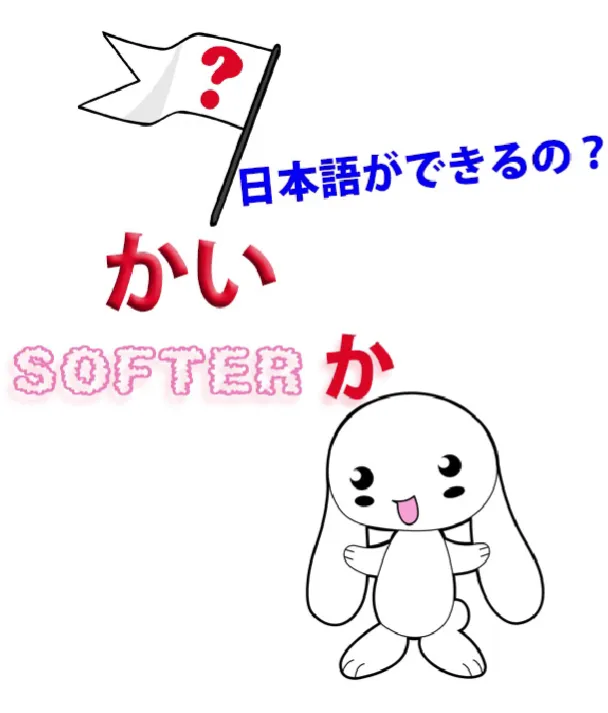
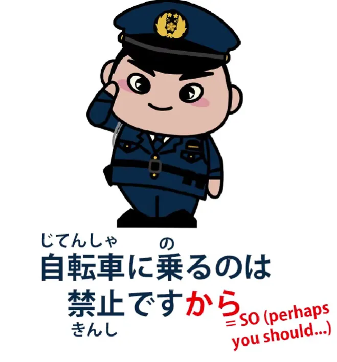
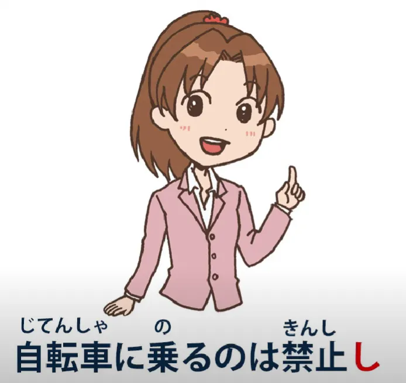
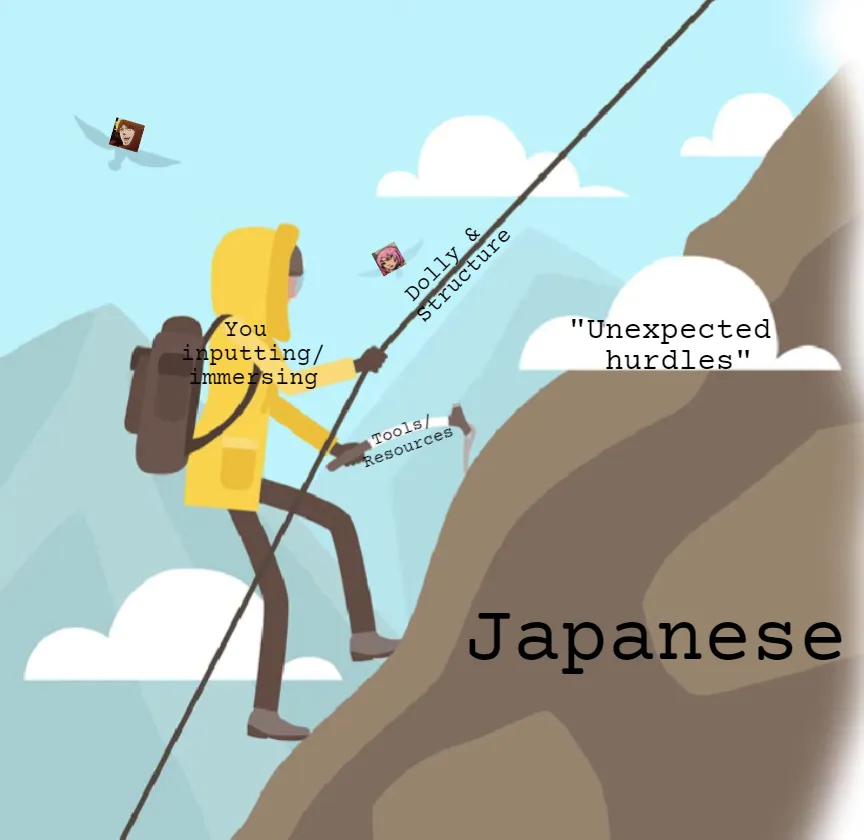

# **63. «Дикие» завершители предложений в реальном японском: かい, だい, ぜ, ぞ, さ, から, し, ちょうだい**

[**«Дикие» завершители предложений в реальном японском: かい, だい, ぜ, ぞ, さ, から, し, ちょうだい | Урок 63**](https://www.youtube.com/watch?v=CVJ4jTlxyno&list=PLg9uYxuZf8x_A-vcqqyOFZu06WlhnypWj&index=65&pp=iAQB)

こんにちは。

Сегодня мы поговорим о тех вещах, которые бьют нас между глаз, как только мы покидаем огороженный сад теоретического японского и отправляемся в дикие леса настоящего языка. Один из вопросов, который мне часто задают, касается различных завершителей предложений, с которыми люди сталкиваются. И я говорю не о «ручных» вроде <code>ね</code>, <code>よ</code> и <code>な</code> – если вам интересно, я сделала [**видео**](https://www.youtube.com/watch?v=IWEok4Ivfyc) об этом, и я помещу ссылку на него над своей головой.

Но сегодня мы поговорим о некоторых более разговорных и нетрадиционных завершителях предложений, с которыми вы столкнетесь, как только погрузитесь в «дикий японский» в аниме, манге и так далее.

## かい

Итак, один из тех, о которых меня часто спрашивают, это <code>かい</code>, и <code>かい</code> — это просто смягченная и разговорная форма <code>か</code>. Как мы знаем, <code>か</code> регулярно используется в формальном японском, где мы используем украшения です/ます в конце предложений, чтобы формировать вопросы. Так мы говорим <code>何々しますか / 何々ですか</code>.

Но в разговорном японском мы не так уж часто используем <code>か</code> в качестве вопросительного маркера в конце предложения. **Мы используем его в других позициях** — и я сделала видео о различных способах использования <code>か</code>[[39]](./39-the-か-particle-buried-questions-かな-もんか-かどうか.md), и я тоже помещу ссылку на него над своей головой. Но там, где мы, как правило, не используем его в неформальной речи, в целом, это в конце предложений, отмечающих вопросы, так, как это делается в です/ます японском.

И это не потому, что это неграмматично, на самом деле это совершенно грамматично, но в современном японском это стало звучать немного грубо, поэтому, хотя вы можете услышать это между мужчинами, которые ведут себя как «свои парни», вы не так часто услышите это в женской речи или в речи любого, кто пытается быть немного вежливым. Так что же нам делать? Большую часть времени мы просто используем восходящую интонацию в речи или вопросительный знак в письменной речи, когда изображаем непринужденную речь. И в этом нет ничего плохого.

Испанский постоянно задает вопросы, просто добавляя восходящую интонацию к эквивалентному утверждению, и там нет никаких проблем. В японском тоже нет проблем. Иногда мы добавляем <code>の</code>, что неоднозначно, потому что оно может отмечать как вопрос, так и утверждение, но опять же, это не имеет значения, потому что интонация работает так же хорошо.

Однако у нас есть неформальный, негрубый вопросительный маркер <code>かい</code>. Вы можете подумать, что его будут использовать постоянно, **но это не так**, потому что он звучит очень разговорно и иногда немного... ну, простонародно. Некоторые источники говорят, что он в основном мужской, и это отчасти правда. Вы не услышите, чтобы его использовали многие молодые женщины, но иногда его используют пожилые женщины.

## だい (& どうだい)

У <code>かい</code> также есть партнер — <code>だい</code>.

**<code>だい</code> — это на самом деле <code>だ</code> плюс <code>かい</code>.**

Так что это форма <code>かい</code>, которую мы используем в предложениях, оканчивающихся на связку, в предложениях, оканчивающихся на <code>だ</code>.

И почти все, что я сказала о <code>かい</code>, также относится к <code>だい</code>, **за исключением** того, что существует особое устойчивое сочетание <code>どうだい</code>, которое используется гораздо шире. Итак, если кто-то ест что-то, и вы говорите <code>どうだい?</code> — <code>как это? / каково это?</code> — и они могут сказать <code>[美味]{おい}しい!</code> или они могут сказать <code>[不味]{まず}い</code>, но **спросить в такой форме может любой, при условии, что это неформальная обстановка.**

## ちょうだい

Люди также сталкиваются с выражением <code>ちょうだい</code>, **и оно никак не связано с <code>かい</code> или <code>だい</code>; это неформальный эквивалент <code>ください</code>.** Так что обычно оно добавляется к て-форме глагола, чтобы попросить кого-то что-то сделать. Иногда считается, что это женская речь, **но это не исключительно так.**

## ぜ, ぞ, さ

Другие настоящие маркеры завершителей предложений в непринужденной речи — это <code>ぜ</code>, <code>ぞ</code> и <code>さ</code>. Итак, <code>ぜ</code> и <code>ぞ</code> очень просты. Это просто словесные восклицательные знаки, которые придают немного силы тому, что вы говорите. **Они довольно грубые и действительно являются мужской речью, и это то, что вы, вероятно, увидите больше в аниме и манге, чем в реальной жизни.**

<code>さ</code> похожа, но она не так груба. **Она гораздо шире используется**, вы увидите ее много, и вы услышите ее в реальной жизни. Ее обычно называют мужской речью, но опять же, **это не исключительно мужская речь**. Ее используют самые разные люди.

**Важно не путать <code>さ</code>, завершитель предложения, придающий акцент, с <code>さあ</code>, которое стоит в начале предложения и является скорее выражением, дающим время на размышление.**

---

Теперь, есть также завершители предложений, **которые не являются завершителями предложений, но фактически ими являются**, потому что люди ставят их после локомотива в конце предложения.

Здесь Долли также предлагает посмотреть это [**видео**](https://www.youtube.com/watch?v=Au5JOtcwE7A&ab_channel=OrganicJapanesewithCureDolly) о псевдо-завершителях, のに и なのに соответственно.

Один из них — <code>から</code>.

## から — завершитель предложения

Итак, <code>から</code>, как вы знаете, **технически не является завершителем предложения.** **Это союз, который соединяет два логических придаточных предложения, образуя сложное предложение.** Так, правильное использование <code>から</code> может быть: <code>さくらが来ないから帰ります</code>, что означает <code>Поскольку Сакура не приходит, я иду домой / Сакура не приходит, поэтому я ухожу</code>.

Однако вы можете просто сказать, уходя: <code>さくらが来ないから</code>, и это просто оставляет вторую половину предложения недосказанной, потому что она очевидна. Теперь, исходя из этого, <code>から</code> может быть добавлено ко многим предложениям, чтобы подразумевать, что что-то еще последует.

**Это дополнительное «что-то еще» не всегда полностью ясно.** На самом деле, <code>から</code> может выполнять функцию либо смягчения того, что оно отмечает, либо его ужесточения.

Оно может смягчить его, делая утверждение объяснительным; оно может ужесточить его, заставляя звучать так, будто это часть логического аргумента или естественного рассуждения, которое слушатель должен понять и с которым должен согласиться.

Например, если вы едете на велосипеде там, где нельзя ездить на велосипеде, и к вам подходит какой-то официальный человек и говорит <code>自転車に乗るのは禁止ですから</code> [вежливый тон], это примирительно, и на самом деле все, что они хотят сказать, это <code>Здесь запрещено ездить на велосипеде</code>, но, добавляя <code>から</code> в конец, они как бы смягчают это, превращая в объяснение для вас.

И наоборот, они могут сказать <code>自転車に乗るのは禁止ですから</code> [строгий тон], и это имеет другое значение. Здесь <code>禁止</code> вбивается с ещё большей силой благодаря этому <code>から</code>.

Таким образом, <code>から</code> может иметь различные применения, часто зависящие от контекста, от того, как они произносятся, от манеры говорящего и от всей ситуации.

## し — завершитель предложения

<code>し</code> — еще одна очень распространенная частица, завершающая предложение, которая похожа на <code>から</code> и имеет значение в той же области. <code>し</code> может фактически объединять различные условия или утверждения, **но ее наиболее распространенное и регулярное использование — это объединение причин.**

Так, например, мы можем сказать <code>遅くなったしさくらが来ないし帰ります</code>, и это означает «Поскольку стало поздно и поскольку Сакура не приходит, я иду домой». И **это наиболее стандартное использование <code>し</code>.**

---

Но затем мы можем часто использовать его только для одного условия, подразумевая другие. Например, если бы мы сказали <code>遅くなったし帰ります</code>, мы говорим <code>поскольку стало поздно, я иду домой</code>, **но мы также подразумеваем, что тот факт, что стало поздно, не единственная причина:** <code>Поскольку стало поздно (и по другим причинам) я иду домой.</code>

И это, в данном конкретном случае, вероятно, подразумевает, что это не только потому, что становится поздно, **это также потому, что Сакура не приходит, но мы оставляем недосказанной более личную часть этого.**

Теперь, наоборот, мы можем сказать <code>さくらが来ないし帰ります</code>, и на этот раз мы вставили самую важную часть, настоящую причину нашего ухода, но, сказав <code>し</code>, а не <code>から</code>, мы также говорим: <code>Поскольку Сакура не приходит (и по другим причинам) я ухожу.</code>

**Что это делает, так это снимает давление с Сакуры.** Хотя она может быть главной причиной, мы немного рассеиваем это, предполагая, что есть и другие причины.
**И мы можем сделать это, когда других причин вообще нет, просто как способ смягчить и рассеять утверждение.**

Другой пример: предположим, вы снова едете на велосипеде в том месте, где нельзя ездить, и на этот раз к вам подходит друг и говорит: <code>自転車に乗るのは禁止し</code>.

::: info
Да, обычно после 禁止 должно быть だ перед し. Но поскольку это непринужденная речь, оно опущено.
:::
Теперь, **разница между этим и утверждением с <code>から</code> заключается просто в том, что <code>し</code> смягчает его.** Оно говорит: «О, потому что здесь запрещено ездить на велосипеде, и по другим причинам...»

**Теперь, никаких «других причин» вообще нет, но это делает речь более разговорной, более дружелюбной**, и немного размывает то <code>から</code>, которое может звучать слишком похоже на приказ. Оно просто говорит: «О, по этой и другим причинам».

И эта тактика «размывания» часто встречается в языках. В английском это часто делается путем добавления слов вроде <code>like</code> или <code>kinda</code> к тому, что вы говорите.

Теперь, способы, которыми работают эти завершители предложений, нельзя выучить только из структуры или только из абстрактных инструкций. **Нам нужно погрузиться в японский, чтобы почувствовать, что люди имеют в виду, когда говорят эти вещи.**

Но, наоборот, понимание структуры, понимание того, как они на самом деле сочетаются, дает нам существенный толчок в способности осмыслить наше погружение. Это похоже на веревку и восхождение на гору.

::: info
Действительно, это немного изменено... как-то... \*кхе-кхе\*... странно... ╮(︶▽︶)╭
*Если у вас есть веревка, это поможет вам взобраться на гору,*
:::

но если вы просто стоите, уставившись и изучая все о веревке, вы никогда не доберетесь до вершины горы. И наоборот, если вы попытаетесь взобраться на гору без веревки, вы можете не продвинуться очень далеко...