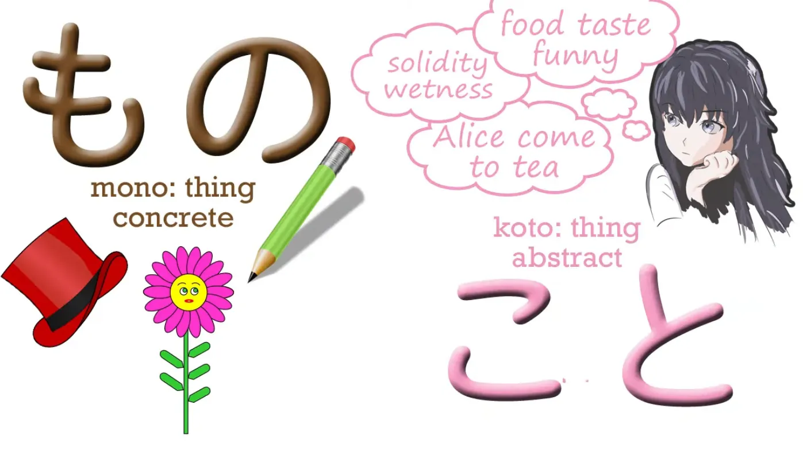
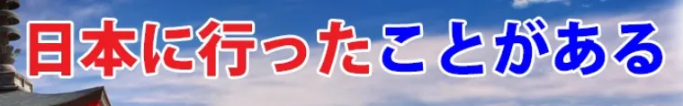
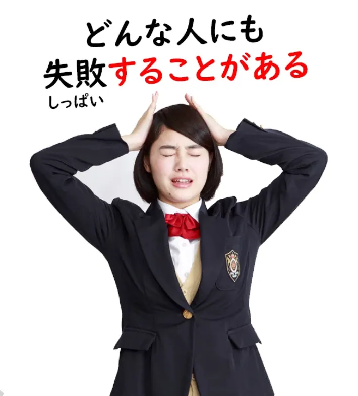

# **64. <code>Вещи</code> становятся странными! もの и こと — Продвинутые секреты: ものだ, ことがある, こと как завершители предложений**

[**<code>Вещи</code> становятся странными! もの и こと — Продвинутые секреты: ものだ, ことがある, こと как завершители предложений | Урок 64**](https://www.youtube.com/watch?v=aYlgQaK7lS4&list=PLg9uYxuZf8x_A-vcqqyOFZu06WlhnypWj&index=66&pp=iAQB)

こんにちは。

Сегодня мы поговорим о <code>もの</code> и <code>こと</code> в некоторых их более продвинутых значениях.

В начале этого курса мы уже говорили о <code>もの</code> и <code>こと</code>, и я тогда сказала то, что обычно говорят люди: что <code>もの</code> — это конкретная вещь, такая как карандаш, яблоко или дерево, а <code>こと</code> — это абстрактная вещь, такая как ситуация, обстоятельство, действие.

Это в целом верно, и, безусловно, это лучший способ понять их в начале, но затем мы сталкиваемся с другими ситуациями, которые, кажется, не вписываются в это правило.

Одна из моих Патронов написала, чтобы обсудить предложение: <code>愛はすばらしいものだ</code>, что означает <code>Любовь — это прекрасная вещь</code>.

Но ведь любовь, несомненно, абстрактна. Вы не можете положить ее в коробку и перевезти из Киото в Токио. Так что же здесь происходит?

Моя Патрон сказала, что она искала объяснение на различных японских сайтах для изучающих язык, и они вообще не смогли это объяснить. Они просто сказали, что нужно запомнить, в каких случаях использовать <code>もの</code>, а в каких — <code>こと</code>.

Это совершенно не так. На самом деле <code>もの</code> обозначает <code>вещь</code>. А вещь — это существительное, поэтому это может быть конкретная вещь, такая как яблоко, книга или вселенная, но это также может быть и абстрактная вещь, такая как любовь или счастье. Все это существительные.

Так что <code>愛はすばらしいものだ</code> — это единственный способ сказать это, потому что <code>ai</code> — это <code>もの</code>, а не <code>こと</code>. Это существительное. Это вещь. Это не состояние, это не действие, это не условие. Это вещь.

И нам нужно помнить об этом, когда мы будем рассматривать некоторые из более широких значений <code>もの</code> и <code>こと</code>, поскольку мы начнем видеть, как <code>もの</code> и <code>こと</code> иногда используются как нечто вроде завершителей предложений.

Но прежде чем мы перейдем к этому, давайте рассмотрим некоторые другие расширенные применения <code>こと</code>. Одно из самых распространенных — это <code>したことがある</code>.

Например, мы можем сказать <code>日本に行ったことがある</code>. И это означает <code>Я бывал в Японии</code>.

И, как вы видите, <code>Я бывал в Японии</code> — это другое утверждение, чем <code>Я ездил в Японию</code>. <code>Я ездил в Японию</code> относится к одному конкретному случаю поездки в Японию. <code>Я бывал в Японии</code> означает, что в прошлом, возможно, один раз, возможно, много раз, поездка в Японию — это то, что я делал. В японском мы буквально говорим: <code>Действие, факт моего пребывания в Японии в прошлом существует.</code>

У меня когда-то был Патрон из Италии, который зацепился за мой ранний урок о японских временах. Я сказала, что в японском языке всего три времени. И это правильно: в японском языке всего три времени. И мой итальянский друг спросил меня: «Так как же мне сказать что-то вроде 'Я бывал в Японии' в отличие от 'Я ездил в Японию'?» И я объяснила, как это делается. И он сказал: «Ну, в таком случае, в японском не просто три времени. Он точно такой же, как итальянский, французский или другие европейские языки...» У него есть перфективные времена и плюсквамперфект, и все эти сложные вещи, которые есть в европейских языках.

И поэтому я должна преподавать это именно так. Я должна преподавать японское прошедшее, настоящее и будущее, и плюсквамперфект, и перфектив, и все такое.

Но это прекрасный пример того, что не так с западным преподаванием японского языка. Это было бы объединение японского, категоризация японского, как если бы это был европейский язык, который пошел не так. Конечно, любой достаточно сложный язык должен быть способен выражать практически любые временные отношения.

Но он делает это не так, как европейские языки. Он не делает это путем спряжения глаголов. На самом деле, как я уже говорила, японский вообще не спрягает глаголы, даже в тех случаях, которые западным глазам кажутся похожими на спряжение.

Он использует совершенно другую стратегию. Он говорит: <code>Факт моего пребывания в Японии существует</code>.

Теперь, если мы перейдем от <code>したことがある</code> к настоящему времени, <code>することがある</code>, если вместо <code>日本に行ったことがある</code> мы скажем <code>日本に行くことがある</code>, мы теперь говорим: <code>Факт моей поездки в Японию существует</code>.

Другими словами, мы говорим: <code>Я иногда езжу в Японию / поездка в Японию — это факт, который существует</code>. Если мы скажем <code>どんな人にも失敗することがある</code>, мы говорим: <code>каждый человек иногда совершает ошибки / какой бы ни был человек, факт совершения ошибок существует</code>.

Теперь, если вы начнете называть эти вещи временами, это должно было бы быть прошедше-настояще-и-будуще-иногда-происходящее время, что является абсурдом, но тогда и все остальное тоже.

Это просто японская стратегия для выражения того, что определенная категория событий иногда происходит — факт их происшествия существует.

Теперь, <code>もの</code> иногда используется таким образом, что это действительно похоже на завершитель предложения. И первый способ, которым это происходит, — это когда мы добавляем <code>ものだ</code> к полному логическому предложению.

И это означает, что логическое предложение, о котором мы говорим, как обобщение, является реальностью — это <code>もの</code>, это вещь, это то, с чем мы должны считаться, это то, что мы должны принять.

Именно поэтому мы используем здесь <code>もの</code>, а не <code>こと</code>. Когда мы говорим <code>ことがある</code>, мы буквально говорим о <code>こと</code>, положении дел, факте, который происходит, но здесь мы консолидируем то, о чем говорим, в <code>вещь</code>.

Это не буквально вещь, это не буквально то, что можно держать в руке, но мы используем гиперболу, говоря, что это так.

Если мы говорим <code>冬は寒いものだ</code>, то мы говорим: «зима холодная, и это просто такая вещь, это вещь, с которой нужно смириться».

Кто-то говорит: «Ой, как холодно», а вы отвечаете: <code>冬は寒いものだ</code> — <code>зима ДЕЙСТВИТЕЛЬНО холодная / зима — это холодная штука</code>.

На самом деле, мы можем разобрать это таким образом. Мы можем сказать, что <code>冬は寒い</code> — это полное предложение, но мы также можем сказать <code>冬は寒いものだ</code> — <code>зима — это холодная вещь</code>, и это было бы полным логическим предложением. Не всегда возможно сказать, подразумевается ли это именно так, и это не имеет значения, потому что смысл в любом случае примерно тот же.

Но есть предложения, когда это никак не может быть прочитано как просто грамматическое. Например, мы можем сказать <code>希望のあるところには必ず試練があるものだ</code>, и то, что мы здесь говорим, это <code>Где есть надежда, там всегда есть испытание</code>, испытание здесь означает что-то, что мы должны преодолеть, что-то, что мы должны сделать, чтобы достичь этой надежды.

Теперь, нет никакого способа логически связать это. У нас просто есть полное логическое предложение <code>希望のあるところには必ず試練がある</code>, а затем мы добавляем в конец, как своего рода завершитель предложения, <code>ものだ</code>.

Это не имеет логического смысла, но то, что вы делаете, это делаете это утверждение, а затем подчеркиваете его и также придаете ему особый акцент, говоря <code>ものだ</code> — <code>так уж оно и есть, это вещь, это то, что мы должны понять, это то, к чему мы должны привыкнуть, это то, что не меняется, это что-то неизбежное</code>: <code>ものだ</code> — <code>это вещь</code>.

Теперь, интересно, что это происходит, когда у нас <code>ものだ</code> в настоящем времени; когда мы ставим его в прошедшее время, оно имеет другое значение. И опять же, это не какое-то странное правило, которое мы должны выучить.

Как и в случае с <code>することがある</code> против <code>したことがある</code>, есть вполне веские причины, почему это должно быть так. <code>ものだ</code>, которое мы только что обсуждали, должно быть в настоящем времени, потому что мы говорим об обобщении, а настоящее время, как мы знаем, на самом деле не является настоящим временем.

Оно охватывает настоящее и будущее, и оно может, хотя и называется не-прошедшим временем (на самом деле это неопределенное время), охватывать и прошлое, если оно также охватывает настоящее и будущее. Так что в данном случае это время обобщения. Но когда мы говорим его в прошедшем времени, оно имеет другое значение.

Если мы скажем <code>子供のころには、よくこちらに来たものだ</code>, то мы говорим: <code>Когда я был ребенком, я часто приходил сюда.</code>

<code>ものだ</code> здесь относится к чему-то в прошлом.
---
И оно говорит, что в прошлом это было <code>вещью</code>. И оно имеет своего рода личное значение. <code>Это вещь, это вещь, о которой я думаю, это вещь, которую я помню / для меня эти прошлые воспоминания — это вещь, это реальность.</code>

Так что снова мы используем это <code>もの</code> для чего-то, что по сути абстрактно.

В чем разница между <code>東京に行ったものだ</code> и <code>東京に行ったことがある</code>?

<code>ことがある</code> — это просто буквальное утверждение: <code>Факт моего пребывания в Токио существует.</code>

<code>東京に行ったものだ</code> на английском языке похоже на <code>I used to go to Tokyo</code>, и оно имеет гораздо больший эмоциональный вес. Это как сказать: <code>Это то, что я раньше делал, это то, что раньше происходило</code>.

И вы видите, мы конкретизируем это, образно называя это <code>вещью</code>: это было <code>もの</code>, это была вещь, это было то, что раньше происходило.

Теперь, я не буду вдаваться в предложения, которые завершают логическое предложение с помощью <code>ということ</code> или <code>というもの</code>, потому что это уведет нас в расширенные значения <code>という</code> и функцию цитирования, что является совершенно другой областью.

Но я кратко расскажу о том, где мы видим <code>こと</code>, используемое само по себе как нечто вроде завершителя предложения.

Мы видим логическое предложение, за которым следует <code>こと</code>. И люди иногда говорят, что это обозначает приказ, но это не совсем верно.

Это обозначает правило или предписание. И это важное различие. Вы поймете почему через минуту.

Итак, если вы идете в додзё и видите список правил, прикрепленный к стене, он может быть пронумерован, и там может быть написано <code>一何々こと, 二何々こと, 三何々こと</code>, и это действительно похоже на: <code>Правило 1: Что-то, Правило 2: Что-то</code> и т.д.

Вы можете зайти в одно из тех кафе с пингвинами, где все официанты и официантки — пингвины, и вы можете увидеть вывеску с надписью <code>ペンギンをくすぐらないこと</code>, и это означает <code>Не щекотать пингвинов</code>.

И причина, по которой это отмечено <code>こと</code>, заключается в том, что это правило заведения. Если вы заходите в это кафе, вы обязаны не щекотать пингвинов, никогда, как бы заманчиво это ни было, потому что это <code>こと</code>.

А что такое <code>こと</code>? В данном случае это решение, которое также означает правило или предписание.

Я уже делала видео о выражениях <code>ことになる</code> и <code>ことにする</code>. Когда вы ставите <code>ことにする</code> в конце логического предложения, мы говорим, что кто-то <code>решил совершить</code> действие этого логического предложения.

Когда у нас есть <code>ことになる</code>, это означает, что действие этого логического предложения <code>было решено</code>. И мы должны переводить это пассивно на английский, потому что нет другого способа перевести это на английский, но это не пассив в японском.

Как мы знаем, в японском нет пассива. Итак, это то же самое <code>こと</code> — <code>решенная вещь</code>.

И в японском это также подразумевает правило или предписание. Одно из самых распространенных слов для правила или предписания в японском языке — это <code>決まり</code>.

Теперь, <code>決まり</code> — это い-основа, существительная форма глагола <code>決まる</code>. А <code>決まる</code> — это версия пары <code>決める / 決まる</code>, обозначающая самопроизвольное действие.

<code>決める</code> означает <code>решить что-то</code>, а <code>決まる</code> означает <code>что-то было решено</code>. И снова мы вынуждены переводить это пассивно на английский, хотя это не пассив в японском.

И я сделала видео об этой всей проблеме пассивности, которую английский язык имеет с японским. Так что, если вы хотите углубиться в это, я предлагаю вам посмотреть это видео.

Итак, <code>こと</code> — это то же самое, что <code>決まり</code>: <code>решенная вещь / правило / предписание</code>. И когда оно ставится в конец логического предложения, оно просто обозначает это логическое предложение как правило или предписание.
