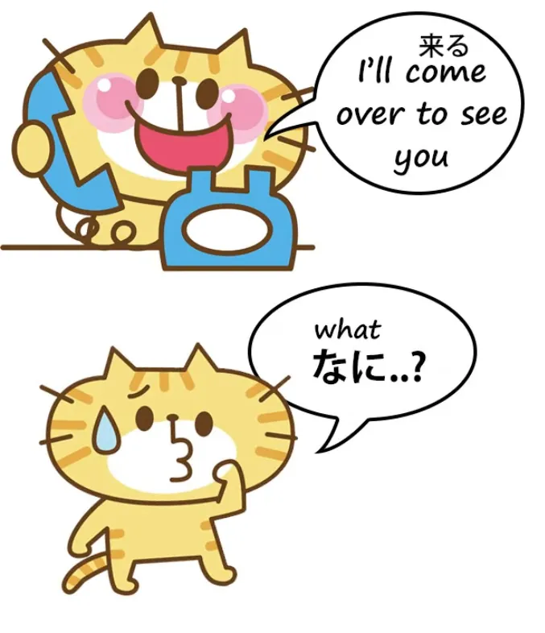
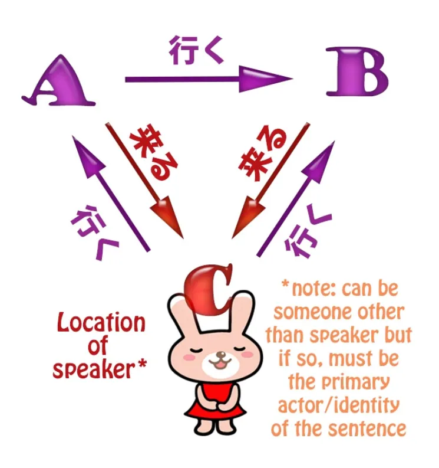
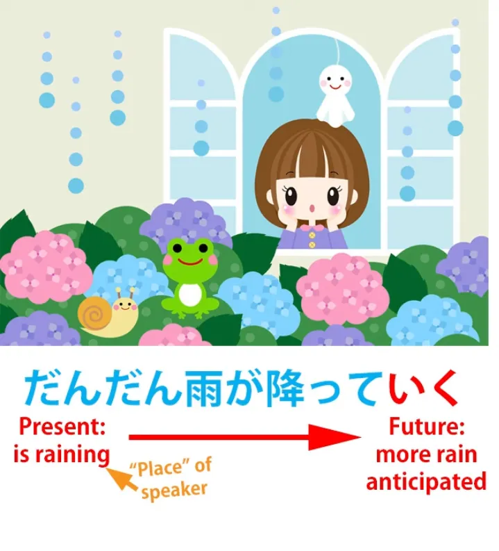
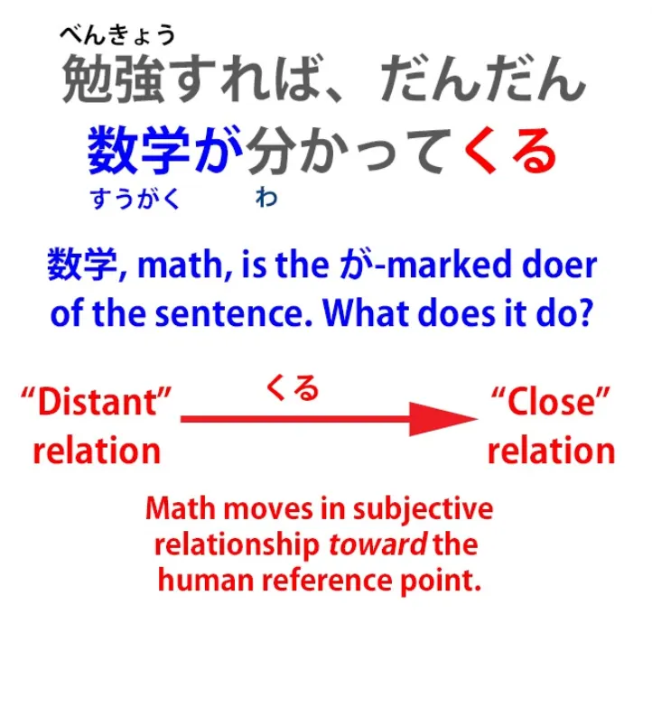
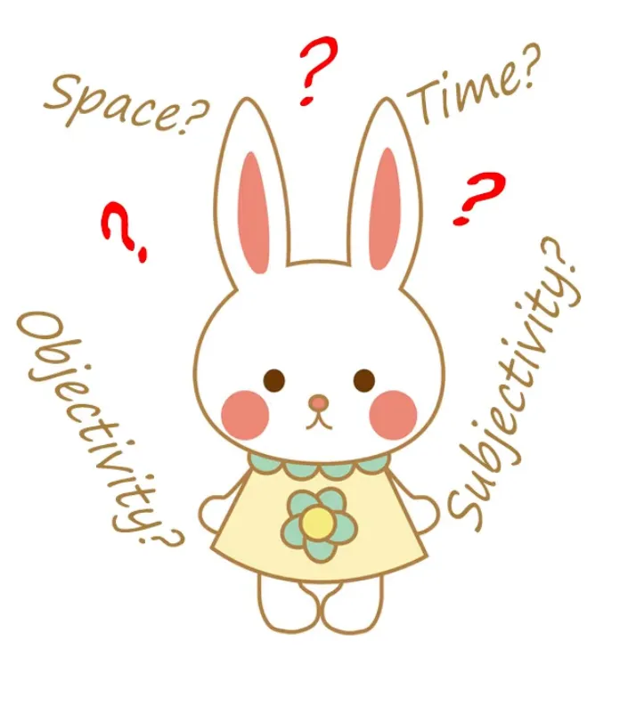

# **65. Приходить и уходить: Глубокие секреты 行く и 来る, て行く и て来る (te-iku, te-kuru)**

こんにちは。

Сегодня мы поговорим о приходе и уходе в японском языке.

Итак, <code>行く</code> и <code>来る</code> — это одни из первых слов, которые мы учим, когда начинаем изучать японский, и мы узнаём, что они означают <code>come</code> (приходить) и <code>go</code> (уходить), и в целом это так. Но по мере того, как мы становимся более продвинутыми, мы понимаем, что всё не так просто. У них много метафорических и более тонких значений, но даже физическое значение не соответствует в точности английским <code>come</code> и <code>go</code>.

По сути, <code>いく</code> означает <code>уходить оттуда, где находится говорящий, куда-то ещё</code>, а <code>くる</code> означает <code>приходить откуда-то ещё туда, где находится говорящий</code>.

Разве это не то же самое, что английские <code>come</code> и <code>go</code>? Ну, не совсем.

Например, мы можем сказать кому-то по телефону: <code>Shall I come over to see you?</code> (Мне прийти к вам?) или вы можете сказать: <code>Will you come to me, or shall I come to you?</code> (Вы придёте ко мне, или мне прийти к вам?)

А в японском это совершенно невозможно, потому что вы не можете <code>прийти</code> в место, где вас нет. <code>Приходить</code> означает приходить откуда-то, где говорящего нет, в место, где говорящий находится. Так что вы не можете сказать кому-то по телефону <code>Shall I come to you?</code> с использованием <code>来る</code>. Вы можете сказать только <code>Shall I go to you?</code> с использованием <code>行く</code>.

<code>Shall I go to you?</code> (Мне пойти к вам?) будет звучать странно по-английски, поэтому мы видим, что <code>来る</code> и <code>行く</code> не совсем взаимозаменяемы с английскими <code>come</code> и <code>go</code>. <code>来る</code> всегда может означать только <code>двигаться из места, где говорящего нет, в место, где говорящий находится</code>.

<code>行く</code> не так строго.

Мы можем говорить о том, как кто-то <code>行く</code>-ет из А в Б, когда мы на самом деле находимся в В, но <code>来る</code> всегда должно означать движение к В, месту, где мы находимся. И это важно понять, когда мы переходим к более метафорическим значениям <code>来る</code> и <code>行く</code>.

Мы говорили о некоторых расширенных значениях в более раннем уроке, но всё ещё физических, особенно тех, которые [**включают присоединение <code>来る</code> или <code>行く</code> к て-форме глагола**](https://www.youtube.com/watch?v=PsTsliRe2Cg).

Так, <code>持ってくる</code> означает <code>принести (в место, где я нахожусь)</code>; <code>持っていく</code> означает <code>взять (из места, где я нахожусь)</code>. Но <code>место, где я нахожусь</code> на самом деле может быть временем или может быть ментальным состоянием идентификации.

Таким образом, мы получаем более продвинутые значения, которые все основаны на фундаментальной физической метафоре прихода в место, где находишься, ухода из места, где находишься, или ухода из одного места в другое (но не прихода из одного места в другое, потому что это невозможно).

Итак, очень простой пример: мы можем сказать <code>雨が降ってきた</code> — и у нас есть почти эквивалентное английское выражение: мы могли бы сказать <code>It came on to rain</code> (Начался дождь).

И метафора здесь — временная метафора. Дождь пришёл к нам во времени, из времени, когда его не было, во время, где мы находимся, когда дождь есть.

Если мы говорим <code>だんだん雨が降っていく</code>, мы говорим <code>It's getting rainier and rainier</code> (Становится всё дождливее и дождливее), и мы проецируем это в будущее. <code>いく</code> движется от того места, где мы находимся, в будущее.

Теперь, поскольку время, по крайней мере, видимо, движется вперёд, мы можем использовать <code>いく</code> только в смысле движения вперёд во времени, от нас, от точки, где мы находимся, а не движения назад во времени от точки, где мы находимся, потому что это в настоящее время невозможно.

Таким образом, <code>雨が降っていく</code> в данном случае подразумевает, что стало дождливо (<code>降って来た</code>) и что это будет всё больше и больше происходить в будущем.

Теперь, мы также можем использовать <code>くる</code> и <code>いく</code> ещё более тонким образом, касающимся не пространства или времени, а субъективности, нашего ментального состояния. Так, очень распространённое выражение — <code>分かってくる</code>, которое по-английски можно было бы перевести как <code>come to understand</code> (прийти к пониманию), но это, конечно, было бы неправильно.

Давайте рассмотрим пример, почему. Мы могли бы сказать <code>勉強すれば、だんだん数学が分かってくる</code>. И это обычно переводится как <code>if you study, you will come to understand mathematics</code> (если вы будете учиться, вы придёте к пониманию математики).

И, как вы видите, если вы были внимательны, здесь есть противоречие. Вы не можете прийти в место, где вас ещё нет, по-японски. Вы не можете использовать <code>くる</code>, чтобы говорить о приходе куда-то, где вас нет на данном этапе, но будете в будущем. Это должно было бы быть <code>いく</code>, не так ли?

Так почему же здесь используется <code>くる</code>? Ну, если вы следили за этим курсом, вы, вероятно, уже знаете ответ.

<code>分かる</code> не означает <code>understand</code> (понимать). Оно означает <code>be understandable / be clear</code> (быть понятным / быть ясным) или буквально то, что оно на самом деле означает, это <code>do understandable</code> (делать понятным).

Так что на самом деле мы говорим, что если вы будете учиться, математика станет понятной для вас.

Другими словами, математика придёт из состояния далёкого от вас в состояние более близкое к вам и понятное. Так что мы используем это в субъективном смысле.

И это важная вещь для понимания, и важно понимать, что <code>くる</code> и <code>いく</code> могут представлять движение во времени, к себе или от себя, движение в пространстве, к себе или от себя, движение в субъективности, к своему ментальному состоянию или от него, но также <code>iku</code> может представлять объективность, в то время как <code>kuru</code> представляет субъективность.

И причина этого — то, что мы уже обсуждали, а именно то, что <code>iku</code> может означать движение из А в Б, пока мы находимся в В. Следовательно, <code>iku</code> может представлять движение из одного места в другое, которое не включает нас, физически, временно, ментально или эмоционально.

Итак, если мы говорим <code>samuku natte kita</code>

мы говорим <code>it became cold</code> (стало холодно), и добавление <code>kita</code> (<code>kuru</code>) связывает это с нами: <code>Стало холодно (приходя ко мне или к нам).</code> Так что мы говорим не просто, что стало холодно, но подразумеваем, что это влияет на меня или нас субъективно: <code>Samuku natte kita</code>.

В отличие от этого, <code>samuku natte itta</code> более объективно. Это не касается нас. Это не подразумевает, что это каким-либо образом повлияло на меня или нас. Это просто произошло. Стало холоднее.

Потому что это то <code>itta</code>, которое в пространственном смысле движется из А в Б, объективно, не затрагивая меня или нас.

Теперь, вы можете спросить: "Как мне понять, когда это движение в пространстве, когда это движение во времени,

когда это движение с точки зрения менталитета и субъективности, и когда <code>kuru</code> и <code>iku</code> представляют субъективность против объективности?"

И ответ на это: Нет никаких правил, и мы не должны искать правила в таких случаях. Причина, по которой мы изучаем, как это работает, не является самоцелью, не является набором фактов для изучения, а является помощью в понимании настоящего японского языка.

По мере того, как мы погружаемся в японский, смотрим аниме, читаем романы, играем в игры на японском, эти вещи начинают обретать смысл.

Нам нужны принципы, на которых они основаны, что даёт нам преимущество в их осмыслении. Но структура никогда не заменит погружения.

Структура — это основа, которая делает погружение быстрее, легче и понятнее.