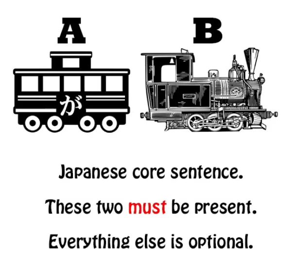
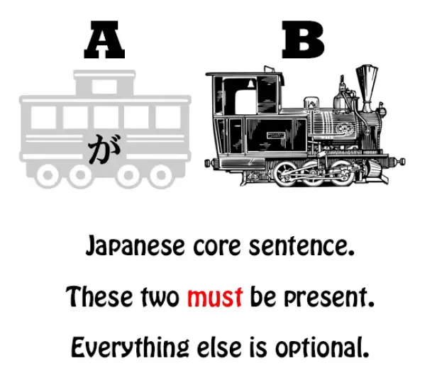
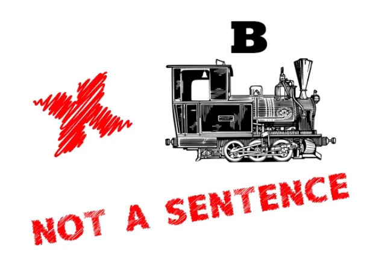
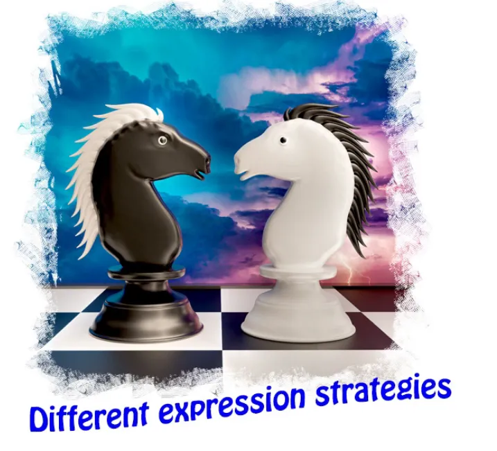
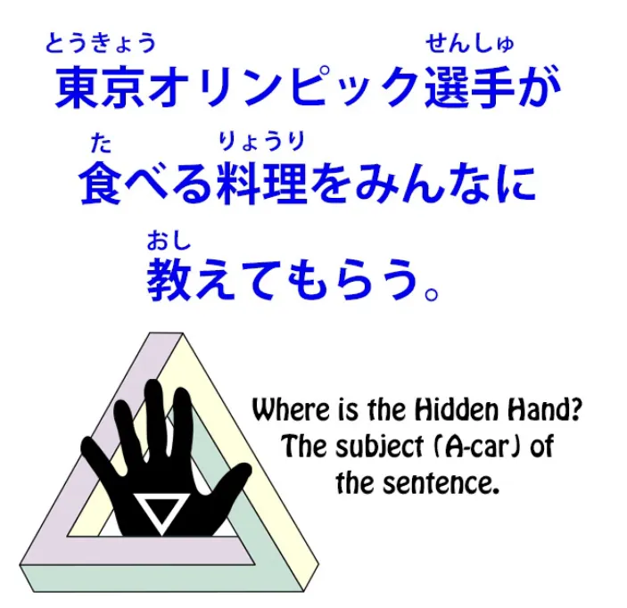
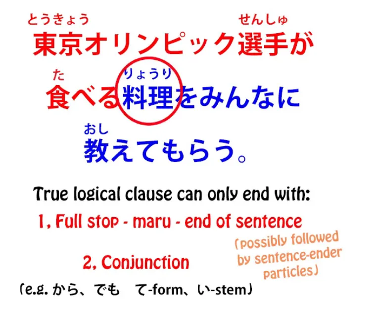
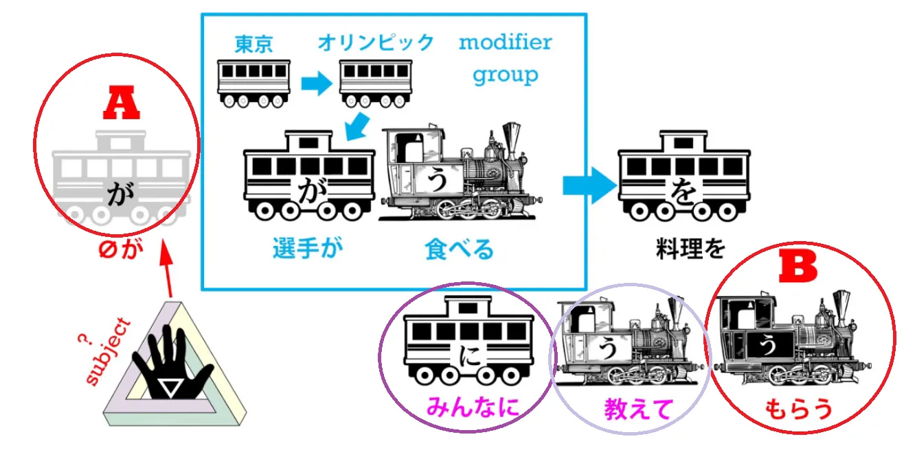

# **66. СКРЫТЫЕ подлежащие в японском языке — и как их понять**

[**СКРЫТЫЕ подлежащие в японском языке — и как их понять | Урок 66**](https://www.youtube.com/watch?v=GN_tGX0W-LE&list=PLg9uYxuZf8x_A-vcqqyOFZu06WlhnypWj&index=68&ab_channel=OrganicJapanesewithCureDolly)

こんにちは。

Сегодня мы поговорим о <code>скрытом механизме</code> в японском языке. Что я имею в виду?

## Нет подлежащего в японском?

Ну, некоторые люди утверждают, что в японском языке нет подлежащего. И я думаю, мы уже без всяких сомнений установили, что в японском языке не только есть подлежащее[[9]](./9-the-subject-of-the-japanese-sentence-expressing-desire-ほしい-たい-たがる.md), но и то, что вы не можете построить ни одного японского предложения без подлежащего, хотя вы не всегда можете его увидеть или услышать. Оно может быть <code>zero-местоимением</code>.

Под подлежащим, конечно, я имею в виду А-вагон предложения. И поскольку каждое предложение сообщает нам либо, что <code>А является Б</code>, либо, что <code>А делает Б</code>, очевидно, мы не можем иметь предложения без А.

Всё так просто. Однако бывают случаи, когда мы не только не можем увидеть подлежащее, А-вагон, но и бывает трудно понять, что именно это такое.

И эта трудность, как выяснится, проистекает из неполного понимания того, как работают некоторые аспекты японского языка. Одна вещь, которую нам нужно понять, это то, что разные языки имеют разные стратегии выражения.

## Различные стратегии выражения

Мы уже знаем, насколько вредно говорить, что <code>コーヒーが好きだ</code> означает <code>Я люблю кофе</code>. <code>I like coffee</code> — это то, что мы сказали бы по-английски, но английский использует совершенно иную стратегию выражения, чем японский.

Любовь выражается глаголом, и тот, кто делает глагол, — это человек, который любит кофе. В японском языке любовь выражается адъективным прилагательным, и тот, кто является этим адъективным прилагательным, — это кофе. Таким образом, японская стратегия выражения здесь ближе к испанской, чем к английской, хотя они и не идентичны.

Итак, хотя языки имеют различные стратегии выражения, оказывается, что языки, даже если они не связаны между собой, как правило, имеют относительно ограниченный набор приёмов, которые они используют. Таким образом, мы находим одни и те же стратегии выражения в разных языках, но не обязательно в одних и тех же местах. А также стратегии выражения могут различаться по статусу между языками.

## Рецептивный помощник

Итак, одна из причин, по которой так называемая <code>японская грамматика</code> в английском языке ошибочно называет японский рецептивный вспомогательный глагол пассивным спряжением или пассивным залогом, заключается в том, что то, чем он на самом деле является, хотя и существует в английском, не имеет очень высокого статуса.[[13]](./13-passive-conjugation-receptive-helper-verb.md) Потому что мы используем рецептивный залог в английском, используя слово <code>got</code> при различных обстоятельствах, например, <code>I got rescued by my big sister</code> (Меня спасла моя старшая сестра), <code>The sandwiches got eaten by the dog</code> (Бутерброды съела собака) — но это не считается хорошим английским.

Тот факт, что это не считается хорошим английским, — это просто вопрос моды. Это совершенно грамматично. Просто так получилось, что это немодно или имеет низкий статус в языке. Это действительно просто историческая случайность.

Точно так же, в японском языке существуют другие стратегии выражения, которые не считаются очень высокостатусными в английском и которые могут нас запутать. Итак, я возьму предложение, которое мне прислал один из моих зрителей, у которого возникли значительные трудности с тем, чтобы разобраться, что на самом деле является подлежащим этого предложения. И это совершенно понятно, потому что, пока вы не поймёте эту стратегию выражения, это не совсем ясно.

## Анализ предложения со скрытым подлежащим

Итак, предложение взято из NHK News Easy, очень хорошего новостного сервиса для начинающих изучать японский язык. И предложение такое: <code>東京オリンピック選手が食べる料理をみんなに教えてもらう</code>

Итак, что, по нашему мнению, является подлежащим, А-вагоном этого предложения?

Итак, первое, что нужно сделать при анализе предложения, — это то, что я сказала в своём видео об анализе предложений[[47]](./47-how-to-understand-japanese-your-secret-weapon-for-breaking-down-sentences.md): нам нужно увидеть, где заканчиваются логические части предложения внутри предложения. Логическая часть предложения, которая функционирует как логическая часть предложения, а не как дескриптор или помощник чего-либо ещё, может заканчиваться только двумя способами:

либо точкой, делая его концом предложения, либо союзом, отмечая его как первую логическую часть предложения в сложносочинённом предложении.

Конечно, если оно находится в конце предложения, за ним могут следовать одна или несколько частиц-окончаний предложения, но оно должно быть финальным локомотивом в предложении: финальным глаголом, существительным-плюс-связкой или прилагательным. Итак, давайте разберём это так, как я учила вас в прошлом.

<code>東京オリンピック選手が食べる...</code> Это логическая часть предложения? Ну, это могла бы быть логическая часть предложения, не так ли? Это означало бы <code>Токийские олимпийские спортсмены едят.</code>

Однако, следует ли за ним точка, частицы-окончания предложения с точкой, или оно заканчивается каким-либо соединителем частей предложения, таким как <code>から</code> или <code>でも</code>, или て-формой, или い-основой глагола? Нет, оно не заканчивается ничем из этого, не так ли? За ним непосредственно следует существительное.

И, как мы знаем, когда за логической частью предложения непосредственно следует существительное, она модифицирует это существительное. Другими словами, она не функционирует как активная логическая часть предложения; она функционирует, по сути, как прилагательное, определитель существительного. Так что <code>東京オリンピック選手が食べる</code> просто модифицирует <code>料理</code>. Это просто даёт нам больше информации о еде.

Итак, затем у нас есть: <code>...料理をみんなに教えてもらう</code> Теперь мы всё ещё не дошли до подлежащего предложения, не так ли? Потому что подлежащее любого предложения должно быть отмечено частицей が.

<code>選手</code> отмечены частицей が, но мы знаем, что они не являются подлежащим предложения; они просто помогают модифицировать <code>料理</code>.

::: info
Просто поместила это здесь… ссылка на Урок 47. Проверьте также Урок 46.

:::
<code>料理</code> не может быть подлежащим предложения, потому что оно отмечено частицей を, а не が.

<code>みんな</code> не может быть подлежащим предложения, потому что оно отмечено частицей に, а не が.

Так что же здесь происходит?

## Действие предложения со скрытым подлежащим

Итак, что на самом деле говорит это предложение? Оно говорит, что кто-то, подлежащее предложения, кто бы это ни был, получает от всех обучение или советы относительно еды, которую должны есть олимпийские спортсмены.

Итак, мой вопрошающий на самом деле дошёл до этого момента, но затем был озадачен вопросом о том, кто же этот неназванный человек или люди. Могут ли это быть спортсмены? Ну, это маловероятно, и мы всегда должны учитывать вероятность при разрешении любой двусмысленности.[[48]](./48-dealing-with-ambiguity-in-japanese.md) Это на самом деле не двусмысленное предложение, но контекст довольно ясно даёт понять, что это не спортсмены.

Прежде всего, по умолчанию эти предложения с <code>-てもらう</code> означают, что кто-то активно получил от кого-то другого услугу по выполнению чего-либо.[[49]](./49-japanese-point-of-view-deconfused-もらう-てもらう.md) Таким образом, человек, который делает <code>もらう</code> *(А zeroが подлежащее)*, получает *(Б-поезд — もらう)* от человека *(みんなに)*, выполняющего て-форму глагола, чтобы тот выполнил эту て-форму глагола *(教えて)*.

Итак, если мы говорим <code>お医者さんに見てもらう</code>, мы говорим <code>попросить доктора осмотреть меня</code>. Таким образом, кто-то получает от всех обучение или мнения о том, что должны есть спортсмены.

Вероятно ли, что это спортсмены? Ну, не совсем. Вероятно ли, что они собираются вместе и спрашивают всех, что им следует есть?

### Кто здесь подлежащее?

Итак, кто же это? Кто это が-отмеченное zero-местоимение, подлежащее, А-вагон этого предложения? И ответ таков: это просто неопределённое zero-местоимение.

Теперь, это может показаться очень странным, но на самом деле это не так. На самом деле, мы используем это постоянно в английском языке. Но вы никогда не увидите это в газете или новостной службе так, как это здесь, что и сбивает с толку.

Итак, когда мы используем такое неопределённое местоимение? Ну, давайте подумаем. Предположим, кто-то сказал: <code>I hear they're putting a man on Mars next year.</code> (Я слышал, они отправляют человека на Марс в следующем году.)

Ну, кто такие <code>они</code>? Ну, мы не знаем, кто такие <code>они</code>. Предположительно, те, кто отправляет людей на Марс — NASA или мистер Маск, или кто-то ещё.

Теперь, предположим, я говорю: <code>They're getting everyone's opinion on what the Olympic athletes should eat.</code> (Знаете, они собирают мнения всех о том, что должны есть олимпийские спортсмены.) Ну, опять же, кто-то вполне мог бы сказать это по-английски. Вы не увидите это в газете, но друг вполне мог бы сказать вам: <code>You know, they're getting everybody's opinion on what the Olympic athletes should eat.</code> (Знаете, они собирают мнения всех о том, что должны есть олимпийские спортсмены.)

Кто такие <code>они</code>? Ну, мы на самом деле не знаем. Предположительно, те, кто отвечает за питание олимпийских спортсменов.

И это конструкция, которую вы довольно часто будете видеть в японском языке, это неназванное <code>они</code>, кто бы они ни были. Вы слышите это в английском постоянно, но это имеет низкий статус.

Вы не увидите это в официальных документах, газетах или чём-то подобном. Вы слышите это только в относительно неформальной речи. Во французском вы можете слышать это чаще.

<code>On</code> (они, кто-то) может использоваться более обобщённо на более высоком уровне дискурса, чем в английском.

Итак, как только мы это знаем, достаточно легко определить подлежащее этого предложения. И это важная вещь, которую нужно знать, потому что мы будем сталкиваться с такого рода конструкциями относительно часто в японском языке.