# **67. もう и まだ: временные отношения, которые объясняют их смысл**

[**もう и まだ: временные отношения, которые объясняют их смысл (mou и mada) | Урок 67**](https://www.youtube.com/watch?v=sBhD_Z5_pHw&list=PLg9uYxuZf8x_A-vcqqyOFZu06WlhnypWj&index=69&ab_channel=OrganicJapanesewithCureDolly)

こんにちは。

Сегодня мы поговорим о <code>もう</code> и <code>まだ</code>, двух выражениях, которые могут быть немного запутанными, особенно <code>もう</code>.

Если мы посмотрим <code>もう</code> в японско-английском словаре, нам скажут, что оно означает <code>сейчас, уже, скоро, вскоре</code>, а иногда даже <code>больше не</code>, а также <code>ещё один</code> и является выражением раздражения. Как оно может означать все эти разные временные отношения одновременно? Что ж, сегодня мы это выясним. И мы увидим, что это не так уж и запутанно, как кажется.

Но сначала я хочу рассмотреть <code>まだ</code>, которое немного менее запутанно, но даст нам принципы, необходимые для понимания того, как на самом деле работает <code>もう</code>. Хорошо.

## まだ

Итак, <code>まだ</code> имеет менее запутанный набор определений. В основном нам говорят, что оно означает либо <code>всё ещё</code>, либо <code>ещё не</code>.

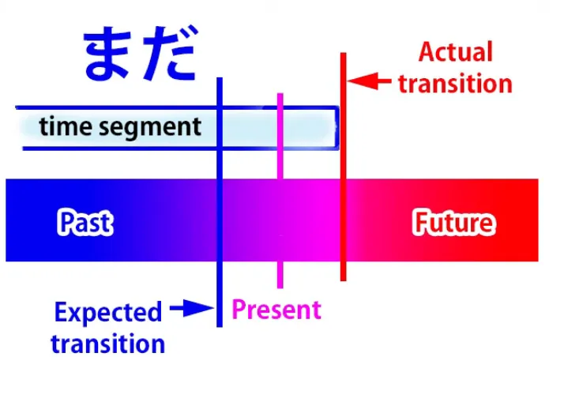

Итак, давайте начнём с того, что оно на самом деле означает, что оно на самом деле делает. <code>まだ</code> делает несколько вещей. Оно сообщает нам о настоящем времени. Оно помещает настоящее время внутрь временного отрезка, который простирается в прошлое и либо, как ожидается, закончится, либо, по крайней мере, рассматривается возможность его окончания. Чаще всего ожидается, что он закончится.

Итак, это делает три вещи. Оно сообщает нам о настоящем, так что мы можем сказать, что это, по сути, способ сказать <code>сейчас</code>, но <code>сейчас</code> в определённом отношении к прошлому и будущему.

Что это за отношение? Ну, как видите, у нас есть две вещи. У нас есть отрезок времени, в котором находится <code>сейчас</code>, и у нас есть точка перехода.

Поскольку это отрезок времени, он не может длиться вечно, поэтому есть точка перехода, в которой он меняется на другой отрезок времени с другими качествами, что ожидается в будущем или, по крайней мере, рассматривается как возможность в будущем. Итак, <code>まだ</code> даёт нам два контраста. Отрезок времени противопоставляется будущему, когда он изменится или может измениться, но настоящий момент противопоставляется прошлому, когда, возможно, ожидалось, что он изменится.

Итак, что это означает по-английски, это, по сути, <code>still</code> (всё ещё). И это может показаться немного абстрактным, но я думаю, мы достаточно ясно поймём это, когда увидим, как это работает.

Итак, если мы говорим <code>宿題はまだしなかった</code>, мы говорим <code>Я ещё не сделал(а) домашнее задание</code> или <code>Я всё ещё не сделал(а) домашнее задание</code>.

Итак, как видите, это означает, что мы находимся во временном отрезке, где я не сделал(а) домашнее задание. Этот отрезок простирается в прошлое и противопоставляется периоду в будущем, когда я сделаю домашнее задание. Но настоящее время противопоставляется времени в прошлом, когда я мог(ла) или должен(на) был(а) сделать домашнее задание.

Вот почему мы говорим <code>まだ</code>, и вот почему по-английски мы бы сказали <code>still</code> (всё ещё) или <code>haven't yet</code> (ещё не). Другими словами, было время в прошлом, когда это могло бы произойти, но этого не произошло. Так что это всё ещё находится в состоянии, которое не изменится до будущего. И это то, что мы подразумеваем под терминами <code>still</code> и <code>yet</code> в английском языке.

Если мы говорим <code>さくらはまだ若い</code>, мы говорим <code>Сакура всё ещё молода</code>.

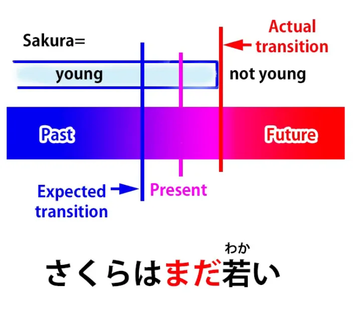

И снова, что мы говорим, это:
настоящее время находится в периоде, когда Сакура молода,
этот период простирается в прошлое и, как ожидается, изменится когда-нибудь в будущем. Она не будет молодой вечно, она постареет. Таким образом, мы видим, что период времени, пока Сакура молода, противопоставляется будущему, когда она постареет.

Но настоящий момент противопоставляется прошлому.

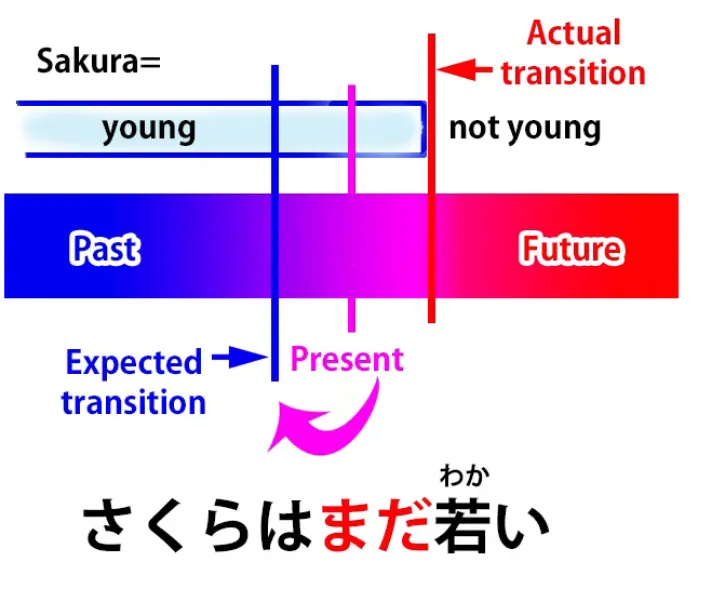

Вот почему мы говорим <code>まだ</code> или почему по-английски мы бы сказали <code>still</code> (всё ещё). Мы говорим: <code>Она ещё не перестала быть молодой</code>. В отличие от возможности того, что она перестала быть молодой в прошлом, она не перестала быть молодой в прошлом — она всё ещё молода сейчас, хотя в будущем она не будет молодой.

Если мы говорим <code>さくらはまだ大人ではない</code>, мы говорим <code>Сакура ещё не взрослая</code>.

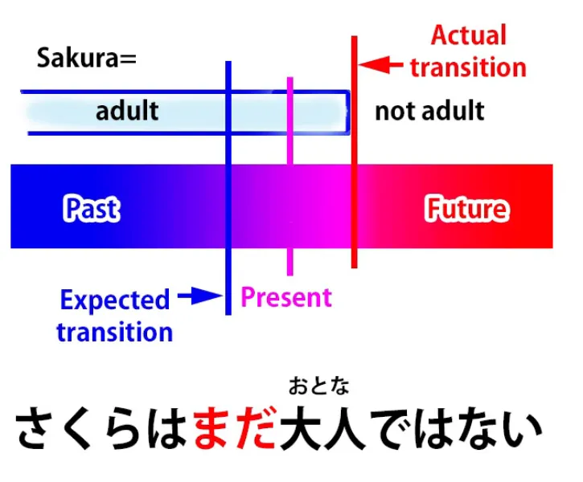

Итак, теперь мы используем отрицание, и вот почему <code>まだ</code> может означать <code>всё ещё</code> или <code>ещё не</code>. Это просто зависит, по крайней мере в данном случае, от того, что оно используется с отрицанием.

Итак, если мы говорим <code>さくらはまだ大人ではない</code>, мы говорим, что в настоящий период Сакура не взрослая. Хотя вы могли подумать, что она повзрослела некоторое время назад, это не так. Но, конечно, она повзрослеет в будущем.

Как видите, причина, по которой оно переводится и как <code>still</code>, и как <code>not yet</code>, заключается в том, что японский язык выражает вещи немного иначе, чем английский. По-английски мы говорим <code>Sakura is not yet grown-up</code> (Сакура ещё не взрослая). Но по-японски мы на самом деле говорим <code>Sakura is still not grown up</code> (Сакура всё ещё не взрослая).

Однако, чтобы <code>まだ</code> означало <code>ещё не</code>, нам не обязательно иметь явное отрицание. Например, если кто-то говорит вам <code>日本語は上手いね</code> — <code>Ваш японский очень хорош, не так ли?</code> Ну, японцы склонны говорить это, даже если вы можете кое-как выдавить <code>こんにちは</code>. И даже если ваш японский действительно очень хорош, вы, вероятно, ответите <code>いえまだまだです</code>.

<code>まだまだ</code> в этом случае означает <code>ещё нет</code>. Другими словами, мы всё ещё находимся во временном отрезке, когда мой японский не очень хорош. Изменение не произошло в прошлом, как вы говорите; оно должно произойти в будущем.

И просто небольшое культурное замечание: на Западе иногда может считаться немного грубым противоречить тому, кто сказал вам что-то приятное, но в японском мы делаем это постоянно. Считается немного высокомерным не делать этого.

## もう

Теперь давайте перейдём к <code>もう</code>, где у нас появляется ещё несколько кажущихся сложностей, но на самом деле это не сложности, как мы увидим.

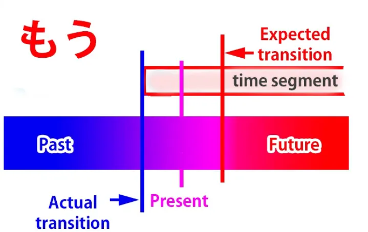

<code>もう</code> по сути является противоположностью <code>まだ</code>. Лучший перевод для него на английский — это <code>already</code> (уже). Это означает, что мы сейчас находимся во временном отрезке, простирающемся вперёд в будущее. То есть, прямо противоположно <code>まだ</code>.

Временной отрезок сравнивается с прошлым, когда текущие условия не преобладали, а сейчас сравнивается с будущим, когда, возможно, ожидалось, что переход произойдёт, но на самом деле он уже произошёл.

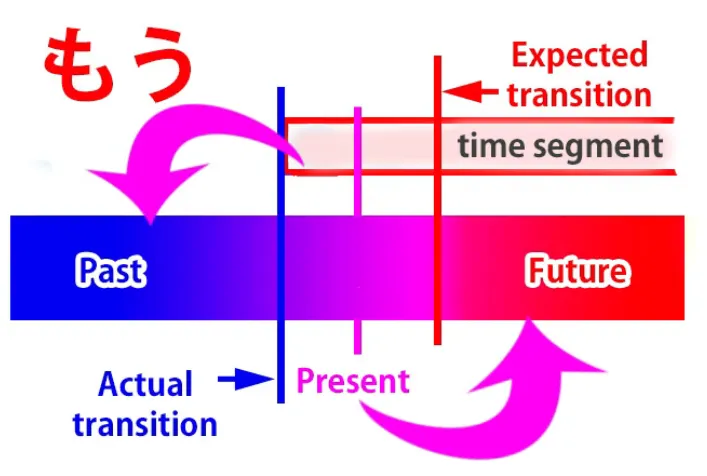

Итак, если кто-то говорит <code>宿題をしなさい。</code> (<code>Делай домашнее задание!</code>), вы можете ответить <code>もうやったよ</code> (<code>Я уже сделал(а) его</code>).

Итак, мы говорим, что мы сейчас находимся во временном отрезке, когда моё домашнее задание сделано, я его сделал(а), и переход не произойдёт в будущем, как вы могли бы подумать; он уже произошёл в прошлом.

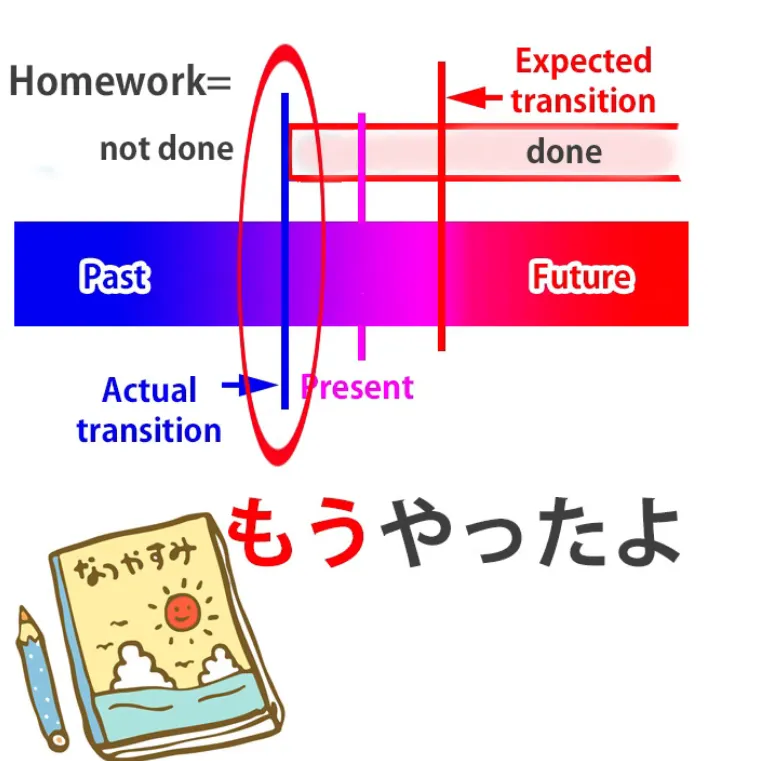

Так почему же оно иногда переводится как имеющее другие значения, отличные от <code>already</code> (уже), например <code>now</code> (сейчас)? Ну, как мы видели, и <code>まだ</code> (<code>всё ещё</code>), и <code>もう</code> (<code>уже</code>) на самом деле являются разновидностями <code>сейчас</code>. Мы говорим о настоящем. Мы просто создаём разные контрасты с прошлым и будущим, когда говорим о настоящем.

Итак, конечно, <code>もう</code> действительно означает <code>сейчас</code>, как и <code>already</code>. Но поскольку слова в разных языках очень редко занимают абсолютно один и тот же участок [**спектра значений**](https://www.youtube.com/watch?v=CpiELpGR-VU&ab_channel=OrganicJapanesewithCureDolly), иногда мы используем <code>もう</code> в тех местах, где по-английски мы бы использовали <code>now</code>.

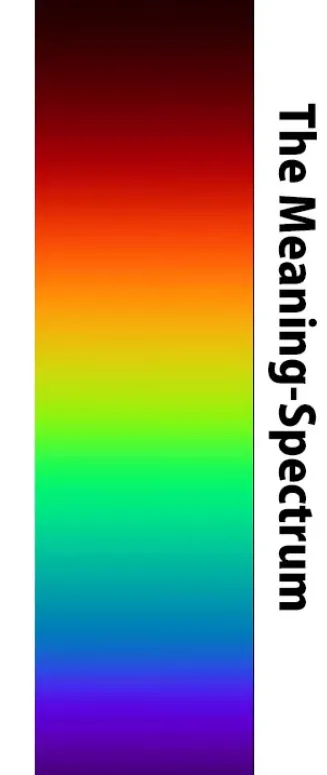

И поскольку японско-английские словари англоцентричны, они будут пытаться переводить <code>もう</code> как <code>сейчас</code> в этих случаях.

Так, например, если вы поранились, встаёте, и кто-то говорит <code>大丈夫?</code>, а вы отвечаете <code>もう大丈夫</code>, то на русский или английский вы обычно переведёте это как <code>I'm all right now</code> (Сейчас я в порядке).

По-английски вы обычно не скажете <code>I'm already all right</code> (Я уже в порядке). В японском вы также могли бы сказать <code>今大丈夫</code>, что тоже означает <code>Я в порядке сейчас</code>, но когда вы говорите <code>もう大丈夫</code>, вы специально добавляете нюанс, что, хотя раньше вы не были в порядке, вы в порядке сейчас, в отличие от какого-то момента в ближайшем будущем. Другими словами, вам больше не нужно время на восстановление, вы в порядке. В английском мы не используем <code>already</code> для этого. Логически мы могли бы, но на практике обычно не используем.

Теперь, совершенно верно, что <code>もう</code> также используется как выражение раздражения или негодования: <code>もう!</code>

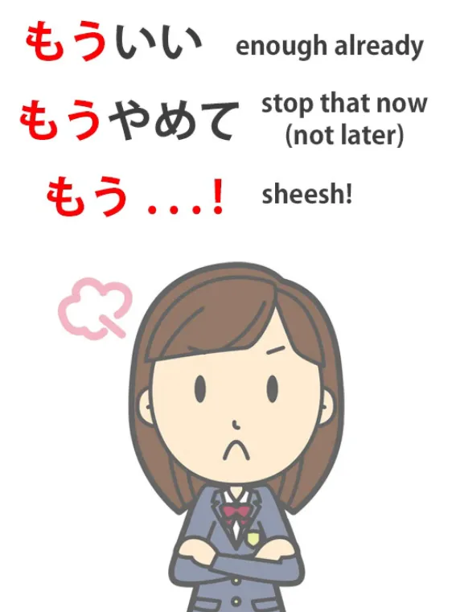

И оно сжимает всевозможные жалобы или ворчания, или может просто стоять само по себе: <code>もう!</code> Как это работает? Интересно, что <code>already</code> (уже) в некоторых обстоятельствах может иметь немного такого нюанса в английском. Так, если кто-то говорит <code>Enough already!</code> (Хватит уже!), они имеют в виду, что в этот момент, в отличие от какого-то момента в будущем, я сыт по горло этим. И это действительно то, что <code>もう!</code> обычно означает в японском. Так что это достаточно просто.

### Второе もう?

Однако есть один аспект <code>もう</code>, который немного запутан, пока вы его не поймёте, и это то, что на самом деле существует два слова <code>もう</code>. Это может быть немного спорно, но на самом деле в словарях с указанием тонального ударения им даются два разных ударения: одно для <code>もう</code>, о котором мы говорили, то, что означает <code>уже</code>, и одно для другого <code>もう</code>, которое во многих отношениях довольно близко, и я объясню, почему оно так близко позже. Но сначала давайте посмотрим на область, где оно не так близко.

Это второе <code>もう</code>, я думаю, в конечном итоге связано с частицей <code>も</code> и имеет то же добавочное значение <code>ещё один</code>.

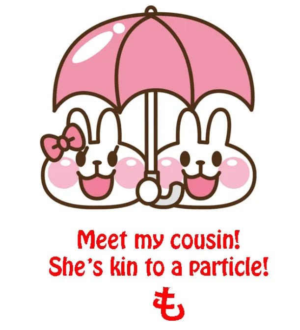

Итак, если мы говорим <code>もう一つ</code>, мы говорим <code>ещё один</code>. Если мы говорим <code>もう一人</code>, мы говорим <code>ещё один человек</code>. Таким образом, когда мы так это формулируем, мы видим, что на самом деле имеем дело с двумя отдельными словами, двумя отдельными понятиями.

Теперь это становится немного более запутанным, и я собираюсь рассказать вам, почему. Это даже сбивает с толку японцев, которые на самом деле во многих случаях не используют тональное ударение правильно, потому что идея о том, что это два разных слова, часто теряется даже у носителей японского языка.

И причина в том, что есть много случаев, когда они становятся довольно близки. Почему? Ну, как мы видели, <code>もう</code> сообщает нам о временном отношении, это слово, связанное со временем, и оно означает <code>уже</code>. А также словари говорят нам, что оно означает <code>скоро</code>. Почему они говорят, что оно означает <code>скоро</code>?

Ну, само по себе оно не означает <code>скоро</code>, но оно означает <code>скоро</code> в определённых сочетаниях. Так, например, если мы говорим <code>もうすぐ</code>, что означает <code>скоро</code>, то на самом деле мы говорим: <code>すぐ</code> означает <code>скоро</code>, а <code>もう</code> означает <code>уже</code>, так что <code>もう</code> подчёркивает <code>скоро</code>: это уже скоро, это не будет скоро в какой-то момент в будущем, это скоро прямо сейчас.

Теперь, мы также можем сказать <code>もう少し</code>. Например, если люди куда-то идут и долго шли и устают, кто-то может сказать <code>もう少し!</code>, что означает <code>ещё чуть-чуть / ещё немного</code>. И это может означать <code>ещё немного усилий</code>, но также может означать <code>ещё немного времени</code>.

Итак, видите, <code>もうすぐ</code> и <code>もう少し</code>, хотя это разные слова <code>もう</code>, при некоторых обстоятельствах имеют очень схожее значение.

И другое <code>もう</code>, добавочное <code>もう</code>, также часто используется для выражения временного отношения. Так, если мы говорим <code>もう一度</code>, мы говорим <code>ещё раз</code>. Очевидно, это означает то же самое, что и когда мы говорим <code>もう一つ</code>, что означает <code>ещё одна вещь</code> — ещё одна конфета, ещё что угодно.

Но оно также очень часто используется с <code>一度</code>: ещё раз. <code>もう二度来ない</code> означает <code>Я больше никогда не приду</code>, буквально <code>Я не приду ещё второй раз</code>.

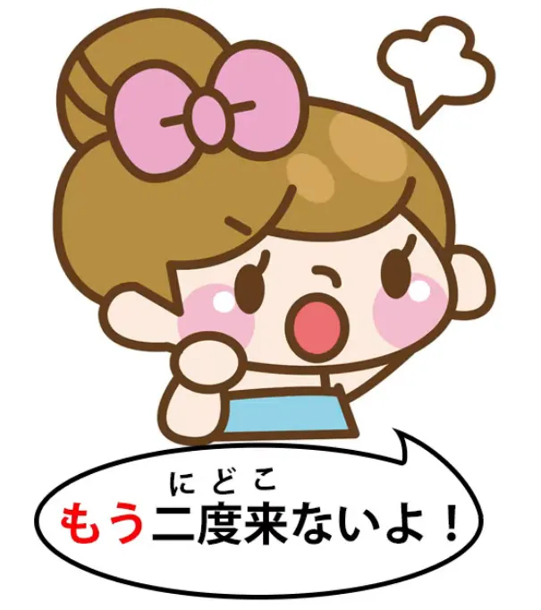

Таким образом, мы видим, что два <code>もう</code> довольно близко подходят к одной и той же территории. Оба они могут использоваться для временных отношений, и в нескольких контекстах, таких как <code>もう少し</code> и <code>もうすぐ</code>, значение почти идентично.

Но как только мы поймём эти два слова и как они работают, я не думаю, что останется место для путаницы…

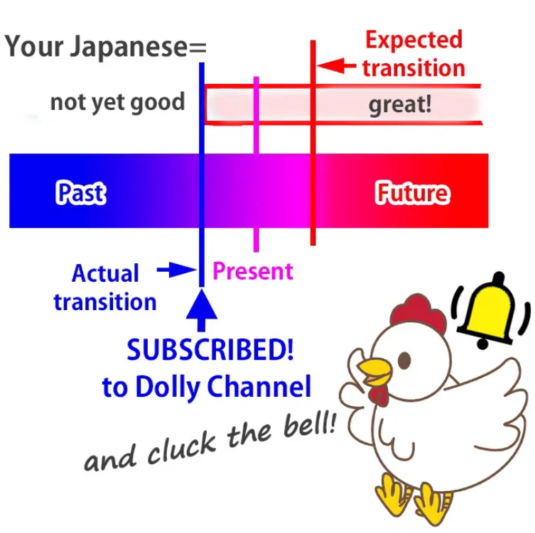

::: info
Добавлю это здесь:

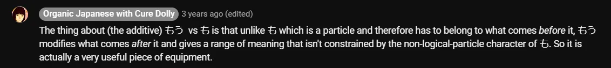

:::