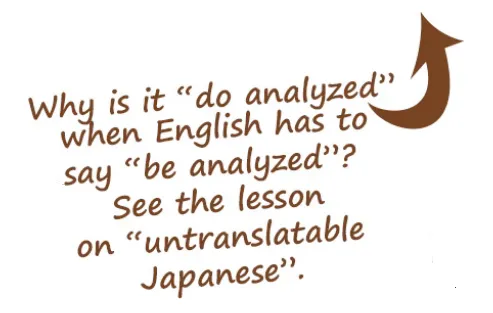
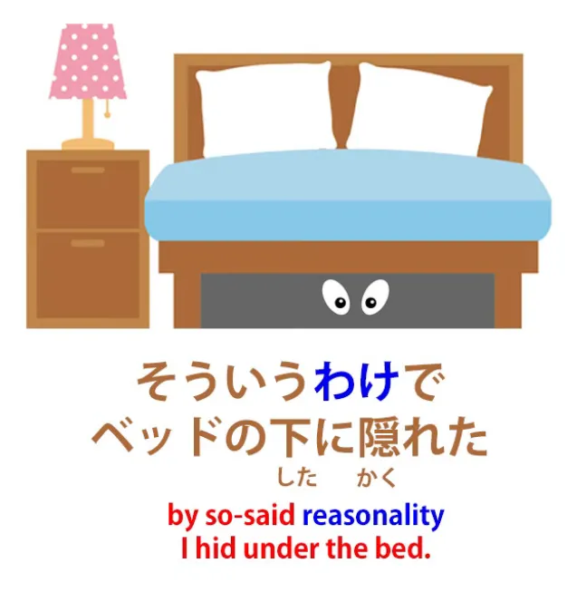
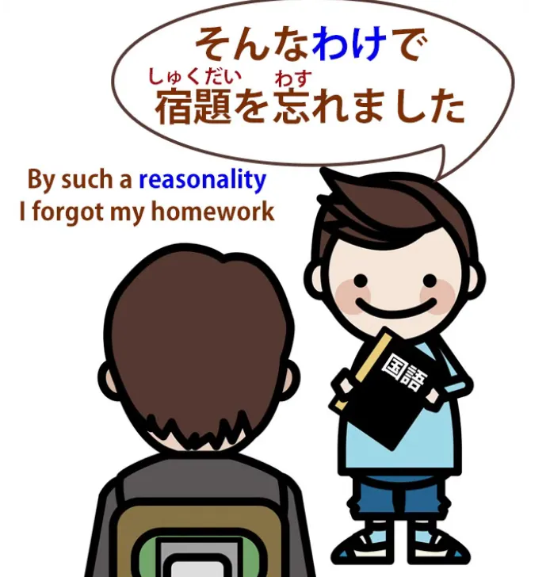
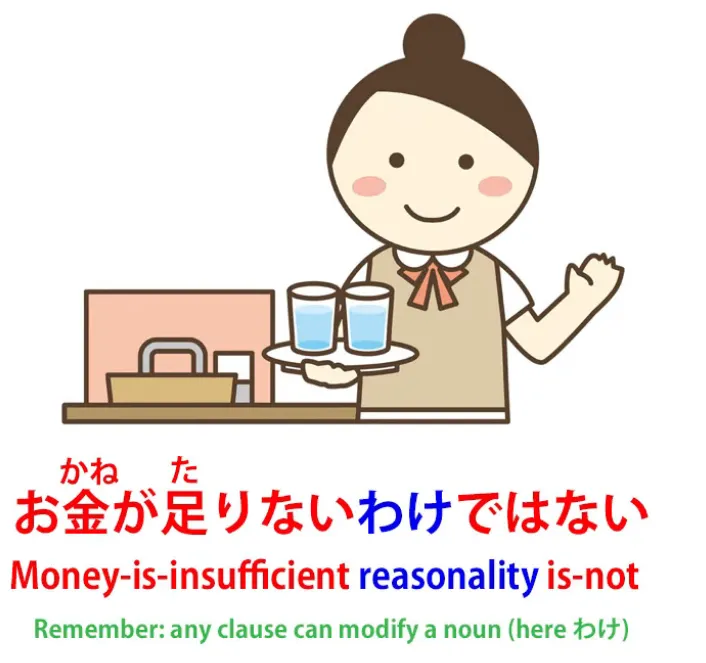
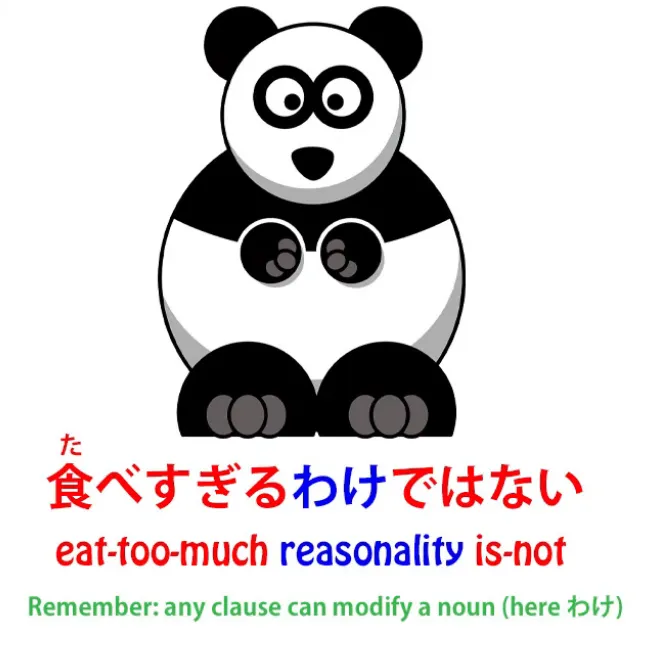
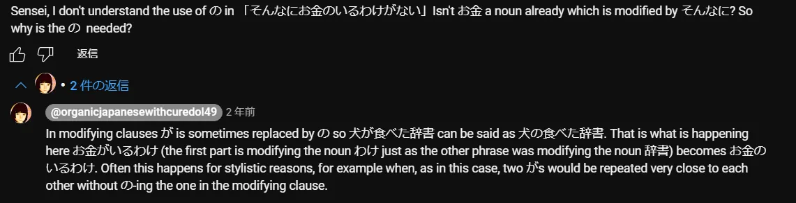
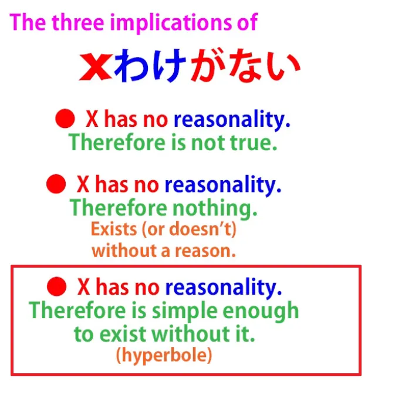

# **68. Глубинная логика японского языка: わけ、そういうわけ、わけが分からない、わけない**

[**Глубинная логика японского языка: わけ、そういうわけ、わけが分からない, わけない | Урок 68**](https://www.youtube.com/watch?v=iU79wvDyDfk&list=PLg9uYxuZf8x_A-vcqqyOFZu06WlhnypWj&index=70&ab_channel=OrganicJapanesewithCureDolly)

こんにちは。

Сегодня мы поговорим о <code>わけ</code>,

японском слове, которое может вызвать довольно много путаницы, потому что оно используется в самых разных способах и ситуациях в японском языке, а в англоязычных словарях у него целый ряд определений, которые кажутся особенно разрозненными и запутанными. Однако, как только мы поймём настоящую логику, глубинное значение этого слова, всё встанет на свои места довольно красиво. Итак, что же такое <code>わけ</code>?

## [訳]{わけ}

Прежде всего, давайте посмотрим на определение из английского словаря. В онлайн-словаре говорится, что <code>わけ</code> означает «вывод из рассуждений; суждение или расчёт, основанный на чём-то прочитанном или услышанном; причина; повод; значение; обстоятельства; ситуация».

Так что же из всего этого оно на самом деле означает? Что ж, для приятного разнообразия словарь на самом деле соглашается, что это существительное. <code>わけ</code> — это существительное, так что же это за существительное?

Что такое <code>わけ</code>? Давайте немного углубимся в историю этого слова.

Изначально <code>わけ</code> означало <code>делить или разделять</code>. Так что оно связано с <code>分ける</code>, глаголом, означающим <code>делить или разделять</code>, а также, что более важно для наших текущих целей, с <code>分かる</code>, которое также фундаментально означает <code>делить или разделять</code>, но в смысле <code>разбивать на части или анализировать</code>.

Итак, когда мы говорим <code>本が分かる</code>, как я уже указывала в предыдущих уроках, мы на самом деле не говорим <code>Я понимаю книгу</code>; мы говорим <code>книга делает понятным или делает ясным</code>. Мы могли бы сказать по-английски <code>The book is clear to me</code> (Книга мне понятна), но на самом деле это не прилагательное, это глагол — <code>книга делает ясным (для меня)</code>.

Но когда мы говорим <code>clear</code> (ясный), мы используем немного не ту метафору, если хотим углубиться в фактическую этимологию слова. <code>Clear</code> — это метафора, очевидно, от видения. Но настоящая метафора, лежащая в основе <code>分かる</code>, — это разбиение на составные части, анализ или возможность анализа. *(см. Урок 59)*

И это то, что <code>[訳]{わけ}</code> означает здесь. Теперь я знаю, что некоторые из вас, возможно, думают: <code>но это другой кандзи</code>.

Что ж, это правда. Мы обычно ассоциируем <code>分かる</code> с этим кандзи, но на самом деле вы можете написать слово <code>分かる</code> тремя разными возможными кандзи, и все они имеют немного разные значения — *分かる*, *解る*, *判る*, и я [**написала статью**](https://www.youtube.com/watch?v=6bI_WLm8Jmo&ab_channel=OrganicJapanesewithCureDolly) *(на самом деле это видео)* об этом, если вам интересно, так что я оставлю ссылку в разделе информации ниже *(то, что по ссылке, — это видео).*

Суть в том, что <code>わけ / 分かる</code> не привязано к какому-либо одному кандзи. Это фундаментальное японское слово, которое восходит дальше, чем кандзи, используемые для его представления, и фундаментальная идея во всех этих случаях одна и та же: идея разделения, деления, анализа, разбиения.

Итак, что же на самом деле такое <code>[訳]{わけ}</code>? Давайте возьмём наиболее заметные английские определения: причина, повод и вывод, основанный на чём-то, что мы видели или слышали.

Теперь давайте отметим, что причина, повод и вывод, вообще говоря, относятся к одному и тому же. Основное различие заключается в том, идёт ли процесс назад или вперёд.

Возьмём пример. Если я говорю <code>Sakura was out in the rain, and therefore she's wet</code> (Сакура была под дождём, и поэтому она мокрая), мы берём два известных факта и констатируем причинно-следственную, логическую связь между ними.

Если я говорю <code>Sakura is wet and therefore I reason that she was out in the rain</code> (Сакура мокрая, и поэтому я рассуждаю, что она была под дождём), мы берём ту же самую часть рассуждения, ту же причинность, и работаем в другом направлении.

Мы работаем от одного известного факта к другому неизвестному факту, к которому мы приходим с помощью рассуждений. Но этот фрагмент рассуждения, эта причинно-следственная связь, эта фундаментальная глубинная рациональность, одинакова в обоих утверждениях.

В одном случае мы работаем вперёд, в другом — назад, но эта фундаментальная глубинная причинно-логическая рациональность, если можно так выразиться, одинакова. И я придумала фразу <code>reasonality</code> (рациональность), потому что в английском языке для этого нет подходящего слова.

Но в японском языке оно есть, и это слово <code>[訳]{わけ}</code>. Итак, <code>わけ</code>, как мы видим, выражает причину, повод и вывод или логическое суждение — всё это.

Что оно на самом деле выражает, так это глубинную причинность или рациональность, и когда словари говорят, что оно также выражает обстоятельство или ситуацию или что-то в этом роде, на самом деле оно этого не делает, но оно выражает глубинную рациональность обстоятельства или ситуации.

И как только мы это поймём, мы сможем начать понимать различные способы использования <code>わけ</code>. Итак, оно используется для указания причины.

## そういうわけ

Итак, если кто-то говорит <code>そういうわけでベッドの下に隠れた</code> — *По такой-то рациональности я спрятался под кроватью* <code>вот почему я прятался под кроватью</code> — это причина.

Если мы находим решение того, что казалось невозможным преступлением, мы говорим <code>そういうわけでした</code> — <code>так вот как это произошло</code>.

И мы на самом деле не говорим о факте преступления, обстоятельстве преступления, ситуации преступления; мы говорим о рациональности, которая сначала казалась совершенно неясной, а теперь мы её поняли.

И если вы заметили, в этой фразе мы говорим <code>そういうわけでした</code> в прошедшем времени. Это не потому, что мои рассуждения произошли в прошлом. Мои рассуждения могут происходить прямо сейчас. Но это потому, что глубинная рациональность события произошла во время события, и именно об этом мы говорим.

Если мы говорим <code>そんなわけで宿題を忘れました</code> – *По такой рациональности я забыл домашнее задание*

мы говорим <code>вот почему я забыл домашнее задание</code>, это причина, причинно-следственная связь, которая объясняет, почему я забыл домашнее задание и почему вы не должны меня винить.

## わけが分からない / 訳が分からない

Теперь, <code>わけ</code> используется во многих отрицательных конструкциях, которые очень важны в японском языке. Одна из тех, что вы часто услышите, это <code>わけが分からない</code>.

Теперь, это очень озадачивает, если мы не знаем, что означает <code>わけ</code>, и мы также, как это бывает, если вы серьёзно относитесь к учебникам, не знаем, что означает <code>分かる</code>. <code>分かる</code>, как мы знаем, не означает <code>понимать</code>; оно означает <code>делать ясным</code> или, если взять наиболее буквальный смысл слова, <code>делать разбитым на части / делать проанализированным</code>.

Итак, то, что мы на самом деле говорим здесь, это то, что рассуждение, глубинная рациональность чего-то <code>не делает проанализированным</code>. ИИ-сущности, подобные мне, склонны выражаться так: <code>логика этого не поддаётся вычислению</code>. Другими словами, это бессмыслица, это нонсенс.

### わけ как <code>Это не то чтобы…</code> / <code>Дело не в том, что…</code> / <code>Это не значит, что…</code>

В других отрицательных употреблениях <code>わけ</code> часто используется для обозначения <code>это не то чтобы... / дело не в том, что...</code> или <code>это не значит, что...</code> И, конечно, все они на самом деле фундаментально сводятся к одному и тому же.

Мы берём предложение А, а затем говорим, что из него нельзя сделать вывод предложения Б. Так, если мы говорим, например, что она всегда ест в дешёвых ресторанах, а затем добавляем <code>お金が足りないわけではない</code>, мы говорим <code>дело не в том, что у неё не хватает денег</code> или <code>это не то чтобы у неё не хватало денег</code>. / *Деньги-недостаточны рациональность есть-не*

То, что мы говорим здесь, это то, что вывод из того факта, что она всегда ест в дешёвых ресторанах, не заключается в том, что у неё не хватает денег; у неё не хватает денег.

Кто-то может сказать: <code>嫉妬したわけではありません</code> — <code>дело не в том, что я ревновал(а)</code>. Опять же, <code>не делайте из моих действий или слов вывод, что я ревновал(а). Это было не так</code>.

И, по сути, словари здесь говорят, что <code>わけ</code> означает ситуацию или обстоятельство, потому что они воспринимают эти утверждения как отрицающие ситуацию или обстоятельство, но, как вы видите, это не совсем то, что они делают.

Они не отрицают ситуацию или обстоятельство, они отрицают глубинную рациональность ситуации или обстоятельства, и при этом также неявно отрицают ситуацию или обстоятельство, но это не всегда так.

Например, мы могли бы сказать: <code>То, что она толстая, не означает, что она слишком много ест</code> — <code>食べすぎるわけではない</code>, рациональность не в том, что она слишком много ест.

И мы, возможно, не говорим, что она не ест слишком много. Мы просто говорим, что тот факт, что она толстая, не обязательно означает, что она слишком много ест, это неверное рассуждение.

Мы не знаем, правда это или нет, но из того факта, что она толстая, мы не можем этого сказать. Итак, то, что мы делаем во всех этих случаях, это отрицаем определённую рациональную связь.

Мы говорим, что этой рациональной связи не существует. Существует ли факт, который она подразумевает, или нет, на самом деле не то, о чём мы здесь говорим. В некоторых случаях мы подразумеваем, что его нет, в некоторых случаях мы можем ничего не подразумевать ни в ту, ни в другую сторону.

Но важно то, что мы отрицаем глубинную рациональность, логическую связь, которая могла бы быть установлена в этих случаях.

## [訳]{わけ}ない (訳がない)

Теперь, ещё одно распространённое отрицательное употребление — это <code>わけがない</code>, иногда сокращаемое до просто <code>わけない</code>.

Это, как правило, сильно отрицает существование чего-либо вообще. Опять же, можно подумать, что отрицается ситуация или обстоятельство, но отрицается именно её рациональность.

Теперь, как мы отличаем это от тех употреблений, которые мы видели раньше? Что ж, давайте обратим внимание на структурное различие.

Одно из них — <code>x わけではない</code>, то есть обстоятельство, о котором мы говорили или на которое ссылаемся, не имеет такого рассуждения. Это простое различие между <code>ではない</code> и <code>がない</code>, о котором мы говорили ещё в нашем уроке об отрицаниях. *(возможно, Урок 7)*

Итак, в тех случаях, когда мы говорим <code>это не значит, что... / дело не в том, что... / это не то чтобы...</code> и т.д., другими словами, <code>это рассуждение неприменимо</code>, здесь мы говорим, что никакого рассуждения не существует. <code>わけがない</code>: <code>нет никакого рассуждения</code>.

И, следовательно, поскольку нет никакого рассуждения, поскольку оно не поддаётся вычислению, этого не может быть. Так, например, <code>さくらはウソをつくわけがない</code> – *Сакура-говорить-ложь рациональность есть-несуществующая* <code>Сакура не стала бы лгать</code> — она ни за что не солжёт.

Глубинная логика или рациональность того, что Сакура лжёт, не существует, следовательно, невозможно, чтобы она солгала. Опять же, <code>さくらを忘れるわけがない</code> — <code>Я не забуду Сакуру</code> или <code>Я не забуду тебя, Сакура</code>.

То, что мы говорим здесь, на самом деле заключается в том, что глубинная рациональность забывания Сакуры не существует. Нет никакой рациональности, это не поддаётся вычислению, следовательно, этого не может произойти.

### わけがない как <code>нет причин</code>

Теперь, есть ещё одно возможное значение для <code>わけがない</code>, и это в более прямом и буквальном смысле просто означает <code>Нет причин</code>. Это не значит, что этого не происходит или этого не существует, но для этого нет причин.

---

Так, например, <code>そんなにお金の要るわけがない</code>

<code>нет причин, по которым ей понадобилось бы столько денег</code>

::: info
поскольку этот いる, по словам Долли, означает <code>нуждаться</code>, я использовала его в форме кандзи 要る, чтобы отразить это, а не просто обычное <code>быть</code> [居]{い}る.

*Также, это... на всякий случай…*

:::

Она может просить об этом, она может получить это, но на самом деле нет никаких причин, по которым ей это понадобилось бы.

Как мы узнаём разницу между этими двумя? Что ж, это вопрос контекста, и я сделала видео о том, как мы справляемся с подобными вещами.

Мы на самом деле делаем это в английском языке постоянно. Множество утверждений имеют более одной возможной интерпретации, и большую часть времени мы не осознаём этого, потому что мы так привыкли использовать контекст для определения того, какое из возможных значений должно быть применено в данном случае.

Мы не осознаём этот процесс, поэтому нам действительно нужно понять его, чтобы применять его в японском или любом другом языке. Так что посмотрите это видео, если вы ещё не видели его[[48]](./48-dealing-with-ambiguity-in-japanese.md).

### わけがない как <code>просто, легко</code>

И это может быть особенно полезно, потому что есть третье употребление этого отрицательного <code>わけがない</code>, часто сокращаемого до просто <code>わけない</code>, которое означает, что что-то просто или легко.

<code>日本語を話すのはわけがないことだ</code> — <code>Говорить по-японски легко, без проблем.</code>

Почему мы говорим <code>わけがない</code> здесь? То, что мы говорим, это то, что на самом деле никаких рассуждений не требуется.

Это можно сравнить с английским выражением <code>no-brainer</code>. Вы могли бы подумать, что это означает, что что-то глупо, но на самом деле это означает, что что-то настолько легко или настолько очевидно, что для этого не требуется никаких умственных усилий.

И это употребление <code>わけない</code> здесь. «Это элементарно. Говорить по-японски — это просто. Проще простого. Легко, как дважды два».

И опять же, нет большой вероятности недопонимания или путаницы в различных употреблениях, при условии, что вы понимаете основные правила устранения неоднозначности. И при условии, что большую часть времени вы делаете это в контексте, в реальном японском погружении, а не в вырванных из контекста, кровоточащих примерах предложений.

Так что не забывайте: структура — ключ к погружению, но погружение — ключ к японскому языку.