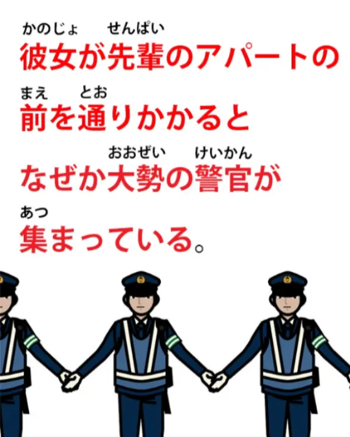
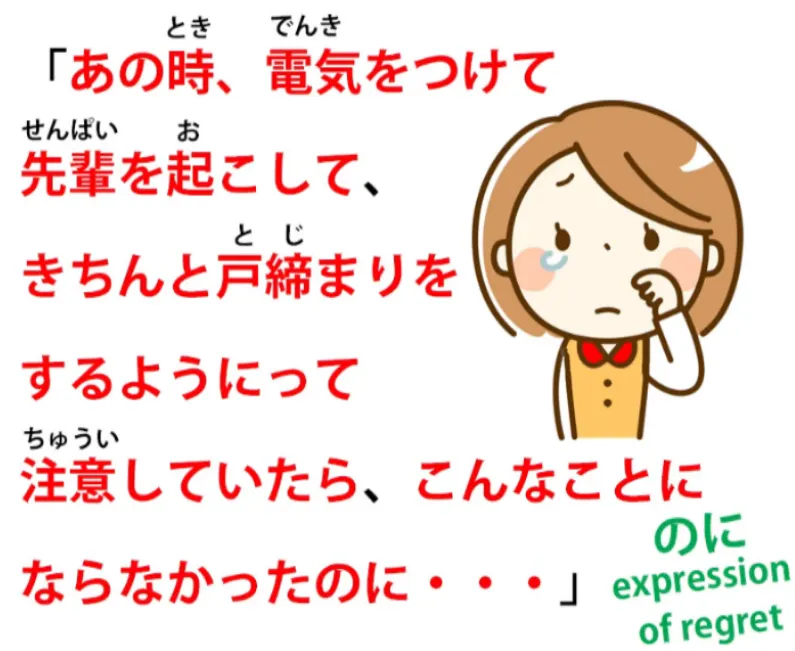
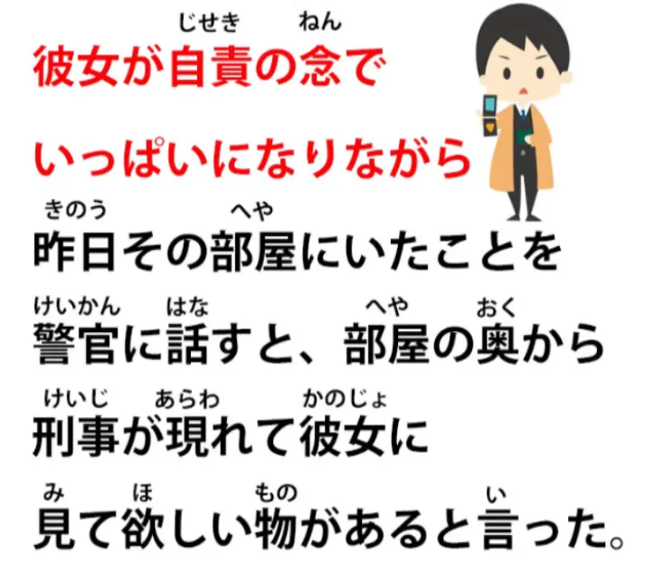
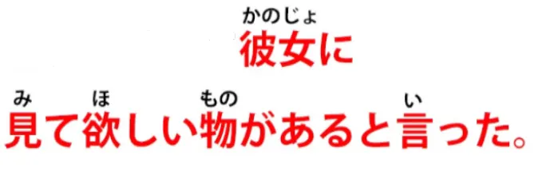
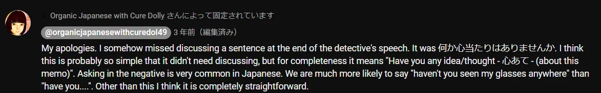
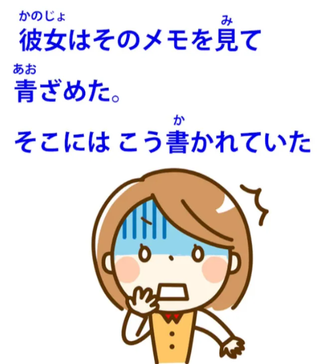
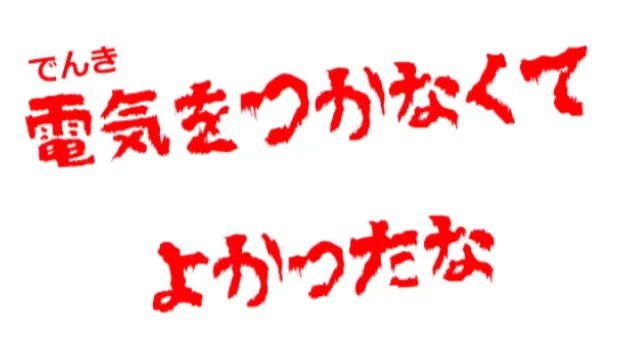

# **69. Японский в естественной среде! Разбираемся с аутентичными японскими материалами. 怪談 4**

[**Японский в естественной среде! Разбираемся с аутентичными японскими материалами. Кайдан 4 | Урок 69**](https://www.youtube.com/watch?v=Iezf0NR-cTE&list=PLg9uYxuZf8x_A-vcqqyOFZu06WlhnypWj&index=71&ab_channel=OrganicJapanesewithCureDolly)

こんにちは。

Сегодня мы вернёмся к [怪談]{かいだん}, страшной японской истории, которую мы начали несколько эпизодов назад, чтобы мы могли разобраться с новыми трудностями чтения настоящего, аутентичного японского. Я собрала все эти эпизоды в один плейлист, так что вы можете посмотреть всю 怪談 в одном месте, и я размещаю ссылку прямо над своей головой.

Итак, чтобы кратко пересказать историю: наша героиня пошла на вечеринку с выпивкой в квартиру своей сэмпай и, возвращаясь домой поздно ночью, обнаружила, что оставила свой 携帯 (свой мобильный телефон) в квартире сэмпай. Она вернулась, постучала в дверь, но ответа не было. Она попробовала ручку, и дверь оказалась незапертой, так что она вошла. И там было совершенно темно, поэтому она предположила, что сэмпай уже легла спать. Она подумала о том, чтобы включить свет и разбудить её, но, вспомнив, что она была довольно пьяна, когда уходила, решила этого не делать. Она нащупала в темноте свой 携帯 и ушла. И это пока вся история.

---

Итак, давайте посмотрим, что произошло на следующий день.

<code>翌日</code> — это означает <code>следующий день</code>. Это слово <code>翌</code> — как вы видите, кандзи означает перья или крылья, а также кандзи для «стоять». Так что можно сказать, что это был день, стоящий за кулисами, ожидающий выхода на сцену, что он теперь и сделал.

<code>翌日</code> — На следующий день — <code>彼女は先輩のアパートの前を通りかかると...</code>

Итак, у нас здесь первое логическое предложение, и у нас есть <code>と</code>, которое является условным «если/когда». Так что за ним что-то последует, но давайте просто посмотрим на это первое: <code>通りかかる</code> буквально означает <code>проходить мимо, зависать</code>, но на самом деле это означает, как говорят японские словари, <code>ちょうどその場所に通る</code>, что на самом деле означает <code>просто случайно проходила мимо этого конкретного места</code>. То есть она не шла туда с какой-либо целью, она просто случайно проходила мимо.

<code>なぜか大勢の警官が集まっている</code> –

<code>大勢</code> означает большое количество, толпу — это относится к людям — <code>警官</code>, как вы, я уверена, знаете, это полицейский. Итак, <code>なぜか...</code> (<code>なぜか</code> — <code>по какой-то причине</code>) много полицейских собралось — <code>集まっている</code>.

<code>集まる</code> — это <code>собираться</code>; <code>集まっている</code> — <code>существовать в состоянии собранности</code>. Много полицейских собралось.

<code>事情を聞いて彼女は驚いた</code>

<code>事情</code> — это <code>ситуация или обстоятельства</code>. В английском мы бы, вероятно, сказали <code>She asked what was going on</code> (Она спросила, что происходит). А <code>驚いた</code> обычно переводится как <code>быть удивлённым</code>, но это может быть сильнее, и мы видим, что в данном случае это сильнее. Когда она спросила о ситуации, она была поражена или шокирована. И <code>彼女は</code> здесь также акцентирует внимание на <code>驚いた</code>, и мы поговорим об этом в видео в ближайшем будущем, об этом акцентирующем качестве は *(видео неизвестно)*. Когда она спросила о ситуации, она была поражена или шокирована тем, что услышала.

<code>なんと... </code> — <code>Что! / Что это?</code>

<code>なんとあの先輩が部屋で殺されたというのだ</code> — <code>Та сэмпай, в той квартире, получила действие «быть убитой».</code>

И это же страдательный залог, не так ли? Она получила действие <code>быть убитой</code>.

<code>というのだ</code> : <code>という</code> — это то, что ей сказали, то, что было сказано; <code>のだ</code> — теперь, мы говорили об этих окончаниях <code>んだ / のだ</code> [**в другом видео**](https://www.youtube.com/watch?v=lYvIOi8Q3I8&ab_channel=OrganicJapanesewithCureDolly). Так что это на самом деле означает: <code>Это было то, что сэмпай в той комнате получила действие «быть убитой».</code> Вот что это было; вот что происходило. Когда она спросила о ситуации, оказалось, что сэмпай была убита в той комнате.

---

<code>部屋は荒らされており</code>

<code>荒らす</code> — это <code>штормить, нарушать или приводить в беспорядок</code>. Итак, комната получила действие «быть приведённой в беспорядок» или «быть нарушенной». И вспомогательный глагол страдательного залога находится в て-форме, за которой следует <code>おり</code>. Теперь, <code>[居]{お}る</code> — как мы говорили в предыдущем эпизоде этой серии, <code>[居]{お}る</code> — это литературный, немного старомодный способ сказать <code>[居]{い}る</code>. Так что <code>荒らされておる</code> то же самое, что <code>荒らされている</code>: <code>находилась в состоянии «быть нарушенной или приведённой в беспорядок»</code>. А затем это <code>おる</code> ставится в свою い-основу, <code>おり</code>, что, опять же, как мы обсуждали ранее, является немного более литературным способом соединения двух предложений в сложном предложении. Таким образом, это соединяет данное предложение со следующим предложением, которое даёт предположение о ситуации: <code>Комната находилась в состоянии «быть приведённой в беспорядок» или «быть нарушенной», и...</code>

<code>物取りの犯行かもしれないという</code> :

<code>物取り</code> — это <code>[物]{もの}</code> (вещь) + <code>取る</code> (брать), так что <code>物取る</code> — <code>брать вещь</code>; <code>物取り</code> — существительное от «брать вещи», так что <code>物取り</code> здесь означает <code>кража</code>; <code>犯行</code> — это <code>преступное деяние</code>, буквально <code>преступное хождение</code>, но преступное деяние. Так что это было, возможно или вероятно, преступление кражи, ограбление... <code>という</code> — <code>было сказано</code>. И кто это сказал? Ну, предположительно, полиция.

---

Теперь следующая часть идёт в кавычках, в этих квадратных японских кавычках, и это то, что она думает про себя. И мы увидим, что здесь есть несколько предложений, соединённых вместе, и все они закончатся на -たら, прежде чем мы перейдём к комментарию о них.

Итак, все эти предложения, которые завершаются окончанием -たら, являются условными предложениями «если». Мы ведь говорили об условном -たら, не так ли?[[32]](./32-the-たら-なら-conditionals.md)

Итак, <code>あの時</code> — <code>в то время</code> — 「電気を付けて先輩を起こして」 — <code>если бы я включила свет</code> –

<code>***きちんと***/ちゃんと戸締りをするようにって</code>.

Теперь, <code>ちゃんと</code> означает <code>правильно или корректно</code>;
::: info
В видео/картинке Долли вместо ちゃんと даёт きちんと. Но по сути, они, кажется, означают одно и то же — что-то вроде <code>правильно</code>, так что это не должно быть большой проблемой. Вероятно, есть какая-то разница, но здесь она не должна быть пагубной…
:::

<code>戸締り</code> — <code>戸</code> — это <code>дверь</code>, <code>締まる</code> — это <code>закрытие</code>, так что <code>戸締り</code> — это <code>закрытие двери</code>. А затем <code>をする</code>: можно было бы просто сказать <code>戸締りをする</code> — <code>делать закрытие двери</code> — но здесь говорится <code>戸締りをするようにって注意をしたら</code>.

<code>ように</code> в данном случае означает <code>сделать так, чтобы (что-то) стало похожим на (что-то)</code>. Так что на самом деле это означает <code>сделала так, чтобы дверь была правильно закрыта</code>. А затем это <code>って</code> — это сокращение от <code>という</code> (мы говорили об этом). *- Урок 18* Так что <code>という</code> в данном случае означает <code>такого рода</code>; <code>注意をして</code> — <code>注意</code> — это <code>осторожность или предосторожность</code> — вы часто видите знаки в Японии <code>注意をしてください</code> – <code>будьте осторожны, пожалуйста / действуйте осторожно</code>. Если бы она таким образом действовала осторожно, включив свет, разбудив сэмпай, убедившись, что дверь была правильно закрыта — и затем всё это заканчивается на -たら. Если бы она это сделала...

<code>こんなことにならなかったのに</code>

Теперь, <code>こんなこと</code> — это <code>подобное положение дел / это положение дел</code>; <code>にならなかったのに</code>: теперь, как мы видим, это логическое предложение, и ему нужен субъект, ему нужен が-отмеченный А-вагон. Так что же это? Ну, это же zero-вагон, не так ли?

<code>(Zeroが) こんなことにならなかった</code> — <code>Это не стало бы чем-то подобным.</code> Теперь, что это значит? Я думаю, мы можем увидеть очень близкую английскую аналогию этому. В английском мы бы, вероятно, сказали <code>it wouldn't have come to this</code> (до этого бы не дошло). Она говорит: <code>это не стало бы такой ситуацией</code>. Так что это очень похожая стратегия выражения. Если бы она сделала всё это: если бы она убедилась, что всё в доме безопасно и в порядке, даже рискуя потревожить пьяную сэмпай, эта ужасная вещь не произошла бы.

—

<code>彼女が自責の念でいっぱいになりながら.</code>

<code>自責</code> — это <code>самообвинение / самопорицание</code> — <code>責</code> здесь, этот кандзи такой же, как кандзи для <code>責める</code> — <code>критиковать или обвинять</code> — а <code>ji</code> — это <code>сам</code>, так что <code>自責... でいっぱいになりながら</code> — <code>-ながら</code>, как я думаю, мы знаем, это вспомогательное слово, означающее выполнение глагола, к которому оно присоединено, одновременно с чем-то ещё. Теперь, что она здесь делает, так это наполняется <code>自責の念</code> — <code>мыслями (или чувствами) самообвинения</code>. Итак, наполняясь чувствами самообвинения, <code>昨日その部屋にいたことを警官に話すと</code> –

Теперь, <code>と</code> даёт нам утверждение «если/когда», но мы сначала разберёмся с этим. <code>昨日その部屋にいたこと</code> означает <code>тот факт, что она была в комнате вчера</code>. Теперь, мы знаем, что она говорит о человеке (или животном) здесь, потому что это <code>いた</code>, так что единственное, что это может быть, это она сама, тот факт, что она была в комнате. Если бы это было <code>昨日その部屋にあったこと</code>, это могло бы означать <code>вещь, которая произошла в комнате вчера</code>. Ну, мы знаем, что это не может быть так, потому что это <code>いた</code>, а не <code>あった</code>. Итак, мы говорим о человеке; мы говорим о ней. <code>昨日その部屋にいたことを警官に話す</code>, а затем <code>と</code>, которое является нашим утверждением «если/когда». Итак, когда она рассказала полиции о том, что она была в комнате вчера...

<code>部屋の奥から刑事が現れて...</code>

Теперь, опять же, оно заканчивается на て-форму; оно будет вести к чему-то ещё. Так что это сложное предложение, но оно не очень трудное, потому что оно состоит из чётких логических предложений, строящихся одно на другом в более крупное целое. Итак, <code>部屋の奥から刑事が現れて</code>: из глубины комнаты, изнутри комнаты — <code>奥</code>, <code>внутренняя часть / интерьер</code> — <code>刑事</code>, это полицейский детектив, <code>現れて</code> — <code>появился</code>. Полицейский детектив появился изнутри комнаты, и...

<code>彼女に見て欲しい物があると言った</code>

Теперь, <code>見て欲しい</code> означает <code>хотеть, чтобы кто-то другой увидел</code>, точно так же, как, как мы объясняли в предыдущем уроке[[49]](./49-japanese-point-of-view-deconfused-もらう-てもらう.md), <code>見てもらう</code> означает <code>заставить кого-то другого увидеть</code>, <code>見て欲しい</code> означает <code>хотеть, чтобы кто-то другой увидел</code>. И так же, как с <code>もらう</code>, человек, которого вы заставляете видеть или хотите, чтобы он увидел (или хотите, чтобы он сделал что-либо ещё), отмечается частицей に как цель «тягового» предложения. Итак, <code>もらう</code> и <code>欲しい</code>, они получают «тяговые» предложения, поэтому их косвенный объект — это человек, который делает то, что мы хотим, чтобы он сделал, то, что мы получаем от него и т.д. Итак, это означает <code>彼女に見て欲しい物がある</code> – <code>существует вещь, которую я хочу, чтобы она увидела</code>. <code>There's something I want you to look at</code> (Есть кое-что, на что я хочу, чтобы вы посмотрели) — так мы бы сказали по-английски. <code>と言った</code> — детектив сказал: «Есть кое-что, на что я хочу, чтобы вы посмотрели».

И в кавычках это слова детектива:

<code>「部屋の中で</code> — <code>внутри комнаты</code> — <code>こんなメモを見つけたんですが…</code> — «такую записку (или, на самом деле, эту записку) мы нашли, *но*» —

<code>見つけた</code>, <code>нашли/обнаружили/увидели</code> – мы обнаружили эту записку — <code>んですが</code>. <code>んですが</code> — снова у нас это окончание <code>んです / のです</code>. Так что он говорит: <code>Дело в том, что мы нашли эту записку в комнате</code>. Вот что это / вот в чём дело: <code>Дело в том, что мы нашли эту записку в комнате, но/が...</code> — <code>これの意味が分からなくて...</code>

Его значение не делает понятным, и... <code>困ってんですよ」</code> — <code>困る</code> — это <code>быть в растерянности / не знать, что делать</code>, так что <code>поскольку его значение не делает понятным...</code> поскольку мы не можем понять его значение, как мы говорим по-английски, <code>...мы в растерянности</code>. И снова это окончание <code>んです</code>: <code>Дело в том, что поскольку мы не можем понять его значение, мы в растерянности.</code>

::: info
Предложение может быть немного сложнее для чтения, но я не могу увеличить масштаб, иначе по какой-то причине оно навсегда скроет конечную часть комментария с <code>...</code> вместо текста.

:::

<code>彼女はそのメモを見て青ざめた</code>

Она посмотрела на записку и... <code>青ざめる</code>.

В английском это обычно переводится как <code>побледнела</code>. Что это буквально означает: <code>青</code>, конечно, <code>синий</code>, а <code>ざめる</code> здесь означает <code>выцветать или терять цвет</code>. Так что она «посинела», вот что это буквально означает. И вы, вероятно, видели в аниме и манге и т.д., что именно так они обычно изображают эту ситуацию. Вы часто видите лица людей, затенённые синим, обычно от лба до середины лица. Так что «посинение» — это способ, которым они представляют то, что в английском мы называем <code>побледнением</code>, и мы видим это, когда кто-то шокирован или болен или что-то в этом роде. Итак, её лицо побледнело.

<code>そこにはこう書かれていた</code> — <code>В том месте</code>, то есть на этом листе бумаги, <code>оно получило действие «быть написанным таким образом» / оно находилось в состоянии «быть написанным таким образом»</code>. В английском мы бы просто сказали <code>this is what was written</code> (вот что было написано).

И что было написано?

<code>電気をつけなくてよかったな</code> : <code>Хорошо, что ты не включила свет.</code>

Итак, что вы об этом думаете? Кто написал эту записку? И что он или она имели в виду? Что произошло в той комнате той ночью?